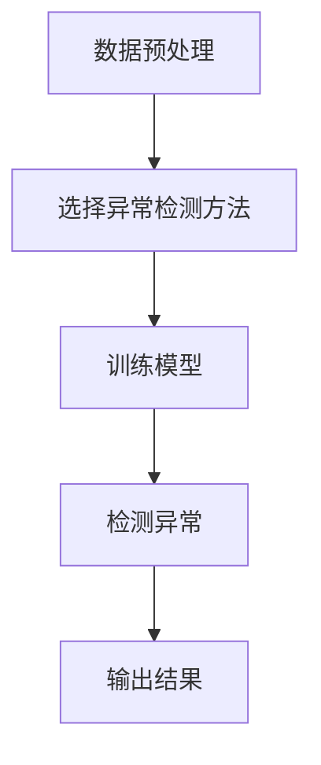
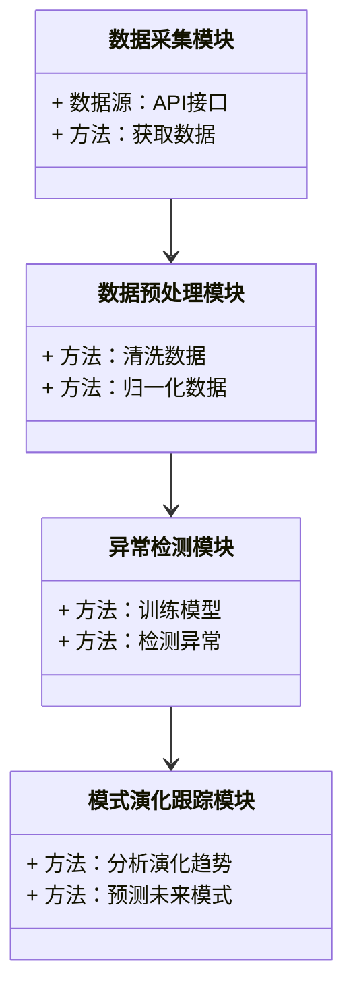
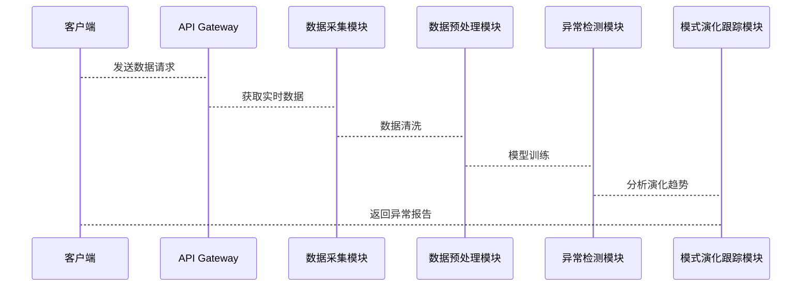

                 


# 开发智能化的金融时序数据异常模式演化跟踪模型

## 关键词：金融时序数据、异常模式、演化跟踪模型、人工智能、深度学习、时间序列分析

## 摘要：本文旨在探讨如何利用智能化技术开发金融时序数据异常模式演化跟踪模型。通过分析金融数据的特征、异常模式的类型及其演化规律，结合深度学习和时间序列分析方法，构建一个能够实时检测和跟踪异常模式的智能化系统。本文将从背景、概念、算法原理、系统设计、项目实战等方面展开，为读者提供全面的技术指导。

---

## 第一部分: 背景介绍

## 第1章: 开发智能化的金融时序数据异常模式演化跟踪模型概述

### 1.1 问题背景与意义

#### 1.1.1 金融时序数据的重要性

金融时序数据是金融市场分析的核心，包括股票价格、汇率、债券收益率等。这些数据反映了市场的动态变化，对投资者、交易员和监管机构具有重要意义。通过对时序数据的分析，可以揭示市场的趋势、周期性波动和潜在风险。

#### 1.1.2 异常模式演化跟踪的必要性

金融市场的异常模式通常预示着潜在的风险或机会。例如，突然的价格波动可能表明市场操纵、重大新闻事件或系统性风险。及时发现和跟踪这些异常模式，可以帮助金融机构采取措施避免损失或抓住机会。

#### 1.1.3 智能化技术在金融领域的应用价值

随着人工智能和深度学习技术的发展，智能化系统能够处理海量数据，发现传统方法难以察觉的模式。通过智能化技术，金融机构可以更高效地进行风险管理和投资决策。

### 1.2 核心概念与问题描述

#### 1.2.1 金融时序数据的定义与特征

金融时序数据是指按时间顺序记录的金融市场相关数据，具有以下特征：
- **连续性**：数据按时间顺序排列。
- **周期性**：可能存在周期性波动，如日、周、月周期。
- **非线性**：数据变化可能受到多种因素影响，呈现非线性特征。
- **波动性**：价格波动可能较大，尤其是在市场波动剧烈时。

#### 1.2.2 异常模式的定义与分类

异常模式是指在正常模式中出现的显著偏离。在金融时序数据中，异常模式可能包括：
- **突变**：价格在短时间内急剧上升或下降。
- **偏离**：数据点偏离正常趋势。
- **趋势变化**：长期趋势的突然改变。

#### 1.2.3 模式演化跟踪的定义与目标

模式演化跟踪是指对异常模式的形成、发展和消亡过程进行实时监测和分析。目标是捕捉异常模式的动态变化，理解其背后的原因，并预测其未来演变。

### 1.3 问题解决与边界

#### 1.3.1 异常模式演化跟踪的核心问题

- 如何准确识别异常模式？
- 如何跟踪异常模式的演化过程？
- 如何预测异常模式的未来趋势？

#### 1.3.2 模型的边界与适用范围

- 数据范围：适用于连续、周期性较强的金融时序数据。
- 时间范围：适用于实时或近实时的异常检测。
- 数据量：适用于中等规模到大规模数据集。

#### 1.3.3 核心要素与组成结构

- 数据采集：从金融市场获取实时数据。
- 数据预处理：清洗、归一化等。
- 模型训练：使用深度学习算法训练异常检测模型。
- 模型部署：将模型部署到实时监控系统中。

## 1.4 本章小结

本章介绍了金融时序数据异常模式演化跟踪模型的背景、核心概念和问题解决思路。通过理解金融时序数据的特征和异常模式的类型，我们可以更好地设计和实现智能化的异常检测系统。

---

## 第二部分: 核心概念与联系

## 第2章: 核心概念与联系

### 2.1 核心概念原理

#### 2.1.1 金融时序数据的特征分析

金融时序数据的特征包括连续性、周期性、非线性和波动性。这些特征使得时序数据的分析具有挑战性，但也为异常检测提供了丰富的信息。

#### 2.1.2 异常模式的数学建模

异常模式可以用统计学方法或机器学习模型进行建模。例如，使用马尔可夫链模型描述数据的转移概率，或者使用LSTM（长短期记忆网络）捕捉数据的长期依赖关系。

#### 2.1.3 模式演化跟踪的算法框架

模式演化跟踪的算法框架通常包括数据预处理、异常检测、模式识别和演化分析四个步骤。

### 2.2 概念属性特征对

以下是金融时序数据和异常模式的对比表格：

| 属性       | 金融时序数据       | 异常模式       |
|------------|--------------------|----------------|
| 时间序列    | 是                | 是             |
| 数据类型    | 数值型            | 数值型         |
| 变异性      | 较高              | 极高           |
| 预测性      | 可预测            | 部分可预测     |

### 2.3 ER实体关系图

以下是金融时序数据异常模式演化跟踪模型的实体关系图：

```mermaid
erd
    组件1: 数据采集模块
    组件2: 数据预处理模块
    组件3: 异常检测模块
    组件4: 模式演化跟踪模块
    组件5: 结果展示模块

    组件1 --> 组件2: 传输原始数据
    组件2 --> 组件3: 提供预处理数据
    组件3 --> 组件4: 传递异常标志
    组件4 --> 组件5: 输出演化分析结果
```

---

## 第三部分: 算法原理讲解

## 第3章: 算法原理讲解

### 3.1 算法原理概述

异常检测算法的核心是识别数据中的异常点。常用的方法包括基于统计的方法（如Z-score）和基于机器学习的方法（如Isolation Forest、LSTM等）。

### 3.2 算法流程

以下是异常检测算法的流程图：



### 3.3 算法实现

以下是使用LSTM进行异常检测的Python代码示例：

```python
import numpy as np
from tensorflow.keras.models import Sequential
from tensorflow.keras.layers import LSTM, Dense

# 示例数据生成
def generate_data(n_timesteps, n_features):
    return np.random.randn(n_timesteps, n_features)

# 数据预处理
data = generate_data(100, 1)
train_data = data[:80]
test_data = data[80:]

# 模型训练
model = Sequential()
model.add(LSTM(50, input_shape=(None, 1)))
model.add(Dense(1))
model.compile(loss='mean_squared_error', optimizer='adam')

model.fit(train_data, train_data, epochs=10, batch_size=1)

# 异常检测
def predict_anomalies(model, data):
    predicted = model.predict(data)
    anomalies = np.where(np.abs(predicted - data) > 0.2, 'Yes', 'No')
    return anomalies

anomalies = predict_anomalies(model, test_data)
print(anomalies)
```

### 3.4 数学模型与公式

以下是LSTM的数学模型：

$$
f(t) = \text{LSTM}(x_t, f(t-1))
$$

其中，$x_t$ 是输入数据，$f(t-1)$ 是前一时刻的状态。

---

## 第四部分: 系统分析与架构设计

## 第4章: 系统分析与架构设计

### 4.1 问题场景介绍

本系统的目标是实时监测金融市场的时序数据，检测并跟踪异常模式。应用场景包括股票价格监控、外汇交易风险管理和债券收益率分析。

### 4.2 系统功能设计

以下是系统功能模块的类图：



### 4.3 系统架构设计

以下是系统的分层架构图：


### 4.4 接口设计与交互

以下是系统接口设计的序列图：



---

## 第五部分: 项目实战

## 第5章: 项目实战

### 5.1 环境安装

安装所需的Python库：

```bash
pip install numpy tensorflow keras matplotlib pandas
```

### 5.2 核心代码实现

以下是异常检测模块的实现代码：

```python
import numpy as np
from tensorflow.keras.models import Sequential
from tensorflow.keras.layers import LSTM, Dense

# 数据生成函数
def generate_data(n_timesteps, n_features):
    return np.random.randn(n_timesteps, n_features)

# 数据预处理
data = generate_data(100, 1)
train_data = data[:80]
test_data = data[80:]

# 模型训练
model = Sequential()
model.add(LSTM(50, input_shape=(None, 1)))
model.add(Dense(1))
model.compile(loss='mean_squared_error', optimizer='adam')

model.fit(train_data, train_data, epochs=10, batch_size=1)

# 异常检测
def predict_anomalies(model, data):
    predicted = model.predict(data)
    anomalies = np.where(np.abs(predicted - data) > 0.2, 'Yes', 'No')
    return anomalies

anomalies = predict_anomalies(model, test_data)
print(anomalies)
```

### 5.3 代码解读与分析

- 数据生成：使用`generate_data`函数生成模拟的金融时序数据。
- 数据预处理：将数据分为训练集和测试集。
- 模型训练：使用LSTM网络训练异常检测模型。
- 异常检测：通过模型预测数据，并与实际数据进行比较，识别异常点。

### 5.4 案例分析

以股票价格为例，假设我们使用上述模型检测异常点。通过分析模型的输出，我们可以发现价格的突然波动，并采取相应的措施，如发出警报或调整投资策略。

### 5.5 项目小结

本项目展示了如何利用深度学习技术开发金融时序数据异常检测系统。通过实践，我们可以验证模型的有效性，并进一步优化算法以提高检测精度。

---

## 第六部分: 最佳实践

## 第6章: 最佳实践

### 6.1 小结

本文详细介绍了开发智能化的金融时序数据异常模式演化跟踪模型的背景、核心概念、算法原理、系统设计和项目实战。通过理论与实践的结合，我们可以更好地理解和应用相关技术。

### 6.2 注意事项

- 数据质量：确保数据的准确性和完整性。
- 模型选择：根据具体场景选择合适的算法。
- 系统优化：通过调参和优化算法提高检测效率。

### 6.3 拓展阅读

- 《时间序列分析》：深入理解时序数据的特征和分析方法。
- 《深度学习实战》：掌握深度学习技术在金融领域的应用。

---

## 作者

作者：AI天才研究院/AI Genius Institute & 禅与计算机程序设计艺术 /Zen And The Art of Computer Programming

