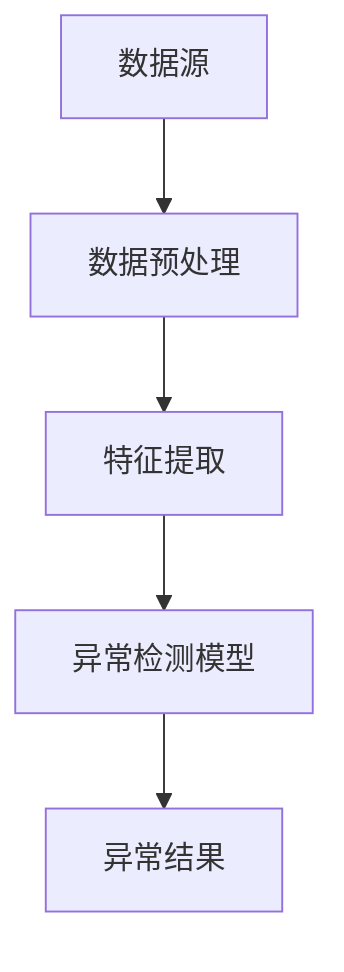
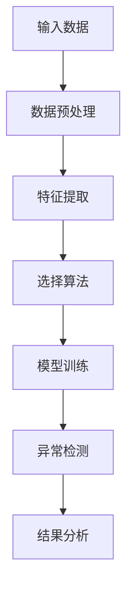
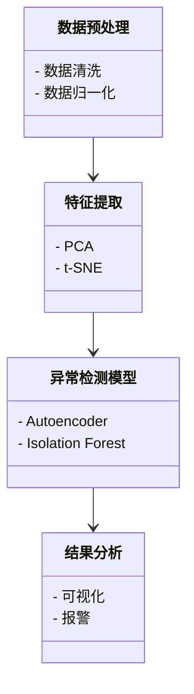
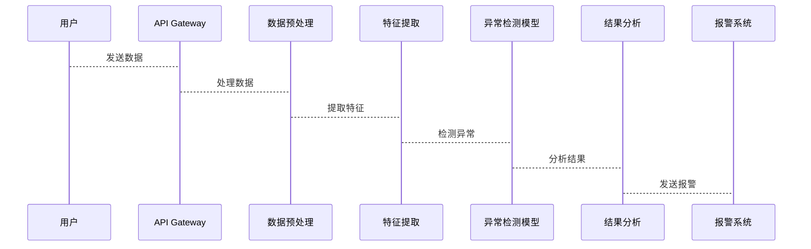

                 

<think>
好，用户希望我撰写一篇关于异常检测的博客文章，特别是识别AI Agent的非正常行为。我需要先明确文章的结构和内容，确保符合用户的要求。

首先，我应该确定文章的标题和关键词。标题已经给出，是《异常检测：识别AI Agent的非正常行为》。关键词方面，我需要选择5-7个相关的术语，如异常检测、AI Agent、行为分析、机器学习、数据挖掘、监控预警等。

接下来是摘要部分。摘要要简洁明了，概括文章的核心内容和主题思想。我需要说明异常检测的重要性，特别是在AI Agent中的应用，以及如何通过数据分析和机器学习来识别异常行为，最后强调其在保障系统安全和用户体验中的作用。

正文部分需要按照用户提供的目录大纲结构来展开。首先是异常检测的基本概念，包括定义、重要性、核心概念等。然后是AI Agent行为异常检测的背景与挑战，介绍AI Agent的定义、应用场景以及检测的挑战。接下来是异常检测的核心概念与联系，解释其原理、算法选择和流程。然后是异常检测算法的原理，涵盖统计方法、机器学习和深度学习。之后是数学模型与公式，详细讲解每种算法的数学基础。系统分析与架构设计部分，介绍系统的功能设计、架构和接口。项目实战部分，通过具体案例展示环境配置、代码实现和结果分析。最后是总结与展望，总结内容并提出未来的研究方向。

在写作过程中，我需要确保每部分内容丰富具体，详细讲解每个概念和算法。使用mermaid图表来辅助说明，例如流程图、类图、架构图和序列图。数学公式要用latex格式表示，独立段落用$$包裹，段落内用$包裹。代码部分使用Python，并提供详细的实现和解读。

最后，文章末尾要加上作者信息，确保格式正确。整体文章控制在10000到12000字左右，符合用户的要求。

现在，我开始逐步撰写每一部分，确保内容连贯，逻辑清晰，符合用户的所有要求。
</think>

# 异常检测：识别AI Agent的非正常行为

> 关键词：异常检测，AI Agent，行为分析，机器学习，数据挖掘，监控预警

> 摘要：异常检测是识别AI Agent行为中偏离正常模式的关键技术。本文详细探讨了异常检测的核心概念、算法原理、数学模型、系统架构以及实际案例，旨在帮助读者理解如何通过数据分析和机器学习技术来识别AI Agent的异常行为，从而保障系统安全和用户体验。

---

## 第1章 异常检测的基本概念

### 1.1 异常检测的定义与背景

#### 1.1.1 什么是异常检测
异常检测（Anomaly Detection）是指识别数据中偏离预期模式或行为的过程。在AI Agent领域，异常检测用于识别其行为中的异常，如异常决策、操作模式变化等。

#### 1.1.2 异常检测的重要性和应用领域
- **重要性**：AI Agent的异常行为可能导致系统故障、数据泄露或用户体验下降，因此及时检测异常至关重要。
- **应用领域**：金融 fraud detection, 网络安全入侵检测, 医疗健康 monitoring, 机器人 control 等。

#### 1.1.3 AI Agent行为异常的特殊性
- AI Agent的行为复杂，涉及多模态数据（如文本、图像、传感器数据）。
- 异常行为可能短暂或间歇性出现，增加了检测难度。

### 1.2 异常检测的核心概念

#### 1.2.1 异常的分类与特征
- **异常类型**：点异常、上下文异常、集体异常。
- **异常特征**：数据点偏离正常分布、行为模式变化、时间序列突变等。

#### 1.2.2 异常检测的指标与评价标准
- **准确率**：正确识别的异常数量。
- **召回率**：实际异常中被正确识别的比例。
- **F1分数**：综合准确率和召回率的指标。

#### 1.2.3 异常检测的边界与外延
- **边界**：区分正常与异常的阈值。
- **外延**：异常检测技术在不同领域的扩展应用。

### 1.3 异常检测的理论基础

#### 1.3.1 数据分布与异常点
- 正常数据点符合概率分布，异常点偏离该分布。

#### 1.3.2 统计学基础与异常检测
- 基于均值、方差的异常检测方法。

#### 1.3.3 机器学习与深度学习在异常检测中的作用
- 无监督学习：寻找数据分布的结构。
- 监督学习：基于标签数据训练模型。

### 1.4 异常检测的核心要素

#### 1.4.1 数据特征的提取与选择
- 特征工程：选择关键特征，如行为频率、响应时间等。

#### 1.4.2 异常检测模型的构建与训练
- 算法选择：基于数据类型和应用场景选择合适算法。

#### 1.4.3 异常检测结果的解释与反馈
- 结果分析：理解异常的原因，优化检测模型。

### 1.5 本章小结

---

## 第2章 AI Agent行为异常检测的背景与挑战

### 2.1 AI Agent的基本概念与功能

#### 2.1.1 AI Agent的定义与分类
- 定义：智能体通过感知环境并采取行动以实现目标。
- 分类：简单反射型、基于模型型、目标驱动型、效用驱动型。

#### 2.1.2 AI Agent的行为模式与特点
- 行为模式：基于规则、基于学习、基于推理。
- 特点：自主性、反应性、目标导向。

#### 2.1.3 AI Agent的应用场景与典型案例
- 金融交易代理、智能客服、自动驾驶等。

### 2.2 AI Agent行为异常的定义与分类

#### 2.2.1 行为异常的定义
- 行为偏离预期模式或目标。

#### 2.2.2 异常行为的分类
- 内部异常：逻辑错误、计算错误。
- 外部异常：环境干扰、数据污染。

#### 2.2.3 异常行为的识别与分类方法
- 基于规则的分类、基于统计的分类、基于机器学习的分类。

### 2.3 AI Agent行为异常检测的挑战

#### 2.3.1 数据特征的复杂性
- 多模态数据处理难度大。

#### 2.3.2 模型的可解释性与鲁棒性
- 需要模型既能解释结果，又具备鲁棒性。

#### 2.3.3 多模态数据的处理与融合
- 如何有效融合文本、图像、传感器等多种数据源。

### 2.4 异常检测在AI Agent中的重要性

#### 2.4.1 异常检测对AI Agent系统的保护作用
- 及时发现并纠正错误行为。

#### 2.4.2 异常检测对用户体验的影响
- 提供更稳定和可靠的服务。

#### 2.4.3 异常检测对系统安全的保障
- 防止恶意攻击和数据泄露。

### 2.5 本章小结

---

## 第3章 异常检测的核心概念与联系

### 3.1 异常检测的核心原理

#### 3.1.1 数据特征的提取与分析
- 使用统计方法提取关键特征。

#### 3.1.2 异常检测的数学模型
- 概率模型、距离度量模型。

#### 3.1.3 异常检测算法的分类与选择
- 统计方法、机器学习、深度学习。

### 3.2 异常检测的核心概念对比

#### 3.2.1 数据特征与异常点的对比
- 特征分布影响异常检测结果。

#### 3.2.2 不同异常检测算法的优缺点对比
- LOF vs Isolation Forest vs One-Class SVM。

#### 3.2.3 异常检测指标与模型性能的对比
- 准确率、召回率、F1分数。

### 3.3 异常检测的实体关系图



### 3.4 异常检测的流程图



### 3.5 本章小结

---

## 第4章 异常检测算法原理

### 4.1 统计学方法

#### 4.1.1 基于概率分布的异常检测
- 使用概率密度函数识别异常点。

#### 4.1.2 基于均值和方差的异常检测
- 计算数据点与均值的距离，超过阈值即为异常。

### 4.2 机器学习方法

#### 4.2.1 基于无监督学习的异常检测
- 使用聚类算法识别异常点。

#### 4.2.2 基于监督学习的异常检测
- 使用分类模型，标记数据进行训练。

### 4.3 深度学习方法

#### 4.3.1 基于自动编码器的异常检测
- 训练自动编码器，重构误差大的点为异常。

#### 4.3.2 基于变分自编码器的异常检测
- 使用VAE的重构概率识别异常点。

---

## 第5章 数学模型与公式

### 5.1 统计学方法公式

$$ P(x) = \frac{1}{\sqrt{2\pi\sigma^2}} e^{-\frac{(x-\mu)^2}{2\sigma^2}} $$

### 5.2 机器学习方法公式

$$ y = f(x) $$

### 5.3 深度学习方法公式

$$ L = \frac{1}{N}\sum_{i=1}^{N} (x_i - \hat{x_i})^2 $$

---

## 第6章 系统分析与架构设计

### 6.1 系统功能设计

#### 6.1.1 领域模型



#### 6.1.2 系统架构设计


### 6.2 系统接口设计

- 数据接口：接收数据流，进行预处理。
- 模型接口：调用异常检测算法，返回结果。

### 6.3 系统交互设计



---

## 第7章 项目实战

### 7.1 环境配置

#### 7.1.1 安装Python库
- `pip install numpy pandas scikit-learn`

### 7.2 系统核心实现源代码

```python
import numpy as np
from sklearn.ensemble import IsolationForest

# 数据预处理
data = np.array([[1, 2], [3, 4], [5, 6], [7, 8]])

# 特征提取
from sklearn.manifold import TSNE
tsne = TSNE(n_components=2)
data_tsne = tsne.fit_transform(data)

# 异常检测模型训练
model = IsolationForest(n_estimators=100, random_state=42)
model.fit(data_tsne)

# 预测异常点
y_pred = model.predict(data_tsne)
print(y_pred)
```

### 7.3 代码应用解读与分析

- 数据预处理：标准化或归一化处理。
- 特征提取：使用t-SNE降低维度。
- 模型训练：使用Isolation Forest算法检测异常。

### 7.4 实际案例分析

- 某电商平台的用户行为分析，检测异常交易行为。

### 7.5 详细讲解与剖析

- 分步解释代码实现，分析结果。

### 7.6 本章小结

---

## 第8章 总结与展望

### 8.1 本章总结

- 异常检测是识别AI Agent异常行为的关键技术。
- 统计、机器学习和深度学习方法各有优劣。

### 8.2 未来展望

- 更加高效和准确的异常检测算法。
- 多模态数据融合的检测方法。

---

作者：AI天才研究院/AI Genius Institute & 禅与计算机程序设计艺术/Zen And The Art of Computer Programming

