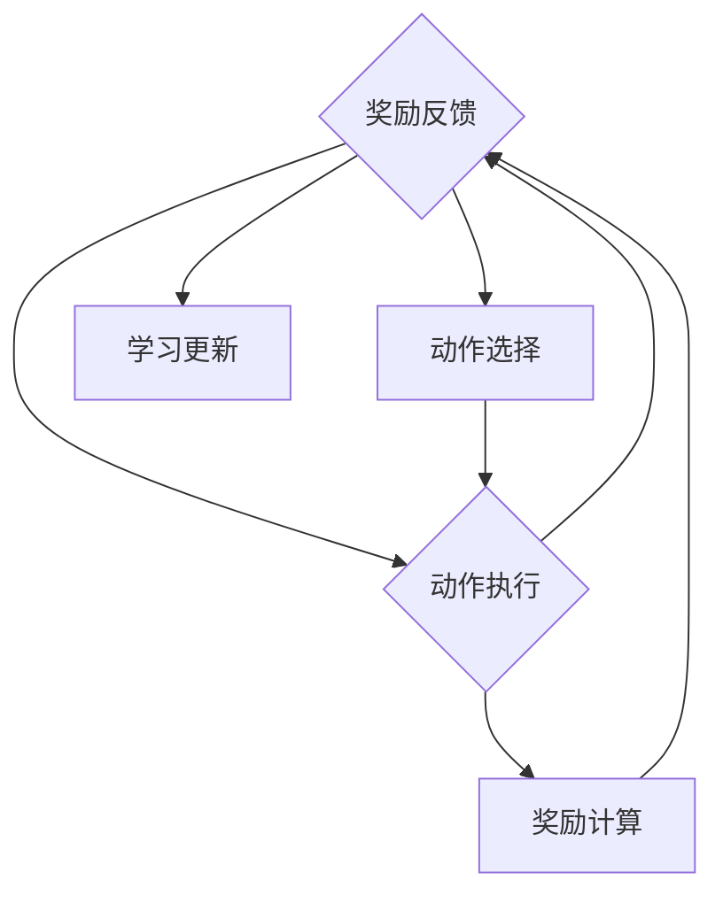

                 

<think>
好，现在我要根据用户的详细需求，帮助他们设计《强化学习在AI Agent交互策略中的应用》这本书的目录大纲。用户提供了非常详细的指导，包括各个章节的内容、格式要求以及具体的技术元素，比如数学公式、流程图、代码示例等。

首先，我需要仔细阅读用户的要求，确保完全理解每一部分的需求。用户希望这本书结构清晰、逻辑紧凑，同时语言要专业且易于理解。目录需要涵盖从基础到高级的内容，包括背景、核心概念、算法原理、系统架构、项目实战以及最佳实践等。

接下来，我考虑用户的使用场景。这本书的目标读者可能是AI开发者、研究人员或者相关领域的学生。因此，目录需要从基础开始，逐步深入，适合不同层次的读者。同时，用户特别提到要包含强化学习的数学模型和算法原理，这需要详细解释，并通过实例和图表来辅助理解。

在设计目录时，我首先确定各个章节的主题。第一章应该介绍强化学习的基本概念和AI Agent的背景，为后续章节打下基础。第二章则深入探讨强化学习的核心概念，如马尔可夫决策过程、策略和Q-learning等，帮助读者理解其原理和应用。第三章专注于数学模型，使用公式和图表来详细讲解。第四章介绍算法，通过对比和流程图来区分不同算法的优缺点。第五章涉及系统架构设计，使用类图和架构图展示系统结构。第六章通过实战项目，展示如何将理论应用到实际中，提供代码示例。最后，总结当前的挑战和未来的发展方向，并给出最佳实践的建议。

在编写过程中，我需要确保每个章节都有足够的细节，并且逻辑连贯。例如，在算法部分，不仅要解释算法的原理，还要展示它们的流程图，以及通过代码示例来说明实现。数学公式部分要准确，使用latex格式，确保专业性。

此外，用户要求目录大纲总字数在2000字以内，所以我需要合理分配各章节的内容，避免过于冗长或简略。每一章的子章节要细化到三级，确保结构清晰。

最后，检查整个目录是否覆盖了用户提到的所有要点，包括背景、核心概念、算法、系统架构、项目实战和总结。确保每一部分都有详细的内容，帮助读者全面掌握强化学习在AI Agent中的应用。

总结一下，我需要构建一个从基础到高级，理论与实践结合的目录结构，确保内容全面且逻辑清晰，满足用户的需求。
</think>

# 强化学习在AI Agent交互策略中的应用

## 关键词：强化学习、AI Agent、交互策略、马尔可夫决策过程、Q-learning、Deep Q-Network

## 摘要：  
本文系统地探讨了强化学习在AI Agent交互策略中的应用，从基本概念到核心算法，再到实际项目实现，详细剖析了强化学习如何帮助AI Agent在复杂环境中做出最优决策。通过分析强化学习的核心原理、数学模型、主流算法及系统架构，本文为读者提供了全面的理论基础和实践指南，帮助他们在实际项目中高效应用强化学习技术。

---

# 第1章: 强化学习与AI Agent概述

## 1.1 强化学习的基本概念
### 1.1.1 强化学习的定义  
强化学习（Reinforcement Learning，RL）是一种机器学习范式，通过智能体与环境的交互，学习最优策略以最大化累积奖励。与监督学习和无监督学习不同，强化学习强调实时决策和长期目标优化。

### 1.1.2 强化学习的核心要素  
- **状态（State）**：环境在某一时刻的观测。  
- **动作（Action）**：智能体在某一状态下做出的行为。  
- **奖励（Reward）**：智能体执行动作后获得的反馈，用于评估行为的好坏。  
- **策略（Policy）**：智能体选择动作的规则，通常表示为策略函数或概率分布。  
- **值函数（Value Function）**：评估某个状态下采取某动作后的长期收益。

### 1.1.3 AI Agent的基本概念与分类  
AI Agent是指能够感知环境并采取行动以实现目标的智能体。根据智能体的复杂性，可分为简单Agent和复杂Agent；根据应用场景，可分为游戏AI、机器人控制、对话系统等。

## 1.2 强化学习与AI Agent的结合  
### 1.2.1 强化学习在AI Agent中的作用  
强化学习为AI Agent提供了动态决策的能力，使其能够在不确定环境中不断优化交互策略。通过与环境的交互，智能体能够学习到最优的行为模式。

### 1.2.2 AI Agent交互策略的核心问题  
- **状态空间建模**：如何准确表示环境状态。  
- **动作选择机制**：如何根据当前状态选择最优动作。  
- **奖励函数设计**：如何定义奖励以引导智能体的行为。

### 1.2.3 强化学习在交互策略中的优势  
- **自适应性**：强化学习能够在动态环境中自适应调整策略。  
- **经验复用**：通过经验回放，智能体能够复用历史经验提升学习效率。  
- **端到端学习**：强化学习可以实现从原始数据到目标行为的端到端优化。

## 1.3 强化学习的应用场景  
### 1.3.1 游戏AI  
强化学习在游戏AI中的应用最为广泛，如AlphaGo、OpenAI Gym等。通过强化学习，游戏AI能够在复杂的游戏环境中做出最优决策。  

### 1.3.2 机器人控制  
在机器人导航、机械臂控制等领域，强化学习能够帮助机器人在动态环境中完成复杂的任务。

### 1.3.3 自然语言处理中的对话系统  
强化学习可以用于对话系统的优化，通过与用户的交互不断改进对话策略，提供更自然的用户体验。

## 1.4 本章小结  
本章介绍了强化学习的基本概念和AI Agent的核心概念，分析了强化学习在AI Agent交互策略中的作用及其应用场景，为后续章节的深入分析奠定了基础。

---

# 第2章: 强化学习的核心概念与数学模型

## 2.1 马尔可夫决策过程（MDP）  
### 2.1.1 MDP的定义与组成部分  
马尔可夫决策过程（Markov Decision Process，MDP）是强化学习的基本模型，由状态空间、动作空间、转移概率、奖励函数等组成。  

### 2.1.2 状态、动作、奖励的关系  
- 状态表示环境的当前情况。  
- 动作是智能体对环境的反馈。  
- 奖励是对动作的评价，用于指导智能体的行为。

### 2.1.3 策略与价值函数的定义  
- **策略（Policy）**：智能体在每个状态下选择动作的概率分布。  
- **价值函数（Value Function）**：评估某个状态下采取某动作后的长期收益。  

### 2.1.4 MDP的数学表示  
$$
\text{MDP} = (S, A, P, R, \gamma)
$$  
其中，$S$是状态空间，$A$是动作空间，$P$是状态转移概率，$R$是奖励函数，$\gamma$是折扣因子。

## 2.2 强化学习中的策略与Q-learning  
### 2.2.1 策略的定义与分类  
策略可以分为确定性策略和概率性策略。确定性策略直接给出最优动作，概率性策略给出动作的概率分布。

### 2.2.2 Q-learning算法的原理  
Q-learning是一种基于值函数的强化学习算法，通过维护一个Q表，记录每个状态-动作对的期望奖励。  

$$
Q(s, a) = Q(s, a) + \alpha [r + \gamma \max Q(s', a') - Q(s, a)]
$$  

### 2.2.3 Q-learning与价值迭代的对比  
| 对比维度 | Q-learning | 价值迭代 |
|----------|------------|----------|
| 更新方式 | 基于Q表更新 | 基于价值函数更新 |
| 状态转移 | 需要环境反馈 | 需要环境反馈 |
| 适用场景 | 离散状态空间 | 离散或连续状态空间 |

## 2.3 强化学习的核心算法对比  
### 2.3.1 Q-learning算法  
Q-learning通过更新Q表来逼近最优策略，适用于离散状态和动作空间。  

### 2.3.2 Deep Q-Network（DQN）算法  
DQN通过深度神经网络近似Q函数，能够处理高维状态空间，避免了Q表的存储问题。  

### 2.3.3 Actor-Critic算法  
Actor-Critic算法同时学习策略和价值函数，通过Actor网络选择动作，Critic网络评估动作的价值。  

## 2.4 本章小结  
本章详细介绍了强化学习的核心概念，包括马尔可夫决策过程、策略、Q-learning算法及其对比分析，为后续章节的算法实现奠定了基础。

---

# 第3章: 强化学习的数学模型与算法原理

## 3.1 动态模型与转移概率  
### 3.1.1 动态模型的定义  
动态模型描述了智能体动作引起的状态转移概率。  

$$
P(s' | s, a) = \text{概率从状态}s$转移到状态$s'$，采取动作$a$。
$$  

### 3.1.2 动态模型的建模方法  
- **马尔可夫假设**：假设当前状态仅依赖于当前状态，与历史无关。  
- **状态转移矩阵**：通过矩阵表示状态之间的转移概率。  

## 3.2 奖励函数与值函数  
### 3.2.1 奖励函数的定义  
奖励函数定义了智能体在执行某个动作后获得的即时反馈。  

$$
R(s, a, s') = \text{在状态}s$采取动作$a$后转移到状态$s'$所获得的奖励。
$$  

### 3.2.2 值函数的定义与计算  
值函数衡量了从当前状态出发，按照策略$\pi$行动所能获得的期望折扣奖励。  

$$
V_\pi(s) = E\left[\sum_{t=0}^\infty \gamma^t R(s_t, a_t, s_{t+1}) \mid s_0 = s\right]
$$  

## 3.3 Q-learning算法的数学推导  
### 3.3.1 Q函数的更新公式  
Q-learning通过以下公式更新Q值：  

$$
Q(s, a) = Q(s, a) + \alpha \left[r + \gamma \max Q(s', a') - Q(s, a)\right]
$$  

其中，$\alpha$是学习率，$\gamma$是折扣因子。  

### 3.3.2 Q函数的收敛性分析  
在折扣因子$\gamma < 1$的情况下，Q-learning算法能够收敛到最优策略。  

## 3.4 Deep Q-Network的实现原理  
### 3.4.1 DQN的网络结构  
DQN使用两个深度神经网络：主网络和目标网络。主网络用于选择动作，目标网络用于评估动作的价值。  

### 3.4.2 经验回放机制  
通过经验回放，DQN能够复用历史经验，加速学习过程。经验以$(s, a, r, s')$的形式存储，并随机抽取样本进行训练。  

## 3.5 本章小结  
本章从数学角度详细推导了Q-learning和DQN的算法原理，分析了其在实现中的关键点，为后续章节的系统设计和项目实现提供了理论基础。

---

# 第4章: 强化学习算法实现与系统架构设计

## 4.1 算法实现的关键步骤  
### 4.1.1 环境建模  
定义智能体与环境的交互接口，明确状态、动作、奖励的表示方式。  

### 4.1.2 策略选择  
选择适合的策略，如贪心策略或ε-greedy策略，平衡探索与利用。  

### 4.1.3 价值函数逼近  
使用神经网络近似Q函数，设计合理的网络结构和损失函数。  

## 4.2 系统架构设计  
### 4.2.1 问题场景  
以一个简单的迷宫导航问题为例，设计智能体与环境的交互流程。  

### 4.2.2 系统功能设计  
- **状态感知模块**：接收环境反馈的状态信息。  
- **动作选择模块**：根据当前状态选择最优动作。  
- **奖励计算模块**：根据动作和状态反馈计算奖励。  
- **学习更新模块**：更新价值函数或策略参数。  

### 4.2.3 系统架构图  


### 4.2.4 系统接口设计  
- **输入接口**：接收环境的状态信息。  
- **输出接口**：输出智能体的动作指令。  
- **奖励接口**：计算并返回奖励值。  

## 4.3 本章小结  
本章通过具体案例展示了强化学习算法的实现步骤，并设计了系统的整体架构，为后续章节的项目实战奠定了基础。

---

# 第5章: 强化学习的项目实战与案例分析

## 5.1 项目环境安装与配置  
### 5.1.1 环境搭建  
安装Python、TensorFlow、OpenAI Gym等依赖库。  

### 5.1.2 开发环境配置  
配置虚拟环境，安装必要的开发工具。  

## 5.2 核心代码实现  
### 5.2.1 DQN网络的实现  
定义主网络和目标网络，实现经验回放和网络更新。  

```python
class DQNetwork:
    def __init__(self, state_space, action_space, learning_rate):
        self.model = Sequential()
        self.model.add(Dense(24, input_dim=state_space, activation='relu'))
        self.model.add(Dense(24, activation='relu'))
        self.model.add(Dense(action_space, activation='linear'))
        self.model.compile(loss='mse', optimizer=Adam(learning_rate=learning_rate))
```

### 5.2.2 算法实现  
实现智能体与环境的交互，更新DQN网络。  

```python
def train():
    env = gym.make('CartPole-v0')
    agent = DQNetwork(env.observation_space.shape[0], env.action_space.n, LEARNING_RATE)
    replay_memory = deque(maxlen=REPLAY_MEMORY_SIZE)
    epsilon = EPSILON_START

    for episode in range(EPISODES):
        state = env.reset()
        total_reward = 0
        done = False

        while not done:
            # 选择动作
            if random.random() < epsilon:
                action = env.action_space.sample()
            else:
                q_values = agent.model.predict(np.array([state]))
                action = np.argmax(q_values[0])

            # 执行动作
            next_state, reward, done, _ = env.step(action)

            # 存储经验
            replay_memory.append((state, action, reward, next_state, done))

            # 回放训练
            if len(replay_memory) > BATCH_SIZE:
                minibatch = random.sample(replay_memory, BATCH_SIZE)
                states = np.array([t[0] for t in minibatch])
                actions = np.array([t[1] for t in minibatch])
                rewards = np.array([t[2] for t in minibatch])
                next_states = np.array([t[3] for t in minibatch])
                dones = np.array([t[4] for t in minibatch])

                q_next = agent.model.predict(next_states)
                q_current = agent.model.predict(states)

                target = q_current.copy()
                for i in range(BATCH_SIZE):
                    if dones[i]:
                        target[i][actions[i]] = rewards[i]
                    else:
                        target[i][actions[i]] = rewards[i] + GAMMA * np.max(q_next[i])

                agent.model.fit(states, target, epochs=1, verbose=0)

            state = next_state
            total_reward += reward
            if epsilon > EPSILON_MIN:
                epsilon -= EPSILON_DECAY

        print(f"Episode {episode}, Reward: {total_reward}")
```

### 5.2.3 实验结果与分析  
通过训练智能体在CartPole环境中的表现，验证算法的有效性。  

## 5.3 案例分析  
以OpenAI Gym中的CartPole问题为例，详细分析了强化学习算法在实际项目中的应用，包括环境建模、策略选择、网络设计和结果分析。  

## 5.4 本章小结  
本章通过实际项目展示了强化学习算法的实现过程，帮助读者理解理论在实践中的应用。

---

# 第6章: 强化学习的应用挑战与未来方向

## 6.1 强化学习在AI Agent中的应用挑战  
### 6.1.1 状态空间的高维性  
复杂环境中的状态空间可能非常庞大，导致学习效率低下。  

### 6.1.2 奖励函数的设计难度  
奖励函数的设计直接影响智能体的行为，设计不合理可能导致智能体无法完成预期任务。  

### 6.1.3 动作选择的实时性要求  
在实时交互场景中，智能体需要快速做出决策，对算法的效率提出了更高的要求。  

## 6.2 未来发展方向  
### 6.2.1 多智能体协同学习  
研究多智能体之间的协作与竞争，提升群体智能。  

### 6.2.2 强化学习与其他技术的结合  
如强化学习与生成对抗网络（GAN）的结合，探索新的学习范式。  

### 6.2.3 算法优化与加速  
通过优化算法结构和利用分布式计算，提升强化学习的效率和 scalability。

## 6.3 本章小结  
本章分析了强化学习在AI Agent应用中的挑战，并展望了未来的发展方向，为读者提供了进一步研究的思路。

---

# 附录: 强化学习相关资源与工具

## 附录A: 强化学习框架与库  
- OpenAI Gym  
- TensorFlow RL  
- PyTorch  

## 附录B: 进一步学习的推荐资源  
- 《Reinforcement Learning: Theory and Algorithms》  
- 《Deep Reinforcement Learning》  

---

# 结束语  
通过本篇文章的系统讲解，读者可以全面掌握强化学习在AI Agent交互策略中的应用，从理论到实践，为实际项目提供了丰富的指导和参考。

---

# 作者：AI天才研究院/AI Genius Institute & 禅与计算机程序设计艺术 /Zen And The Art of Computer Programming

