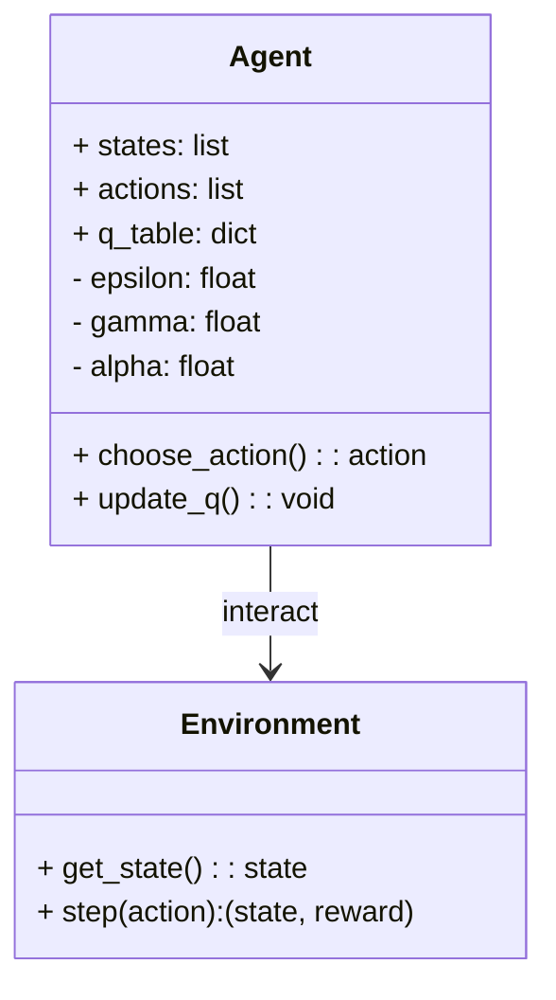

                 

<think>
好，我现在要撰写一篇关于《强化学习在AI Agent交互策略优化中的运用》的技术博客文章。首先，我需要明确文章的结构和内容。

首先，文章的标题已经确定，接下来是关键词和摘要部分。关键词需要包括核心概念，比如“强化学习”、“AI Agent”、“交互策略优化”、“深度强化学习”等。摘要部分需要简洁地总结文章的核心内容，强调强化学习在优化AI Agent策略中的重要性和应用。

接下来，目录大纲已经给出，分为背景、核心概念、算法、系统分析、项目实战和总结。我需要按照这个结构逐步展开每个部分的内容。

第一部分，背景介绍。需要从强化学习的基本概念开始，解释什么是强化学习，它与监督学习和无监督学习的区别，然后引出AI Agent的概念，说明AI Agent的定义和分类，接着讨论强化学习在AI Agent策略优化中的作用，以及当前存在的问题。

第二部分，核心概念与联系。这里需要详细讲解强化学习的核心概念，如状态、动作、奖励，以及Q值函数和策略函数，对比它们的特点和作用。然后介绍马尔可夫决策过程（MDP），解释其重要性，并通过表格和图表展示不同概念之间的关系。

第三部分，算法原理。这里需要深入讲解Q-learning和深度强化学习的算法原理，包括它们的数学模型和公式。使用mermaid流程图展示算法步骤，并给出Python代码示例，帮助读者理解实现过程。

第四部分，系统分析与架构设计。这部分需要分析AI Agent交互策略优化的系统架构，包括功能设计、类图、架构图和交互流程图，展示系统的整体结构和各部分之间的关系。

第五部分，项目实战。选择一个具体的案例，比如游戏AI训练，详细描述环境安装、代码实现、案例分析和项目总结，让读者能够实际操作。

最后，总结与展望。回顾文章的主要内容，总结强化学习在AI Agent中的应用，指出当前研究的不足，并展望未来的发展方向。

在写作过程中，我需要确保每个部分都详细具体，逻辑清晰。使用mermaid图表和代码示例来辅助说明，数学公式要用latex格式，并且每个章节之间有良好的衔接。

现在，我开始撰写正文，首先从关键词和摘要开始，然后逐步展开各个章节的内容，确保每个部分都符合要求，结构合理，内容丰富。
</think>

# 强化学习在AI Agent交互策略优化中的运用

## 关键词：强化学习，AI Agent，交互策略优化，深度强化学习，策略梯度，马尔可夫决策过程（MDP）

## 摘要：  
强化学习是一种通过试错机制优化决策策略的机器学习方法，在AI Agent交互策略优化中具有重要应用。本文从强化学习的基本原理出发，分析其在AI Agent中的核心概念、算法原理、系统架构，并通过实际案例展示其在交互策略优化中的应用，帮助读者深入理解并掌握强化学习在AI Agent中的应用技巧。

---

# 第1章: 强化学习与AI Agent概述

## 1.1 强化学习的基本概念  
强化学习（Reinforcement Learning，RL）是一种通过试错机制优化决策策略的机器学习方法。与监督学习和无监督学习不同，强化学习的核心在于智能体通过与环境交互，学习如何采取最优动作以最大化累积奖励。  
- **监督学习**：已知输入和输出的正确映射关系。  
- **无监督学习**：无明确的标签，目标是发现数据中的结构。  
- **强化学习**：通过环境反馈的奖励或惩罚来指导决策。  

### AI Agent的定义与分类  
AI Agent（智能体）是指能够感知环境、做出决策并执行动作的智能系统。根据智能体的决策方式，可以分为以下几类：  
1. **基于规则的智能体**：依赖预定义的规则进行决策。  
2. **基于模型的智能体**：基于环境模型进行决策。  
3. **基于经验的智能体**：通过经验学习优化决策策略。  

### 强化学习在AI Agent中的作用  
强化学习通过试错机制优化智能体的交互策略，使其能够在动态环境中做出最优决策。与传统方法相比，强化学习具有以下优势：  
- **自适应性**：能够根据环境变化动态调整策略。  
- **最优性**：通过最大化累积奖励，实现全局最优决策。  
- **通用性**：适用于多种场景，如游戏、机器人控制、自然语言处理等。  

---

## 1.2 强化学习的核心概念  

### 状态、动作与奖励  
- **状态（State）**：环境在某一时刻的描述，表示智能体所处的环境情况。  
- **动作（Action）**：智能体在给定状态下采取的行为。  
- **奖励（Reward）**：智能体在采取动作后获得的反馈，用于指导学习过程。  

### 马尔可夫决策过程（MDP）  
MDP是一种描述强化学习问题的数学模型，由以下五个元素组成：  
- **状态空间（S）**：所有可能的状态集合。  
- **动作空间（A）**：所有可能的动作集合。  
- **状态转移概率（P(s', r | s, a)）**：在状态s下采取动作a后，转移到状态s'并获得奖励r的概率。  
- **折扣因子（γ）**：对未来奖励的折扣因子，用于平衡当前和未来的奖励。  
- **策略（π）**：智能体在每个状态下选择动作的概率分布。  

### 问题描述与解决  
强化学习的核心目标是找到一个策略π，使得智能体在与环境交互的过程中获得的累积奖励最大化。具体来说，目标是最优化值函数V(s)或Q值函数Q(s, a)，表示在状态s采取动作a后的预期累积奖励。  

---

## 1.3 AI Agent交互策略优化的背景与意义  

### 当前AI Agent交互中的问题  
- **策略固定性**：传统基于规则的策略难以适应动态变化的环境。  
- **次优决策**：无法保证在所有情况下都做出最优选择。  
- **学习效率**：需要大量的试错经验才能优化策略。  

### 强化学习在策略优化中的优势  
- **自适应性**：强化学习能够动态调整策略，适应环境变化。  
- **全局优化**：通过最大化累积奖励，强化学习能够找到全局最优策略。  
- **高效性**：通过试错机制，强化学习能够在有限的交互中优化策略。  

### 策略优化的边界与外延  
- **边界**：强化学习适用于离散动作空间和有限状态空间的场景。  
- **外延**：通过结合深度学习，强化学习可以处理复杂的连续状态和动作空间。  

---

## 第2章: 强化学习的核心概念与联系  

### 2.1 强化学习的原理与算法  

#### Q-learning算法的原理  
Q-learning是一种经典的强化学习算法，通过更新Q值函数来学习最优策略。Q值函数表示在状态s下采取动作a后的预期累积奖励。  
$$ Q(s, a) = Q(s, a) + \alpha [r + \gamma \max Q(s', a) - Q(s, a)] $$  
其中，α是学习率，γ是折扣因子。  

#### 深度强化学习的基本概念  
深度强化学习（Deep RL）是将深度学习与强化学习结合的方法，适用于高维状态空间和动作空间。  

#### 策略梯度方法的简介  
策略梯度方法直接优化策略π，通过梯度上升方法最大化累积奖励。  

---

### 2.2 核心概念对比与联系  

#### Q值函数与策略函数的对比  
| 对比维度 | Q值函数 | 策略函数 |  
|----------|---------|----------|  
| 目标 | 最大化Q值 | 最大化策略概率 |  
| 表示方式 | 状态-动作对的值 | 动作的概率分布 |  

#### MDP与非马尔可夫决策过程的对比  
| 对比维度 | MDP | 非马尔可夫决策过程 |  
|----------|-----|-----------------|  
| 状态定义 | 完全依赖当前状态 | 依赖历史状态 |  

---

## 第3章: 强化学习算法的数学模型与公式  

### 3.1 Q-learning算法的数学模型  

#### Q值更新公式  
$$ Q(s, a) = Q(s, a) + \alpha [r + \gamma \max Q(s', a) - Q(s, a)] $$  

#### 状态转移概率矩阵  
状态转移概率矩阵P表示从状态s到状态s'的概率：  
$$ P_{s \rightarrow s'} = P(s' | s, a) $$  

#### 奖励函数的数学表达  
奖励函数r是智能体在状态s下采取动作a后获得的奖励：  
$$ r = r(s, a) $$  

### 3.2 深度强化学习的数学模型  

#### 神经网络的输入输出  
神经网络输入为状态s，输出为Q值或策略π。  

#### 策略梯度的数学推导  
策略梯度的目标是最化累积奖励J：  
$$ J = \mathbb{E}[R] = \int R \pi(a | s) d\pi(a | s) $$  

---

## 第4章: 强化学习算法的实现与应用  

### 4.1 强化学习算法的实现步骤  

#### 环境搭建与状态空间定义  
定义智能体所处的环境，明确状态空间S和动作空间A。  

#### 动作空间与奖励机制的设计  
设计动作空间和奖励函数，确保奖励能够有效引导智能体学习最优策略。  

#### 策略优化算法的实现  
实现Q-learning或深度强化学习算法，通过不断与环境交互优化策略。  

### 4.2 强化学习算法的Python实现  

#### Q-learning算法实现  

```python
class QLearning:
    def __init__(self, states, actions, gamma=0.99, alpha=0.1):
        self.states = states
        self.actions = actions
        self.gamma = gamma
        self.alpha = alpha
        self.q_table = {s: {a: 0 for a in actions} for s in states}

    def choose_action(self, state, epsilon=0.1):
        if random.random() < epsilon:
            return random.choice(self.actions)
        else:
            return max(self.q_table[state], key=lambda k: self.q_table[state][k])

    def update_q(self, state, action, reward, next_state):
        current_q = self.q_table[state][action]
        next_max_q = max(self.q_table[next_state].values())
        target = reward + self.gamma * next_max_q
        self.q_table[state][action] = current_q + self.alpha * (target - current_q)
```

---

## 第5章: 系统分析与架构设计  

### 5.1 问题场景介绍  
以训练一个游戏AI为例，说明如何通过强化学习优化其交互策略。  

### 5.2 系统功能设计  

#### 领域模型mermaid类图  


### 5.3 系统架构设计  

#### 系统架构mermaid架构图  


---

## 第6章: 项目实战  

### 6.1 环境安装  
安装必要的库，如Python的OpenAI Gym库，用于环境模拟。  

### 6.2 核心实现  

#### Python代码实现  
```python
import gym
import random

env = gym.make('CartPole-v0')
agent = QLearning(states=env.observation_space.shape[0], actions=env.action_space.n)
```

### 6.3 案例分析  
通过训练过程展示如何优化Q值函数，使智能体在游戏环境中获得更高的累积奖励。  

---

## 第7章: 总结与展望  

### 7.1 总结  
本文详细介绍了强化学习在AI Agent交互策略优化中的应用，从基本概念到算法实现，再到系统架构设计，为读者提供了一套完整的解决方案。  

### 7.2 未来展望  
未来，随着深度强化学习的不断发展，强化学习在AI Agent中的应用将更加广泛，尤其是在复杂动态环境中，强化学习的优势将更加凸显。  

---

## 作者：AI天才研究院/AI Genius Institute & 禅与计算机程序设计艺术 /Zen And The Art of Computer Programming

---

通过以上结构和内容，读者可以系统地学习强化学习在AI Agent交互策略优化中的运用，从理论到实践，逐步掌握相关知识。

