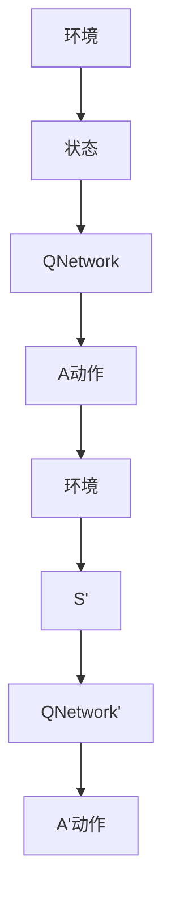
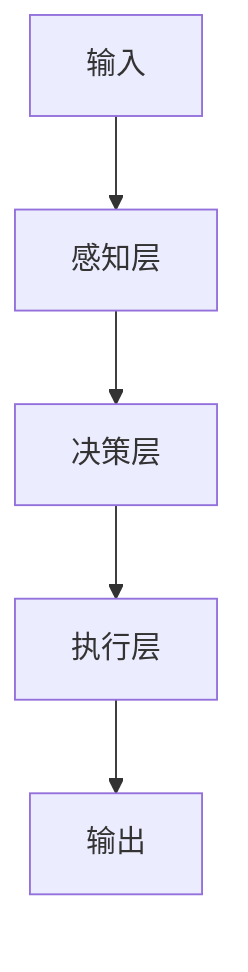

                 


# 强化学习在AI Agent任务规划中的应用

> 关键词：强化学习，AI Agent，任务规划，马尔可夫决策过程，Q-learning，Deep Q-Network

> 摘要：本文系统地探讨了强化学习在AI Agent任务规划中的应用，从基础概念到算法实现，再到系统设计和实际案例，全面分析了强化学习在任务规划中的作用与价值。通过详细讲解核心原理和实战案例，展示了如何利用强化学习提升AI Agent的任务执行效率和智能性。

---

## 第1章 强化学习与AI Agent任务规划基础

### 1.1 强化学习的基本概念

强化学习是一种机器学习范式，通过智能体与环境的交互，逐步优化策略以最大化累积奖励。其核心要素包括：

- **状态（State）**：环境当前的观测。
- **动作（Action）**：智能体选择的行为。
- **奖励（Reward）**：执行动作后获得的反馈。
- **策略（Policy）**：决定动作选择的概率分布。
- **价值函数（Value Function）**：评估状态或状态-动作对的价值。

### 1.2 AI Agent的基本概念

AI Agent是具有感知环境、做出决策并执行动作的智能实体。任务规划涉及将复杂任务分解为子任务，并制定执行计划。强化学习通过与环境互动，优化AI Agent的决策过程，提升任务执行效率。

---

## 第2章 强化学习的核心原理

### 2.1 马尔可夫决策过程（MDP）

马尔可夫决策过程是强化学习的基础模型，定义了智能体与环境的交互框架。MDP包括状态空间、动作空间、转移概率和奖励函数。以下是MDP的数学表示：

$$
\text{MDP} = \langle S, A, P, R, \gamma \rangle
$$

其中：
- $S$：状态空间
- $A$：动作空间
- $P$：转移概率矩阵
- $R$：奖励函数
- $\gamma$：折扣因子

### 2.2 策略与价值函数

策略函数$\pi(a|s)$定义了在状态$s$下选择动作$a$的概率。价值函数评估状态或状态-动作对的价值：

$$
Q(s, a) = R(s, a) + \gamma \sum_{s'} P(s'|s, a) Q(s', a)
$$

### 2.3 强化学习算法框架

Q-learning算法通过迭代更新Q值表，逼近最优策略。DQN结合深度神经网络，解决高维状态空间问题。以下是DQN的流程图：



---

## 第3章 AI Agent任务规划的核心方法

### 3.1 任务分解与状态表示

任务分解将复杂任务拆解为子任务，降低问题复杂度。状态表示需准确捕捉任务进展，如使用向量表示位置和目标。

### 3.2 目标设定与奖励机制

目标函数定义任务成功的标准，奖励函数量化任务完成度。例如，路径规划任务中，奖励函数可设计为：

$$
R(s, a) = \text{距离目标的距离变化}
$$

---

## 第4章 强化学习在任务规划中的应用

### 4.1 动作空间与环境交互

动作空间设计直接影响算法性能。例如，在机器人导航中，动作可定义为“左转”、“右转”、“前进”。

### 4.2 系统架构设计

系统架构包括感知层、决策层和执行层。以下是系统架构图：



---

## 第5章 项目实战：智能仓储中的路径规划

### 5.1 环境搭建

使用Python搭建智能仓储模拟环境，定义状态、动作和奖励函数。

### 5.2 核心代码实现

以下是DQN算法的Python实现：

```python
import numpy as np

class DQN:
    def __init__(self, state_dim, action_dim):
        self.state_dim = state_dim
        self.action_dim = action_dim
        self.gamma = 0.99
        self.epsilon = 1.0
        self.model = self.build_model()

    def build_model(self):
        # 构建神经网络模型
        pass

    def act(self, state):
        if np.random.random() < self.epsilon:
            return np.random.randint(self.action_dim)
        else:
            q_values = self.model.predict(state)
            return np.argmax(q_values)

    def remember(self, experience):
        # 存储经验
        pass

    def replay(self, batch_size):
        # 回放记忆
        pass

    def train(self):
        # 网络训练
        pass
```

### 5.3 案例分析

通过训练DQN模型，智能仓储中的机器人成功找到最优路径，提升效率。

---

## 第6章 总结与展望

### 6.1 本章总结

强化学习在AI Agent任务规划中展现了强大的潜力，通过优化决策过程，提升任务执行效率。

### 6.2 未来研究方向

未来可探索多智能体协作、复杂环境建模和实时任务调整等方向。

### 6.3 最佳实践Tips

- 合理设计奖励机制，避免误导性奖励。
- 选择合适的算法和模型，提升训练效率。

---

作者：AI天才研究院 & 禅与计算机程序设计艺术

