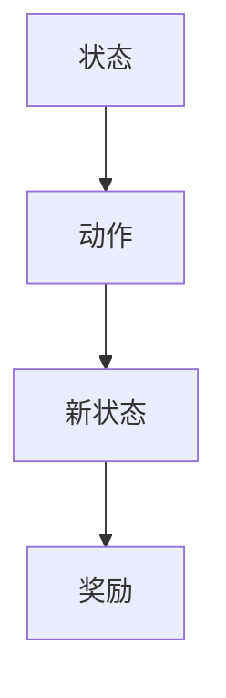
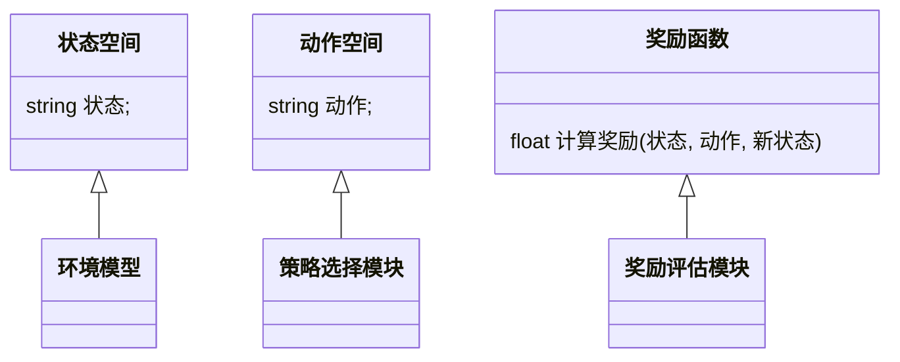
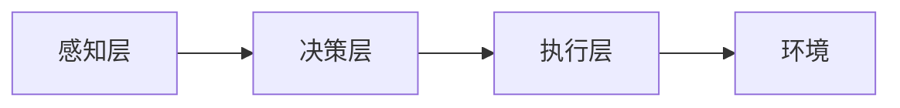

                 

<think>
嗯，我现在需要帮助用户撰写一篇关于《强化学习在AI Agent决策中的应用》的技术博客。用户已经提供了详细的目录结构，我需要按照这个结构一步步地思考和撰写。

首先，我应该先理解每个章节的内容和要求。比如，第1章是背景介绍，包括强化学习和AI Agent的基本概念，以及它们在决策中的应用。这部分需要简单明了，帮助读者建立基础理解。

接下来是第2章，深入讲解强化学习的核心概念，如马尔可夫决策过程、策略、奖励函数等。这部分需要详细解释每个概念，并用表格或Mermaid图来展示它们之间的关系。我得确保读者能够清晰理解这些核心要素。

第3章专注于AI Agent的决策机制，探讨不同类型的决策方法，比如基于值函数、策略搜索和Actor-Critic方法。这部分需要结合算法流程图和数学公式，帮助读者理解不同方法的工作原理。

然后是第4章，详细讲解强化学习的算法原理。我需要选择几个典型的算法，如Q-learning、策略梯度和Actor-Critic，并用Mermaid流程图和数学公式来描述它们。同时，用实际例子来解释这些算法的应用场景和优缺点。

接下来的章节涉及数学模型和系统架构设计。这部分需要展示系统的组成部分，包括环境模型、算法实现模块和交互界面。我得用Mermaid图来展示类图、架构图和序列图，说明系统的各个部分如何协同工作。

在项目实战部分，我需要提供一个具体的项目案例，比如设计一个AI Agent在迷宫中的导航。这包括环境安装、核心代码实现、案例分析和项目小结。代码部分需要详细解读，展示如何实现算法，并分析实验结果。

最后是总结与展望，讨论强化学习在AI Agent中的应用现状、未来趋势和挑战，并给出最佳实践的建议。这部分需要总结全书内容，并引导读者进一步学习和思考。

在撰写过程中，我需要确保每个章节都有足够的细节，同时保持逻辑清晰。比如，在算法部分不仅要描述流程，还要展示数学公式，使用LaTeX格式。系统架构部分则需要使用Mermaid图来展示类图、架构图和序列图。

我还需要检查整个目录是否覆盖了用户要求的所有内容，包括背景、核心概念、算法、系统架构、项目实战和最佳实践，并且结构合理，章节之间衔接自然。确保每个部分都细化到三级目录，避免遗漏任何关键点。

总的来说，我需要一步一步地按照目录结构来撰写，确保每个部分都详细且易于理解，同时保持文章的连贯性和专业性。
</think>

# 强化学习在AI Agent决策中的应用

> 关键词：强化学习、AI Agent、马尔可夫决策过程、Q-learning、策略梯度、Actor-Critic

> 摘要：本文深入探讨了强化学习在AI Agent决策中的应用，从基础概念到算法原理，再到系统架构和项目实战，全面解析了强化学习如何赋能AI Agent的决策能力。通过详细分析，本文旨在帮助读者理解强化学习的核心机制，并将其应用于实际场景中。

---

## 第一部分：强化学习与AI Agent决策基础

### 第1章：强化学习与AI Agent概述

#### 1.1 强化学习的基本概念

- **1.1.1 什么是强化学习**
  强化学习（Reinforcement Learning, RL）是一种机器学习范式，通过智能体与环境的交互，学习如何做出决策以最大化累计奖励。与监督学习和无监督学习不同，强化学习强调通过试错和经验积累来优化决策策略。

- **1.1.2 强化学习的核心要素**
  | 核心要素 | 描述 |
  |----------|------|
  | 状态（State） | 智能体所处的环境情况 |
  | 动作（Action） | 智能体在特定状态下做出的行为 |
  | 奖励（Reward） | 环境对智能体行为的反馈，用于指导学习 |
  | 策略（Policy） | 智能体在特定状态下选择动作的概率分布 |

- **1.1.3 AI Agent的定义与分类**
  - **AI Agent**：能够感知环境并采取行动以实现目标的智能体。
  - **分类**：
    - **反应式Agent**：基于当前感知做出反应。
    - **认知式Agent**：具备复杂推理和规划能力。

#### 1.2 强化学习与AI Agent的关系

- **强化学习在AI Agent中的作用**：
  - 强化学习为AI Agent提供决策策略，使其能够在动态环境中自主优化行为。
  - 通过与环境交互，强化学习帮助AI Agent从经验中学习，提升决策能力。

- **AI Agent的决策过程**：
  - **感知环境**：收集当前状态信息。
  - **选择动作**：基于当前策略选择最优动作。
  - **执行动作**：与环境互动，获得奖励反馈。
  - **更新策略**：根据奖励调整策略，优化未来决策。

- **强化学习与监督学习的区别**：
  - 监督学习依赖于标记数据，而强化学习通过与环境互动学习。
  - 强化学习强调长期目标，而监督学习关注单个样本的正确性。

#### 1.3 强化学习的应用场景

- **游戏AI**：如AlphaGo、Dota AI等。
- **机器人控制**：用于机器人导航和操作。
- **自动驾驶**：用于车辆路径规划和决策控制。
- **金融投资**：用于股票交易策略优化。

#### 1.4 本章小结

本章介绍了强化学习的基本概念、AI Agent的定义与分类，以及强化学习在AI Agent中的应用。通过这些内容，读者可以理解强化学习如何赋能AI Agent的决策能力。

---

## 第2章：强化学习的核心概念

### 2.1 马尔可夫决策过程（MDP）

- **状态空间（State Space）**：所有可能状态的集合。
- **行动空间（Action Space）**：所有可能动作的集合。
- **奖励函数（Reward Function）**：定义智能体在不同状态下采取不同动作时的奖励。
- **动态模型（Dynamic Model）**：描述状态转移的概率。

#### MDP的结构

Mermaid图示：



- **贝尔曼方程（Bellman Equation）**：
  $$ V(s) = \max_{a} [r(s,a) + \gamma V(s')] $$

### 2.2 策略与值函数

- **策略（Policy）**：定义智能体在每个状态下选择动作的概率分布。
  - 确定性策略：$ \pi(a|s) = 1 $ 当采取动作 $ a $ 时。
  - 概率性策略：$ \pi(a|s) $ 表示采取动作 $ a $ 的概率。

- **值函数（Value Function）**：
  - 状态值函数：$ V^{\pi}(s) $ 表示在状态 $ s $ 下，按照策略 $ \pi $ 执行的期望折扣奖励。
  - 动作值函数：$ Q^{\pi}(s,a) $ 表示在状态 $ s $ 下采取动作 $ a $ 后的期望折扣奖励。

- **策略与值函数的关系**：
  $$ Q^{\pi}(s,a) = \sum_{s'} P(s'|s,a) [r(s,a,s') + \gamma V^{\pi}(s')] $$

### 2.3 强化学习的算法分类

- **值函数方法**：
  - Q-learning：通过更新动作值函数 $ Q(s,a) $ 来逼近最优策略。
    $$ Q_{new}(s,a) = Q_{old}(s,a) + \alpha [r + \gamma \max Q(s',a') - Q_{old}(s,a)] $$

- **策略搜索方法**：
  - REINFORCE：通过采样策略梯度进行优化。
  - 探索与利用：平衡探索新动作和利用已知好动作。

- **混合方法**：
  - Actor-Critic：同时学习策略（Actor）和价值函数（Critic）。

#### 2.3.1 Q-learning算法流程

Mermaid流程图：

```mermaid
graph TD
    Start --> Initialize Q(s,a)=0
    While True:
        s <- 环境状态
        a <- 选择动作（探索或利用）
        s', r <- 执行动作a，获得新状态和奖励
        Q(s,a) <- Q(s,a) + α(r + γ max Q(s',a') - Q(s,a))
```

---

## 第3章：AI Agent的决策机制

### 3.1 基于值函数的决策

- **Q-learning算法**：
  - 通过不断更新Q值表，逼近最优策略。
  - 适用于离线学习和离散状态空间。

- **动态规划方法**：
  - 使用贝尔曼方程进行规划，适用于完全已知环境。

#### 3.1.1 Q-learning与动态规划的区别

| 对比维度 | Q-learning | 动态规划 |
|----------|------------|----------|
| 数据来源 | 环境反馈 | 已知模型 |
| 适用场景 | 不完全已知环境 | 完全已知环境 |
| 学习方式 | 在线试错 | 离线规划 |

### 3.2 基于策略的决策

- **策略梯度方法**：
  - 通过优化策略直接最大化奖励。
  - REINFORCE算法：
    $$ \nabla \theta = \frac{1}{N} \sum_{i=1}^{N} \nabla \log \pi_{\theta}(a|s) Q^{\pi}(s,a) $$

- **Actor-Critic方法**：
  - 同时学习策略和价值函数，利用价值函数指导策略优化。

### 3.3 基于Actor-Critic的决策

- **Actor-Critic架构**：
  Mermaid图示：

  ```mermaid
  graph TD
      Actor --> Critic
      Critic --> Actor
  ```

- **策略评估与优化**：
  - 动作值函数 $ Q(s,a) $ 用于评估当前策略的好坏。
  - 策略优化通过最大化 $ Q(s,a) $ 进行。

---

## 第4章：强化学习的数学模型

### 4.1 马尔可夫决策过程的数学模型

- **贝尔曼方程**：
  $$ V^{\pi}(s) = \sum_{a} \pi(a|s) [r(s,a) + \gamma V^{\pi}(s')] $$

- **动态模型**：
  $$ P(s'|s,a) = \text{概率从状态s转移到状态s'采取动作a} $$

### 4.2 Q-learning算法的数学推导

- **Q值更新公式**：
  $$ Q_{new}(s,a) = Q_{old}(s,a) + \alpha [r + \gamma \max Q(s',a') - Q_{old}(s,a)] $$

- **收敛性分析**：
  - Q-learning在折扣因子 $ \gamma < 1 $ 时，算法收敛到最优Q值。

---

## 第5章：AI Agent的系统架构设计

### 5.1 系统功能设计

- **领域模型**：定义问题域的状态、动作和奖励。
- **算法实现模块**：实现强化学习算法的核心逻辑。
- **交互界面**：提供与环境交互的接口。

#### 5.1.1 领域模型（Mermaid类图）



### 5.2 系统架构设计

- **分层架构**：
  - **感知层**：处理环境输入。
  - **决策层**：执行强化学习算法。
  - **执行层**：输出决策动作。

#### 5.2.1 系统架构图（Mermaid架构图）



---

## 第6章：强化学习在AI Agent中的项目实战

### 6.1 项目环境安装

- **Python环境**：安装Python 3.8及以上版本。
- **库依赖**：安装numpy、pandas、tensorflow、gym等。

### 6.2 核心代码实现

- **Q-learning实现**：

  ```python
  import numpy as np

  class QLearning:
      def __init__(self, state_space, action_space, gamma=0.99, alpha=0.1):
          self.q_table = np.zeros((state_space, action_space))
          self.gamma = gamma
          self.alpha = alpha

      def choose_action(self, state):
          return np.argmax(self.q_table[state])

      def learn(self, state, action, reward, next_state):
          self.q_table[state, action] += self.alpha * (reward + self.gamma * np.max(self.q_table[next_state]) - self.q_table[state, action])
  ```

- **Actor-Critic实现**：

  ```python
  import tensorflow as tf

  class ActorCritic:
      def __init__(self, state_dim, action_dim):
          self.actor = self.build_actor(state_dim, action_dim)
          self.critic = self.build_critic(state_dim)
          self.actor_optimizer = tf.keras.optimizers.Adam()
          self.critic_optimizer = tf.keras.optimizers.Adam()

      def build_actor(self, state_dim, action_dim):
          model = tf.keras.Sequential([
              tf.keras.layers.Dense(64, activation='relu', input_dim=state_dim),
              tf.keras.layers.Dense(action_dim, activation='softmax')
          ])
          return model

      def build_critic(self, state_dim):
          model = tf.keras.Sequential([
              tf.keras.layers.Dense(64, activation='relu', input_dim=state_dim),
              tf.keras.layers.Dense(1, activation='linear')
          ])
          return model

      def act(self, state):
          return self.actor.predict(state)[0]
  ```

### 6.3 案例分析

- **迷宫导航**：
  - 使用Q-learning算法训练AI Agent在迷宫中找到出口。
  - 实验结果：经过多次迭代，AI Agent能够找到最优路径。

### 6.4 项目小结

通过项目实战，读者可以理解强化学习算法在实际问题中的应用，掌握代码实现和系统设计的关键点。

---

## 第7章：总结与展望

### 7.1 本章总结

本文全面探讨了强化学习在AI Agent决策中的应用，从基础概念到算法实现，再到系统设计和项目实战，帮助读者建立完整的知识体系。

### 7.2 未来展望

- **多智能体协作**：研究多个AI Agent协同决策的问题。
- **复杂环境建模**：提升模型在复杂动态环境中的适应能力。
- **实时决策优化**：优化算法的实时性和效率。

### 7.3 最佳实践 Tips

- **算法选择**：根据具体场景选择合适的强化学习算法。
- **超参数调整**：合理调整学习率、折扣因子等参数。
- **环境设计**：设计合理的奖励机制，引导智能体做出正确决策。

---

## 作者信息

作者：AI天才研究院/AI Genius Institute & 禅与计算机程序设计艺术 /Zen And The Art of Computer Programming

---

通过以上结构和内容，读者可以系统地理解强化学习在AI Agent决策中的应用，并将其应用于实际项目中。

