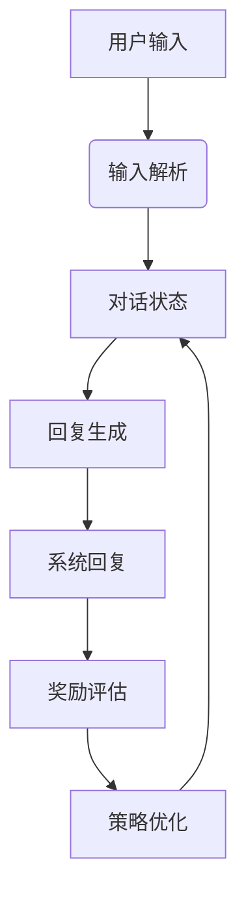
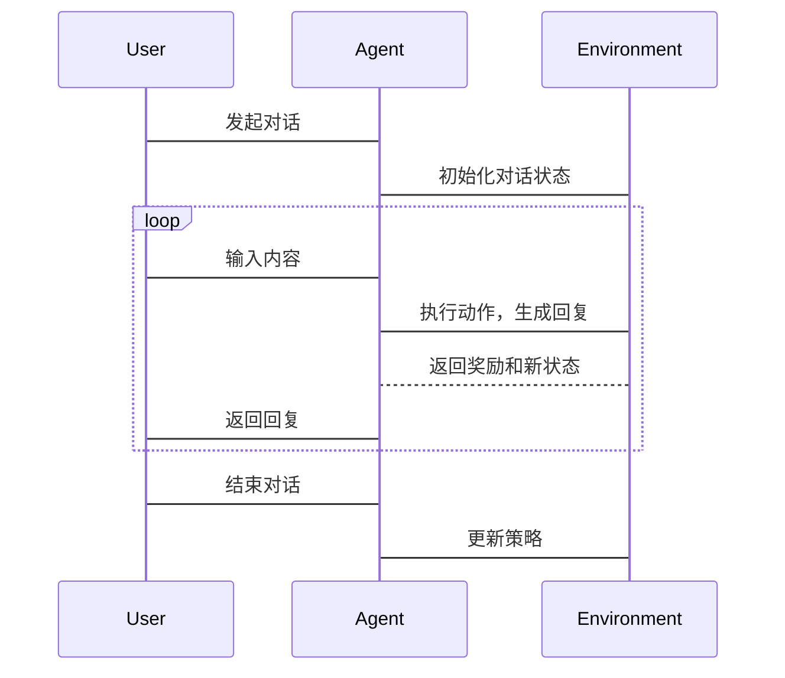

                 

<think>
好的，我现在要帮用户撰写一篇关于强化学习在AI Agent对话策略中的应用的技术博客。首先，我需要仔细阅读用户的需求，确保理解所有的要求。

用户希望文章标题是《强化学习在AI Agent对话策略中的应用》，关键词包括强化学习、对话系统、AI Agent、对话策略、自然语言处理、深度学习。摘要需要简明扼要地概括文章的核心内容，强调强化学习在对话系统中的重要性以及文章的结构安排。

接下来，用户提供了一个详细的目录结构，分为六大部分，每个部分都有具体的章节和子章节。我需要按照这个结构来撰写文章，确保每个部分都涵盖必要的内容，并且逻辑清晰。

第一部分是引言，介绍强化学习和AI Agent的基本概念，以及它们在对话策略中的应用背景。我需要确保这部分内容足够简明，帮助读者建立基础理解。

第二部分是强化学习的核心概念与数学模型，详细讲解强化学习的原理、核心算法，以及在对话策略中的应用。这里需要使用数学公式和图表来辅助说明，比如Q-learning算法和DQN的结构。

第三部分是基于强化学习的对话策略算法实现，这部分需要详细描述算法的实现步骤，包括环境建模、动作空间设计、奖励机制定义等，并提供代码示例，帮助读者理解。

第四部分是系统分析与架构设计，介绍如何将强化学习应用于实际的对话系统中。这部分需要系统架构图和交互流程图，展示系统的组成部分和交互过程。

第五部分是项目实战，通过一个具体案例（如基于OpenAI的对话系统）来展示如何实现对话策略。需要详细说明环境搭建、代码实现、功能模块设计等，帮助读者实际操作。

最后是总结与展望，回顾整书内容，并指出未来的研究方向和应用前景。同时，给出一些最佳实践的建议，帮助读者在实际应用中避免常见问题。

在撰写过程中，我需要确保每个章节内容丰富，详细讲解每个概念和算法，同时提供足够的实例和代码，使读者能够深入理解和掌握强化学习在AI Agent对话策略中的应用。

现在，我开始按照目录结构逐一撰写每个部分，确保每部分内容完整，逻辑清晰，语言专业但易懂。同时，注意使用markdown格式，正确嵌入数学公式和图表，使文章结构美观，内容易于理解。

在写作过程中，我会不断检查是否覆盖了用户的所有要求，确保没有遗漏任何重要部分，并且保持文章的连贯性和深度。完成后，我会通读一遍，确保没有语法错误，内容准确，结构合理。

最终，完成一篇符合用户需求，高质量的技术博客文章。
</think>

# 强化学习在AI Agent对话策略中的应用

> 关键词：强化学习，对话系统，AI Agent，对话策略，自然语言处理，深度学习

> 摘要：本文深入探讨了强化学习在AI Agent对话策略中的应用，从基础概念到算法实现，再到系统设计与实战，全面解析了强化学习在对话系统中的核心作用与实际应用。通过详细讲解强化学习的核心原理、对话策略的设计方法，以及具体的算法实现和系统架构，本文为读者提供了从理论到实践的完整指南，帮助读者理解并掌握如何利用强化学习提升AI Agent的对话能力。

---

# 第一部分: 强化学习与AI Agent对话策略基础

## 第1章: 强化学习与AI Agent概述

### 1.1 强化学习的定义与核心概念

#### 1.1.1 强化学习的基本概念
强化学习（Reinforcement Learning, RL）是一种机器学习范式，通过智能体与环境的交互来学习最优策略。智能体通过执行动作，观察环境的状态和获得的奖励，逐步优化自己的行为以最大化累积奖励。与监督学习不同，强化学习不需要明确的标注数据，而是通过试错和奖励机制进行学习。

#### 1.1.2 强化学习的核心要素
- **状态（State）**：环境在某一时刻的描述，表示智能体所处的环境情况。
- **动作（Action）**：智能体在某一状态下选择的行为。
- **奖励（Reward）**：智能体执行动作后，环境给予的反馈，用于评估动作的好坏。
- **策略（Policy）**：智能体选择动作的规则，可以是基于当前状态的随机策略或确定性策略。
- **值函数（Value Function）**：评估某一状态或动作的期望奖励的函数。

#### 1.1.3 强化学习与监督学习的区别
- 监督学习：基于标注数据进行学习，目标是找到输入到输出的映射关系。
- 强化学习：通过与环境交互，基于奖励信号优化策略，是一种目标导向的学习方式。

### 1.2 AI Agent的基本概念与分类

#### 1.2.1 AI Agent的定义
AI Agent（人工智能代理）是指能够感知环境并采取行动以实现目标的智能实体。它可以是一个软件程序、机器人或其他智能系统，具备自主决策和问题解决能力。

#### 1.2.2 AI Agent的分类与应用场景
- **简单反射型Agent**：基于当前状态直接映射到动作，适用于简单的决策任务。
- **基于模型的规划型Agent**：维护环境的状态模型，能够进行复杂规划和决策。
- **实用主义型Agent**：通过效用函数评估不同动作的价值，选择最优动作。
- **学习型Agent**：通过与环境的交互和经验积累，不断优化自身的决策能力。

#### 1.2.3 对话策略的基本概念
对话策略是指AI Agent在对话过程中选择回复或行动的规则。一个有效的对话策略能够理解用户意图、生成合理的回复，并根据对话上下文进行动态调整。

### 1.3 强化学习在对话策略中的应用背景

#### 1.3.1 对话系统的发展历程
- **基于规则的对话系统**：通过预定义的规则生成回复，适用于简单的对话场景。
- **基于统计模型的对话系统**：利用概率模型（如马尔可夫链）进行对话生成，考虑上下文信息。
- **基于深度学习的对话系统**：采用神经网络模型（如循环神经网络RNN、Transformer）进行对话生成，具备更强的语义理解和生成能力。
- **基于强化学习的对话系统**：通过强化学习优化对话策略，实现更智能的对话生成与管理。

#### 1.3.2 强化学习在对话策略中的优势
- **目标导向性**：强化学习通过最大化累积奖励，能够直接优化对话系统的最终目标，如用户满意度或任务完成度。
- **动态适应性**：强化学习能够在动态变化的对话环境中，实时调整策略，适应新的对话场景。
- **端到端优化**：强化学习可以直接对整个对话过程进行优化，而不需要依赖于中间任务的分解。

#### 1.3.3 当前研究的挑战与机遇
- **挑战**：对话环境的高度复杂性、奖励函数的设计难度、策略的稳定性和收敛性等问题。
- **机遇**：强化学习在对话系统中的应用能够显著提升对话的自然性和智能性，为AI Agent的发展提供新的方向。

---

## 第2章: 强化学习的核心概念与原理

### 2.1 强化学习的基本原理

#### 2.1.1 状态（State）的定义与表示
状态是环境在某一时刻的描述，可以用向量、符号或其他形式表示。在对话系统中，状态可能包括对话历史、用户意图、上下文信息等。

#### 2.1.2 动作（Action）的定义与选择
动作是智能体在某一状态下选择的行为，可以是回复一句话、提出一个问题或执行某个任务。在对话系统中，动作通常表现为生成回复文本或选择特定的回复模板。

#### 2.1.3 奖励（Reward）的定义与设计
奖励是智能体执行动作后获得的反馈，用于评估动作的好坏。在对话系统中，奖励可以是基于用户满意度、对话流畅度、任务完成度等多维度的综合评估。

### 2.2 马尔可夫决策过程（MDP）

#### 2.2.1 MDP的基本概念
马尔可夫决策过程（Markov Decision Process, MDP）是强化学习的核心模型，描述了智能体与环境之间的交互过程。MDP由状态空间、动作空间、转移概率和奖励函数四个部分组成。

#### 2.2.2 MDP的数学模型
- 状态空间：\( S \)，表示所有可能的状态。
- 动作空间：\( A \)，表示所有可能的动作。
- 转移概率：\( P(s' | s, a) \)，表示从状态 \( s \) 执行动作 \( a \) 后转移到状态 \( s' \) 的概率。
- 奖励函数：\( R(s, a, s') \)，表示从状态 \( s \) 执行动作 \( a \) 后转移到状态 \( s' \) 时获得的奖励。

#### 2.2.3 MDP在对话策略中的应用
在对话系统中，MDP模型可以用来描述对话的动态过程，状态表示对话历史，动作表示回复内容，奖励表示对话的流畅性和用户满意度。

### 2.3 强化学习的核心算法

#### 2.3.1 Q-learning算法
Q-learning是一种经典的强化学习算法，通过学习状态-动作对的值函数来优化策略。其核心公式为：
$$ Q(s, a) = Q(s, a) + \alpha (r + \gamma \max Q(s', a') - Q(s, a)) $$
其中：
- \( Q(s, a) \)：状态 \( s \) 下执行动作 \( a \) 的价值。
- \( \alpha \)：学习率。
- \( r \)：获得的奖励。
- \( \gamma \)：折扣因子。
- \( s' \)：执行动作 \( a \) 后转移到的新状态。

#### 2.3.2 Deep Q-Networks（DQN）
DQN通过深度神经网络近似Q函数，解决了Q-learning在高维状态空间中的计算问题。其网络结构包括经验回放和目标网络两个关键组件：
1. **经验回放**：将经历的状态、动作、奖励和新状态存储在经验池中，训练时随机采样经验，减少数据相关性。
2. **目标网络**：使用两个网络，一个作为主网络用于选择动作，另一个作为目标网络用于计算目标值，定期更新目标网络以稳定训练。

#### 2.3.3 策略梯度方法（Policy Gradient）
策略梯度方法直接优化策略，而不是价值函数。通过计算策略梯度，更新策略参数以最大化期望奖励。其优化目标为：
$$ \nabla J(\theta) = \mathbb{E}[\nabla_\theta \log \pi_\theta(a|s) \cdot Q_\pi(s, a)] $$
其中：
- \( \pi_\theta(a|s) \)：策略函数。
- \( Q_\pi(s, a) \)：策略 \( \pi \) 下的状态-动作价值函数。

### 2.4 强化学习的数学模型与公式

#### 2.4.1 Q-learning的数学公式
$$ Q(s, a) = Q(s, a) + \alpha (r + \gamma \max Q(s', a') - Q(s, a)) $$
该公式表示智能体在状态 \( s \) 下执行动作 \( a \)，获得奖励 \( r \) 后，更新状态 \( s' \) 下的动作价值函数。

#### 2.4.2 DQN的网络结构与损失函数
DQN的损失函数为：
$$ \mathcal{L} = \mathbb{E}[(r + \gamma Q(s', a') - Q(s, a))^2] $$
其中，\( Q(s, a) \) 为主网络输出，\( Q(s', a') \) 为目标网络输出。

---

## 第3章: 强化学习与对话策略的结合

### 3.1 对话策略的核心问题
对话策略的目标是通过智能体与用户交互，生成符合用户意图的回复，同时保持对话的连贯性和自然性。强化学习能够通过试错和奖励机制，优化对话策略，使其更接近用户的期望。

### 3.2 强化学习在对话策略中的应用流程

#### 3.2.1 状态表示
状态表示是强化学习在对话系统中的关键问题之一。常见的状态表示方法包括：
1. **基于对话历史的表示**：将对话历史编码为一个向量，用于描述当前对话的状态。
2. **基于上下文的表示**：结合对话历史、用户意图和情感等因素，构建更丰富的状态表示。
3. **基于嵌入的表示**：使用预训练的词向量（如Word2Vec、BERT）对对话内容进行编码。

#### 3.2.2 动作空间设计
动作空间的设计直接影响对话策略的灵活性和复杂性。常见的动作空间包括：
1. **回复生成**：智能体根据当前状态生成回复文本。
2. **问题选择**：智能体在多个问题中选择最合适的一个。
3. **任务执行**：智能体根据对话内容执行特定任务（如预约、查询信息等）。

#### 3.2.3 奖励机制设计
奖励机制是强化学习的核心，决定了智能体的优化方向。在对话系统中，奖励函数的设计需要考虑以下因素：
- **对话流畅性**：回复是否自然、连贯。
- **任务完成度**：是否成功完成用户的目标。
- **用户满意度**：用户对回复的满意度。
- **多样性**：回复是否具有多样性和创造性。

#### 3.2.4 强化学习的训练过程
强化学习的训练过程通常包括以下几个步骤：
1. **环境构建**：构建对话环境，定义状态、动作和奖励。
2. **策略选择**：选择策略函数或Q函数，初始化参数。
3. **经验交互**：智能体与环境交互，收集经验。
4. **模型更新**：根据经验更新策略或价值函数。
5. **策略评估**：评估当前策略的性能，调整参数。

### 3.3 基于强化学习的对话策略实现

#### 3.3.1 基于Q-learning的对话策略
Q-learning通过不断更新Q表，学习状态-动作对的值函数，优化对话策略。在对话系统中，Q表可以表示为一个二维数组，状态为对话历史，动作位回复内容。

#### 3.3.2 基于DQN的对话策略
DQN通过深度神经网络近似Q函数，解决了Q-learning在高维状态空间中的计算问题。在对话系统中，DQN可以通过预训练的对话模型生成回复，同时通过强化学习优化回复策略。

#### 3.3.3 基于策略梯度的对话策略
策略梯度方法直接优化策略，适用于动作空间较大或策略空间复杂的对话系统。在对话系统中，策略梯度方法可以通过生成模型直接生成回复文本，同时通过强化学习优化回复策略。

---

## 第4章: 系统分析与架构设计

### 4.1 对话系统的需求分析

#### 4.1.1 系统目标
- 提供自然流畅的对话体验。
- 实现复杂任务的对话管理。
- 支持多轮对话和上下文理解。

#### 4.1.2 功能需求
- 用户输入处理：解析用户的输入，理解用户意图。
- 系统回复生成：根据对话历史生成合适的回复。
- 对话状态管理：维护对话的上下文信息。
- 系统反馈机制：根据用户反馈调整对话策略。

### 4.2 系统架构设计

#### 4.2.1 系统模块划分
- **输入解析模块**：解析用户的输入，提取关键信息。
- **对话管理模块**：维护对话状态，管理对话流程。
- **回复生成模块**：根据对话状态生成回复内容。
- **奖励评估模块**：评估回复的奖励值，优化对话策略。

#### 4.2.2 系统架构图


### 4.3 对话流程分析

#### 4.3.1 对话启动
- 用户发起对话请求。
- 系统初始化对话状态。

#### 4.3.2 对话进行
- 系统根据对话状态生成回复。
- 用户反馈回复内容。
- 系统根据反馈更新对话状态和策略。

#### 4.3.3 对话结束
- 用户确认结束对话。
- 系统保存对话历史，优化策略。

---

## 第5章: 项目实战

### 5.1 项目背景
本项目旨在实现一个基于强化学习的对话系统，通过强化学习优化对话策略，提升对话的自然性和智能性。

### 5.2 环境搭建

#### 5.2.1 环境需求
- 操作系统：Windows/Mac/Linux。
- Python版本：3.6以上。
- 需要安装的库：TensorFlow、Keras、numpy、matplotlib。

#### 5.2.2 安装依赖
```bash
pip install tensorflow keras numpy matplotlib
```

### 5.3 系统实现

#### 5.3.1 环境建模
```python
class DialogueEnvironment:
    def __init__(self):
        self.dialogue_history = []
        self.user_intention = None
    def get_state(self):
        return self.dialogue_history
    def execute_action(self, action):
        # 根据动作生成新的对话历史
        self.dialogue_history.append(action)
        return self.get_next_state(), reward
```

#### 5.3.2 动作空间定义
```python
class ActionSpace:
    def __init__(self, actions):
        self.actions = actions
    def sample(self):
        return random.choice(self.actions)
```

#### 5.3.3 奖励机制设计
```python
def reward_function(current_state, action, next_state):
    # 简单的奖励函数，可以根据具体需求修改
    return 1 if action == 'appropriate' else -0.5
```

#### 5.3.4 强化学习算法实现
```python
class DQN:
    def __init__(self, state_space, action_space):
        self.state_space = state_space
        self.action_space = action_space
        self.memory = []
        self.gamma = 0.95
        self.epsilon = 0.1
        self.model = self.build_model()
        self.target_model = self.build_model()
    def build_model(self):
        # 构建神经网络模型
        model = Sequential()
        model.add(Dense(64, activation='relu'))
        model.add(Dense(32, activation='relu'))
        model.add(Dense(len(self.action_space.actions), activation='linear'))
        model.compile(optimizer='adam', loss='mse')
        return model
    def remember(self, state, action, reward, next_state):
        self.memory.append((state, action, reward, next_state))
    def act(self, state):
        if random.random() < self.epsilon:
            return self.action_space.sample()
        else:
            q_values = self.model.predict(state)
            return self.action_space.actions[np.argmax(q_values[0])]
    def replay(self, batch_size):
        if len(self.memory) < batch_size:
            return
        minibatch = random.sample(self.memory, batch_size)
        X = []
        y = []
        for memory in minibatch:
            state, action, reward, next_state = memory
            q_next = self.target_model.predict(next_state)
            q_current = self.model.predict(state)
            target = q_current[0][self.action_space.actions.index(action)]
            target = target + self.gamma * np.max(q_next[0])
            X.append(state)
            y.append([target])
        self.model.fit(np.array(X), np.array(y), epochs=1, verbose=0)
    def update_target_model(self):
        self.target_model.set_weights(self.model.get_weights())
```

#### 5.3.5 系统交互流程


### 5.4 项目小结

---

## 第6章: 总结与展望

### 6.1 本章总结
本文详细探讨了强化学习在AI Agent对话策略中的应用，从强化学习的基本原理到对话策略的实现，再到系统的架构设计，为读者提供了从理论到实践的完整指南。通过强化学习，AI Agent能够通过试错和奖励机制不断优化对话策略，提升对话的自然性和智能性。

### 6.2 未来展望
随着强化学习和自然语言处理技术的不断进步，对话系统将朝着更加智能化和个性化的方向发展。未来的研究方向包括：
- 更复杂的对话场景建模。
- 更高效的强化学习算法设计。
- 更多样化的奖励机制。
- 更强的跨领域对话能力。

### 6.3 最佳实践 tips
- 在实际应用中，建议结合监督学习和强化学习，充分利用标注数据的优势。
- 对话系统的奖励函数设计需要综合考虑多维度的评估指标，以提升对话的多样性和自然性。
- 在实际部署中，建议采用增量式训练和在线优化的方式，不断提升系统的对话能力。

---

# 作者：AI天才研究院/AI Genius Institute & 禅与计算机程序设计艺术 /Zen And The Art of Computer Programming

