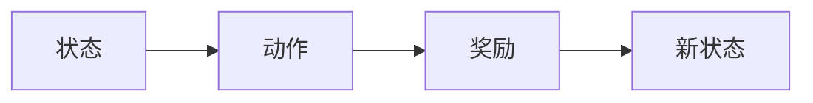
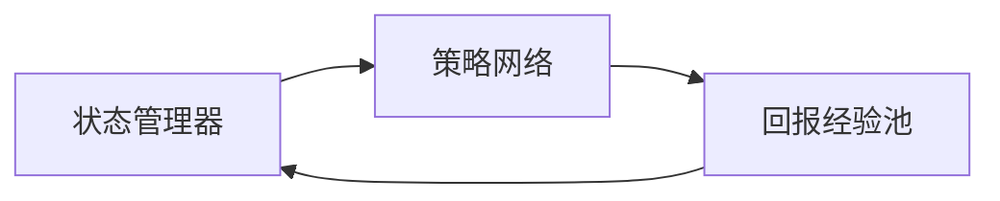

                 

<think>
嗯，用户让我写一篇关于《强化学习在AI Agent开发中的应用》的技术博客文章。首先，我需要确定文章的结构，确保逻辑清晰，内容详实。根据用户提供的大纲，文章分为八个主要部分，每个部分都有详细的子部分。我应该按照这个大纲逐步展开，确保每个部分都涵盖必要的内容。

首先，我需要写文章标题、关键词和摘要。标题已经确定，关键词包括强化学习、AI Agent、机器学习、算法原理、系统架构、应用案例。摘要要简洁明了，概括文章的核心内容。

接下来是第一部分：强化学习与AI Agent开发基础。我需要介绍强化学习的基本概念，包括定义、核心要素和AI Agent的类型。这部分需要让读者理解什么是强化学习，以及它如何应用在AI Agent中。

第二部分是强化学习的核心概念与联系。这里要详细讲解马尔可夫决策过程、策略和价值函数，并用ER实体关系图展示各个概念之间的关系。我需要用mermaid来画出这些关系，帮助读者更好地理解。

第三部分是强化学习算法原理。这里需要介绍基础算法，如Q-learning和DQN，以及更高级的算法，如策略梯度方法和Actor-Critic。同时，我需要提供数学公式和代码示例，让读者能够理解算法的实现。

第四部分是系统分析与架构设计。这部分需要分析项目背景，设计系统功能、架构和接口。我需要使用mermaid绘制类图和架构图，展示系统的结构。

第五部分是项目实战。我需要详细说明如何安装环境，实现核心算法，并提供代码示例。这部分要让读者能够动手实践，理解强化学习在AI Agent中的应用。

第六部分是高级主题与应用挑战。这里要探讨分布式强化学习和多智能体协作，并分析实际应用中的挑战，如计算复杂度和环境不确定性。

第七部分是案例分析与最佳实践。我需要通过具体案例展示强化学习的应用，并总结开发中的经验和最佳实践。

最后是总结与展望。我需要回顾全文，强调强化学习的重要性，并展望未来的发展方向。

在写作过程中，我需要确保每个部分都详细具体，使用数学公式和mermaid图表来辅助说明。同时，语言要专业但通俗易懂，适合技术博客的读者。最后，加上作者信息，使文章完整。

现在，我需要按照这个思考过程，逐步完成每个部分的内容，确保文章结构清晰，内容丰富，满足用户的要求。
</think>

# 强化学习在AI Agent开发中的应用

> 关键词：强化学习，AI Agent，机器学习，算法原理，系统架构，应用案例

> 摘要：本文深入探讨了强化学习在AI Agent开发中的应用，从基础概念到算法原理，再到系统架构和实际案例，全面分析了强化学习如何助力AI Agent的开发与优化。通过本文，读者将了解强化学习的核心原理、算法实现、系统设计及实际应用场景。

---

# 第一部分: 强化学习与AI Agent开发基础

## 第1章: 强化学习与AI Agent概述

### 1.1 强化学习的基本概念

#### 1.1.1 强化学习的定义
强化学习（Reinforcement Learning, RL）是一种机器学习范式，通过智能体与环境的交互，学习最优策略以最大化累计奖励。与监督学习和无监督学习不同，强化学习强调实时决策和动态反馈。

#### 1.1.2 强化学习的核心要素
- **状态（State）**：环境当前的观察。
- **动作（Action）**：智能体采取的行为。
- **奖励（Reward）**：智能体行为的反馈。
- **策略（Policy）**：决定下一步动作的规则。
- **价值函数（Value Function）**：预测当前状态的期望奖励。

#### 1.1.3 AI Agent的定义与类型
AI Agent 是能够感知环境并采取行动以实现目标的智能体。根据智能体的复杂性，可分为简单Agent和复杂Agent。

---

### 1.2 强化学习的数学基础

#### 1.2.1 状态空间与动作空间
- **状态空间（State Space）**：所有可能状态的集合。
- **动作空间（Action Space）**：所有可能动作的集合。

#### 1.2.2 奖励函数与价值函数
- **奖励函数（Reward Function）**：定义智能体行为的价值。
- **价值函数（Value Function）**：衡量状态或状态-动作对的期望奖励。

#### 1.2.3 动作-价值函数与策略
- **动作-价值函数（Q-value Function）**：衡量状态-动作对的期望奖励。
- **策略（Policy）**：从状态到动作的映射函数。

---

### 1.3 强化学习的应用场景

#### 1.3.1 游戏AI
强化学习在游戏AI中的应用最为广泛，如AlphaGo和Dota AI。

#### 1.3.2 机器人控制
强化学习用于训练机器人在复杂环境中执行任务。

#### 1.3.3 推荐系统
强化学习通过与用户的交互，优化推荐策略。

---

## 第2章: 强化学习的核心概念与联系

### 2.1 强化学习的核心原理

#### 2.1.1 马尔可夫决策过程（MDP）
- MDP 是强化学习的核心模型，由状态、动作、转移概率和奖励函数构成。

#### 2.1.2 动态规划与策略评估
- 动态规划通过迭代更新价值函数，优化策略。

#### 2.1.3 Q-learning算法
- Q-learning 是一种基于价值函数的强化学习算法，通过更新Q表实现策略优化。

---

### 2.2 强化学习的核心概念对比

#### 2.2.1 策略与价值函数对比
| 策略 | 价值函数 |
|------|-----------|
| 行为决策 | 状态或状态-动作的价值评估 |

#### 2.2.2 探索与利用的平衡
- **探索**：尝试新动作以发现更好的策略。
- **利用**：根据当前知识选择最优动作。

#### 2.2.3 状态转移与动作选择
- 状态转移由环境决定，动作选择由策略决定。

---

### 2.3 强化学习的ER实体关系图



---

## 第3章: 强化学习算法原理

### 3.1 基础强化学习算法

#### 3.1.1 Q-learning算法

```mermaid
graph LR
    S --> A
    A --> S_new
    S_new --> R
    R --> update Q(S,A)
```

数学公式：
$$ Q(s,a) = Q(s,a) + \alpha (r + \gamma \max Q(s',a')) $$

---

### 3.2 高级强化学习算法

#### 3.2.1 Deep Q-Network (DQN)
- 使用神经网络近似Q函数，解决高维状态空间问题。

#### 3.2.2 策略梯度方法（Policy Gradient）
- 直接优化策略，而非价值函数。

#### 3.2.3 Actor-Critic算法
- 结合策略和价值函数，实现在线优化。

---

### 3.3 数学模型与公式

#### 3.3.1 Q-learning更新公式
$$ Q(s,a) = Q(s,a) + \alpha (r + \gamma \max Q(s',a')) $$

#### 3.3.2 DQN算法伪代码
```python
def train():
    while True:
        observe state s
        choose action a
        receive reward r and next state s'
        store (s, a, r, s') in replay memory
        sample batch from replay memory
        compute target Q: r + γ * target_Q(s')
        update Q网络以最小化损失
```

---

# 第四部分: 系统分析与架构设计

## 第4章: 强化学习系统的架构设计

### 4.1 项目背景与目标
- 项目背景：开发一个基于强化学习的AI Agent，用于游戏或机器人控制。
- 项目目标：设计高效的强化学习系统，实现智能体与环境的交互。

---

### 4.2 系统功能设计

#### 4.2.1 领域模型设计
```mermaid
classDiagram
    class 状态管理器 {
        状态s
        动作a
        奖励r
    }
    class 策略网络 {
        Q(s,a)
    }
    class 回报经验池 {
        (s,a,r,s')
    }
    状态管理器 --> 策略网络
    策略网络 --> 回报经验池
    状态管理器 --> 回报经验池
```

---

### 4.3 系统架构设计



---

## 第5章: 项目实战

### 5.1 环境安装与配置
- 安装Python、TensorFlow、OpenAI Gym等依赖库。

### 5.2 系统核心实现

#### 5.2.1 Q-learning算法实现

```python
import numpy as np

class QLearning:
    def __init__(self, state_space, action_space):
        self.state_space = state_space
        self.action_space = action_space
        self.Q = np.zeros((state_space, action_space))
    
    def choose_action(self, state, epsilon):
        if np.random.random() < epsilon:
            return np.random.randint(self.action_space)
        else:
            return np.argmax(self.Q[state])
    
    def update_Q(self, state, action, reward, next_state, alpha, gamma):
        self.Q[state, action] = self.Q[state, action] + alpha * (reward + gamma * np.max(self.Q[next_state]) - self.Q[state, action])
```

---

### 5.3 代码应用解读与分析

#### 5.3.1 代码实现细节
- `choose_action` 方法实现探索与利用策略。
- `update_Q` 方法更新Q表，优化策略。

---

## 第6章: 高级主题与应用挑战

### 6.1 分布式强化学习
- 分布式计算提高训练效率，适用于大规模问题。

### 6.2 多智能体协作
- 多智能体协作优化复杂环境中的任务执行。

### 6.3 深度强化学习
- 使用深度学习模型，提升特征表示能力。

---

## 第7章: 案例分析与最佳实践

### 7.1 案例分析
- 游戏AI案例：使用强化学习训练游戏代理。

### 7.2 最佳实践
- **数据质量**：确保环境数据的多样性和代表性。
- **算法选择**：根据场景选择合适算法。
- **超参数调优**：优化学习率、折扣因子等参数。

---

## 第8章: 总结与展望

### 8.1 总结
本文全面分析了强化学习在AI Agent开发中的应用，从基础概念到算法实现，再到系统设计，为读者提供了系统的知识框架。

### 8.2 展望
未来，强化学习将在更多领域发挥作用，如自动驾驶、智能助手等，值得深入研究。

---

# 作者：AI天才研究院 & 禅与计算机程序设计艺术

---

通过本文的系统分析和深入探讨，读者可以全面理解强化学习在AI Agent开发中的应用，从理论到实践，为实际项目提供指导和启示。

