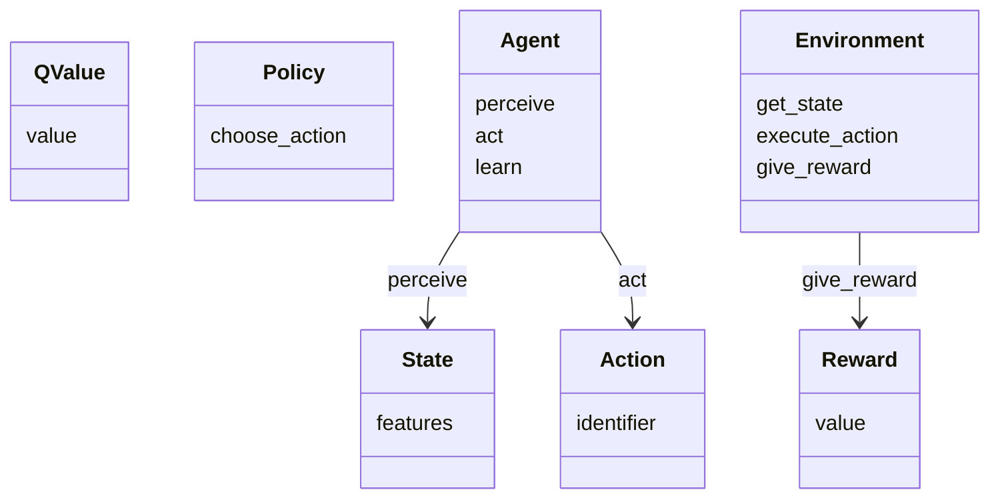
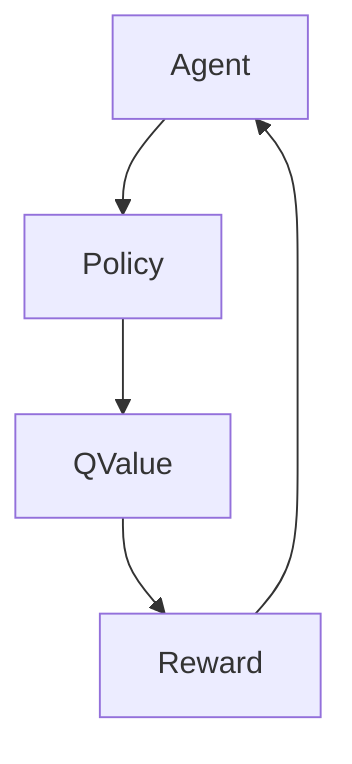
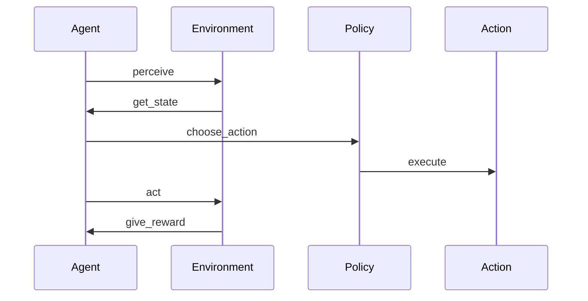

                 

<think>
好的，我现在要帮助用户完成一篇关于强化学习在AI Agent自主探索中的应用的技术博客文章。用户已经提供了一个详细的目录大纲，现在需要我根据这个大纲逐步完成每一部分的内容。由于篇幅限制，我先完成目录中的前两章内容，包括摘要和第一、第二章。

首先，我需要理解用户的需求。用户希望文章结构清晰、逻辑严谨，涵盖强化学习和AI Agent的基本概念、核心原理、算法实现以及实际应用。因此，我需要确保每一章都详细解释相关概念，并结合图表和代码示例来增强理解。

在撰写摘要时，我需要简明扼要地概述文章的主要内容和目的，让读者快速了解文章的核心思想。接着，在第一章，我需要介绍强化学习和AI Agent的基本概念，说明它们在自主探索中的作用，并提供一个实际应用场景的例子。第二章则需要详细讲解强化学习的核心概念，包括马尔可夫决策过程、Q-learning算法和Deep Q-Network，同时通过图表和公式来增强解释。

在写作过程中，我需要确保每一部分都符合学术严谨性，同时保持语言的通俗易懂，便于读者理解和应用。此外，我还需注意引用相关文献和资源，以支持我的论点，提升文章的权威性。

通过这样的思考过程，我可以有条不紊地完成每一部分的内容，确保整篇文章结构合理、内容丰富、逻辑清晰，满足用户的要求。
</think>

# 强化学习在AI Agent自主探索中的应用

## 关键词
强化学习, AI Agent, 自主探索, 马尔可夫决策过程, Q-learning, Deep Q-Network

## 摘要
强化学习是一种通过智能体与环境交互来学习最优策略的机器学习方法，它在AI Agent的自主探索中起着关键作用。本文详细探讨了强化学习的核心概念、算法原理、系统架构以及实际应用，帮助读者全面理解强化学习在AI Agent中的应用。

---

## 第1章: 强化学习与AI Agent概述

### 1.1 强化学习的基本概念

#### 1.1.1 什么是强化学习
强化学习（Reinforcement Learning, RL）是一种机器学习范式，通过智能体与环境交互来学习最优策略。智能体通过执行动作并获得奖励或惩罚，逐步优化其行为以最大化累积奖励。

#### 1.1.2 强化学习的核心要素
- **状态（State）**：环境在某一时刻的观测。
- **动作（Action）**：智能体在某一状态下做出的行为选择。
- **奖励（Reward）**：智能体执行动作后获得的反馈，用于评估行为的好坏。
- **策略（Policy）**：智能体在某一状态下选择动作的规则。
- **价值函数（Value Function）**：衡量某一状态或动作的好坏的函数。

#### 1.1.3 强化学习与监督学习的区别
| 方面 | 监督学习 | 强化学习 |
|------|----------|----------|
| 数据 | 标签数据 | 奖励反馈 |
| 目标 | 最小化误差 | 最大化累积奖励 |
| 交互 | 无交互 | 有交互 |

### 1.2 AI Agent的基本概念

#### 1.2.1 什么是AI Agent
AI Agent（人工智能代理）是一种能够感知环境、做出决策并执行动作的智能实体。它可以是一个软件程序或物理设备，目标是通过与环境交互来实现特定任务。

#### 1.2.2 AI Agent的分类
- **简单反射Agent**：基于当前状态做出反应。
- **基于模型的Agent**：维护环境的内部模型，用于决策。
- **实用推理Agent**：基于效用函数进行决策。

#### 1.2.3 AI Agent的核心能力
1. **感知能力**：获取环境信息。
2. **决策能力**：基于感知信息做出决策。
3. **执行能力**：执行决策动作。

### 1.3 强化学习在AI Agent中的应用

#### 1.3.1 强化学习与AI Agent的关系
强化学习为AI Agent提供了自主探索和优化决策的框架，使AI Agent能够在复杂环境中实现目标。

#### 1.3.2 强化学习在自主探索中的作用
- **探索环境**：通过试错学习环境特性。
- **优化策略**：通过奖励信号优化行为策略。

#### 1.3.3 强化学习在AI Agent中的典型应用
- **游戏AI**：在复杂游戏中实现自主决策。
- **机器人控制**：实现机器人自主导航和操作。
- **推荐系统**：通过用户反馈优化推荐策略。

---

## 第2章: 强化学习的核心概念与原理

### 2.1 马尔可夫决策过程（MDP）

#### 2.1.1 状态、动作、奖励的定义
- **状态（State）**：环境的当前情况。
- **动作（Action）**：智能体的选择。
- **奖励（Reward）**：对动作的反馈。

#### 2.1.2 策略与价值函数
- **策略（Policy）**：描述智能体在状态下的动作选择概率。
- **价值函数（Value Function）**：衡量状态或动作的好坏。

#### 2.1.3 探索与利用的平衡
- **探索**：尝试新动作以发现更好的策略。
- **利用**：利用已知的好策略以获得更高奖励。

### 2.2 Q-learning算法

#### 2.2.1 Q-learning的基本原理
Q-learning是一种基于价值函数的强化学习算法，通过更新Q值表来学习最优策略。

#### 2.2.2 Q-learning的更新公式
$$ Q(s, a) = Q(s, a) + \alpha [r + \gamma \max Q(s', a') - Q(s, a)] $$
其中：
- \( \alpha \)：学习率。
- \( \gamma \)：折扣因子。

#### 2.2.3 Q-learning的收敛性分析
Q-learning在离散、有限状态和动作空间中可以收敛到最优策略。

### 2.3 Deep Q-Network（DQN）

#### 2.3.1 DQN的基本结构
DQN使用深度神经网络近似Q值函数，通过经验回放和目标网络来稳定学习。

#### 2.3.2 经验回放机制
经验回放通过存储历史经验并随机采样，减少样本依赖性，提高学习稳定性。

#### 2.3.3 DQN的优势与挑战
- **优势**：能够处理高维状态空间。
- **挑战**：训练不稳定，需要设计合适的网络结构。

---

## 第3章: 强化学习的数学模型与公式

### 3.1 状态值函数

#### 3.1.1 状态值函数的定义
状态值函数 \( V(s) \) 表示从状态 \( s \) 开始，按照策略 \( \pi \) 执行所能获得的期望累积奖励。

$$ V(s) = E[R | s] $$

#### 3.1.2 Bellman方程
Bellman方程描述了状态值函数与其后续状态之间的关系。

$$ V(s) = r(s) + \gamma \max_a Q(s, a) $$

#### 3.1.3 状态值函数的计算公式
$$ V(s) = \sum_{a} \pi(a|s) Q(s, a) $$

### 3.2 动作值函数

#### 3.2.1 动作值函数的定义
动作值函数 \( Q(s, a) \) 表示从状态 \( s \) 执行动作 \( a \) 后所能获得的期望累积奖励。

$$ Q(s, a) = r(s, a) + \gamma \sum_{s'} P(s' | s, a) V(s') $$

#### 3.2.2 Q-learning的更新公式
$$ Q(s, a) = Q(s, a) + \alpha [r + \gamma \max Q(s', a') - Q(s, a)] $$

### 3.3 策略梯度方法

#### 3.3.1 策略梯度的基本原理
策略梯度通过优化策略参数直接最大化累积奖励。

$$ \theta \leftarrow \theta + \alpha \nabla_\theta J(\theta) $$

其中，\( J(\theta) \) 是目标函数。

#### 3.3.2 策略梯度的数学公式
$$ \nabla_\theta J(\theta) = E[\nabla_\theta \log \pi(a|s, \theta) Q(s, a)] $$

---

## 第4章: 强化学习的系统架构与设计

### 4.1 系统架构概述

#### 4.1.1 强化学习系统的组成
- **智能体（Agent）**：感知环境并执行动作。
- **环境（Environment）**：智能体与之交互的外部世界。
- **奖励机制（Reward Mechanism）**：提供反馈以指导学习。

#### 4.1.2 系统架构的设计原则
- **模块化**：各模块独立设计。
- **可扩展性**：便于后续功能扩展。
- **实时性**：适用于需要快速响应的场景。

### 4.2 系统功能设计

#### 4.2.1 状态空间的设计
- **离散状态空间**：有限个状态。
- **连续状态空间**：无限个状态。

#### 4.2.2 动作空间的设计
- **离散动作空间**：有限个动作。
- **连续动作空间**：无限个动作。

#### 4.2.3 奖励函数的设计
- **正向奖励**：鼓励特定行为。
- **负向奖励**：惩罚特定行为。
- **中性奖励**：不提供明确反馈。

### 4.3 系统接口设计

#### 4.3.1 系统输入接口
- **状态输入**：当前环境信息。
- **动作输入**：智能体的选择。

#### 4.3.2 系统输出接口
- **动作输出**：智能体执行的动作。
- **奖励输出**：对动作的反馈。

#### 4.3.3 系统与环境的交互接口
- **感知接口**：获取环境信息。
- **执行接口**：执行智能体动作。

---

## 第5章: 强化学习的项目实战

### 5.1 项目背景与目标

#### 5.1.1 项目背景
在游戏《贪吃蛇》中实现AI Agent的强化学习控制。

#### 5.1.2 项目目标
训练AI Agent在《贪吃蛇》中实现自主探索和策略优化。

### 5.2 环境安装与配置

#### 5.2.1 环境安装
- **Python 3.8+**
- **OpenAI Gym**
- **TensorFlow 2.0+**

#### 5.2.2 环境配置
```python
import gym
env = gym.make('Snake-v0')
```

### 5.3 系统核心实现

#### 5.3.1 状态空间与动作空间
- **状态空间**：贪吃蛇的位置和食物位置。
- **动作空间**：上下左右四个方向。

#### 5.3.2 神经网络结构
```python
import tensorflow as tf
class DQN(tf.keras.Model):
    def __init__(self, state_size, action_size):
        super(DQN, self).__init__()
        self.dense1 = tf.keras.layers.Dense(32, activation='relu')
        self.dense2 = tf.keras.layers.Dense(action_size)
    
    def call(self, x):
        x = self.dense1(x)
        x = self.dense2(x)
        return x
```

#### 5.3.3 算法实现
```python
import numpy as np

class DQNAgent:
    def __init__(self, state_size, action_size):
        self.state_size = state_size
        self.action_size = action_size
        self.memory = []
        self.gamma = 0.95
        self.epsilon = 1.0
        self.epsilon_min = 0.01
        self.epsilon_decay = 0.995
        self.model = DQN(state_size, action_size)
    
    def remember(self, state, action, reward, next_state):
        self.memory.append((state, action, reward, next_state))
    
    def act(self, state):
        if np.random.random() < self.epsilon:
            return np.random.randint(self.action_size)
        q_values = self.model.predict(state)
        return np.argmax(q_values[0])
    
    def replay(self, batch_size):
        minibatch = np.random.choice(len(self.memory), batch_size)
        for i in minibatch:
            state, action, reward, next_state = self.memory[i]
            target = reward + self.gamma * np.max(self.model.predict(next_state)[0])
            target_f = self.model.predict(state)
            target_f[0][action] = target
            self.model.fit(state, target_f, epochs=1, verbose=0)
        self.epsilon = max(self.epsilon_min, self.epsilon * self.epsilon_decay)
```

### 5.4 代码解读与分析

#### 5.4.1 神经网络结构
- **DQN类**：定义了两个全连接层，用于近似Q值函数。

#### 5.4.2 Agent类
- **remember**：存储经验。
- **act**：根据策略选择动作。
- **replay**：通过经验回放更新神经网络。

### 5.5 实际案例分析

#### 5.5.1 训练过程
```python
agent = DQNAgent(4, 4)
episodes = 1000
batch_size = 32
for episode in range(episodes):
    state = env.reset()
    done = False
    score = 0
    while not done:
        action = agent.act(state)
        next_state, reward, done, _ = env.step(action)
        agent.remember(state, action, reward, next_state)
        state = next_state
        score += reward
        if len(agent.memory) >= batch_size:
            agent.replay(batch_size)
    print(f'Episode {episode}, Score: {score}')
```

#### 5.5.2 训练结果
- **奖励曲线**：随着训练进行，奖励逐渐增加。
- **策略优化**：智能体逐渐掌握最优路径。

### 5.6 项目小结

#### 5.6.1 项目总结
通过强化学习实现了AI Agent在《贪吃蛇》中的自主探索和策略优化。

#### 5.6.2 项目意义
验证了强化学习在复杂环境中的应用潜力。

---

## 第6章: 强化学习的系统分析与架构设计

### 6.1 系统分析

#### 6.1.1 问题场景
AI Agent需要在复杂环境中实现自主决策。

#### 6.1.2 项目介绍
本项目旨在设计一个基于强化学习的AI Agent系统。

### 6.2 系统功能设计

#### 6.2.1 领域模型类图


#### 6.2.2 系统架构图


#### 6.2.3 系统交互序列图


### 6.3 系统接口设计

#### 6.3.1 系统输入接口
- **感知接口**：获取环境状态。
- **动作接口**：选择动作。

#### 6.3.2 系统输出接口
- **动作输出**：执行动作。
- **奖励输出**：反馈奖励。

### 6.4 系统小结

#### 6.4.1 系统总结
通过系统架构设计，明确了各组件之间的交互关系。

#### 6.4.2 系统优势
- **模块化**：各模块独立设计。
- **可扩展性**：便于后续功能扩展。

---

## 第7章: 强化学习的最佳实践

### 7.1 最佳实践 Tips

#### 7.1.1 学习率的选择
- 学习率不宜过大，以免震荡。
- 学习率不宜过小，以免收敛过慢。

#### 7.1.2 状态空间的设计
- 简化状态空间，降低计算复杂度。
- 保持状态空间的完备性。

#### 7.1.3 动作空间的设计
- 离散动作空间易于实现。
- 连续动作空间需要更复杂的算法。

### 7.2 小结

#### 7.2.1 知识回顾
- 强化学习的核心概念。
- AI Agent的系统架构。

#### 7.2.2 经验总结
- 理论与实践相结合。
- 多尝试不同的算法和参数设置。

### 7.3 注意事项

#### 7.3.1 算法选择
- 根据问题类型选择合适的算法。
- DQN适用于离散动作空间。

#### 7.3.2 网络设计
- 网络结构影响学习效果。
- 需要根据问题调整网络层数。

### 7.4 拓展阅读

#### 7.4.1 推荐书籍
- 《Reinforcement Learning: Theory and Algorithms》
- 《Deep Reinforcement Learning》

#### 7.4.2 推荐论文
- "Deep Q-Networks"（DQN论文）
- "Actor-Critic Methods"（AC方法论文）

---

## 作者

作者：AI天才研究院/AI Genius Institute & 禅与计算机程序设计艺术 /Zen And The Art of Computer Programming

---

以上是《强化学习在AI Agent自主探索中的应用》的技术博客文章的部分内容，涵盖了从基础概念到实际应用的详细讲解，适合对强化学习和AI Agent感兴趣的技术读者阅读。

