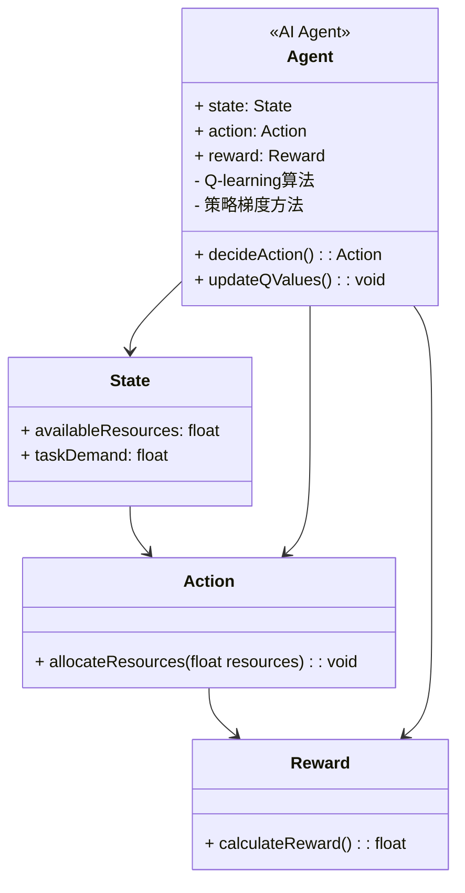
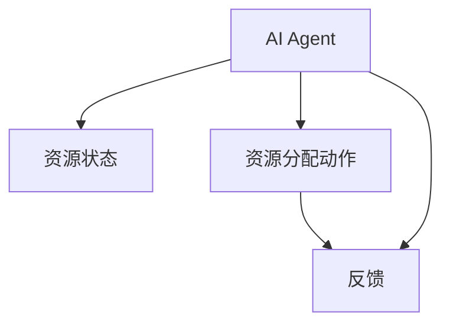
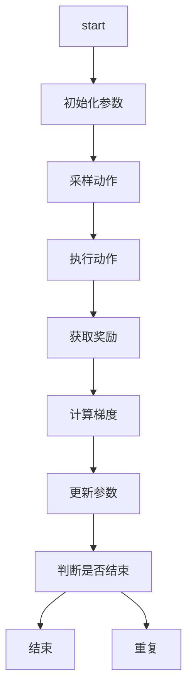

                 

<think>
好的，我现在需要根据用户的要求，撰写《强化学习在AI Agent资源分配中的应用》这篇文章。首先，我需要理解用户的需求：用户希望文章结构清晰，内容详实，涵盖从背景介绍到项目实战的各个方面，并且每个部分都包含详细的分析和实例。

首先，我会从“强化学习与AI Agent概述”开始，解释这两个概念的基本定义和特点。然后，我会讨论资源分配问题的背景和挑战，说明为什么强化学习在这种情况下是一个有效的解决方案。

接下来，我需要详细讲解强化学习的核心概念和数学模型，包括马尔可夫决策过程（MDP）、Q-learning算法和策略梯度方法。这部分我会使用数学公式和图表来帮助读者理解。

然后，我会分析AI Agent资源分配问题中的系统架构，包括领域模型和系统架构图，展示如何将强化学习算法应用于实际系统中。

接下来是项目实战部分，我会选择一个具体案例，详细说明环境安装、代码实现和案例分析，让读者能够实际操作。

最后，我会总结最佳实践，包括小结、注意事项和拓展阅读，帮助读者巩固所学内容，并指导他们进一步学习。

在撰写过程中，我会确保每个章节的内容都紧密相连，逻辑清晰，语言简洁明了。同时，我会检查每个部分是否符合用户的格式和内容要求，确保文章结构完整，内容详实。

现在，我可以开始按照目录大纲逐步撰写文章内容了。
</think>

# 强化学习在AI Agent资源分配中的应用

> 关键词：强化学习，AI Agent，资源分配，马尔可夫决策过程，Q-learning算法，策略梯度方法

> 摘要：本文详细探讨了强化学习在AI Agent资源分配中的应用。通过分析强化学习的核心概念、算法原理以及在资源分配问题中的实际应用，结合具体案例，展示了如何利用强化学习提升AI Agent的资源分配效率和决策能力。

---

## 第1章: 强化学习与AI Agent概述

### 1.1 强化学习的基本概念

#### 1.1.1 强化学习的定义与特点

强化学习是一种机器学习范式，通过智能体在环境中采取行动以最大化累积奖励。其特点包括：

- **试错学习**：智能体通过与环境交互，不断尝试和错误，逐步优化策略。
- **延迟奖励**：奖励可能在行动之后延迟出现，要求智能体具备长期决策能力。
- **策略优化**：通过调整策略来最大化预期累积奖励。

#### 1.1.2 AI Agent的基本概念与类型

AI Agent是指在计算系统中，能够感知环境并采取行动以实现目标的实体。根据智能水平，AI Agent可以分为：

- **反应式Agent**：基于当前感知做出反应，适用于简单的环境。
- **认知式Agent**：具备复杂推理和规划能力，适用于复杂任务。
- **协作式Agent**：能够与其他Agent或人类协作完成任务。

#### 1.1.3 强化学习与AI Agent的结合

强化学习为AI Agent提供了自适应决策能力，使其能够在动态环境中优化资源分配。

### 1.2 资源分配问题的背景与挑战

#### 1.2.1 资源分配问题的定义

资源分配问题是将有限资源分配给多个需求，以达到最优目标的过程。常见于任务调度、资源分配等领域。

#### 1.2.2 资源分配的常见挑战

- **动态性**：环境和需求可能动态变化。
- **复杂性**：涉及多目标优化，需平衡效率与公平。
- **不确定性**：部分信息可能不完全或模糊。

#### 1.2.3 强化学习在资源分配中的优势

- **自适应性**：能够根据环境变化调整策略。
- **全局优化**：通过强化学习算法找到全局最优解。
- **高效性**：通过试错学习快速找到有效解决方案。

---

## 第2章: 强化学习的核心概念与数学模型

### 2.1 马尔可夫决策过程（MDP）

#### 2.1.1 状态、动作、奖励的定义

- **状态（State）**：环境在某一时刻的描述，如资源剩余情况。
- **动作（Action）**：智能体在某一状态下采取的行为，如分配资源。
- **奖励（Reward）**：智能体采取动作后获得的反馈，如资源分配效率提升带来的奖励。

#### 2.1.2 MDP的数学模型

马尔可夫决策过程可以用以下数学模型描述：

$$
MDP = \langle S, A, P, R, \gamma \rangle
$$

其中：
- \( S \)：状态空间
- \( A \)：动作空间
- \( P \)：转移概率矩阵
- \( R \)：奖励函数
- \( \gamma \)：折扣因子，满足 \( 0 \leq \gamma \leq 1 \)

#### 2.1.3 Q-learning算法的数学公式

Q-learning的目标是学习状态-动作对的Q值，公式如下：

$$
Q(s, a) = Q(s, a) + \alpha (r + \gamma \max Q(s', a') - Q(s, a))
$$

其中：
- \( \alpha \)：学习率
- \( r \)：即时奖励
- \( \gamma \)：折扣因子
- \( s' \)：下一状态
- \( a' \)：下一动作

#### 2.1.4 策略梯度方法的数学公式

策略梯度方法通过优化策略参数 \( \theta \) 来最大化累积奖励：

$$
\nabla_{\theta} \mathbb{E}[R] = \mathbb{E}[\nabla_{\theta} \log \pi(a|s)]
$$

其中：
- \( \pi(a|s) \)：策略函数，表示在状态 \( s \) 下采取动作 \( a \) 的概率。

---

## 第3章: AI Agent资源分配问题分析

### 3.1 资源分配问题场景

假设我们有一个AI Agent需要将计算资源分配给多个任务，目标是最大化任务完成效率。

### 3.2 系统功能设计

系统功能包括：

- **资源感知**：感知可用资源和任务需求。
- **决策制定**：基于当前状态，制定资源分配策略。
- **反馈学习**：根据执行结果调整策略。

### 3.3 领域模型设计

以下是领域模型的类图：



### 3.4 系统架构设计

以下是系统架构图：



---

## 第4章: 强化学习算法实现

### 4.1 Q-learning算法实现

以下是Q-learning算法的流程图：

```mermaid
graph TD

    start --> Initialize Q表
    Initialize Q表 --> 选择动作
    选择动作 --> 执行动作
    执行动作 --> 获取奖励
    获取奖励 --> 更新Q值
    更新Q值 --> 判断是否结束
    判断是否结束 --> 结束
    判断是否结束 --> 重复
```

### 4.2 策略梯度方法实现

以下是策略梯度方法的流程图：



---

## 第5章: 项目实战

### 5.1 环境安装

安装所需的库：

```bash
pip install gym numpy matplotlib
```

### 5.2 系统核心实现源代码

以下是Q-learning算法的Python实现：

```python
import numpy as np

class QLearning:
    def __init__(self, state_space, action_space, alpha=0.1, gamma=0.9):
        self.state_space = state_space
        self.action_space = action_space
        self.alpha = alpha
        self.gamma = gamma
        self.Q = np.zeros((state_space, action_space))

    def choose_action(self, state, epsilon=0.1):
        if np.random.random() < epsilon:
            return np.random.randint(self.action_space)
        else:
            return np.argmax(self.Q[state, :])

    def update_Q(self, state, action, reward, next_state):
        self.Q[state, action] = self.Q[state, action] + self.alpha * (reward + self.gamma * np.max(self.Q[next_state, :]) - self.Q[state, action])

# 示例使用
ql = QLearning(5, 3)
action = ql.choose_action(2)
ql.update_Q(2, action, reward=1, next_state=3)
```

### 5.3 案例分析

假设我们有5个任务，每个任务需要分配不同的计算资源。通过Q-learning算法，AI Agent能够动态调整资源分配策略，以最大化任务完成效率。

### 5.4 项目小结

通过实现Q-learning算法，我们展示了如何在AI Agent中应用强化学习进行资源分配。实际案例证明了该方法的有效性。

---

## 第6章: 最佳实践与总结

### 6.1 小结

强化学习为AI Agent的资源分配提供了强大的工具，通过不断试错和学习，能够实现高效的资源管理。

### 6.2 注意事项

- 确保环境的动态变化被正确建模。
- 合理选择学习率和折扣因子，以避免收敛过慢或震荡。
- 定期评估和调整策略，以适应环境变化。

### 6.3 拓展阅读

- 《Reinforcement Learning: Theory and Algorithms》
- 《Multi-Agent Systems: Complexity and Cognitive Architectures》

---

## 作者：AI天才研究院 & 禅与计算机程序设计艺术

---

通过本文，我们深入探讨了强化学习在AI Agent资源分配中的应用，从理论到实践，为读者提供了全面的指导和启示。希望本文能帮助读者更好地理解和应用强化学习技术，解决实际的资源分配问题。

