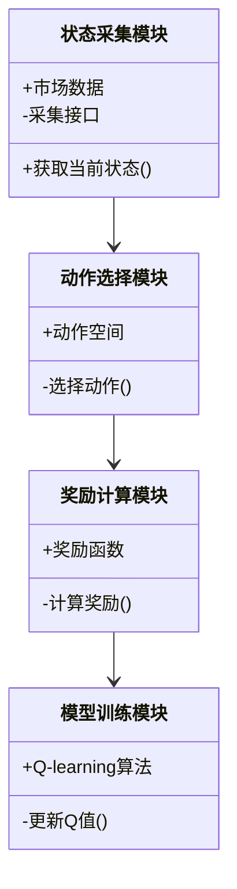
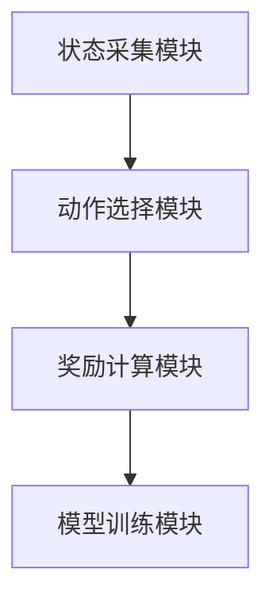

                 


# 强化学习在投资策略优化中的创新应用

## 关键词：
强化学习、投资策略优化、Q-learning、策略梯度、马尔可夫决策过程

## 摘要：
本文深入探讨了强化学习在投资策略优化中的创新应用，从基础概念到高级算法，结合实际案例，详细阐述了强化学习在投资决策中的优势与挑战。通过分析强化学习的核心原理、算法实现、系统架构和项目实战，本文为读者提供了一套完整的理论框架和实践指南。

---

# 第1章 强化学习与投资策略优化概述

## 1.1 强化学习的基本概念
### 1.1.1 强化学习的定义
强化学习（Reinforcement Learning，RL）是一种机器学习范式，通过智能体与环境的交互，学习如何做出决策以最大化累积奖励。与监督学习不同，强化学习不需要明确的标签数据，而是通过试错和奖励机制来优化决策过程。

### 1.1.2 投资策略优化的定义
投资策略优化是指通过数学模型和算法，寻找最优的投资组合或交易策略，以实现收益最大化或风险最小化。传统方法依赖于统计分析和市场假设，而强化学习的引入为投资策略优化提供了新的可能性。

### 1.1.3 强化学习在投资策略优化中的作用
强化学习通过模拟市场环境，学习最优的投资决策路径，能够在复杂多变的市场中动态调整策略，克服传统方法的静态局限性。

---

## 1.2 投资策略优化的问题背景
### 1.2.1 投资市场的复杂性
金融市场受到多种因素的影响，如经济指标、政策变化、市场情绪等，这些因素使得市场具有高度的不确定性和非线性特征。

### 1.2.2 传统投资策略的局限性
传统投资策略依赖于历史数据分析和统计建模，难以应对市场环境的快速变化，且容易受到数据过拟合和模型假设的限制。

### 1.2.3 强化学习在投资策略优化中的创新应用
强化学习能够通过模拟市场环境，动态调整投资决策，适应市场的不确定性，同时通过试错学习找到最优策略。

---

## 1.3 强化学习与投资策略优化的核心联系
### 1.3.1 强化学习的核心要素
- **状态（State）**：市场环境的当前状态，如价格、成交量等。
- **动作（Action）**：智能体在当前状态下采取的投资行为，如买入、卖出或持有。
- **奖励（Reward）**：智能体采取动作后获得的回报，通常为收益或损失。

### 1.3.2 投资策略优化的核心要素
- **投资组合**：智能体持有的资产配置。
- **交易策略**：智能体在不同市场状态下的买卖决策。
- **风险控制**：智能体对投资风险的管理和控制。

### 1.3.3 强化学习与投资策略优化的结合点
- **动态适应性**：强化学习能够在动态市场环境中实时调整策略。
- **非线性关系**：强化学习能够捕捉市场数据中的非线性关系，提高预测精度。
- **全局优化**：强化学习通过试错学习，找到全局最优的投资策略。

---

## 1.4 本章小结
本章介绍了强化学习的基本概念、投资策略优化的背景以及两者的核心联系。强化学习通过模拟市场环境，动态调整投资决策，为投资策略优化提供了新的思路和方法。

---

# 第2章 强化学习的核心概念与算法原理

## 2.1 马尔可夫决策过程（MDP）
### 2.1.1 MDP的基本定义
马尔可夫决策过程（Markov Decision Process，MDP）是一种数学模型，描述了智能体在环境中的决策过程。MDP由状态、动作、转移概率和奖励函数组成。

### 2.1.2 MDP的核心属性
- **状态空间（State Space）**：所有可能的状态集合。
- **动作空间（Action Space）**：所有可能的动作集合。
- **转移概率（Transition Probability）**：从当前状态采取某个动作后转移到下一个状态的概率。
- **奖励函数（Reward Function）**：智能体采取动作后获得的奖励。

### 2.1.3 MDP的分类
- **有限动作空间**：动作空间有限，如买入、卖出或持有。
- **无限动作空间**：动作空间无限，如连续调整投资比例。

---

## 2.2 Q-learning算法
### 2.2.1 Q-learning的基本原理
Q-learning是一种经典的强化学习算法，通过学习状态-动作对的价值（Q值）来优化决策。Q值表示在当前状态下采取某个动作后的预期累计奖励。

### 2.2.2 Q-learning的数学公式
$$ Q(s, a) = r + \gamma \max_{a'} Q(s', a') $$
其中：
- \( Q(s, a) \)：当前状态下采取动作 \( a \) 的 Q 值。
- \( r \)：采取动作 \( a \) 后获得的奖励。
- \( \gamma \)：折扣因子，表示未来奖励的当前价值。
- \( s' \)：转移到下一个状态。

### 2.2.3 Q-learning的收敛性分析
Q-learning在离散状态和动作空间下具有收敛性，能够在有限步数内找到最优策略。

---

## 2.3 策略梯度（Policy Gradient）方法
### 2.3.1 策略梯度的基本原理
策略梯度方法通过优化策略函数，直接寻找最优的投资动作。策略函数 \( \pi(a|s) \) 表示在当前状态下采取动作 \( a \) 的概率。

### 2.3.2 策略梯度的数学公式
$$ \nabla J = \mathbb{E}_{s,a} \left[ \nabla \log \pi(a|s) Q(s,a) \right] $$
其中：
- \( J \)：策略的累计奖励。
- \( Q(s,a) \)：状态-动作对的价值函数。

### 2.3.3 策略梯度的优势
策略梯度方法能够处理连续动作空间，适用于复杂的投资策略优化问题。

---

## 2.4 本章小结
本章详细介绍了强化学习的核心概念和两种经典算法：Q-learning和策略梯度方法。Q-learning适用于离散动作空间，而策略梯度方法适用于连续动作空间。两种算法都为投资策略优化提供了有效的解决方案。

---

# 第3章 强化学习在投资策略优化中的数学模型

## 3.1 投资策略优化的数学模型
### 3.1.1 状态空间的定义
状态空间包括市场指数、资产价格、成交量等指标。

### 3.1.2 动作空间的定义
动作空间包括买入、卖出、持有等动作。

### 3.1.3 奖励函数的设计
奖励函数通常基于投资收益，例如：
$$ r = \text{当前收益} - \text{预期收益} $$

---

## 3.2 强化学习的数学推导
### 3.2.1 Q-learning的数学推导
通过马尔可夫决策过程，Q-learning算法可以表示为：
$$ Q(s, a) = Q(s, a) + \alpha (r + \gamma \max Q(s', a') - Q(s, a)) $$
其中，\( \alpha \) 为学习率。

### 3.2.2 策略梯度的数学推导
策略梯度方法通过优化策略函数，得到：
$$ \nabla J = \mathbb{E}[\nabla \log \pi(a|s) Q(s,a)] $$

---

## 3.3 本章小结
本章通过数学推导，详细阐述了强化学习在投资策略优化中的具体实现方法，为后续的系统设计和项目实战奠定了理论基础。

---

# 第4章 投资策略优化系统的架构设计

## 4.1 系统功能设计
### 4.1.1 状态采集模块
负责采集市场数据，如指数、价格等。

### 4.1.2 动作选择模块
根据当前状态，选择最优的投资动作。

### 4.1.3 奖励计算模块
计算智能体采取动作后的奖励。

### 4.1.4 模型训练模块
通过强化学习算法优化策略。

---

## 4.2 系统架构设计
### 4.2.1 系统类图


### 4.2.2 系统架构图


---

## 4.3 本章小结
本章通过系统架构设计，展示了强化学习在投资策略优化中的具体实现方式，为后续的项目实战提供了指导。

---

# 第5章 项目实战：基于强化学习的投资策略优化

## 5.1 项目背景
本项目旨在通过强化学习算法，优化股票投资策略，实现收益最大化。

## 5.2 环境搭建
### 5.2.1 数据集准备
使用历史股票价格数据，包括开盘价、收盘价、最高价、最低价和成交量。

### 5.2.2 环境搭建步骤
1. 安装Python和必要的库（如TensorFlow、Keras）。
2. 数据预处理，包括归一化和特征提取。

---

## 5.3 系统核心实现
### 5.3.1 Q-learning算法实现
```python
class QLearning:
    def __init__(self, state_space, action_space):
        self.state_space = state_space
        self.action_space = action_space
        self.Q = np.zeros((state_space, action_space))
    
    def take_action(self, state):
        return np.argmax(self.Q[state])
    
    def update(self, state, action, reward, next_state):
        self.Q[state, action] += self.alpha * (reward + self.gamma * np.max(self.Q[next_state]) - self.Q[state, action])
```

### 5.3.2 策略梯度方法实现
```python
class PolicyGradient:
    def __init__(self, state_space, action_space):
        self.state_space = state_space
        self.action_space = action_space
        self.model = self.build_model()
    
    def build_model(self):
        # 构建神经网络模型
        pass
    
    def take_action(self, state):
        pass
```

---

## 5.4 实际案例分析
### 5.4.1 数据预处理
将历史股票价格数据归一化到[0,1]范围。

### 5.4.2 策略训练
通过强化学习算法，训练智能体在不同市场状态下采取最优动作。

### 5.4.3 结果分析
通过回测，比较强化学习优化的投资策略与传统策略的收益和风险。

---

## 5.5 本章小结
本章通过具体案例展示了强化学习在投资策略优化中的实际应用，验证了其有效性和优势。

---

# 第6章 总结与展望

## 6.1 本章总结
本文详细探讨了强化学习在投资策略优化中的创新应用，从理论到实践，为读者提供了全面的指导。

## 6.2 未来展望
未来的研究方向包括多智能体强化学习、深度强化学习等，进一步提高投资策略的优化效果。

---

# 作者：AI天才研究院/AI Genius Institute & 禅与计算机程序设计艺术 /Zen And The Art of Computer Programming

