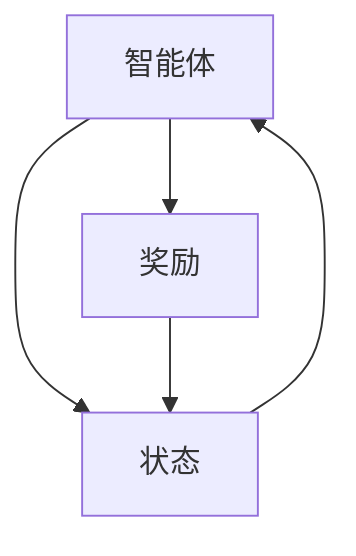
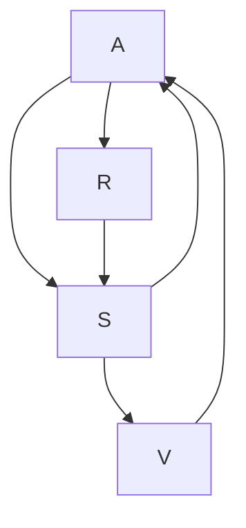
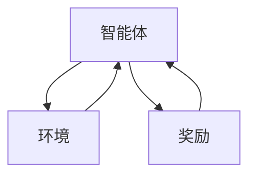
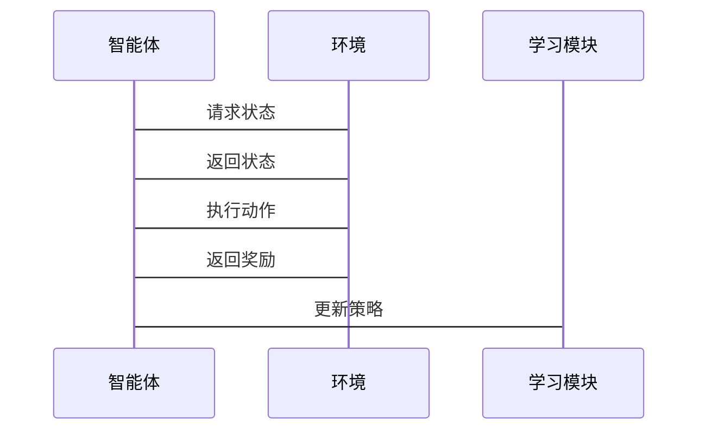

                 

# 强化学习：通过奖励机制改进AI Agent

## 关键词：
强化学习, 奖励机制, AI Agent, 策略优化, 数学模型, 系统架构

## 摘要：
强化学习是一种通过与环境交互并利用奖励机制来优化AI Agent行为的机器学习方法。本文详细探讨了强化学习的核心概念、算法原理、数学模型以及系统架构，结合实际案例分析，帮助读者深入理解如何通过奖励机制改进AI Agent的性能。文章内容涵盖了从基本概念到高级算法的全面解析，适合希望在强化学习领域深入研究的技术人员和研究人员。

---

## 第一部分: 强化学习基础与背景

### 第1章: 强化学习概述

#### 1.1 强化学习的基本概念
##### 1.1.1 什么是强化学习
强化学习（Reinforcement Learning，简称RL）是一种机器学习范式，其中智能体通过与环境交互，学习如何采取一系列行动以最大化累积的奖励。与监督学习和无监督学习不同，强化学习依赖于实时反馈（奖励或惩罚）来调整策略，从而优化决策过程。

##### 1.1.2 强化学习的核心要素
- **状态（State）**：环境在某一时刻的描述，表示智能体所处的环境情况。
- **动作（Action）**：智能体在给定状态下采取的行为。
- **奖励（Reward）**：智能体采取动作后，环境给予的反馈，用于评估该动作的好坏。
- **策略（Policy）**：智能体选择动作的规则，通常表示为从状态到动作的概率分布。
- **价值函数（Value Function）**：衡量某个状态或动作-状态对的长期累积奖励的函数。

##### 1.1.3 强化学习与监督学习、无监督学习的区别
- **监督学习**：基于标记的训练数据，学习输入到输出的映射关系。
- **无监督学习**：从无标记数据中发现结构或模式。
- **强化学习**：通过与环境互动，学习优化决策策略，以最大化累积奖励。

#### 1.2 强化学习的问题背景
##### 1.2.1 问题建模与状态空间
强化学习问题通常通过马尔可夫决策过程（MDP）建模。MDP由以下五个元组定义：
$$ MDP = (S, A, P, R, \gamma) $$
其中：
- \( S \)：状态空间，表示所有可能的状态。
- \( A \)：动作空间，表示智能体在给定状态下可执行的所有动作。
- \( P \)：转移概率，描述从当前状态执行某个动作后转移到下一个状态的概率。
- \( R \)：奖励函数，描述执行某个动作后获得的奖励。
- \( \gamma \)：折扣因子，用于权衡当前奖励与未来奖励的重要性。

##### 1.2.2 动作与奖励机制
- **动作空间**：可以是离散的（例如，游戏中的移动方向）或连续的（例如，机器人控制中的角度调整）。
- **奖励函数**：定义智能体在不同状态和动作下的奖励，直接影响学习过程和策略优化。

##### 1.2.3 马尔可夫决策过程（MDP）的定义
马尔可夫假设：当前状态和未来状态只依赖于当前状态，而与过去的历史无关。强化学习通过MDP建模，假设智能体仅需根据当前状态做出决策，而无需考虑历史信息。

#### 1.3 强化学习的核心概念
##### 1.3.1 状态、动作、奖励的关系
- 状态是环境的描述，动作是智能体的决策，奖励是对决策的反馈。
- 通过不断调整动作，智能体旨在在长期累积奖励最大化的基础上，找到最优策略。

##### 1.3.2 策略与价值函数的定义
- **策略（Policy）**：函数 \( \pi(a|s) \) 表示在状态 \( s \) 下选择动作 \( a \) 的概率。
- **价值函数（Value Function）**：衡量从状态 \( s \) 开始采取策略 \( \pi \) 的长期累积奖励的期望值。

##### 1.3.3 马尔可夫决策过程的数学模型
通过MDP建模强化学习问题，我们可以将问题转化为在给定的MDP中寻找最优策略 \( \pi^* \)，使得累积奖励最大化：
$$ \pi^* = \arg\max_{\pi} V_\pi(s) $$

---

### 第2章: 强化学习的核心概念与联系

#### 2.1 马尔可夫决策过程（MDP）的详细分析
##### 2.1.1 状态空间的定义与特征
状态空间 \( S \) 可以是有限的或无限的，具体取决于问题。例如，在棋类游戏中，状态空间可能包括棋盘上所有可能的棋子位置组合。

##### 2.1.2 动作空间的定义与特征
动作空间 \( A \) 可以是离散的或连续的。离散动作空间的例子包括游戏中的移动方向，而连续动作空间的例子包括机器人关节的角度调整。

##### 2.1.3 奖励函数的设计原则
奖励函数的设计直接影响智能体的学习效率和策略优化效果。奖励函数需要明确且具有引导性，以鼓励智能体采取正确的行动路径。

#### 2.2 策略与价值函数的对比分析
##### 2.2.1 策略的定义与类型
- **确定性策略**：智能体在每个状态下选择唯一动作，例如 \( \mu(s) \)。
- **概率性策略**：智能体在每个状态下选择动作的概率分布，例如 \( \pi(a|s) \)。

##### 2.2.2 价值函数的定义与类型
- **状态价值函数**：衡量从状态 \( s \) 开始的长期累积奖励，表示为 \( V_\pi(s) \)。
- **动作-状态价值函数**：衡量从状态 \( s \) 采取动作 \( a \) 开始的长期累积奖励，表示为 \( Q_\pi(s,a) \)。

##### 2.2.3 策略与价值函数的对比表格
| 比较项            | 策略（Policy）                  | 价值函数（Value Function）          |
|-------------------|--------------------------------|-----------------------------------|
| 定义              | 动作的选择规则                  | 累积奖励的期望值                    |
| 表示              | \( \pi(a|s) \)                 | \( V_\pi(s) \) 或 \( Q_\pi(s,a) \)  |
| 目标              | 选择最优动作                   | 评估状态或动作-状态对的奖励        |

#### 2.3 实体关系图（ER图）与强化学习的关系
##### 2.3.1 实体关系图的定义
实体关系图（ER图）用于描述系统中各实体及其之间的关系，通常用于数据库设计。

##### 2.3.2 强化学习中的实体关系图分析
在强化学习中，实体可以包括智能体、环境、状态、动作和奖励。智能体与环境之间通过状态和动作进行交互，环境通过奖励反馈给智能体。

##### 2.3.3 Mermaid流程图展示强化学习的核心概念

---

### 第3章: 强化学习算法原理

#### 3.1 值函数方法
##### 3.1.1 动态规划方法
动态规划方法通过迭代计算价值函数，逐步逼近最优策略。例如，值迭代算法的公式为：
$$ V_{k+1}(s) = \max_a \left( R(s,a) + \gamma \sum_{s'} P(s'|s,a) V_k(s') \right) $$

##### 3.1.2 贝尔曼方程的数学模型
贝尔曼方程描述了状态的价值函数与其后续状态的关系：
$$ V_\pi(s) = R(s, a) + \gamma \sum_{s'} P(s'|s,a) V_\pi(s') $$

##### 3.1.3 Q-learning算法的流程图

#### 3.2 策略梯度方法
##### 3.2.1 策略梯度的基本原理
策略梯度方法通过优化策略的参数，使得累积奖励最大化。例如，割裂策略梯度（PG）的公式为：
$$ \nabla J(\theta) = \mathbb{E}_{\tau \sim \pi_\theta} [\nabla \log \pi_\theta(a|s) Q(s,a)] $$

##### 3.2.2 前向传播与反向传播的数学模型
策略梯度方法通常涉及前向传播和反向传播两步：
- 前向传播：根据当前策略生成动作并获得奖励。
- 反向传播：根据累积奖励调整策略参数。

##### 3.2.3 近端策略优化（PPO）的流程图

---

### 第4章: 数学模型与公式

#### 4.1 马尔可夫决策过程的数学模型
##### 4.1.1 状态空间S的定义
状态空间 \( S \) 包含所有可能的状态，例如 \( S = \{s_1, s_2, ..., s_n\} \)。

##### 4.1.2 动作空间A的定义
动作空间 \( A \) 包含所有可能的动作，例如 \( A = \{a_1, a_2, ..., a_m\} \)。

##### 4.1.3 转移概率P的定义
转移概率 \( P \) 表示从状态 \( s \) 采取动作 \( a \) 后转移到状态 \( s' \) 的概率：
$$ P(s' | s, a) $$

##### 4.1.4 奖励函数r的定义
奖励函数 \( R \) 表示在状态 \( s \) 采取动作 \( a \) 后获得的奖励：
$$ R(s, a) $$

#### 4.2 值函数的数学公式
##### 4.2.1 价值函数V的定义
价值函数 \( V \) 衡量从状态 \( s \) 开始的长期累积奖励的期望值：
$$ V_\pi(s) = \mathbb{E} \left[ \sum_{t=0}^\infty \gamma^t R(s_t, a_t) \right] $$

##### 4.2.2 Q值函数的定义
Q值函数 \( Q \) 衡量从状态 \( s \) 采取动作 \( a \) 开始的长期累积奖励的期望值：
$$ Q_\pi(s, a) = \mathbb{E} \left[ \sum_{t=0}^\infty \gamma^t R(s_t, a_t) \right] $$

##### 4.2.3 贝尔曼方程的公式
$$ V_\pi(s) = R(s, a) + \gamma \sum_{s'} P(s'|s,a) V_\pi(s') $$

#### 4.3 策略梯度的数学公式
##### 4.3.1 策略梯度的定义
策略梯度表示策略的参数梯度：
$$ \nabla J(\theta) = \mathbb{E}_{\tau \sim \pi_\theta} [\nabla \log \pi_\theta(a|s) Q(s,a)] $$

##### 4.3.2 割裂策略梯度的公式
$$ \nabla J(\theta) = \mathbb{E}_{\tau \sim \pi_\theta} [\nabla \log \pi_\theta(a|s) Q(s,a)] $$

---

### 第5章: 系统分析与架构设计方案

#### 5.1 强化学习系统的总体架构
##### 5.1.1 系统功能模块划分
- **智能体模块**：负责与环境交互，选择动作并获得奖励。
- **环境模块**：定义状态、动作和奖励函数。
- **学习模块**：负责根据奖励优化策略。

##### 5.1.2 系统架构图的Mermaid展示

##### 5.1.3 系统接口设计
- **输入接口**：接收状态和奖励。
- **输出接口**：输出动作和策略参数。

#### 5.2 强化学习系统的交互流程
##### 5.2.1 系统交互的Mermaid序列图

##### 5.2.2 系统交互的详细步骤说明
1. 智能体向环境请求当前状态。
2. 环境返回当前状态。
3. 智能体根据当前策略选择一个动作。
4. 智能体执行该动作。
5. 环境根据动作和状态变化返回奖励。
6. 智能体根据奖励更新策略。

##### 5.2.3 系统交互的关

