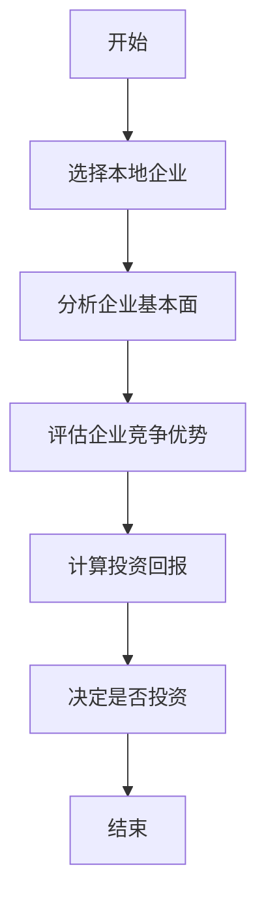

                 


# 彼得·林奇的本地投资优势：投资你所了解的

---

## 关键词：
本地投资，彼得·林奇，投资策略，本地市场，风险管理，投资回报

---

## 摘要：
本文深入探讨了彼得·林奇的本地投资理念，分析了本地投资的优势与策略。通过背景介绍、核心概念、算法原理、系统架构设计和项目实战，详细解读了如何利用本地市场的独特优势进行投资。文章结合实际案例和数学模型，帮助读者掌握本地投资的核心方法和风险管理技巧。

---

# 第一部分：本地投资的优势与策略

## 第1章：本地投资的优势

### 1.1 本地投资的背景与意义

#### 1.1.1 投资的基本概念
投资是指将资金投入到能够产生收益的资产中，以实现财富增值。投资的核心在于选择具有长期增长潜力的资产或企业。本地投资是指将资金投入到本地市场的企业或项目中。

#### 1.1.2 本地投资的独特优势
本地市场具有高度的可及性和透明性，投资者可以更方便地获取企业的信息，深入了解企业的经营状况和市场环境。此外，本地市场的竞争格局相对稳定，投资者更容易发现具有竞争优势的企业。

#### 1.1.3 本地投资与全球化投资的对比
全球化投资虽然潜在回报更高，但由于信息不对称和文化差异，投资者难以深入了解海外市场的细节。而本地投资则可以通过熟悉的环境和文化背景，降低信息不对称的风险。

---

### 1.2 本地市场的特点

#### 1.2.1 本地市场的定义与范围
本地市场指的是投资者所在地区的企业和市场。它包括本地的企业、消费者、政策和经济环境。

#### 1.2.2 本地市场的优势分析
- **信息优势**：投资者对本地市场的了解更深入，能够及时获取市场动态。
- **文化优势**：本地市场的企业更容易理解消费者的需求和偏好。
- **政策优势**：本地市场的企业更熟悉当地政策，能够更好地应对政策变化。

#### 1.2.3 本地市场的风险与挑战
- **竞争激烈**：本地市场通常竞争激烈，企业需要具备更强的竞争力。
- **地域限制**：本地市场的增长潜力可能受到地理限制。

---

### 1.3 本地信息的优势

#### 1.3.1 本地信息的获取渠道
投资者可以通过多种渠道获取本地市场的信息，包括新闻报道、行业报告、企业财报等。

#### 1.3.2 本地信息对投资决策的影响
本地信息能够帮助投资者更准确地评估企业的竞争优势和市场地位，从而做出更明智的投资决策。

#### 1.3.3 本地信息的分析方法
- **基本面分析**：分析企业的财务状况、盈利能力和发展潜力。
- **市场分析**：研究本地市场的趋势和消费者行为。

---

### 1.4 本地投资的回报与风险

#### 1.4.1 本地投资的潜在回报
本地投资的回报通常较为稳定，且能够受益于本地经济的增长。

#### 1.4.2 本地投资的主要风险
- **市场波动风险**：本地市场的波动可能会影响投资回报。
- **企业风险**：本地企业的经营状况直接影响投资回报。

#### 1.4.3 风险管理的基本策略
- **分散投资**：将资金分散投入到不同的企业或行业，降低风险。
- **长期投资**：通过长期持有优质企业，规避短期波动风险。

---

## 第2章：彼得·林奇的投资理念

### 2.1 彼得·林奇的个人简介

#### 2.1.1 彼得·林奇的生平简介
彼得·林奇是美国著名的投资专家，曾任富达麦哲伦基金的经理，以长期优异的投资业绩闻名。

#### 2.1.2 林奇的投资风格与成就
林奇以投资于熟悉的本地企业著称，注重企业的基本面分析和长期价值。

#### 2.1.3 林奇的投资哲学与理念
林奇认为，投资于自己熟悉的企业是降低风险的有效方式。他强调长期投资和价值发现。

---

### 2.2 林奇的本地投资策略

#### 2.2.1 投资于熟悉的行业与企业
林奇认为，投资者应该选择自己熟悉的企业进行投资，这样能够更好地评估企业的价值和潜力。

#### 2.2.2 本地企业的竞争优势分析
林奇关注本地企业的竞争优势，包括市场份额、品牌影响力和成本控制能力。

#### 2.2.3 本地企业的长期价值评估
林奇通过分析企业的财务状况和未来发展前景，评估企业的长期价值。

---

### 2.3 林奇的选股标准

#### 2.3.1 企业的基本面分析
林奇注重企业的财务健康状况，包括盈利能力、资产负债率和现金流。

#### 2.3.2 企业的财务健康状况
林奇认为，健康的财务状况是企业长期发展的基础。

#### 2.3.3 企业的管理团队与战略规划
林奇关注企业的管理团队和战略规划，认为优秀的管理团队能够带领企业实现持续增长。

---

### 2.4 林奇的投资组合管理

#### 2.4.1 投资组合的构建原则
林奇强调分散投资，将资金分散投入到不同行业和企业中。

#### 2.4.2 投资组合的动态调整
林奇定期评估投资组合的表现，根据市场变化进行调整。

#### 2.4.3 风险管理与收益平衡
林奇注重风险管理，通过分散投资和长期持有，平衡风险与收益。

---

## 第3章：本地投资的核心概念与联系

### 3.1 核心概念原理

#### 3.1.1 本地市场的核心要素
本地市场的核心要素包括本地企业、本地消费者和本地政策。

#### 3.1.2 本地企业的竞争优势
本地企业的竞争优势包括本地市场的熟悉度和成本优势。

#### 3.1.3 本地投资的风险特征
本地投资的风险包括市场波动和企业经营风险。

---

### 3.2 核心概念对比表格

| **对比内容** | **本地投资** | **全球化投资** |
|--------------|---------------|----------------|
| 信息获取     | 高            | 低              |
| 文化适应性   | 高            | 低              |
| 竞争强度     | 高            | 高              |
| 风险管理     | 易             | 难              |

---

### 3.3 ER实体关系图架构

```mermaid
erDiagram
    customer[顾客] {
        <属性>
        id : integer
        name : string
        address : string
    }
    enterprise[企业] {
        <属性>
        id : integer
        name : string
        industry : string
    }
    market[市场] {
        <属性>
        id : integer
        name : string
        size : integer
    }
    customer --|{拥有} enterprise
    enterprise --|{属于} market
```

---

## 第4章：算法原理与数学模型

### 4.1 投资决策算法



---

### 4.2 投资回报计算公式

$$ \text{投资回报} = \frac{\text{最终价值} - \text{初始投资}}{\text{初始投资}} \times 100\% $$

---

### 4.3 风险评估模型

$$ \text{风险评分} = \frac{\text{企业风险} + \text{市场风险}}{2} $$

---

## 第5章：系统分析与架构设计方案

### 5.1 问题场景介绍

本地投资分析系统旨在帮助投资者分析本地企业的投资潜力，提供投资决策支持。

---

### 5.2 系统功能设计


---

### 5.3 系统架构设计


---

## 第6章：项目实战

### 6.1 环境安装

安装必要的工具和软件，包括数据分析工具和投资分析系统。

---

### 6.2 系统核心实现源代码

```python
def evaluate_company(company_data):
    # 输入企业数据
    # 输出企业价值评估
    return company_value

def calculate_return(initial_investment, final_value):
    return (final_value - initial_investment) / initial_investment * 100
```

---

### 6.3 代码应用解读与分析

通过代码实现企业价值评估和投资回报计算，帮助投资者做出决策。

---

### 6.4 实际案例分析

分析本地零售企业的投资机会，评估其竞争优势和市场潜力。

---

## 第7章：最佳实践、小结、注意事项与拓展阅读

### 7.1 最佳实践

- 分散投资，降低风险。
- 长期持有，避免短期波动。
- 定期评估，及时调整。

### 7.2 小结

本地投资的优势在于信息优势和文化适应性，投资者可以通过熟悉本地市场和企业，实现稳健的投资回报。

### 7.3 注意事项

- 风险管理是投资成功的关键。
- 需要持续学习和更新投资知识。

### 7.4 拓展阅读

推荐阅读彼得·林奇的著作，深入理解本地投资的策略和方法。

---

## 作者：AI天才研究院/AI Genius Institute & 禅与计算机程序设计艺术/Zen And The Art of Computer Programming

---

以上是《彼得·林奇的本地投资优势：投资你所了解的》的技术博客文章大纲和部分内容。

