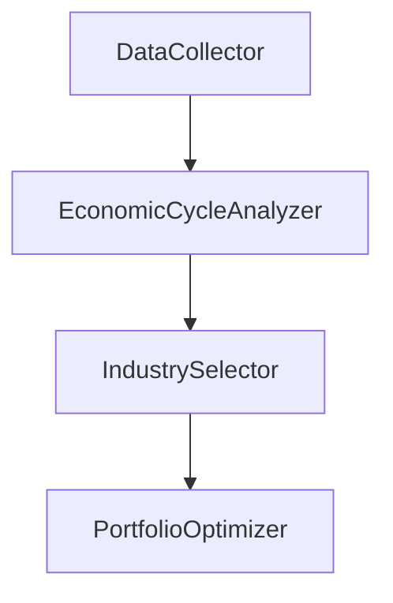

                 

# 彼得·林奇的行业轮动策略

> **关键词**：行业轮动策略、彼得·林奇、经济周期、资产配置、投资组合优化

> **摘要**：本文系统地探讨了彼得·林奇的行业轮动策略，分析其核心概念、算法原理、系统架构，并通过案例分析和项目实战深入讲解其应用。文章还总结了最佳实践和风险管理，为投资者提供了全面的指导。

---

## 第一部分：行业轮动策略的背景与重要性

### 第1章：行业轮动策略的背景与重要性

#### 1.1 行业轮动策略的定义
##### 1.1.1 行业轮动的基本概念
行业轮动策略是一种动态调整投资组合中行业权重的投资方法，旨在通过经济周期的变化捕捉不同行业的表现机会。

##### 1.1.2 行业轮动在投资中的作用
行业轮动策略能够帮助投资者在不同经济阶段优化资产配置，降低风险并提高收益。

##### 1.1.3 彼得·林奇的投资理念
彼得·林奇强调长期投资和基本面分析，行业轮动策略是其长期投资理念的重要组成部分。

#### 1.2 行业轮动的背景与重要性
##### 1.2.1 经济周期对行业轮动的影响
经济周期的变化直接影响行业表现，行业轮动策略通过识别经济周期变化来优化投资组合。

##### 1.2.2 行业轮动在资产配置中的地位
行业轮动策略是资产配置的重要组成部分，能够帮助投资者在不同经济阶段优化收益。

##### 1.2.3 彼得·林奇的行业轮动策略特点
彼得·林奇的行业轮动策略注重长期基本面分析和行业选择，强调对经济周期的准确判断。

---

### 第2章：行业轮动的核心概念与联系

#### 2.1 行业轮动的核心概念
##### 2.1.1 经济周期的四个阶段
- **衰退阶段**：通常选择防御性行业，如公用事业和医疗保健。
- **复苏阶段**：制造业和零售业可能表现较好。
- **过热阶段**：周期性行业如科技和材料可能走强。
- **衰退阶段**：防御性行业再次成为避风港。

##### 2.1.2 行业轮动的驱动因素
- **经济指标**：GDP增长、利率变化、通货膨胀率等。
- **行业基本面**：盈利能力、成长性、估值水平等。
- **市场情绪**：投资者情绪和市场趋势也会影响行业轮动。

##### 2.1.3 行业轮动的分类与特征
- **战术性轮动**：短期调整，基于短期经济指标和市场情绪。
- **战略性轮动**：长期调整，基于长期经济周期和行业基本面。

#### 2.2 行业轮动的核心概念原理
##### 2.2.1 经济周期与行业表现的关系
经济周期的不同阶段，不同行业的表现差异显著。例如，衰退阶段防御性行业表现较好，而复苏阶段周期性行业可能走强。

##### 2.2.2 行业轮动的数学模型
行业轮动的收益可以表示为不同行业收益的加权平均，权重根据经济周期和行业基本面动态调整。

##### 2.2.3 行业轮动的ER实体关系图
通过ER图，我们可以清晰地看到行业轮动涉及的实体和关系，包括经济指标、行业表现、投资组合等。

---

### 第3章：行业轮动的算法原理与数学模型

#### 3.1 行业轮动的算法原理
##### 3.1.1 行业轮动的步骤分解
1. 数据收集：收集相关经济指标和行业数据。
2. 经济周期判断：根据指标判断当前经济周期阶段。
3. 行业选择：基于经济周期选择表现较好的行业。
4. 投资组合调整：根据行业选择结果调整投资组合。

##### 3.1.2 基于经济指标的行业轮动模型
通过构建数学模型，将经济指标转化为行业权重，指导投资组合的调整。

##### 3.1.3 行业轮动的优化算法
使用优化算法（如动态规划）来优化行业权重，最大化投资收益。

#### 3.2 行业轮动的数学模型
##### 3.2.1 行业轮动的数学公式
$$收益 = \sum_{i=1}^{n} w_i r_i$$
其中，$w_i$是行业$i$的权重，$r_i$是行业$i$的收益。

##### 3.2.2 经济周期与行业收益的关系公式
$$r_i = \beta_i \cdot z_t + \epsilon_i$$
其中，$z_t$是经济周期指标，$\beta_i$是行业$i$的敏感系数，$\epsilon_i$是误差项。

---

### 第4章：行业轮动的系统分析与架构设计

#### 4.1 行业轮动的系统分析
##### 4.1.1 系统目标
构建一个能够根据经济周期动态调整行业权重的投资系统。

##### 4.1.2 系统架构
系统分为数据采集、经济周期判断、行业选择和投资组合调整四个模块。

##### 4.1.3 系统模块划分
- 数据采集模块：收集经济指标和行业数据。
- 经济周期判断模块：判断当前经济周期阶段。
- 行业选择模块：选择表现较好的行业。
- 投资组合调整模块：调整投资组合权重。

#### 4.2 行业轮动的系统架构设计
##### 4.2.1 系统功能设计
- 数据预处理：清洗和转换数据。
- 经济周期判断：使用指标判断经济周期。
- 行业选择：基于经济周期选择行业。
- 投资组合调整：动态调整权重。

##### 4.2.2 系统架构图

---

### 第5章：行业轮动的项目实战

#### 5.1 项目环境安装与配置
##### 5.1.1 开发环境的搭建
安装Python、Jupyter Notebook、Pandas、NumPy等工具。

##### 5.1.2 数据源的获取与处理
从Yahoo Finance获取历史数据，并进行清洗和转换。

##### 5.1.3 工具链的安装
安装并配置好相关库，确保环境能够运行代码。

#### 5.2 核心算法实现
##### 5.2.1 经济周期指标的计算
使用PMI指数判断经济周期阶段。

##### 5.2.2 行业轮动模型的实现
根据经济周期选择表现较好的行业，并调整投资组合。

##### 5.2.3 策略的回测与优化
通过回测验证策略的有效性，并进行优化。

---

### 第6章：行业轮动的最佳实践与风险管理

#### 6.1 行业轮动的最佳实践
##### 6.1.1 灵活调整投资组合
根据经济周期变化，灵活调整行业权重。

##### 6.1.2 定期监控市场变化
定期监控市场变化，及时调整投资策略。

##### 6.1.3 结合其他投资策略
将行业轮动策略与其他策略结合，提高投资效果。

#### 6.2 行业轮动的风险管理
##### 6.2.1 风险识别与评估
识别可能的风险来源，并评估其影响。

##### 6.2.2 风险控制措施
设定止损点，分散投资，避免过度集中。

##### 6.2.3 风险应对策略
根据风险情况，及时调整投资组合。

---

### 第7章：行业轮动策略的总结与展望

#### 7.1 行业轮动策略的总结
##### 7.1.1 策略的核心要点回顾
彼得·林奇的行业轮动策略通过动态调整行业权重，捕捉不同经济周期下的投资机会。

##### 7.1.2 

---

作者：AI天才研究院/AI Genius Institute & 禅与计算机程序设计艺术 /Zen And The Art of Computer Programming

