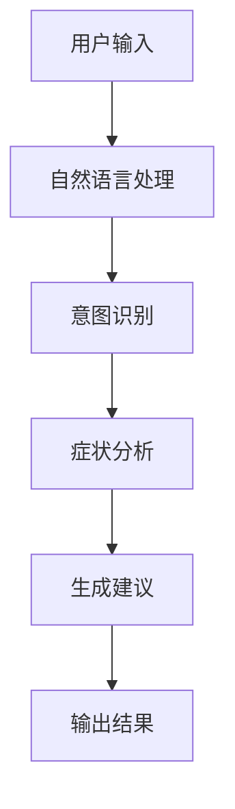
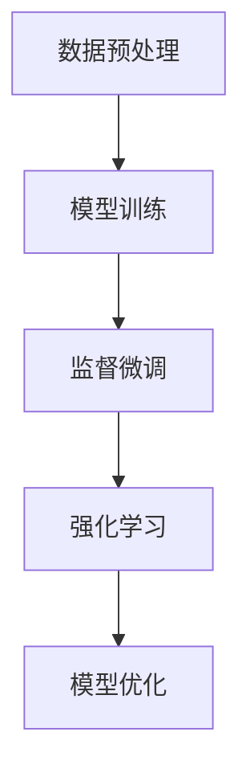

                 


# 心理咨询 AI Agent：LLM 在心理健康领域的应用

## 关键词：心理咨询，AI Agent，LLM，心理健康，人工智能，自然语言处理

## 摘要：  
随着人工智能技术的快速发展，LLM（Large Language Model）在心理健康领域的应用潜力巨大。本文将探讨心理咨询 AI Agent 的核心概念、技术实现、系统架构及实际应用场景，分析其在心理健康服务中的优势与挑战，为未来的心理健康支持提供新的思路。

---

## 第一部分：心理咨询 AI Agent 的背景与概念

### 第1章：心理咨询 AI Agent 的背景

#### 1.1 心理咨询 AI Agent 的背景
心理健康问题在现代社会日益凸显，传统心理咨询方式面临资源不足、覆盖范围有限等挑战。AI 技术的快速发展为心理健康服务提供了新的解决方案，其中，LLM（大语言模型）因其强大的自然语言处理能力，成为实现心理咨询 AI Agent 的核心技术。

#### 1.2 心理健康问题的现状与挑战
- **心理健康问题的普遍性**：焦虑、抑郁等心理问题呈现高发趋势，尤其是青少年和职场人群。
- **资源不足**：专业心理咨询师数量有限，难以满足庞大的需求。
- **隐私与便利性**：用户希望获得私密、便捷的心理咨询方式。

#### 1.3 AI 技术在心理健康领域的潜力
- **24/7 可用性**：AI Agent 可以全天候为用户提供心理支持。
- **隐私保护**：AI 咨询无需面对面交流，保护用户隐私。
- **个性化服务**：通过大数据分析，AI 可以为用户提供个性化的心理支持方案。

### 第2章：心理咨询 AI Agent 的核心概念与问题描述

#### 2.1 心理咨询 AI Agent 的核心概念
- **AI Agent**：一种智能体，能够通过交互理解用户需求并提供相应服务。
- **LLM**：大语言模型，基于深度学习的自然语言处理模型，能够理解和生成人类语言。

#### 2.2 心理咨询 AI Agent 的问题描述
- **技术挑战**：如何训练模型准确理解心理健康问题，并提供有效的建议。
- **伦理问题**：AI 咨询的边界在哪里？如何避免误诊或过度干预？
- **用户体验**：如何设计用户友好的交互界面，让用户愿意与 AI 交流。

---

## 第二部分：心理咨询 AI Agent 的核心概念与联系

### 第3章：心理咨询 AI Agent 的核心概念原理

#### 3.1 心理咨询 AI Agent 的基本原理
- **自然语言处理（NLP）**：AI Agent 通过 NLP 技术理解用户的问题。
- **机器学习（ML）**：模型通过训练数据学习如何回答问题。
- **用户行为分析**：通过分析用户的历史对话，识别潜在的心理健康问题。

#### 3.2 心理咨询 AI Agent 的特征对比
| 特征      | 传统心理咨询 | AI 咨询 AI Agent |
|-----------|---------------|-------------------|
| 可及性     | 有限          | 24/7 可用         |
| 专业性     | 高            | 较低（依赖模型）   |
| 隐私性     | 高            | 高（数据加密）     |
| 成本       | 高            | 低                |

#### 3.3 心理咨询 AI Agent 的 ER 实体关系图
```mermaid
erd
    用户
    咨询记录
    心理咨询师
    AI 咨询模型
    症状分析
    建议方案
    交互记录
```

### 第4章：心理咨询 AI Agent 的算法原理

#### 4.1 心理咨询 AI Agent 的算法流程


#### 4.2 心理咨询 AI Agent 的数学模型
- 概率分布：用于分类用户输入的情绪状态。
  $$ P(y|x) = \frac{P(x|y)P(y)}{P(x)} $$
- 损失函数：用于优化模型参数。
  $$ L = -\frac{1}{N}\sum_{i=1}^{N} \log P(y_i|x_i) $$

#### 4.3 心理咨询 AI Agent 的训练过程


---

## 第三部分：心理咨询 AI Agent 的系统分析与架构设计

### 第5章：心理咨询 AI Agent 的系统架构

#### 5.1 应用场景
- **心理咨询**：用户与 AI Agent 对话，获得心理支持。
- **压力评估**：通过分析用户语言，评估其压力水平。
- **情绪管理**：提供情绪调节技巧和建议。

#### 5.2 系统功能设计
- 用户界面：简洁的聊天界面，支持文字输入。
- 对话管理：记录用户对话历史，分析情绪变化。
- 数据管理：存储用户数据，确保隐私安全。

#### 5.3 系统架构图


#### 5.4 接口与交互流程
- 用户输入：文本输入。
- 系统处理：自然语言理解、意图识别、生成回复。
- 输出：自然语言回复。

---

## 第四部分：心理咨询 AI Agent 的项目实战

### 第6章：心理咨询 AI Agent 的实现

#### 6.1 环境安装
- Python 3.8+
- PyTorch 2.0+
- Hugging Face Transformers

#### 6.2 核心代码实现
```python
from transformers import AutoTokenizer, AutoModelForCausalLM

model_name = "gpt2"
tokenizer = AutoTokenizer.from_pretrained(model_name)
model = AutoModelForCausalLM.from_pretrained(model_name)

def心理咨询师回答问题(问题):
    inputs = tokenizer(问题, return_tensors="np")
    outputs = model.generate(inputs.input_ids, max_length=500)
    回答 = tokenizer.decode(outputs[0], skip_special_tokens=True)
    return 回答

# 示例
问题 = "我最近感到很焦虑，怎么办？"
print(心理咨询师回答问题(问题))
```

#### 6.3 实际案例分析
- 用户输入：我最近感到很焦虑，怎么办？
- 系统回复：您可以尝试深呼吸放松，或者记录您的情绪变化，帮助更好地理解自己的感受。

---

## 第五部分：最佳实践与总结

### 第7章：最佳实践与注意事项

#### 7.1 注意事项
- **数据隐私**：确保用户数据的安全性。
- **伦理问题**：明确 AI 咨询的边界，避免误导用户。
- **用户体验**：设计友好直观的交互界面。

#### 7.2 小结
心理咨询 AI Agent 的实现依赖于先进的 NLP 技术和强大的 LLM 模型，能够为用户提供便捷、高效的心理支持。然而，其应用仍需谨慎考虑伦理和技术问题，确保真正为用户带来积极的影响。

---

## 作者：AI天才研究院/AI Genius Institute & 禅与计算机程序设计艺术 /Zen And The Art of Computer Programming

---

这篇技术博客文章通过系统化的分析，详细介绍了心理咨询 AI Agent 的背景、核心概念、技术实现和实际应用，为读者提供了全面的视角和深入的思考。

