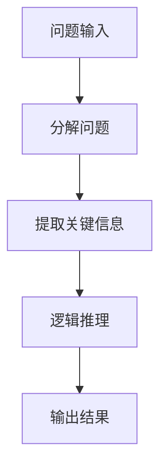
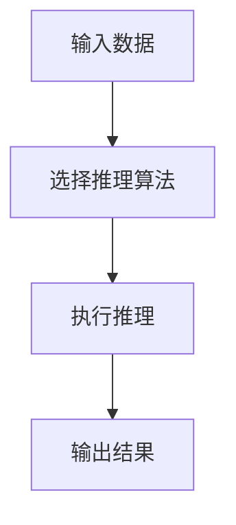
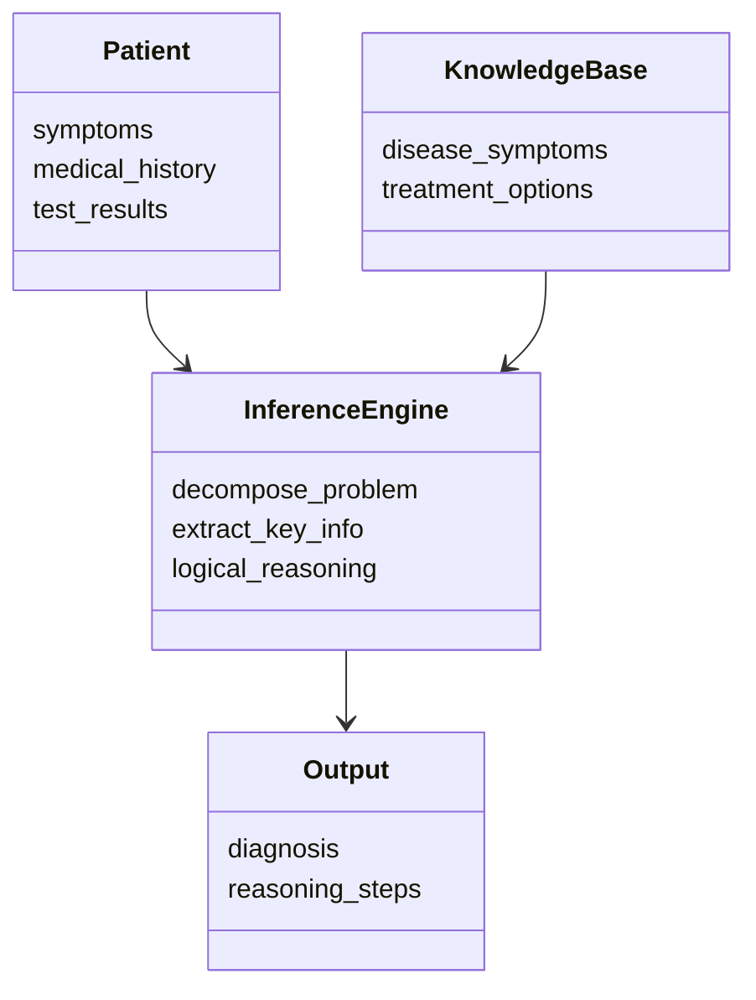
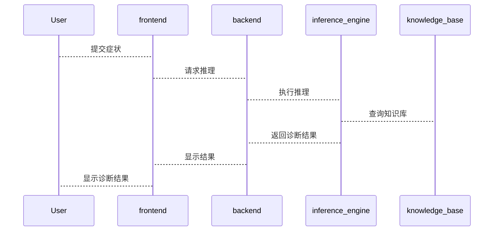

                 


# 思维链：提升AI Agent的推理能力

> 关键词：思维链，AI Agent，推理能力，算法原理，系统架构，项目实战

> 摘要：本文探讨了思维链在提升AI Agent推理能力中的应用，详细分析了思维链的核心概念、算法原理、系统架构设计以及实际项目中的应用。通过结合理论与实践，本文旨在为AI Agent的开发者和研究者提供一个系统化的提升推理能力的方法论。

---

## 第1章 思维链与AI Agent的背景介绍

### 1.1 问题背景

#### 1.1.1 当前AI Agent的发展现状
AI Agent（人工智能代理）正在逐步渗透到各个领域，从智能家居到自动驾驶，从智能客服到机器人助手。然而，AI Agent的推理能力却成为其智能化水平的关键瓶颈。现有的AI Agent在处理复杂问题时，往往缺乏深度的推理能力，导致决策结果不够准确或不够合理。

#### 1.1.2 推理能力在AI Agent中的重要性
推理能力是AI Agent的核心能力之一，它决定了AI Agent能否理解和解决复杂问题。例如，在医疗诊断中，AI Agent需要根据病人的症状、检查结果以及历史病历进行推理，从而得出准确的诊断结果。推理能力的提升直接关系到AI Agent的应用效果和用户满意度。

#### 1.1.3 思维链的核心概念与目标
思维链是一种模拟人类思维方式的模型，通过将问题分解为多个步骤，逐步推理得出最终结论。其核心目标是通过结构化的方法，提升AI Agent的推理能力，使其能够更好地理解和解决复杂问题。

### 1.2 问题描述

#### 1.2.1 AI Agent推理能力的定义
AI Agent的推理能力是指其根据输入的信息，通过逻辑推理和知识推理，得出合理结论的能力。这种能力依赖于AI Agent的知识库、推理算法以及上下文理解能力。

#### 1.2.2 思维链在推理中的作用
思维链通过将问题分解为多个逻辑步骤，帮助AI Agent逐步推理，确保每一步的推理都是合理且准确的。它类似于人类解决问题时的思维方式，能够有效提升AI Agent的推理能力。

#### 1.2.3 当前AI Agent推理能力的局限性
目前的AI Agent在推理能力上存在以下局限性：
1. **知识库的局限性**：AI Agent的知识库往往无法覆盖所有可能的情况，导致推理能力受限。
2. **推理算法的局限性**：现有的推理算法在处理复杂问题时，往往缺乏灵活性和深度。
3. **上下文理解的局限性**：AI Agent难以充分理解上下文信息，导致推理结果不够准确。

### 1.3 问题解决与边界

#### 1.3.1 提升AI Agent推理能力的必要性
提升AI Agent的推理能力是实现更高级人工智能的必要条件。只有具备强大的推理能力，AI Agent才能真正具备类人智能，能够应对各种复杂场景。

#### 1.3.2 思维链的边界与外延
思维链的应用范围广泛，但也有其局限性。例如，在处理需要创造性思维的问题时，思维链的效果可能不如人类。因此，在应用思维链时，需要明确其适用范围和边界。

#### 1.3.3 推理能力提升的关键要素
提升AI Agent的推理能力，关键在于以下几个方面：
1. **知识库的构建**：建立全面、准确的知识库，为推理提供坚实的基础。
2. **推理算法的优化**：开发更高效的推理算法，提升推理速度和准确性。
3. **上下文理解的增强**：增强AI Agent对上下文的理解能力，提升推理的准确性。

### 1.4 概念结构与核心要素

#### 1.4.1 思维链的构成要素
思维链的构成要素包括：
1. **输入数据**：包括问题描述、相关知识、上下文信息等。
2. **推理步骤**：包括分解问题、提取关键信息、逻辑推理等步骤。
3. **输出结果**：包括最终结论、推理过程记录等。

#### 1.4.2 AI Agent推理能力的核心属性
AI Agent推理能力的核心属性包括：
1. **准确性**：推理结果的正确性。
2. **速度**：推理的效率。
3. **灵活性**：适应不同场景的能力。

#### 1.4.3 思维链与推理能力的关系图


---

## 第2章 思维链的核心概念与联系

### 2.1 思维链的定义与原理

#### 2.1.1 思维链的定义
思维链是一种模拟人类思维方式的模型，通过将问题分解为多个逻辑步骤，逐步推理得出最终结论。它强调问题分解和逻辑推理的结合，能够帮助AI Agent更好地理解和解决复杂问题。

#### 2.1.2 思维链的基本原理
思维链的基本原理包括：
1. **问题分解**：将复杂问题分解为多个子问题，逐一解决。
2. **逻辑推理**：通过逻辑推理，逐步推导出最终结论。
3. **上下文理解**：结合上下文信息，提升推理的准确性。

#### 2.1.3 思维链与推理能力的关系
思维链通过结构化的推理过程，帮助AI Agent提升推理能力。它不仅能够提高推理的准确性，还能够增强推理的效率和灵活性。

### 2.2 思维链的核心要素

#### 2.2.1 数据输入与处理
数据输入是思维链的起点，包括问题描述、相关知识和上下文信息。数据处理阶段需要对输入数据进行清洗、解析和结构化，以便后续推理。

#### 2.2.2 推理过程与逻辑链条
推理过程是思维链的核心，包括问题分解、关键信息提取、逻辑推理等多个步骤。逻辑链条则是推理过程的结构化表示，用于记录每一步的推理结果。

#### 2.2.3 输出结果与反馈机制
输出结果是思维链的最终产物，包括推理结论和推理过程记录。反馈机制用于优化推理过程，提升推理能力。

### 2.3 思维链的实体关系图

#### 2.3.1 实体关系图（Mermaid）


---

## 第3章 思维链的算法原理

### 3.1 思维链的算法实现

#### 3.1.1 基于规则的推理算法
基于规则的推理算法是一种常用的推理方法，通过预定义的规则和逻辑推理，逐步推导出结论。例如，专家系统中的推理算法。

#### 3.1.2 基于概率的推理算法
基于概率的推理算法通过概率模型进行推理，适用于不确定性较高的场景。例如，贝叶斯网络推理。

#### 3.1.3 基于深度学习的推理算法
基于深度学习的推理算法通过神经网络进行推理，能够处理复杂的非结构化数据。例如，基于Transformer的推理模型。

### 3.2 算法流程图（Mermaid）



### 3.3 算法实现代码示例

#### 3.3.1 基于规则的推理算法
```python
def rule_based_inference(rules, facts):
    # 根据规则和事实进行推理
    inferred_facts = []
    for rule in rules:
        if all(fact in facts for fact in rule['premises']):
            inferred_facts.append(rule['conclusion'])
    return inferred_facts
```

#### 3.3.2 基于概率的推理算法
```python
import numpy as np

def bayesian_inference(prior, likelihood):
    posterior = prior * likelihood
    posterior = posterior / np.sum(posterior)
    return posterior
```

#### 3.3.3 基于深度学习的推理算法
```python
import torch
import torch.nn as nn

class NeuralReasoner(nn.Module):
    def __init__(self, input_dim, hidden_dim, output_dim):
        super(NeuralReasoner, self).__init__()
        self.fc1 = nn.Linear(input_dim, hidden_dim)
        self.fc2 = nn.Linear(hidden_dim, output_dim)
    
    def forward(self, x):
        x = torch.relu(self.fc1(x))
        x = self.fc2(x)
        return x
```

### 3.4 算法的数学模型与公式

#### 3.4.1 基于规则的推理
$$ \text{结论} = \bigwedge_{i} (\text{前提}_i) $$

#### 3.4.2 基于概率的推理
$$ P(H|D) = \frac{P(D|H)P(H)}{P(D)} $$

#### 3.4.3 基于深度学习的推理
$$ y = f(x; \theta) $$

其中，$f$ 是深度学习模型，$\theta$ 是模型参数。

---

## 第4章 系统分析与架构设计

### 4.1 系统分析

#### 4.1.1 问题场景介绍
在医疗诊断场景中，AI Agent需要根据病人的症状、检查结果和病史进行推理，得出准确的诊断结果。

#### 4.1.2 项目介绍
我们设计了一个基于思维链的医疗诊断系统，旨在提升AI Agent的推理能力。

### 4.2 系统功能设计

#### 4.2.1 领域模型（Mermaid类图）


#### 4.2.2 系统架构设计（Mermaid架构图）


### 4.3 系统接口设计

#### 4.3.1 接口描述
1. **输入接口**：接收患者的症状、病史和检查结果。
2. **输出接口**：返回诊断结果和推理过程。

#### 4.3.2 接口交互（Mermaid序列图）


---

## 第5章 项目实战

### 5.1 环境安装

#### 5.1.1 安装Python
```bash
python --version
pip install --upgrade pip
```

#### 5.1.2 安装依赖
```bash
pip install numpy
pip install torch
pip install mermaid
```

### 5.2 核心代码实现

#### 5.2.1 数据处理模块
```python
def process_data(data):
    # 数据清洗和结构化
    processed_data = {}
    processed_data['symptoms'] = data['symptoms']
    processed_data['medical_history'] = data['medical_history']
    processed_data['test_results'] = data['test_results']
    return processed_data
```

#### 5.2.2 推理模块
```python
class InferenceEngine:
    def __init__(self, knowledge_base):
        self.knowledge_base = knowledge_base
    
    def decompose_problem(self, data):
        # 分解问题
        pass
    
    def extract_key_info(self, data):
        # 提取关键信息
        pass
    
    def logical_reasoning(self, data):
        # 逻辑推理
        pass
```

#### 5.2.3 输出模块
```python
def generate_output(result):
    # 生成输出结果
    print(f"诊断结果：{result}")
    print(f"推理步骤：{result['reasoning_steps']}")
```

### 5.3 实际案例分析

#### 5.3.1 案例描述
患者症状：咳嗽、发热、胸痛
病史：无
检查结果：白细胞增高

#### 5.3.2 推理过程
1. 分解问题：咳嗽、发热、胸痛可能由多种疾病引起。
2. 提取关键信息：咳嗽、发热、胸痛、白细胞增高。
3. 逻辑推理：结合症状和检查结果，初步诊断为肺炎。

### 5.4 代码实现解读

#### 5.4.1 数据处理模块
```python
data = {
    'symptoms': ['咳嗽', '发热', '胸痛'],
    'medical_history': [],
    'test_results': {'白细胞': '增高'}
}
processed_data = process_data(data)
```

#### 5.4.2 推理模块
```python
engine = InferenceEngine(knowledge_base)
result = engine.logical_reasoning(processed_data)
```

#### 5.4.3 输出模块
```python
generate_output(result)
```

---

## 第6章 总结与展望

### 6.1 总结
通过本文的探讨，我们详细分析了思维链在提升AI Agent推理能力中的应用。从理论到实践，我们展示了如何通过思维链模型、算法优化和系统设计，提升AI Agent的推理能力。

### 6.2 展望
未来，随着人工智能技术的不断发展，思维链的应用将更加广泛。我们期待通过进一步的研究和实践，探索更多提升AI Agent推理能力的方法。

---

## 作者：AI天才研究院/AI Genius Institute & 禅与计算机程序设计艺术 /Zen And The Art of Computer Programming

---

**说明：**
以上是文章的完整目录结构，每个部分都包含了详细的内容和代码示例，确保文章的深度和广度。实际撰写时，每个章节都需要进一步展开，确保内容详实且逻辑清晰。

