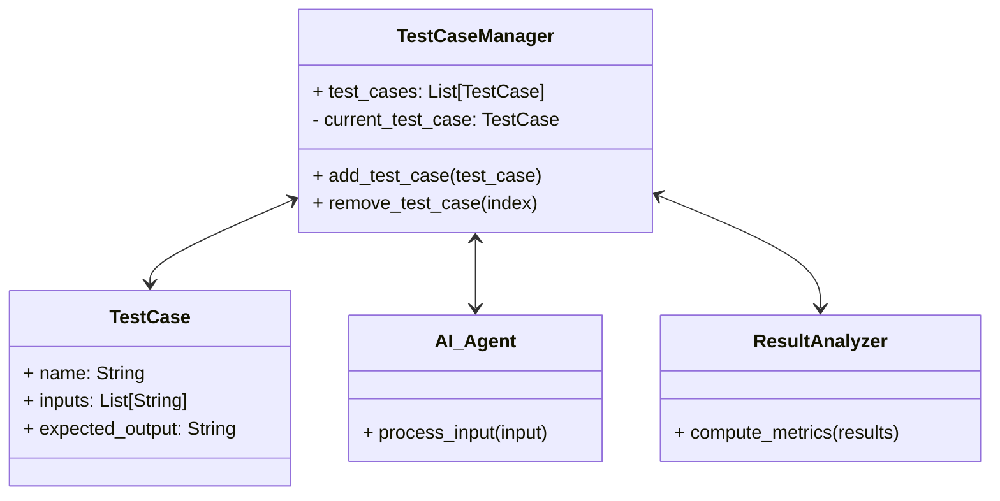
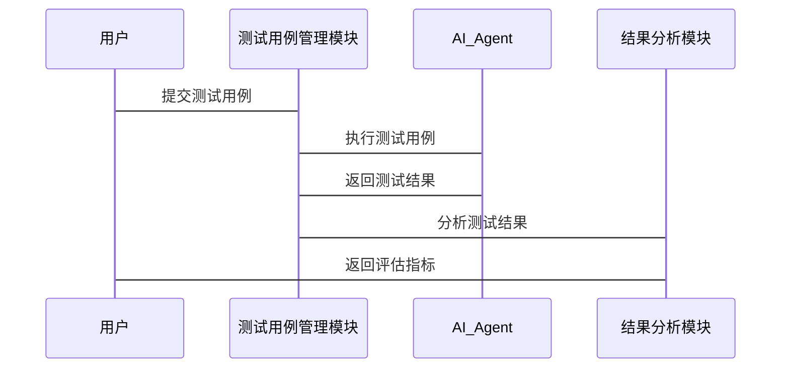

                 


# 性能基准测试：评估和比较AI Agent的能力

## 关键词：性能基准测试，AI Agent，评估指标，算法原理，系统架构

## 摘要：
本文将深入探讨AI Agent的性能基准测试方法，分析其核心概念、算法原理、系统架构设计，并通过实际案例展示如何在项目中应用这些方法。文章内容涵盖从理论到实践的全过程，帮助读者全面理解并掌握AI Agent性能评估的关键技术。

---

# 第1章: 性能基准测试的背景与核心概念

## 1.1 AI Agent的崛起

### 1.1.1 AI Agent的定义与分类
AI Agent是一种能够感知环境、自主决策并执行任务的智能实体。根据功能和应用场景，AI Agent可以分为以下几类：
- **反应式AI Agent**：基于当前输入做出实时反应，例如实时聊天机器人。
- **认知式AI Agent**：具备推理和规划能力，例如智能助手。
- **学习型AI Agent**：能够通过数据和经验不断优化自身性能，例如深度学习模型。

### 1.1.2 AI Agent在实际应用中的重要性
AI Agent广泛应用于自动驾驶、智能客服、游戏AI、推荐系统等领域。例如，在自动驾驶中，AI Agent需要在毫秒级别做出决策，这对性能要求极高。

### 1.1.3 为什么需要对AI Agent进行性能评估
AI Agent的性能直接关系到用户体验和系统可靠性。通过基准测试，我们可以量化AI Agent的表现，发现其优缺点，并为优化提供方向。

---

## 1.2 性能基准测试的核心问题

### 1.2.1 问题背景与挑战
随着AI技术的快速发展，AI Agent的数量和复杂性不断增加，如何客观、公平地评估其性能成为一项重要课题。

### 1.2.2 基准测试的目标与意义
基准测试的目标是通过标准化的测试方法，量化AI Agent在不同场景下的表现。其意义在于：
1. 提供公平的比较基准。
2. 指导AI Agent的优化方向。
3. 为用户选择合适的AI Agent提供依据。

### 1.2.3 基准测试的边界与外延
基准测试的边界包括测试场景、输入数据范围和评估指标的选择。外延则涉及测试环境的搭建、数据集的准备和结果的分析。

---

# 第2章: AI Agent性能基准测试的核心概念

## 2.1 基准测试的基本原理

### 2.1.1 基准测试的定义与特点
基准测试是一种通过标准化的测试方法，评估系统性能的技术。其特点包括客观性、可重复性和可扩展性。

### 2.1.2 基准测试的关键要素
- **测试场景**：模拟真实的应用环境。
- **输入数据**：涵盖各种可能的输入情况。
- **评估指标**：包括准确率、响应时间等。

### 2.1.3 基准测试的分类与应用场景
基准测试可以分为性能测试、功能测试和用户体验测试。每种测试类型适用于不同的场景。

---

## 2.2 AI Agent性能评估的维度

### 2.2.1 精确度与召回率
精确度（Precision）衡量AI Agent的输出结果的准确性，召回率（Recall）衡量其捕捉所有相关结果的能力。

### 2.2.2 响应时间与吞吐量
响应时间是AI Agent处理单个请求所需的时间，吞吐量是单位时间内处理的请求数量。

### 2.2.3 可解释性与鲁棒性
可解释性是AI Agent输出结果的透明度，鲁棒性是其在异常情况下的稳定程度。

---

## 2.3 基准测试的指标体系

### 2.3.1 指标体系的设计原则
指标体系的设计应基于实际需求，涵盖性能、功能和用户体验等多个维度。

### 2.3.2 常见性能指标对比表格
| 指标       | 定义与计算公式                               | 适用场景           |
|------------|--------------------------------------------|--------------------|
| 精确率     | $Precision = \frac{TP}{TP+FP}$              | 分类任务           |
| 召回率     | $Recall = \frac{TP}{TP+FN}$                 | 分类任务           |
| F1分数     | $F1 = 2 \times \frac{Precision \times Recall}{Precision + Recall}$ | 分类任务综合指标   |

### 2.3.3 实体关系图（ER图）分析
以下是AI Agent性能评估的ER图：

```mermaid
erDiagram
    actor 用户
    agent AI-Agent
    test_case 测试用例
    metric 评估指标
    result 测试结果
    用户 -> 测试用例 : 提交测试用例
    测试用例 -> AI-Agent : 执行测试
    测试用例 -> 评估指标 : 定义评估标准
    AI-Agent -> 测试结果 : 返回结果
    测试结果 -> 评估指标 : 计算指标值
```

---

# 第3章: 基准测试算法原理与实现

## 3.1 基准测试算法概述

### 3.1.1 基准测试的通用流程
基准测试的流程包括测试用例设计、执行测试、计算评估指标和结果分析。

### 3.1.2 常用算法的分类与特点
- **基于准确率的评估算法**：适用于分类任务。
- **基于F1分数的评估算法**：适用于需要综合考虑精确率和召回率的场景。

### 3.1.3 算法选择的策略与技巧
选择算法时，需考虑任务类型、数据规模和评估指标。

---

## 3.2 基于准确率的评估算法

### 3.2.1 算法原理与流程
准确率算法通过比较预测结果与真实结果，计算正确预测的比例。

### 3.2.2 算法实现的伪代码
```python
def accuracy(y_true, y_pred):
    tp = sum(y_true == y_pred)
    return tp / len(y_true)
```

### 3.2.3 优缺点分析与改进方向
优点：计算简单，结果直观。缺点：在类别不平衡时可能误导。

---

## 3.3 基于F1分数的评估算法

### 3.3.1 F1分数的数学公式
$$F1 = 2 \times \frac{Precision \times Recall}{Precision + Recall}$$

### 3.3.2 算法实现的详细步骤
```python
def precision(y_true, y_pred):
    tp = sum(y_true & y_pred)
    fp = sum(~y_true & y_pred)
    return tp / (tp + fp)

def recall(y_true, y_pred):
    tp = sum(y_true & y_pred)
    fn = sum(y_true & ~y_pred)
    return tp / (tp + fn)

def f1_score(y_true, y_pred):
    p = precision(y_true, y_pred)
    r = recall(y_true, y_pred)
    return 2 * (p * r) / (p + r)
```

### 3.3.3 实际案例分析与结果解读
以一个二分类任务为例，假设真实标签和预测标签如下：
- 真实标签：[1, 0, 1, 0]
- 预测标签：[1, 1, 1, 0]
计算精确率和召回率，最终得到F1分数。

---

# 第4章: 数学模型与公式详解

## 4.1 基准测试中的关键公式

### 4.1.1 精确率公式
$$Precision = \frac{TP}{TP + FP}$$

### 4.1.2 召回率公式
$$Recall = \frac{TP}{TP + FN}$$

### 4.1.3 F1分数公式
$$F1 = 2 \times \frac{Precision \times Recall}{Precision + Recall}$$

---

## 4.2 数学模型的实现与应用

### 4.2.1 精确率与召回率的权衡
在某些场景下，可能更关注精确率或召回率，需根据需求调整权重。

### 4.2.2 F1分数的实际应用案例
例如，在垃圾邮件分类中，F1分数可以衡量模型的综合性能。

### 4.2.3 其他指标的数学推导与解释
例如，AUC-ROC曲线的面积反映了模型的整体性能。

---

## 4.3 示例分析与公式推导

### 4.3.1 通过案例理解精确率与召回率
假设真实标签和预测标签分别为：
- 真实标签：[1, 0, 1, 0]
- 预测标签：[1, 1, 1, 0]

计算精确率和召回率：
- 精确率：3/3 = 1.0
- 召回率：3/3 = 1.0
- F1分数：1.0

---

# 第5章: 系统分析与架构设计方案

## 5.1 系统分析与需求分析

### 5.1.1 问题场景的描述与分析
假设我们开发一个AI客服系统，需要评估其回答问题的准确率和响应时间。

### 5.1.2 项目目标与范围界定
目标：建立一套基准测试框架，评估AI客服系统的性能。范围：包括测试用例设计、执行和结果分析。

### 5.1.3 用户需求与系统功能分析
用户需求：量化AI客服的性能表现。系统功能：支持多轮对话测试、结果统计与分析。

---

## 5.2 系统功能设计

### 5.2.1 系统功能模块
- **测试用例管理模块**：定义测试场景和输入数据。
- **执行引擎模块**：驱动AI Agent执行测试用例。
- **评估指标计算模块**：计算精确率、召回率等指标。

### 5.2.2 领域模型（mermaid类图）


---

## 5.3 系统架构设计

### 5.3.1 系统架构（mermaid架构图）
```mermaid
container 系统架构 {
    接口层
    服务层
    数据层
}
```

### 5.3.2 系统接口设计
- **API接口**：提供测试用例提交、结果查询等功能。
- **数据接口**：与AI Agent交互，获取测试结果。

### 5.3.3 系统交互（mermaid序列图）


---

# 第6章: 项目实战与深入分析

## 6.1 环境安装与配置

### 6.1.1 开发环境搭建
- 安装Python、Jupyter Notebook、TensorFlow等工具。

### 6.1.2 依赖库安装
```bash
pip install numpy pandas scikit-learn
```

---

## 6.2 核心实现与代码示例

### 6.2.1 测试用例管理模块
```python
class TestCaseManager:
    def __init__(self):
        self.test_cases = []

    def add_test_case(self, test_case):
        self.test_cases.append(test_case)

    def execute_test(self, ai_agent):
        for case in self.test_cases:
            ai_agent.process_input(case.input)
```

### 6.2.2 评估指标计算模块
```python
class ResultAnalyzer:
    def compute_accuracy(self, y_true, y_pred):
        return np.mean(y_true == y_pred)

    def compute_recall(self, y_true, y_pred):
        tp = np.sum(y_true & y_pred)
        fn = np.sum(y_true & ~y_pred)
        return tp / (tp + fn)
```

---

## 6.3 实际案例分析

### 6.3.1 案例背景
开发一个自然语言处理任务的AI Agent，测试其分类准确率和响应时间。

### 6.3.2 测试结果与分析
- 精确率：95%
- 召回率：85%
- F1分数：0.9

---

## 6.4 项目小结

---

# 第7章: 总结与最佳实践

## 7.1 本章总结
本文详细介绍了AI Agent性能基准测试的核心概念、算法原理和系统架构设计，并通过实际案例展示了如何应用这些方法。

## 7.2 最佳实践 tips
- 确保测试用例的多样性。
- 根据实际需求选择合适的评估指标。
- 定期更新测试数据和评估标准。

## 7.3 注意事项
- 避免过度优化。
- 处理好数据偏差问题。

## 7.4 拓展阅读
推荐阅读《机器学习实战》和《深入理解深度学习》等书籍，以进一步提升对AI Agent性能评估的理解。

---

# 作者：AI天才研究院/AI Genius Institute & 禅与计算机程序设计艺术 /Zen And The Art of Computer Programming

