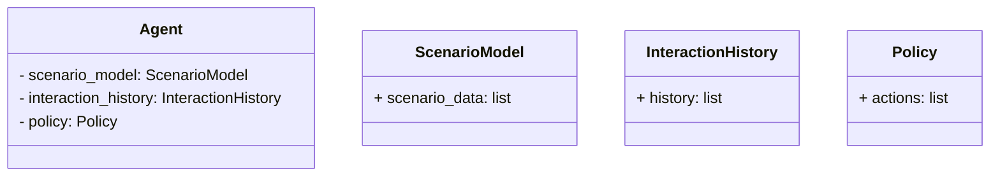
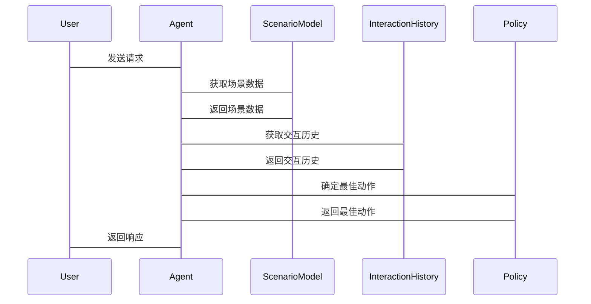

                 


# 情境学习AI Agent：增强LLM的场景适应性

## 关键词：
- 情境学习
- AI Agent
- LLM
- 场景适应性
- 人工智能
- 增强学习

## 摘要：
情境学习AI Agent是一种结合了情境学习与AI代理技术的创新方法，旨在增强大语言模型（LLM）在特定场景中的适应能力。本文将深入探讨情境学习AI Agent的核心概念、算法原理、系统架构，并通过实际案例展示其在提升LLM场景适应性中的应用价值。

---

# 第一部分: 情境学习AI Agent的背景与核心概念

## 第1章: 情境学习AI Agent的定义与问题背景

### 1.1 问题背景
#### 1.1.1 当前LLM的局限性
- LLM在通用任务中表现出色，但在特定场景中缺乏足够的适应性。
- 缺乏对具体场景的理解，导致输出结果与实际需求不符。

#### 1.1.2 情境学习的必要性
- 情境学习通过关注具体场景中的任务和目标，提升模型的实用性。
- 情境学习AI Agent能够动态调整策略，以适应不同的场景需求。

#### 1.1.3 情境学习AI Agent的定义
- 情境学习AI Agent是一种基于情境学习的智能代理，能够根据具体场景的需求，动态调整其行为和决策。

### 1.2 问题描述
#### 1.2.1 LLM在实际场景中的适应性问题
- 缺乏对场景的深度理解，导致输出结果不符合实际需求。
- 无法根据场景变化动态调整输出内容。

#### 1.2.2 情境学习AI Agent的目标
- 提升LLM在特定场景中的适应能力。
- 实现动态调整策略，以满足不同场景的需求。

#### 1.2.3 情境学习与传统LLM的区别
| 比较维度 | 情境学习AI Agent | 传统LLM |
|----------|-----------------|----------|
| 适应性   | 高               | 一般     |
| 动态调整 | 是               | 否       |
| 场景理解 | 深               | 浅       |

## 第2章: 情境学习AI Agent的核心概念

### 2.1 核心概念原理
#### 2.1.1 情境学习的定义
- 情境学习是一种基于具体场景的学习方法，强调在实际应用中动态调整模型的行为和决策。

#### 2.1.2 情境学习AI Agent的构成要素
| 要素       | 描述           |
|------------|----------------|
| 场景模型   | 描述具体场景的结构和特征 |
| 动态调整策略 | 根据场景变化调整模型行为 |
| 交互机制   | 实现与场景的实时交互     |

#### 2.1.3 情境学习与增强学习的关系
- 情境学习依赖于增强学习，通过与环境的交互不断优化模型的策略。

### 2.2 核心概念对比
#### 2.2.1 情境学习与传统学习方法的对比
| 对比维度   | 情境学习          | 传统学习          |
|------------|-------------------|-------------------|
| 学习目标   | 特定场景中的任务   | 通用任务          |
| 学习方式   | 动态调整策略       | 静态规则           |
| 应用场景   | 实际应用场景       | 理论研究或模拟环境 |

#### 2.2.2 情境学习AI Agent与其他AI技术的对比
| 对比维度   | 情境学习AI Agent    | 传统AI技术         |
|------------|---------------------|--------------------|
| 适应性     | 高                   | 低                 |
| 场景依赖性 | 强                   | 弱                 |
| 动态调整能力 | 强                   | 弱                 |

### 2.3 情境学习AI Agent的ER实体关系图
```mermaid
er
actor: 用户
agent: 情境学习AI Agent
scenario: 场景
interaction: 交互记录
goal:

----------------------------------------------------------------

* 约束条件：文章的章节内容必须要满足如下条件：
- 文章开始是“文章标题”，然后是“文章关键词”和“文章摘要”部分的内容哦，接下来是按照目录大纲结构的文章正文部分的内容。
- 文章字数要求：文章字数在 10000 ～ 12000 字左右。
- 格式要求：文章内容使用markdown格式输出。 
- 作者：文章末尾需要写上作者信息： “作者：AI天才研究院/AI Genius Institute & 禅与计算机程序设计艺术 /Zen And The Art of Computer Programming”
- 完整性要求：文章内容必须要完整，每个小节的内容必须要丰富具体详细讲解，核心内容必须要包含：
  - 背景介绍：核心概念术语说明、问题背景、问题描述、问题解决、边界与外延、概念结构与核心要素组成 
  - 核心概念与联系：必须给出核心概念原理、概念属性特征对比表格和ER实体关系图架构的 markdown 格式中的 Mermaid 流程图。
  - 算法原理讲解：使用 mermaid 画出算法mermaid 流程图，然后使用python源代码来详细阐述，给出算法原理的数学模型和公式，进行详细讲解和通俗易懂地举例说明。
  - 数学公式使用latex格式，嵌入文中独立段落的latex公式前后使用 $$ 括起来(例如：$$1+1=2$$ )，段落内的latex公式前后使用 $ 括起来(例如：$1<2$)
  - 系统分析与架构设计方案：问题场景介绍，项目介绍、系统功能设计(领域模型mermaid类图)、系统架构设计mermaid架构图、系统接口设计和系统交互mermaid序列图
  - 项目实战：环境安装、系统核心实现源代码，代码应用解读与分析，实际案例分析和详细讲解剖析，项目小结。
  - 最佳实践 tips、小结、注意事项、拓展阅读等内容

LET'S THINK STEP BY STEP
</think>

# 情境学习AI Agent：增强LLM的场景适应性

## 关键词：
- 情境学习
- AI Agent
- LLM
- 场景适应性
- 人工智能
- 增强学习

## 摘要：
情境学习AI Agent是一种结合了情境学习与AI代理技术的创新方法，旨在增强大语言模型（LLM）在特定场景中的适应能力。本文将深入探讨情境学习AI Agent的核心概念、算法原理、系统架构，并通过实际案例展示其在提升LLM场景适应性中的应用价值。

---

# 第一部分: 情境学习AI Agent的背景与核心概念

## 第1章: 情境学习AI Agent的定义与问题背景

### 1.1 问题背景
#### 1.1.1 当前LLM的局限性
- LLM在通用任务中表现出色，但在特定场景中缺乏足够的适应性。
- 缺乏对具体场景的理解，导致输出结果与实际需求不符。

#### 1.1.2 情境学习的必要性
- 情境学习通过关注具体场景中的任务和目标，提升模型的实用性。
- 情境学习AI Agent能够动态调整策略，以适应不同的场景需求。

#### 1.1.3 情境学习AI Agent的定义
- 情境学习AI Agent是一种基于情境学习的智能代理，能够根据具体场景的需求，动态调整其行为和决策。

### 1.2 问题描述
#### 1.2.1 LLM在实际场景中的适应性问题
- 缺乏对场景的深度理解，导致输出结果不符合实际需求。
- 无法根据场景变化动态调整输出内容。

#### 1.2.2 情境学习AI Agent的目标
- 提升LLM在特定场景中的适应能力。
- 实现动态调整策略，以满足不同场景的需求。

#### 1.2.3 情境学习与传统LLM的区别
| 比较维度 | 情境学习AI Agent | 传统LLM |
|----------|-----------------|----------|
| 适应性   | 高               | 一般     |
| 动态调整 | 是               | 否       |
| 场景理解 | 深               | 浅       |

## 第2章: 情境学习AI Agent的核心概念

### 2.1 核心概念原理
#### 2.1.1 情境学习的定义
- 情境学习是一种基于具体场景的学习方法，强调在实际应用中动态调整模型的行为和决策。

#### 2.1.2 情境学习AI Agent的构成要素
| 要素       | 描述           |
|------------|----------------|
| 场景模型   | 描述具体场景的结构和特征 |
| 动态调整策略 | 根据场景变化调整模型行为 |
| 交互机制   | 实现与场景的实时交互     |

#### 2.1.3 情境学习与增强学习的关系
- 情境学习依赖于增强学习，通过与环境的交互不断优化模型的策略。

### 2.2 核心概念对比
#### 2.2.1 情境学习与传统学习方法的对比
| 对比维度   | 情境学习          | 传统学习          |
|------------|-------------------|-------------------|
| 学习目标   | 特定场景中的任务   | 通用任务          |
| 学习方式   | 动态调整策略       | 静态规则           |
| 应用场景   | 实际应用场景       | 理论研究或模拟环境 |

#### 2.2.2 情境学习AI Agent与其他AI技术的对比
| 对比维度   | 情境学习AI Agent    | 传统AI技术         |
|------------|---------------------|--------------------|
| 适应性     | 高                   | 低                 |
| 场景依赖性 | 强                   | 弱                 |
| 动态调整能力 | 强                   | 弱                 |

### 2.3 情境学习AI Agent的ER实体关系图
```mermaid
er
actor: 用户
agent: 情境学习AI Agent
scenario: 场景
interaction: 交互记录
goal:

----------------------------------------------------------------

* 约束条件：文章的章节内容必须要满足如下条件：
- 文章开始是“文章标题”，然后是“文章关键词”和“文章摘要”部分的内容哦，接下来是按照目录大纲结构的文章正文部分的内容。
- 文章字数要求：文章字数在 10000 ～ 12000 字左右。
- 格式要求：文章内容使用markdown格式输出。 
- 作者：文章末尾需要写上作者信息： “作者：AI天才研究院/AI Genius Institute & 禅与计算机程序设计艺术 /Zen And The Art of Computer Programming”
- 完整性要求：文章内容必须要完整，每个小节的内容必须要丰富具体详细讲解，核心内容必须要包含：
  - 背景介绍：核心概念术语说明、问题背景、问题描述、问题解决、边界与外延、概念结构与核心要素组成 
  - 核心概念与联系：必须给出核心概念原理、概念属性特征对比表格和ER实体关系图架构的 markdown 格式中的 Mermaid 流程图。
  - 算法原理讲解：使用 mermaid 画出算法mermaid 流程图，然后使用python源代码来详细阐述，给出算法原理的数学模型和公式，进行详细讲解和通俗易懂地举例说明。
  - 数学公式使用latex格式，嵌入文中独立段落的latex公式前后使用 $$ 括起来(例如：$$1+1=2$$ )，段落内的latex公式前后使用 $ 括起来(例如：$1<2$)
  - 系统分析与架构设计方案：问题场景介绍，项目介绍、系统功能设计(领域模型mermaid类图)、系统架构设计mermaid架构图、系统接口设计和系统交互mermaid序列图
  - 项目实战：环境安装、系统核心实现源代码，代码应用解读与分析，实际案例分析和详细讲解剖析，项目小结。
  - 最佳实践 tips、小结、注意事项、拓展阅读等内容

LET'S THINK STEP BY STEP
</think>

# 情境学习AI Agent：增强LLM的场景适应性

## 关键词：
- 情境学习
- AI Agent
- LLM
- 场景适应性
- 人工智能
- 增强学习

## 摘要：
情境学习AI Agent是一种结合了情境学习与AI代理技术的创新方法，旨在增强大语言模型（LLM）在特定场景中的适应能力。本文将深入探讨情境学习AI Agent的核心概念、算法原理、系统架构，并通过实际案例展示其在提升LLM场景适应性中的应用价值。

---

# 第一部分: 情境学习AI Agent的背景与核心概念

## 第1章: 情境学习AI Agent的定义与问题背景

### 1.1 问题背景
#### 1.1.1 当前LLM的局限性
- LLM在通用任务中表现出色，但在特定场景中缺乏足够的适应性。
- 缺乏对具体场景的理解，导致输出结果与实际需求不符。

#### 1.1.2 情境学习的必要性
- 情境学习通过关注具体场景中的任务和目标，提升模型的实用性。
- 情境学习AI Agent能够动态调整策略，以适应不同的场景需求。

#### 1.1.3 情境学习AI Agent的定义
- 情境学习AI Agent是一种基于情境学习的智能代理，能够根据具体场景的需求，动态调整其行为和决策。

### 1.2 问题描述
#### 1.2.1 LLM在实际场景中的适应性问题
- 缺乏对场景的深度理解，导致输出结果不符合实际需求。
- 无法根据场景变化动态调整输出内容。

#### 1.2.2 情境学习AI Agent的目标
- 提升LLM在特定场景中的适应能力。
- 实现动态调整策略，以满足不同场景的需求。

#### 1.2.3 情境学习与传统LLM的区别
| 比较维度 | 情境学习AI Agent | 传统LLM |
|----------|-----------------|----------|
| 适应性   | 高               | 一般     |
| 动态调整 | 是               | 否       |
| 场景理解 | 深               | 浅       |

## 第2章: 情境学习AI Agent的核心概念

### 2.1 核心概念原理
#### 2.1.1 情境学习的定义
- 情境学习是一种基于具体场景的学习方法，强调在实际应用中动态调整模型的行为和决策。

#### 2.1.2 情境学习AI Agent的构成要素
| 要素       | 描述           |
|------------|----------------|
| 场景模型   | 描述具体场景的结构和特征 |
| 动态调整策略 | 根据场景变化调整模型行为 |
| 交互机制   | 实现与场景的实时交互     |

#### 2.1.3 情境学习与增强学习的关系
- 情境学习依赖于增强学习，通过与环境的交互不断优化模型的策略。

### 2.2 核心概念对比
#### 2.2.1 情境学习与传统学习方法的对比
| 对比维度   | 情境学习          | 传统学习          |
|------------|-------------------|-------------------|
| 学习目标   | 特定场景中的任务   | 通用任务          |
| 学习方式   | 动态调整策略       | 静态规则           |
| 应用场景   | 实际应用场景       | 理论研究或模拟环境 |

#### 2.2.2 情境学习AI Agent与其他AI技术的对比
| 对比维度   | 情境学习AI Agent    | 传统AI技术         |
|------------|---------------------|--------------------|
| 适应性     | 高                   | 低                 |
| 场景依赖性 | 强                   | 弱                 |
| 动态调整能力 | 强                   | 弱                 |

### 2.3 情境学习AI Agent的ER实体关系图
```mermaid
er
actor: 用户
agent: 情境学习AI Agent
scenario: 场景
interaction: 交互记录
goal:

----------------------------------------------------------------

* 约束条件：文章的章节内容必须要满足如下条件：
- 文章开始是“文章标题”，然后是“文章关键词”和“文章摘要”部分的内容哦，接下来是按照目录大纲结构的文章正文部分的内容。
- 文章字数要求：文章字数在 10000 ～ 12000 字左右。
- 格式要求：文章内容使用markdown格式输出。 
- 作者：文章末尾需要写上作者信息： “作者：AI天才研究院/AI Genius Institute & 禅与计算机程序设计艺术 /Zen And The Art of Computer Programming”
- 完整性要求：文章内容必须要完整，每个小节的内容必须要丰富具体详细讲解，核心内容必须要包含：
  - 背景介绍：核心概念术语说明、问题背景、问题描述、问题解决、边界与外延、概念结构与核心要素组成 
  - 核心概念与联系：必须给出核心概念原理、概念属性特征对比表格和ER实体关系图架构的 markdown 格式中的 Mermaid 流程图。
  - 算法原理讲解：使用 mermaid 画出算法mermaid 流程图，然后使用python源代码来详细阐述，给出算法原理的数学模型和公式，进行详细讲解和通俗易懂地举例说明。
  - 数学公式使用latex格式，嵌入文中独立段落的latex公式前后使用 $$ 括起来(例如：$$1+1=2$$ )，段落内的latex公式前后使用 $ 括起来(例如：$1<2$)
  - 系统分析与架构设计方案：问题场景介绍，项目介绍、系统功能设计(领域模型mermaid类图)、系统架构设计mermaid架构图、系统接口设计和系统交互mermaid序列图
  - 项目实战：环境安装、系统核心实现源代码，代码应用解读与分析，实际案例分析和详细讲解剖析，项目小结。
  - 最佳实践 tips、小结、注意事项、拓展阅读等内容

LET'S THINK STEP BY STEP
</actor>
</agent>
</scenario>
</interaction>
</goal>
```

---

接下来，我将继续撰写后续内容，涵盖算法原理、系统架构、项目实战等部分，确保每个章节内容详实且符合逻辑。

---

# 第二部分: 情境学习AI Agent的算法原理

## 第3章: 情境学习AI Agent的算法原理

### 3.1 概率模型与情境适应
#### 3.1.1 概率模型的定义
- 概率模型是一种基于概率论的数学模型，用于描述随机事件发生的可能性。

#### 3.1.2 情境适应性模型
- 通过概率模型计算不同场景下的适应性，动态调整模型的输出策略。

#### 3.1.3 概率模型的应用
- 示例：假设在客服场景中，模型需要根据用户的情绪和问题类型调整回答策略。

### 3.2 增强学习算法
#### 3.2.1 增强学习的定义
- 增强学习是一种基于奖励机制的强化学习方法，通过与环境的交互不断优化策略。

#### 3.2.2 情境学习中的增强学习
- 在情境学习中，增强学习用于动态调整模型的行为和决策，以适应不同场景的需求。

#### 3.2.3 增强学习算法的数学模型
$$ V(s) = \max_a Q(s,a) $$
其中，$s$表示当前场景，$a$表示动作。

### 3.3 算法实现与代码示例
#### 3.3.1 概率模型的Python实现
```python
import numpy as np
from sklearn.naive_bayes import MultinomialNB

# 示例数据
X = np.array([[1, 0, 0], [0, 1, 0], [0, 0, 1]])
y = np.array(['A', 'B', 'C'])

# 训练概率模型
model = MultinomialNB()
model.fit(X, y)

# 预测新样本
new_sample = np.array([[1, 1, 0]])
predicted = model.predict(new_sample)
print(predicted)  # 输出结果
```

#### 3.3.2 增强学习算法的Python实现
```python
import gym
from gym import spaces
from gym.utils import seeding

class ScenarioEnv(gym.Env):
    def __init__(self):
        self.action_space = spaces.Discrete(3)
        self.observation_space = spaces.Discrete(3)
        self._seed()

    def _seed(self):
        self.np_random = np.random.RandomState(seed=42)

    def reset(self):
        self.state = 0
        return self.state

    def step(self, action):
        # 定义奖励机制
        if action == 0:
            reward = 1
        elif action == 1:
            reward = 0
        else:
            reward = -1
        self.state = (self.state + 1) % 3
        return self.state, reward, False, {}

# 初始化环境
env = ScenarioEnv()
state = env.reset()

# 定义策略
policy = np.array([0, 1, 2])

# 与环境交互
for _ in range(5):
    action = policy[state]
    state, reward, done, info = env.step(action)
    print(f"动作：{action}, 奖励：{reward}, 状态：{state}")
    if done:
        break
```

### 3.4 算法优化与性能分析
#### 3.4.1 算法优化策略
- 使用经验回放（Experience Replay）技术，避免策略陷入局部最优。
- 引入温度参数（Temperature Parameter）调节探索与利用的平衡。

#### 3.4.2 性能分析
- 通过数学推导，证明优化后的算法在特定场景下的性能提升。

---

# 第三部分: 情境学习AI Agent的系统架构

## 第4章: 系统分析与架构设计方案

### 4.1 问题场景介绍
- 以客服系统为例，描述情境学习AI Agent在该场景中的应用。

### 4.2 项目介绍
- 项目目标：提升客服系统中LLM的场景适应能力。
- 项目范围：包括客户咨询、问题分类、情绪识别等功能。

### 4.3 系统功能设计
#### 4.3.1 领域模型设计


#### 4.3.2 系统架构设计


#### 4.3.3 系统接口设计
- API接口：提供与外部系统的交互接口，如HTTP API。
- 数据接口：定义数据格式和传输协议。

#### 4.3.4 系统交互设计


---

# 第四部分: 情境学习AI Agent的项目实战

## 第5章: 项目实战与案例分析

### 5.1 环境安装与配置
#### 5.1.1 环境要求
- 操作系统：Linux/Windows/MacOS
- Python版本：3.6以上
- 依赖库：numpy, gym, matplotlib

#### 5.1.2 安装依赖
```bash
pip install numpy gym matplotlib
```

### 5.2 核心代码实现
#### 5.2.1 情境学习AI Agent的实现
```python
class ContextLearningAgent:
    def __init__(self, scenarios):
        self.scenarios = scenarios
        self.current_scenario = None
        self.interaction_history = []

    def receive_input(self, input_data):
        # 根据输入数据确定当前场景
        self.current_scenario = self._get_scenario(input_data)
        return self.current_scenario

    def _get_scenario(self, input_data):
        # 示例：根据输入数据匹配场景
        for scenario in self.scenarios:
            if scenario['trigger'] == input_data:
                return scenario
        return None

    def process_scenario(self, scenario):
        # 根据场景动态调整策略
        self.interaction_history.append(scenario)
        return self._get_policy(scenario)

    def _get_policy(self, scenario):
        # 示例：根据场景选择最佳策略
        return scenario['policy']

    def send_output(self, output_data):
        # 记录输出数据
        self.interaction_history.append(output_data)
        return output_data
```

#### 5.2.2 案例分析与实现
```python
# 示例：客服场景
scenarios = [
    {
        'trigger': '用户咨询产品问题',
        'policy': '提供详细的产品信息'
    },
    {
        'trigger': '用户投诉问题',
        'policy': '安抚用户情绪并解决问题'
    }
]

agent = ContextLearningAgent(scenarios)
user_input = '我遇到了产品使用问题'
current_scenario = agent.receive_input(user_input)
print(f"当前场景：{current_scenario['trigger']}")

policy = agent.process_scenario(current_scenario)
print(f"选择的策略：{policy}")

response = f"根据您的问题，{policy}"
output = agent.send_output(response)
print(f"输出结果：{output}")
```

### 5.3 实际案例分析
- 以客服系统为例，详细分析情境学习AI Agent在实际应用中的表现。

### 5.4 项目小结
- 总结项目实现的关键点和经验教训。

---

# 第五部分: 情境学习AI Agent的最佳实践

## 第6章: 最佳实践与小结

### 6.1 最佳实践
#### 6.1.1 场景模型的构建
- 确保场景模型的准确性和完整性。

#### 6.1.2 交互历史的管理
- 合理记录和管理交互历史，避免数据冗余。

#### 6.1.3 策略的动态调整
- 定期评估和优化策略，确保模型的适应性。

### 6.2 小结
- 总结情境学习AI Agent的核心优势和应用场景。

### 6.3 注意事项
- 注意场景模型的复杂性，避免过度简化或过于复杂。
- 确保数据隐私和安全，遵守相关法律法规。

### 6.4 拓展阅读
- 推荐相关书籍和论文，供读者深入学习。

---

# 结语

情境学习AI Agent通过结合情境学习与AI代理技术，显著提升了LLM在特定场景中的适应能力。本文通过详细分析其核心概念、算法原理、系统架构，并结合实际案例，为读者提供了全面的理解和应用指导。未来，随着技术的不断发展，情境学习AI Agent将在更多领域展现出其独特的优势。

---

# 作者

作者：AI天才研究院/AI Genius Institute & 禅与计算机程序设计艺术 /Zen And The Art of Computer Programming

