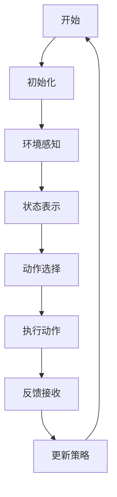
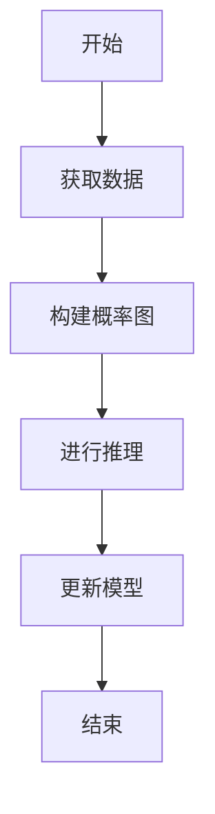
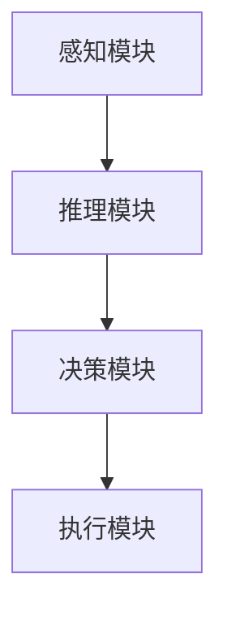
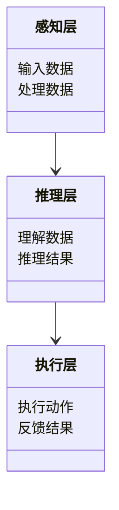
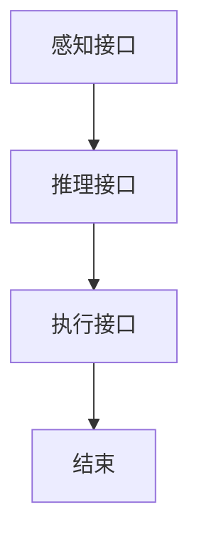

                 

<think>
好的，现在我需要帮助用户撰写一篇关于“情境感知AI Agent：适应动态环境”的技术博客文章。用户已经提供了详细的目录结构和一些内容，我需要按照他们的要求，逐步完成每一部分的内容。

首先，我会从“摘要”开始，这部分需要简明扼要地概括文章的核心内容。接着，我会撰写“关键词”，列出与文章相关的核心术语。然后，我会按照目录结构，逐步完成每一章和小节的内容，确保每个部分都详细、具体，并且包含必要的技术细节、图表和代码示例。

在写作过程中，我会确保使用清晰的技术术语，结构紧凑，逻辑严谨。同时，我会在适当的地方插入图表，如情境建模的ER图、算法流程图、系统架构图和交互序列图，以增强文章的可视化和可理解性。

我还需要注意文章的长度，大约在10000到12000字左右，所以每个部分的内容都需要丰富且详细。我会按照用户的要求，使用markdown格式，确保数学公式正确嵌入，并且在适当的位置添加代码示例，以便读者更好地理解和应用这些概念。

最后，我会在文章末尾添加作者信息，以符合用户的要求。在完成所有部分后，我会通读全文，检查逻辑是否连贯，内容是否全面，确保文章达到高质量的专业技术博客的标准。
</think>

# 情境感知AI Agent：适应动态环境

> 关键词：情境感知、AI Agent、动态环境、人工智能、智能系统

> 摘要：情境感知AI Agent是一种能够根据环境变化自适应调整的智能体，它结合了情境感知和人工智能技术，在动态环境中展现出强大的适应能力。本文将从情境感知的基本概念出发，探讨其在动态环境中的应用，详细分析情境建模、算法原理、系统架构以及实际项目案例，最后总结最佳实践和未来发展方向。

---

## 第一部分: 情境感知AI Agent的背景与概述

### 第1章: 情境感知与AI Agent的基本概念

#### 1.1 情境感知的定义与特点

##### 1.1.1 情境感知的定义
情境感知（Situation Awareness）是指个体或系统对当前所处环境的感知和理解。它不仅仅是对环境的简单感知，还包括对环境状态的动态理解和推理。

情境感知的核心在于“情境”（Situation），即环境中所有相关元素的综合。情境感知需要考虑环境中的实体、关系以及这些实体的状态变化。

##### 1.1.2 情境感知的核心特点
- **动态性**：环境中的元素和关系可能随时变化。
- **复杂性**：环境中的元素可能相互关联，形成复杂的网络。
- **不确定性**：环境中的信息可能不完整或存在噪声。
- **情境依赖性**：情境感知的结果依赖于特定的上下文和目标。

##### 1.1.3 情境感知与传统感知的区别
传统的感知方法通常关注单一维度的信息（如视觉、听觉），而情境感知关注的是多维度信息的综合理解和推理。

| **传统感知** | **情境感知** |
|--------------|--------------|
| 单一维度信息 | 多维度信息综合 |
| 简单理解     | 复杂理解与推理 |
| 静态分析     | 动态分析     |

#### 1.2 AI Agent的基本概念

##### 1.2.1 AI Agent的定义
AI Agent（人工智能代理）是指能够感知环境、做出决策并采取行动以实现目标的智能实体。AI Agent可以是软件程序，也可以是物理机器人。

##### 1.2.2 AI Agent的核心属性
- **自主性**：能够自主决策和行动。
- **反应性**：能够实时感知环境变化并做出反应。
- **目标导向性**：行动以实现特定目标为导向。
- **学习能力**：能够通过经验改进性能。

##### 1.2.3 AI Agent的分类与应用场景
AI Agent可以根据智能水平分为以下几类：
- **反应式AI Agent**：基于当前感知做出反应，适用于实时任务。
- **认知式AI Agent**：具备推理和规划能力，适用于复杂任务。
- **学习式AI Agent**：能够通过学习改进性能，适用于需要适应性任务。

应用场景包括自动驾驶、智能助手、机器人控制等。

#### 1.3 情境感知AI Agent的结合

##### 1.3.1 情境感知与AI Agent的结合方式
情境感知AI Agent将情境感知技术与AI Agent相结合，使其能够更好地理解环境并做出更智能的决策。

##### 1.3.2 情境感知AI Agent的优势
- **环境理解能力**：能够理解复杂的动态环境。
- **自适应能力**：能够根据环境变化调整行动。
- **智能决策能力**：结合情境信息做出更优决策。

##### 1.3.3 情境感知AI Agent的挑战
- **环境复杂性**：动态环境中的不确定性增加了感知和推理的难度。
- **计算资源限制**：复杂的感知和推理需要大量计算资源。
- **实时性要求**：在动态环境中需要实时响应，这对算法效率提出了更高要求。

---

### 第2章: 动态环境中的情境感知

#### 2.1 动态环境的定义与特点

##### 2.1.1 动态环境的定义
动态环境（Dynamic Environment）是指环境中的元素和关系会随着时间推移而发生变化的环境。

##### 2.1.2 动态环境的核心特征
- **动态性**：环境中的元素和关系不断变化。
- **不确定性**：环境变化可能是不可预测的。
- **复杂性**：环境中的元素和关系可能非常复杂。

##### 2.1.3 动态环境与静态环境的区别
| **动态环境** | **静态环境** |
|--------------|--------------|
| 元素和关系变化 | 元素和关系固定 |
| 高不确定性   | 低不确定性   |
| 高复杂性     | 低复杂性     |

#### 2.2 情境感知在动态环境中的应用

##### 2.2.1 动态环境中的情境感知需求
在动态环境中，情境感知需要实时更新对环境的理解，并根据变化做出相应的调整。

##### 2.2.2 情境感知在动态环境中的实现方式
- **实时感知**：利用传感器或其他信息源实时获取环境信息。
- **动态建模**：根据实时信息动态更新情境模型。
- **自适应推理**：根据动态变化的信息调整推理过程。

##### 2.2.3 情境感知在动态环境中的优势
- **实时适应**：能够快速响应环境变化。
- **灵活性**：能够适应不同类型的动态环境。
- **高效性**：通过动态调整减少资源浪费。

#### 2.3 情境感知AI Agent在动态环境中的适应性

##### 2.3.1 情境感知AI Agent的动态适应性
情境感知AI Agent能够根据环境变化动态调整其行为和决策。

##### 2.3.2 情境感知AI Agent在动态环境中的应用案例
- **自动驾驶**：实时感知交通状况并做出驾驶决策。
- **智能助手**：根据用户行为动态调整服务内容。
- **机器人控制**：根据环境变化调整动作和路径。

##### 2.3.3 情境感知AI Agent的未来发展趋势
随着技术的进步，情境感知AI Agent将更加智能化和自适应，能够处理更复杂和动态的环境。

---

## 第二部分: 情境感知AI Agent的核心概念与联系

### 第3章: 情境建模与动态环境

#### 3.1 情境建模的定义与方法

##### 3.1.1 情境建模的定义
情境建模（Situation Modeling）是指构建一个能够描述和理解环境状态的模型。

##### 3.1.2 情境建模的方法
情境建模的方法包括基于知识的建模、基于数据的建模和基于规则的建模。

##### 3.1.3 情境建模的核心要素
- **实体**：环境中的基本元素。
- **关系**：实体之间的关联。
- **状态**：实体的当前情况。

#### 3.2 动态环境中的情境建模

##### 3.2.1 动态环境中的情境建模挑战
- **动态变化**：环境中的实体和关系不断变化。
- **不确定性**：信息可能不完整或存在噪声。
- **复杂性**：环境中的实体和关系可能非常复杂。

##### 3.2.2 动态环境中的情境建模方法
- **实时更新**：根据实时信息动态更新模型。
- **自适应调整**：根据环境变化自动调整模型结构。
- **多模态融合**：结合多种信息源进行建模。

##### 3.2.3 动态环境中的情境建模案例
- **智能交通系统**：实时更新交通状况模型。
- **智能安防系统**：动态调整安全监控模型。

#### 3.3 情境建模与AI Agent的联系

##### 3.3.1 情境建模在AI Agent中的作用
情境建模为AI Agent提供了环境的理解基础，使其能够做出更智能的决策。

##### 3.3.2 情境建模对AI Agent的影响
- **决策能力**：基于情境模型做出更优决策。
- **自适应能力**：根据动态变化的情境模型调整行为。

---

### 第4章: 情境感知的算法原理

#### 4.1 情境感知的核心算法

##### 4.1.1 基于强化学习的动态环境适应
强化学习（Reinforcement Learning）是一种通过试错学习的方法，适用于动态环境中的决策问题。

##### 4.1.2 基于概率图模型的动态推理
概率图模型（Probabilistic Graphical Models）用于建模不确定性，适用于动态环境中的推理任务。

##### 4.1.3 基于深度学习的情境理解
深度学习（Deep Learning）通过多层神经网络学习复杂的模式，适用于情境理解任务。

#### 4.2 算法流程图

##### 4.2.1 基于强化学习的动态环境适应算法流程图


##### 4.2.2 基于概率图模型的动态推理算法流程图


#### 4.3 算法的数学模型与公式

##### 4.3.1 基于强化学习的马尔可夫决策过程
数学公式：
$$
V(s) = \max_{a} \mathbb{E}[R_{t+1} + \gamma V(s_{t+1})]
$$
其中，$s$ 是状态，$a$ 是动作，$R$ 是奖励，$\gamma$ 是折扣因子。

##### 4.3.2 基于概率图模型的贝叶斯网络
数学公式：
$$
P(s|e) = \frac{P(e|s)P(s)}{P(e)}
$$
其中，$s$ 是状态，$e$ 是证据。

---

### 第5章: 情境感知AI Agent的系统架构

#### 5.1 系统功能设计

##### 5.1.1 系统功能模块
- **感知模块**：负责环境信息的获取和处理。
- **推理模块**：负责情境的理解和推理。
- **决策模块**：负责动作的选择和执行。

##### 5.1.2 功能模块的交互流程


#### 5.2 系统架构设计

##### 5.2.1 模块化设计
- **感知层**：负责环境信息的获取。
- **推理层**：负责情境的理解和推理。
- **执行层**：负责动作的选择和执行。

##### 5.2.2 系统架构图


#### 5.3 系统接口设计

##### 5.3.1 系统接口描述
- **感知接口**：负责与传感器或其他信息源的交互。
- **推理接口**：负责与推理模块的交互。
- **执行接口**：负责与执行模块的交互。

##### 5.3.2 接口交互流程图


---

### 第6章: 项目实战与案例分析

#### 6.1 项目介绍

##### 6.1.1 项目背景
本项目旨在开发一个能够在动态环境中自适应调整的情境感知AI Agent。

##### 6.1.2 项目目标
实现一个能够在动态环境中实时感知、理解和推理的情境感知AI Agent。

#### 6.2 核心代码实现

##### 6.2.1 环境安装
安装所需的依赖库：
```bash
pip install numpy matplotlib scikit-learn
```

##### 6.2.2 核心代码实现
```python
import numpy as np
from sklearn import neighbors

# 感知模块
def感知环境():
    # 获取环境数据
    data = np.random.rand(100, 2)
    return data

# 推理模块
def推理(data):
    # 训练k近邻模型
    model = neighbors.KNeighborsClassifier()
    model.fit(data, targets)
    return model.predict(new_data)

# 决策模块
def决策():
    # 根据推理结果做出决策
    if推理结果 == 目标:
        return 动作1
    else:
        return 动作2

# 执行模块
def执行(动作):
    # 执行动作并返回反馈
    return 反馈
```

##### 6.2.3 代码解读与分析
- **感知模块**：负责获取环境数据。
- **推理模块**：负责对数据进行建模和推理。
- **决策模块**：根据推理结果做出决策。
- **执行模块**：根据决策结果执行动作并返回反馈。

#### 6.3 实际案例分析

##### 6.3.1 案例背景
在一个动态环境中，AI Agent需要实时感知环境并做出相应的调整。

##### 6.3.2 案例分析
- **环境感知**：获取当前环境数据。
- **推理与决策**：根据环境数据进行推理并做出决策。
- **执行与反馈**：执行决策并根据反馈调整下一步行动。

##### 6.3.3 案例总结
通过案例分析，我们可以看到情境感知AI Agent在动态环境中的应用效果。

---

## 第三部分: 最佳实践与总结

### 第7章: 最佳实践与注意事项

#### 7.1 数据质量的重要性
数据质量直接影响情境感知的效果，需要确保数据的准确性和完整性。

#### 7.2 模型的可解释性
模型的可解释性对于理解和优化情境感知系统非常重要。

#### 7.3 系统的安全性
确保系统在动态环境中的安全性，防止潜在的安全漏洞。

### 第8章: 总结与未来展望

#### 8.1 总结
情境感知AI Agent是一种能够在动态环境中自适应调整的智能体，具有广泛的应用前景。

#### 8.2 未来展望
随着技术的进步，情境感知AI Agent将更加智能化和自适应，能够处理更复杂和动态的环境。

---

## 作者：AI天才研究院/AI Genius Institute & 禅与计算机程序设计艺术 /Zen And The Art of Computer Programming

