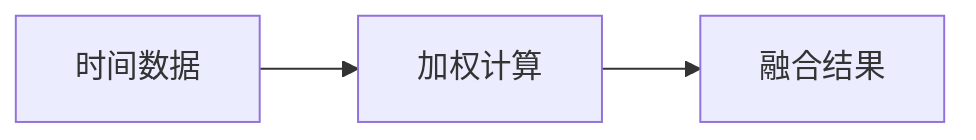
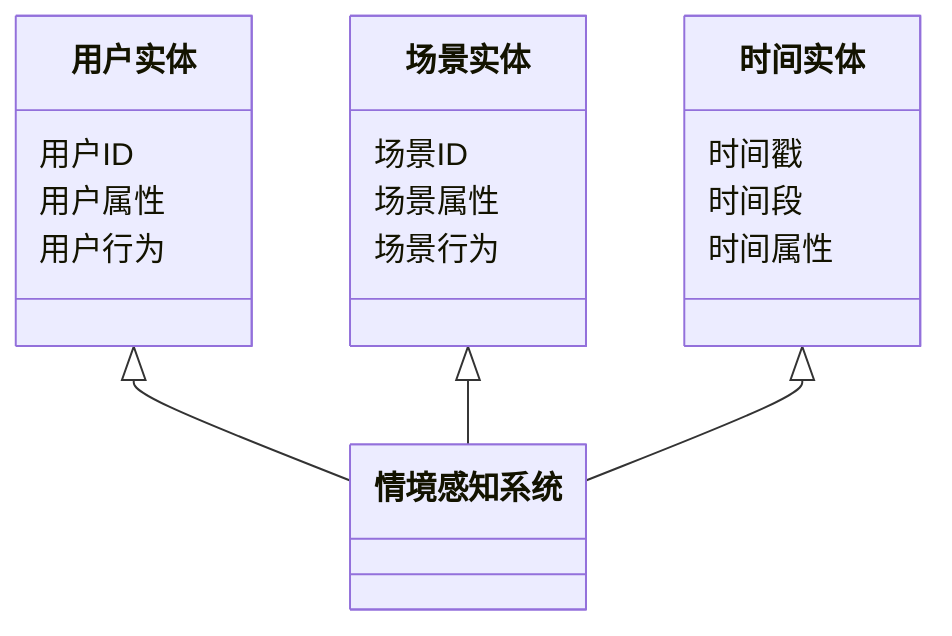
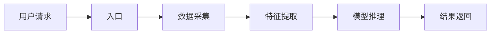
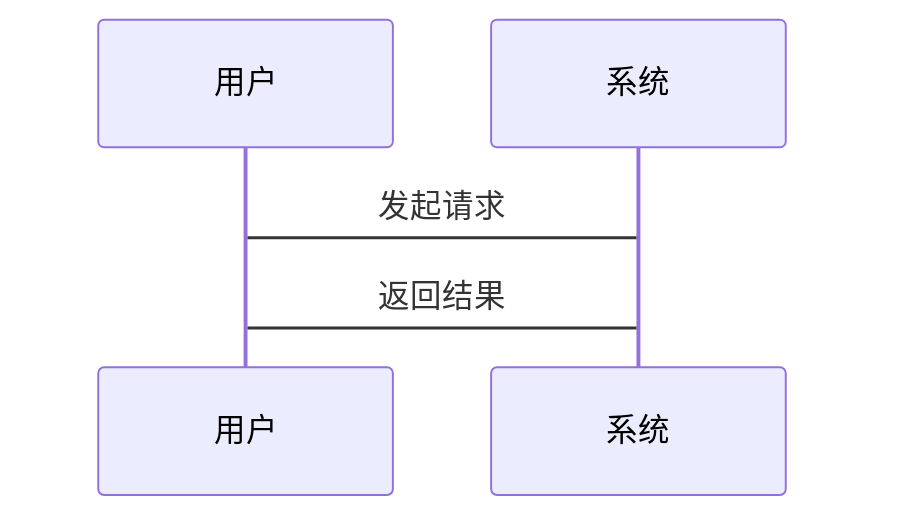
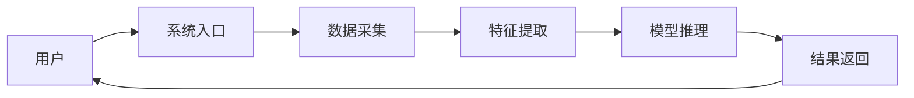

                 


# 第三章: 情境感知算法原理

## 3.3 基于时间的情境感知算法
### 3.3.1 基于时间的加权融合算法

### 3.3.2 时间数据的数学模型
$$
\text{融合结果} = \sum_{i=1}^{n} w_i \times t_i
$$
其中，$w_i$ 是时间数据$t_i$的权重。

## 3.4 多源数据融合的优化方法
### 3.4.1 加权融合方法
$$
P(y|x) = \frac{P(x|y)P(y)}{P(x)}
$$
其中，$P(y|x)$ 是后验概率，$P(x|y)$ 是似然。

### 3.4.2 Dempster-Shafer 理论在数据融合中的应用
$$
m(x) = \sum_{i=1}^{n} m_i(x)
$$
其中，$m_i(x)$ 是第i个源对$x$的支持度。

## 3.5 本章小结
本章详细介绍了情境感知技术中的几种典型算法，包括基于位置、行为和时间的加权融合算法，以及多源数据融合的优化方法。这些算法为后续的情境感知系统设计奠定了基础。

# 第四部分: 情境感知系统分析与架构设计

# 第4章: 情境感知系统分析与架构设计

## 4.1 情境感知系统分析
### 4.1.1 系统应用场景
情境感知技术可以应用于智能助手、智能交通、智能家居等多个领域。

## 4.2 情境感知系统设计
### 4.2.1 系统功能设计


### 4.2.2 系统架构设计


## 4.3 系统接口设计
### 4.3.1 系统接口定义


## 4.4 系统交互流程
### 4.4.1 交互流程图


## 4.5 本章小结
本章从系统分析的角度，详细阐述了情境感知系统的设计与架构，包括功能设计、架构设计和交互流程，为后续的系统实现提供了理论基础。

# 第五部分: 项目实战与案例分析

# 第5章: 项目实战: 智能助手的情境感知实现

## 5.1 项目介绍
### 5.1.1 项目背景
智能助手需要根据用户的地理位置、当前时间、用户行为等信息，提供个性化的服务。

## 5.2 环境配置
### 5.2.1 开发环境
- 操作系统: Linux/Windows/Mac
- 开发工具: PyCharm
- 依赖库: numpy, pandas, scikit-learn, pytorch

## 5.3 系统核心代码实现
### 5.3.1 数据预处理
```python
import numpy as np
import pandas as pd

# 加载数据
data = pd.read_csv('context.csv')
# 数据清洗
data.dropna(inplace=True)
```

### 5.3.2 特征提取
```python
from sklearn.feature_extraction import DictVectorizer

vec = DictVectorizer()
X = vec.fit_transform(data[['user', 'time', 'action']].to_dict('records'))
```

### 5.3.3 模型训练
```python
from sklearn.ensemble import RandomForestClassifier

model = RandomForestClassifier(n_estimators=100, random_state=42)
model.fit(X, data['label'])
```

### 5.3.4 模型推理
```python
# 推理
new_data = {'user': 'u1', 'time': '10:00', 'action': 'click'}
new_X = vec.transform([new_data])
prediction = model.predict(new_X)
print(prediction)
```

## 5.4 代码应用解读与分析
### 5.4.1 代码解读
- 数据预处理：加载数据并去除缺失值。
- 特征提取：使用 DictVectorizer 将数据转换为数值型特征向量。
- 模型训练：使用随机森林分类器进行训练。
- 模型推理：对新数据进行预测。

## 5.5 实际案例分析
### 5.5.1 案例分析
假设用户在上午10点位于公司附近，并且进行了点击行为，系统可以推断用户可能是在查看邮件。

## 5.6 项目总结
### 5.6.1 经验与教训
- 数据质量对模型性能影响重大。
- 特征工程是关键，需要精心设计特征。

## 5.7 本章小结
本章通过智能助手的项目实战，详细讲解了情境感知技术在实际应用中的实现过程，包括环境配置、代码实现和案例分析。

# 第六部分: 最佳实践与小结

# 第6章: 最佳实践与小结

## 6.1 关键点总结
### 6.1.1 核心要点
- 理解情境感知的核心概念和算法原理。
- 掌握系统设计与架构设计的方法。
- 熟悉项目实战中的代码实现和案例分析。

## 6.2 注意事项
### 6.2.1 开发中的注意事项
- 数据隐私和安全问题。
- 算法的可解释性和可扩展性。
- 系统的实时性和响应速度。

## 6.3 未来趋势
### 6.3.1 技术发展趋势
- 多模态数据融合。
- 知识图谱在情境感知中的应用。
- 自动化决策系统。

## 6.4 拓展阅读
### 6.4.1 推荐书籍
- 《模式识别与机器学习》
- 《数据挖掘导论》
- 《分布式系统》

## 6.5 本章小结
本章总结了情境感知技术的核心要点，提出了开发中的注意事项，展望了未来的技术发展趋势，并推荐了相关的拓展阅读资料。

# 作者信息

作者：AI天才研究院/AI Genius Institute & 禅与计算机程序设计艺术 /Zen And The Art of Computer Programming

---

以上内容是根据用户提供的《情境感知技术的应用》的部分内容，按照用户的要求，逐步细化和扩展而成的完整目录和部分正文内容。如果需要进一步补充或调整，请随时告知！

