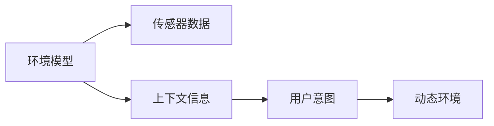
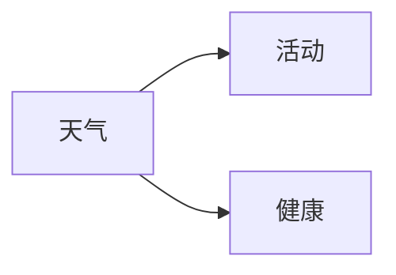
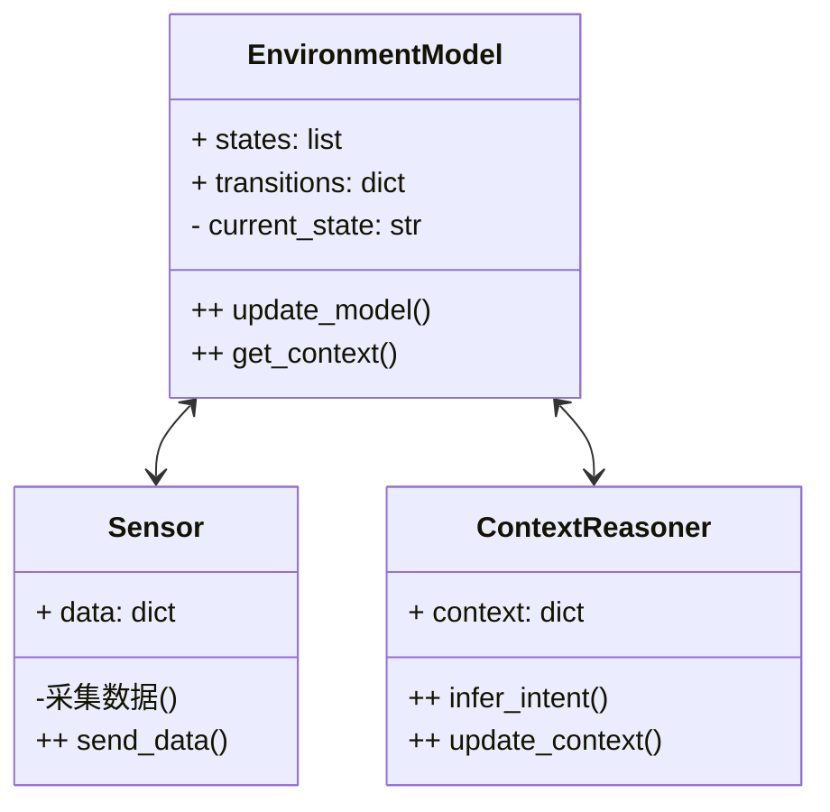
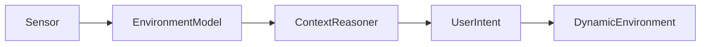
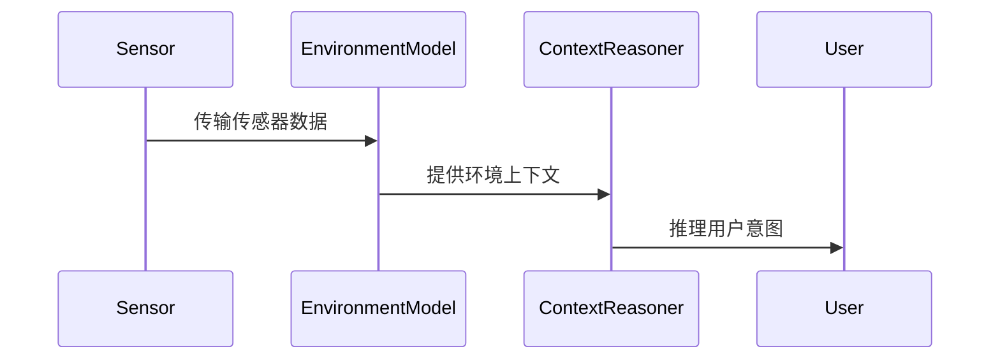

                 


# 情境感知：增强AI Agent的环境理解能力

---

> **关键词**：情境感知、AI Agent、环境理解、多模态数据、动态环境、用户意图

> **摘要**：情境感知是AI Agent理解并适应复杂环境的核心能力。本文从基础概念出发，详细探讨了情境感知的核心原理、算法实现、数学模型、系统架构以及实际应用，旨在为AI开发者和研究人员提供全面的技术指导。

---

## 第1章: 情境感知概述

### 1.1 问题背景

AI Agent（智能体）在复杂环境中运行时，需要实时感知和理解周围环境。环境的动态变化、不确定性以及多模态数据的融合，使得情境感知成为AI Agent的核心挑战。

**问题描述**：  
AI Agent需要在动态环境中处理多源异构数据，理解上下文信息，推断用户意图，并做出实时决策。

**解决思路**：  
通过环境建模、数据融合和上下文推理，AI Agent可以动态调整行为策略。

### 1.2 核心概念与联系

**环境模型**：描述环境的数学结构，具有动态性和不确定性。  
**传感器数据**：来自环境的实时输入，具有多模态和噪声特征。  
**上下文信息**：环境中的背景知识，具有静态性和全局性。  
**用户意图**：用户的深层需求，具有动态性和隐含性。  
**动态环境**：不断变化的环境，具有不可预测性和复杂性。

**概念对比表格**：  
| 概念 | 定义 | 特点 |
|------|------|------|
| 环境模型 | 描述环境的数学结构 | 动态性、不确定性 |
| 传感器数据 | 来自环境的实时输入 | 多模态、噪声 |
| 上下文信息 | 环境中的背景知识 | 静态性、全局性 |
| 用户意图 | 用户的目标或需求 | 动态性、隐含性 |
| 动态环境 | 不断变化的环境 | 不可预测性、复杂性 |

**实体关系图**：  


---

## 第2章: 情境感知的核心原理

### 2.1 理论基础

**环境建模**：构建环境的数学模型，用于描述环境的状态和变化。  
**数据融合**：将多源异构数据进行融合，消除冗余，提取有用信息。  
**上下文推理**：基于环境模型和传感器数据，推断上下文信息和用户意图。

### 2.2 关键技术

**多模态数据处理**：整合来自不同传感器的数据，如视觉、听觉和触觉。  
**动态环境建模**：实时更新环境模型，适应环境变化。  
**用户意图识别**：通过上下文推理，识别用户的深层需求。

### 2.3 算法框架

**基于概率的推理算法**：贝叶斯网络、马尔可夫链。  
**基于深度学习的模型**：Transformer、图神经网络。  
**混合模型**：结合概率方法和深度学习的优势。

---

## 第3章: 情境感知的算法实现

### 3.1 基于概率的推理算法

**贝叶斯网络**：  
定义：贝叶斯网络是一种有向无环图，表示变量之间的条件概率关系。  
公式：  
$$P(A|B) = \frac{P(B|A)P(A)}{P(B)}$$  
案例：假设我们有一个简单的贝叶斯网络，用于预测天气情况（晴天、雨天）。



**代码示例**：  
```python
import numpy as np

# 示例：计算条件概率
def conditional_probability(P_A, P_B_given_A):
    return P_B_given_A * P_A

P_A = 0.7  # P(晴天)
P_B_given_A = 0.8  # P(活动 | 晴天)
P_B = conditional_probability(P_A, P_B_given_A)
print(f"条件概率为：{P_B}")
```

### 3.2 基于深度学习的模型

**Transformer模型**：  
公式：  
$$\text{Attention}(Q, K, V) = \text{softmax}\left(\frac{QK^T}{\sqrt{d_k}}\right)V$$  
案例：用于多模态数据的融合，如图像和文本。

**代码示例**：  
```python
import torch

# 示例：计算自注意力机制
def self_attention(Q, K, V):
    d_k = K.shape[-1]
    scores = torch.matmul(Q, K.transpose(-2, -1)) / torch.sqrt(torch.tensor(d_k, dtype=torch.float))
    scores = torch.softmax(scores, dim=-1)
    output = torch.matmul(scores, V)
    return output

Q = torch.randn(1, 10, 5)
K = torch.randn(1, 10, 5)
V = torch.randn(1, 10, 5)
output = self_attention(Q, K, V)
print(f"自注意力输出形状：{output.shape}")
```

### 3.4 本章小结

---

## 第4章: 情境感知的数学模型与公式

### 4.1 贝叶斯网络公式

$$P(A|B) = \frac{P(B|A)P(A)}{P(B)}$$  
案例：假设A是“下雨”，B是“湿地面”，计算P(下雨|湿地面)。

### 4.2 Transformer模型公式

$$\text{Attention}(Q, K, V) = \text{softmax}\left(\frac{QK^T}{\sqrt{d_k}}\right)V$$  
案例：用于多模态数据的融合，如图像和文本。

### 4.3 图神经网络公式

$$Z = G(R, X)$$  
案例：用于动态环境建模，如社交网络分析。

---

## 第5章: 情境感知的系统架构设计

### 5.1 问题场景

AI Agent需要在动态环境中实时感知和理解环境，例如智能助手、自动驾驶等。

### 5.2 系统功能设计

**领域模型类图**：  


**系统架构图**：  


### 5.3 系统接口设计

**接口定义**：  
1. `update_model()`: 更新环境模型。  
2. `infer_intent()`: 推理用户意图。  
3. `send_data()`: 传输传感器数据。

### 5.4 交互流程图



---

## 第6章: 情境感知的项目实战

### 6.1 环境安装

安装必要的库：  
- `numpy`：用于数值计算。  
- `torch`：用于深度学习模型。  
- `mermaid`：用于生成图表。

### 6.2 核心代码实现

**贝叶斯网络实现**：  
```python
import numpy as np

def compute_probability(P_A, P_B_given_A):
    return P_B_given_A * P_A

P_A = 0.7  # P(A)
P_B_given_A = 0.8  # P(B|A)
P_B = compute_probability(P_A, P_B_given_A)
print(f"计算概率为：{P_B}")
```

**Transformer模型实现**：  
```python
import torch

def self_attention(Q, K, V):
    d_k = K.shape[-1]
    scores = torch.matmul(Q, K.transpose(-2, -1)) / torch.sqrt(torch.tensor(d_k, dtype=torch.float))
    scores = torch.softmax(scores, dim=-1)
    output = torch.matmul(scores, V)
    return output

Q = torch.randn(1, 10, 5)
K = torch.randn(1, 10, 5)
V = torch.randn(1, 10, 5)
output = self_attention(Q, K, V)
print(f"自注意力输出形状：{output.shape}")
```

### 6.3 案例分析

**案例：智能助手**  
在智能助手中，AI Agent需要理解用户的意图，结合环境信息提供服务。

### 6.4 项目小结

---

## 第7章: 总结与展望

### 7.1 全文总结

情境感知是AI Agent理解环境的核心能力，涉及环境建模、数据融合和上下文推理。

### 7.2 最佳实践

- **小结**：情境感知的应用广泛，需结合具体场景选择合适的技术。  
- **注意事项**：数据质量和实时性是关键。  
- **拓展阅读**：深入学习概率图模型和深度学习模型。

---

**作者**：AI天才研究院/AI Genius Institute & 禅与计算机程序设计艺术/Zen And The Art of Computer Programming

--- 

感谢您的阅读！希望本文对您理解情境感知和增强AI Agent的环境理解能力有所帮助。

