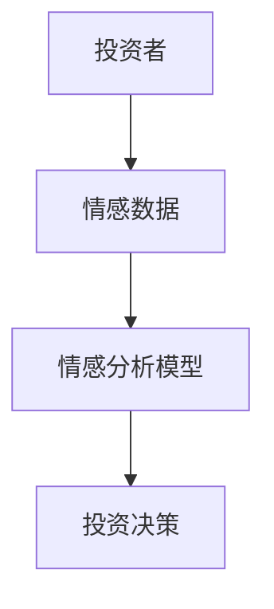
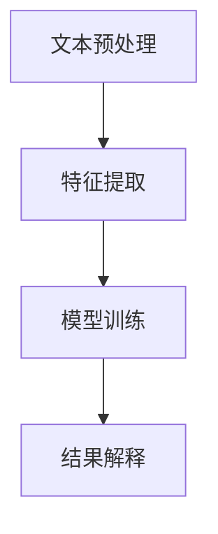
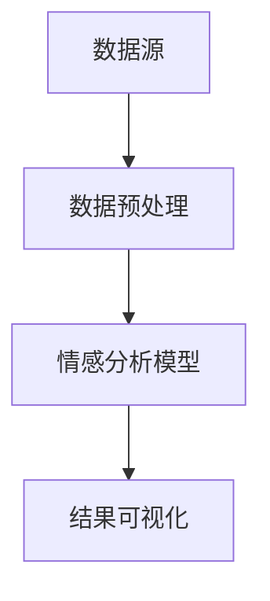

                 


# 情感分析在投资决策中的应用

> 关键词：情感分析，投资决策，自然语言处理，文本挖掘，机器学习

> 摘要：本文深入探讨了情感分析在投资决策中的应用，从理论基础到实际应用，结合算法原理、系统架构和项目实战，详细阐述了如何利用情感分析技术帮助投资者做出更明智的决策。文章还提供了丰富的代码示例、数学公式和图表，帮助读者全面理解情感分析在投资中的价值与挑战。

---

## 第一部分: 情感分析在投资决策中的应用概述

### 第1章: 情感分析的基本概念与背景

#### 1.1 情感分析的定义与背景

情感分析（Sentiment Analysis）是一种自然语言处理技术，旨在识别和分类文本中的情感倾向。在投资领域，情感分析通过分析市场参与者的情绪（如乐观、悲观、中立等），帮助投资者做出更明智的决策。例如，社交媒体上的评论、新闻标题和分析师报告中的情感倾向都可以为投资决策提供参考。

**问题背景**：金融市场中的投资者情绪往往会影响资产价格的波动。然而，投资者情绪的复杂性和不确定性使得传统定量分析方法难以捕捉其全貌。情感分析通过提取文本中的情感信息，弥补了这一缺口。

**问题描述**：本文将探讨如何利用情感分析技术，从非结构化的文本数据中提取情感信息，并将其整合到投资决策模型中。

**问题解决**：通过分析社交媒体、新闻媒体和公司财报中的情感倾向，投资者可以更好地理解市场情绪，优化投资策略。

**边界与外延**：情感分析仅关注文本中的情感倾向，不涉及其他市场因素（如宏观经济指标）。其外延包括文本挖掘、自然语言处理和机器学习技术。

**核心要素**：文本数据、情感特征、情感强度、上下文依赖性。

#### 1.2 投资决策中的情感因素

**投资者情绪对市场的影响**：投资者情绪可以通过“情绪传染”影响市场走势。例如，乐观的市场情绪可能导致股价上涨，而悲观的情绪则可能导致股价下跌。

**情感分析在投资决策中的作用**：
1. **市场情绪监测**：通过分析社交媒体和新闻媒体，实时监测市场情绪。
2. **投资策略优化**：基于市场情绪变化，调整投资组合。
3. **风险预警**：识别潜在的市场风险，提前采取应对措施。

**情感分析的局限性与挑战**：
1. **数据质量**：社交媒体数据通常存在噪声，影响分析结果。
2. **模型解释性**：复杂的情感分析模型可能难以解释其决策过程。
3. **实时性要求**：投资决策需要快速响应，对模型的实时性提出更高要求。

---

### 第2章: 情感分析的核心概念与联系

#### 2.1 情感分析的原理

**文本特征提取**：情感分析依赖于文本特征的提取。常用的方法包括词袋模型（Bag of Words）和词嵌入模型（如Word2Vec）。

**情感强度计算**：情感强度是文本中情感倾向的量化表示，通常采用情感得分（如-1到1之间的值）。

**上下文依赖性分析**：情感分析需要考虑文本的上下文，例如否定词或语气助词可能改变情感倾向。

#### 2.2 情感分析的核心概念对比

| **概念**       | **文本特征提取**       | **情感强度计算**       | **上下文依赖性分析** |
|----------------|-----------------------|-----------------------|-----------------------|
| **方法**       | 词袋模型、TF-IDF       | 情感得分计算           | 依赖句法结构和语境   |
| **优点**       | 简单易实现             | 能量化情感强度         | 提高分析准确性       |
| **缺点**       | 无法捕捉语义信息       | 情感得分可能不准确     | 计算复杂性增加       |

#### 2.3 情感分析的实体关系图



---

### 第3章: 情感分析的算法原理

#### 3.1 常用情感分析算法

**词袋模型**：将文本表示为单词的集合，不考虑单词顺序。

**TF-IDF特征提取**：通过计算词频（TF）和逆向文件频率（IDF）来提取关键词。

**词嵌入模型（如Word2Vec）**：通过神经网络学习词向量，捕捉词语语义信息。

#### 3.2 情感分析算法流程



#### 3.3 情感分析的数学模型

**线性回归模型**：
$$ y = \beta_0 + \beta_1x + \epsilon $$

**逻辑回归模型**：
$$ P(y=1|x) = \frac{e^{\beta_0 + \beta_1x}}{1 + e^{\beta_0 + \beta_1x}} $$

---

### 第4章: 情感分析在投资决策中的系统架构

#### 4.1 投资决策系统的场景描述

**投资者需求分析**：投资者需要实时了解市场情绪，优化投资组合。

**数据来源与类型**：社交媒体数据、新闻媒体数据、公司财报数据。

**系统功能模块划分**：
1. 数据收集模块：从社交媒体和新闻媒体获取文本数据。
2. 数据预处理模块：清洗和转换数据。
3. 情感分析模块：提取情感特征并计算情感倾向。
4. 结果可视化模块：将分析结果以图表形式展示。

#### 4.2 系统功能设计

**数据收集模块**：通过API获取社交媒体数据和新闻媒体数据。

**数据预处理模块**：去除噪声（如停用词、标点符号），进行分词和词性标注。

**情感分析模块**：使用预训练的情感分析模型进行分类，计算情感得分。

**结果可视化模块**：将情感得分以柱状图、折线图等形式展示。

#### 4.3 系统架构设计



---

### 第5章: 项目实战

#### 5.1 环境安装

```bash
pip install numpy pandas scikit-learn transformers
```

#### 5.2 系统核心实现源代码

```python
from transformers import pipeline

# 初始化情感分析模型
sentiment_analyzer = pipeline("sentiment-analysis")

# 示例文本
text = "The company's new product launch was a huge success."

# 情感分析结果
result = sentiment_analyzer(text)
print(result)
```

#### 5.3 代码应用解读与分析

上述代码使用了Hugging Face的Transformers库中的情感分析模型。输入文本“公司新产品的发布非常成功”将被分类为积极情感。

#### 5.4 实际案例分析

**案例分析**：分析社交媒体上对某公司的评论，计算整体情感得分。

**结果解读**：如果情感得分较高，投资者可以考虑买入该公司的股票。

#### 5.5 项目小结

通过项目实战，我们可以看到情感分析在投资决策中的巨大潜力。然而，实际应用中仍需注意数据质量和模型解释性问题。

---

## 第六部分: 最佳实践 tips、小结、注意事项、拓展阅读

### 6.1 小结

情感分析在投资决策中的应用可以帮助投资者更好地理解市场情绪，优化投资策略。然而，其局限性（如数据质量和模型解释性）仍需进一步解决。

### 6.2 注意事项

1. 数据质量：确保数据来源可靠，减少噪声。
2. 模型解释性：选择易于解释的模型，便于投资者理解分析结果。
3. 实时性要求：优化系统架构，提高处理速度。

### 6.3 拓展阅读

- 《自然语言处理实战：构建对话机器人》
- 《机器学习实战：基于Scikit-learn和TensorFlow》
- 《情感分析与社交媒体数据挖掘》

---

作者：AI天才研究院/AI Genius Institute & 禅与计算机程序设计艺术 /Zen And The Art of Computer Programming

