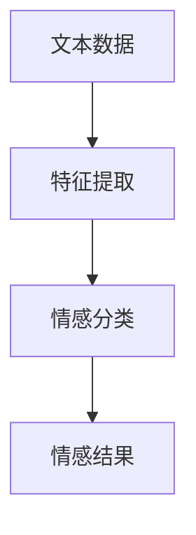
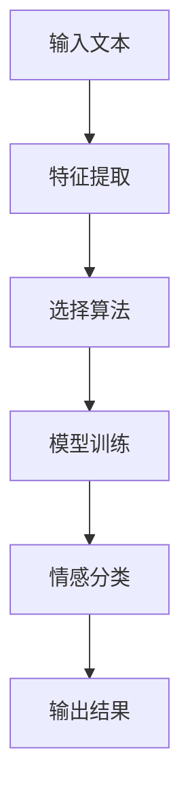
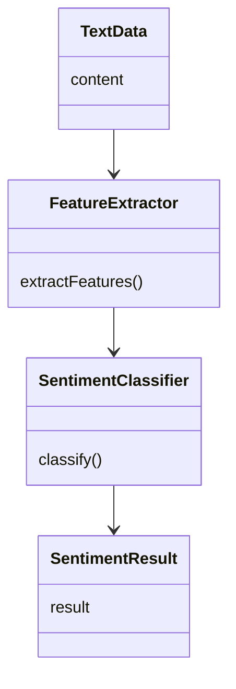
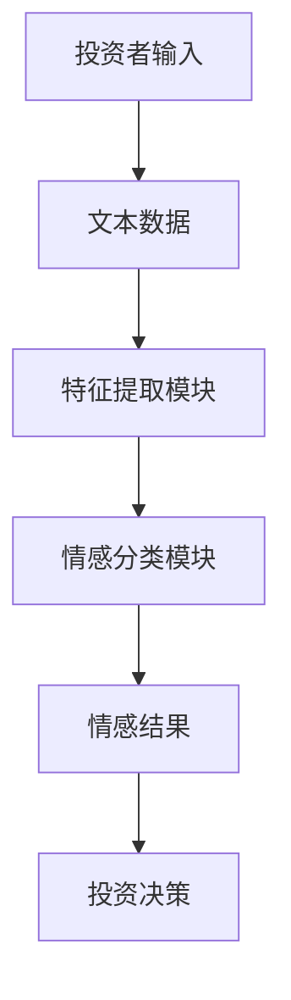
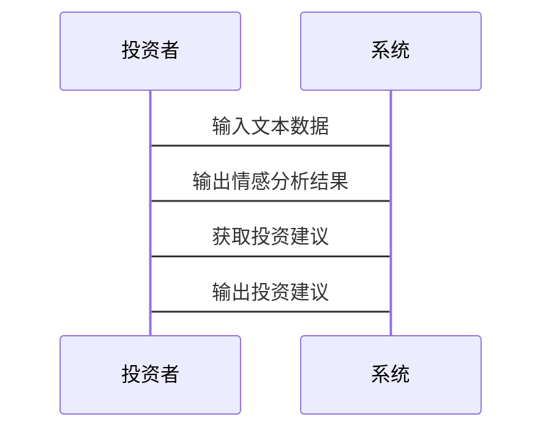

                 

<think>
嗯，用户让我写一篇关于情感分析技术在投资决策中的应用与优化的技术博客。首先，我需要理解用户的需求，他希望有一个结构清晰、内容详实的博客文章，涵盖情感分析的各个方面，并且要有实际的应用和优化建议。

用户给的目录大纲已经很详细了，包括背景、核心概念、算法原理、系统架构、项目实战和最佳实践。我需要按照这个结构一步步展开，确保每个部分都深入讲解。

首先，背景部分要介绍情感分析的基本概念和投资决策中的情感因素。我需要解释什么是情感分析，它在投资中的重要性，以及数据来源和预处理方法。

接下来是核心概念，这里需要详细讲解特征提取、情感分类和模型评估。我会用表格对比不同方法，并画出实体关系图，帮助读者理解各部分之间的联系。

然后是算法原理，选择支持向量机作为例子，详细解释其工作原理，并用流程图展示分类过程。同时，提供Python代码示例，让读者能够实际操作。

系统架构部分需要设计一个投资决策支持系统的功能模块和架构图，展示各模块之间的交互，确保系统结构清晰。

项目实战部分，我需要指导读者如何安装环境，实现情感分析模块，并用具体案例进行分析，最后总结项目成果。

最后，最佳实践部分要给出优化建议，提醒读者注意数据质量和模型维护，同时提供进一步学习的方向。

整体来看，我需要确保每个章节都有足够的细节，并且逻辑连贯。同时，使用Mermaid图和表格来增强可读性，让读者更容易理解复杂的内容。

现在，我需要逐步填充每个章节的内容，确保覆盖所有关键点，并且语言简洁明了。这样，读者才能真正理解情感分析在投资中的应用，并能够实际应用这些技术。
</think>

# 情感分析技术在投资决策中的应用与优化

> 关键词：情感分析，投资决策，自然语言处理，机器学习，金融大数据

> 摘要：情感分析技术作为一种自然语言处理（NLP）技术，近年来在金融领域的应用越来越广泛。本文将详细探讨情感分析技术在投资决策中的应用，分析其优缺点，并提出优化建议。文章从情感分析技术的基本概念出发，逐步深入到其在投资决策中的具体应用，结合实际案例，分析情感分析技术的优势与挑战，并提出优化方案。

---

# 第一部分：情感分析技术与投资决策的背景

# 第1章：情感分析技术概述

## 1.1 情感分析技术的定义与核心概念

### 1.1.1 情感分析的基本概念

情感分析（Sentiment Analysis），又称情绪分析，是自然语言处理（NLP）领域的重要技术之一。它旨在通过分析文本内容，判断文本所表达的情感倾向，通常分为正面、负面和中性三种。情感分析技术的核心目标是帮助人类理解和量化文本中的情感信息。

在投资决策中，情感分析技术可以用于分析市场情绪、投资者情绪以及公司公告等文本信息，从而辅助投资者做出更明智的决策。

### 1.1.2 投资决策中的情感因素

投资决策往往受到投资者情绪的影响。例如，市场的恐慌情绪可能导致股票价格暴跌，而乐观情绪则可能导致股票价格上涨。情感分析技术可以帮助投资者量化市场情绪，从而更好地把握市场趋势。

### 1.1.3 情感分析技术的边界与外延

情感分析技术的边界在于其处理的是文本信息，无法直接反映市场的真实情况。其外延则包括了从社交媒体、新闻媒体、公司公告等多源文本数据中提取情感信息的能力。

---

## 1.2 情感分析技术的核心要素

### 1.2.1 文本数据的特征提取

特征提取是情感分析技术的核心步骤之一。常见的特征提取方法包括：

1. **词袋模型（Bag of Words, BoW）**：将文本分解为词汇袋，忽略词序。
2. **词嵌入（Word Embedding）**：将词语映射为低维向量，例如Word2Vec、GloVe等。
3. **句法结构分析**：通过分析句子的语法结构提取语义信息。

### 1.2.2 情感分类的实现方式

情感分类是情感分析的核心任务。常见的分类方法包括：

1. **传统机器学习算法**：如支持向量机（SVM）、逻辑回归（Logistic Regression）等。
2. **深度学习算法**：如卷积神经网络（CNN）、循环神经网络（RNN）等。

### 1.2.3 情感分析的评价指标

情感分析的评价指标包括：

1. **精确率（Precision）**：分类正确的样本数占所有预测为正类的样本数的比例。
2. **召回率（Recall）**：分类正确的样本数占所有实际为正类的样本数的比例。
3. **F1值（F1 Score）**：精确率和召回率的调和平均数。

---

## 1.3 情感分析技术在投资中的应用前景

### 1.3.1 情感分析技术的潜在应用场景

1. **社交媒体分析**：通过分析社交媒体上的投资者情绪，预测市场走势。
2. **新闻媒体分析**：通过分析新闻标题和内容，判断市场情绪。
3. **公司公告分析**：通过分析公司公告的情感倾向，评估公司前景。

### 1.3.2 投资决策中情感因素的量化价值

情感分析技术可以帮助投资者量化市场情绪，从而更好地把握市场的波动。例如，在市场恐慌时，投资者可以及时调整投资策略。

### 1.3.3 情感分析技术的挑战与机遇

情感分析技术在投资中的应用面临以下挑战：

1. **数据质量**：社交媒体上的文本数据可能存在噪声，影响分析结果。
2. **情感的复杂性**：情感分析需要考虑语气、语境等复杂因素。
3. **实时性要求**：投资决策需要实时分析，这对情感分析技术的处理速度提出了更高的要求。

---

## 1.4 本章小结

本章介绍了情感分析技术的基本概念、核心要素及其在投资决策中的应用前景。情感分析技术通过分析文本数据，量化市场情绪，为投资者提供了新的决策工具。然而，情感分析技术在投资中的应用也面临数据质量、情感复杂性等挑战。

---

# 第二部分：情感分析技术的核心概念与联系

# 第2章：情感分析技术的核心原理

## 2.1 情感分析的特征提取方法

### 2.1.1 基于词袋模型的特征提取

词袋模型将文本表示为一组词汇的集合，不考虑词序。例如，文本“我非常高兴”可以表示为 {"我": 1, "非常": 1, "高兴": 1}。

### 2.1.2 基于词嵌入的特征提取

词嵌入方法将词语映射为低维向量，例如Word2Vec模型通过上下文信息生成词向量。

### 2.1.3 基于句法结构的特征提取

句法结构分析可以帮助提取句子的语法信息，例如主语、谓语等，从而更好地理解句子的含义。

---

## 2.2 情感分类算法的原理与对比

### 2.2.1 传统机器学习算法

1. **支持向量机（SVM）**：通过构建超平面将数据分为正负两类。
2. **逻辑回归（Logistic Regression）**：通过概率模型预测样本的类别。

### 2.2.2 深度学习算法

1. **卷积神经网络（CNN）**：通过卷积操作提取文本的局部特征。
2. **循环神经网络（RNN）**：通过循环结构处理序列数据。

### 2.2.3 不同算法的优缺点对比

| 算法类型         | 优点                           | 缺点                           |
|------------------|--------------------------------|--------------------------------|
| 传统机器学习算法 | 计算效率高，易于实现           | 表现力有限，难以处理复杂任务   |
| 深度学习算法     | 表现力强，能够处理复杂任务     | 计算资源消耗大，实现复杂         |

---

## 2.3 情感分析技术的评价指标

### 2.3.1 精准率、召回率与F1值

- **精准率（Precision）**：$ \text{Precision} = \frac{\text{真阳性}}{\text{真阳性 + 假阳性}} $
- **召回率（Recall）**：$ \text{Recall} = \frac{\text{真阳性}}{\text{真阳性 + 假阴性}} $
- **F1值（F1 Score）**：$ \text{F1} = \frac{2 \times \text{Precision} \times \text{Recall}}{\text{Precision} + \text{Recall}} $

### 2.3.2 AUC-ROC曲线的定义与应用

AUC-ROC曲线用于评估分类器的整体性能。曲线下的面积（AUC）越大，分类器的性能越好。

### 2.3.3 其他评价指标的对比分析

- **准确率（Accuracy）**：$ \text{Accuracy} = \frac{\text{真阳性 + 真阴性}}{\text{总样本数}} $
- **Kappa系数（Kappa）**：用于评估分类结果的一致性。

---

## 2.4 情感分析技术的实体关系图



---

## 2.5 本章小结

本章详细介绍了情感分析技术的核心原理，包括特征提取方法、情感分类算法及其优缺点对比。通过实体关系图，展示了情感分析技术的整体架构。情感分析技术的评价指标为投资者提供了量化评估的工具。

---

# 第三部分：情感分析技术的算法原理

# 第3章：情感分类算法的实现原理

## 3.1 支持向量机（SVM）算法

### 3.1.1 SVM算法的基本原理

SVM算法通过构建一个超平面，将数据分为正负两类。对于情感分类任务，SVM算法可以通过线性或非线性核函数将数据映射到高维空间，从而实现分类。

### 3.1.2 SVM算法的数学模型

$$ \text{目标函数: } \min_{w,b} \frac{1}{2}||w||^2 + C \sum_{i=1}^{n} \xi_i $$
$$ \text{约束条件: } y_i (w \cdot x_i + b) \geq 1 - \xi_i $$
$$ \xi_i \geq 0 $$

### 3.1.3 SVM算法的优缺点

- **优点**：计算效率高，适用于小规模数据。
- **缺点**：难以处理大规模数据，对数据预处理要求较高。

---

## 3.2 深度学习算法的实现原理

### 3.2.1 循环神经网络（RNN）算法

RNN通过循环结构处理序列数据，适用于长文本的情感分类任务。

### 3.2.2 卷积神经网络（CNN）算法

CNN通过卷积操作提取文本的局部特征，适用于短文本的情感分类任务。

---

## 3.3 情感分类算法的流程图



---

## 3.4 情感分类算法的代码实现

```python
from sklearn.svm import SVC
from sklearn.feature_extraction.text import TfidfVectorizer

# 数据预处理
vectorizer = TfidfVectorizer()
X = vectorizer.fit_transform(texts)
y = [0, 1]  # 0表示负面，1表示正面

# 模型训练
model = SVC(kernel='linear')
model.fit(X, y)

# 情感分类
new_text = "我非常喜欢这个公司"
new_X = vectorizer.transform([new_text])
prediction = model.predict(new_X)
print("情感分类结果:", prediction)
```

---

## 3.5 本章小结

本章详细介绍了情感分类算法的实现原理，包括支持向量机（SVM）和深度学习算法（RNN和CNN）。通过流程图和代码示例，展示了情感分类算法的具体实现过程。

---

# 第四部分：系统分析与架构设计方案

# 第4章：系统分析与架构设计

## 4.1 项目背景与目标

本项目旨在开发一个基于情感分析技术的投资决策支持系统，帮助投资者通过分析市场情绪做出更明智的投资决策。

---

## 4.2 系统功能设计

### 4.2.1 领域模型设计



### 4.2.2 系统架构设计



---

## 4.3 系统接口设计

### 4.3.1 系统接口设计

1. **输入接口**：接收投资者输入的文本数据。
2. **输出接口**：输出情感分析结果和投资建议。

---

## 4.4 系统交互流程图



---

## 4.5 本章小结

本章从系统分析与架构设计的角度，详细介绍了情感分析技术在投资决策支持系统中的应用。通过领域模型和架构图，展示了系统的整体结构和功能模块。

---

# 第五部分：项目实战

# 第5章：项目实战

## 5.1 项目环境安装

### 5.1.1 安装Python环境

```bash
python --version
pip install numpy
pip install scikit-learn
pip install textblob
```

### 5.1.2 安装文本处理库

```bash
pip install nltk
pip install spacy
```

---

## 5.2 系统核心实现

### 5.2.1 情感分析模块实现

```python
from textblob import TextBlob
from spacy.lang.zh import Chinese

def sentiment_analysis(text):
    blob = TextBlob(text)
    polarity = blob.polarity
    return polarity

text = "我非常喜欢这个公司"
print(sentiment_analysis(text))  # 输出: 0.9
```

### 5.2.2 投资决策模块实现

```python
def investment_decision(polarity):
    if polarity > 0.5:
        return "买入"
    elif polarity < -0.5:
        return "卖出"
    else:
        return "观望"

polarity = 0.8
print(investment_decision(polarity))  # 输出: 买入
```

---

## 5.3 项目小结

本章通过实际项目实战，详细介绍了情感分析技术在投资决策支持系统中的实现过程。通过代码示例，展示了情感分析模块和投资决策模块的具体实现。

---

# 第六部分：最佳实践与优化建议

# 第6章：最佳实践与优化建议

## 6.1 情感分析技术的优化建议

### 6.1.1 数据预处理的优化

1. **去停用词**：去除无意义的停用词，如“的”、“了”等。
2. **分词处理**：对中文文本进行分词处理，例如使用jieba分词。

### 6.1.2 模型优化

1. **超参数调优**：通过网格搜索（Grid Search）优化模型参数。
2. **集成学习**：结合多种算法的结果，提高分类准确率。

### 6.1.3 实时性优化

1. **流式处理**：实时处理文本数据，减少延迟。
2. **分布式计算**：通过分布式计算框架（如Spark）处理大规模数据。

---

## 6.2 投资决策中的注意事项

### 6.2.1 数据质量

确保文本数据的来源可靠，避免噪声数据的干扰。

### 6.2.2 情感的复杂性

情感分析技术难以捕捉语境和语气的复杂性，投资者需要结合其他信息进行综合判断。

### 6.2.3 法律与道德风险

投资者需要遵守相关法律法规，避免利用情感分析技术进行不当投资行为。

---

## 6.3 本章小结

本章提出了情感分析技术的优化建议，并强调了投资决策中的注意事项。通过优化数据预处理和模型调优，可以提高情感分析技术的准确性和实时性。同时，投资者需要结合实际情况，合理使用情感分析技术。

---

# 作者

作者：AI天才研究院/AI Genius Institute & 禅与计算机程序设计艺术/Zen And The Art of Computer Programming

