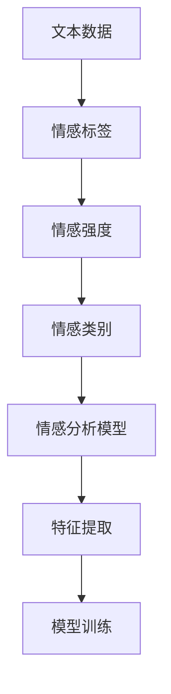
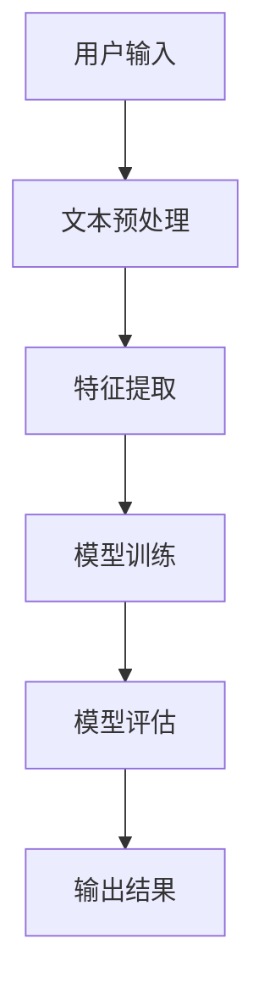
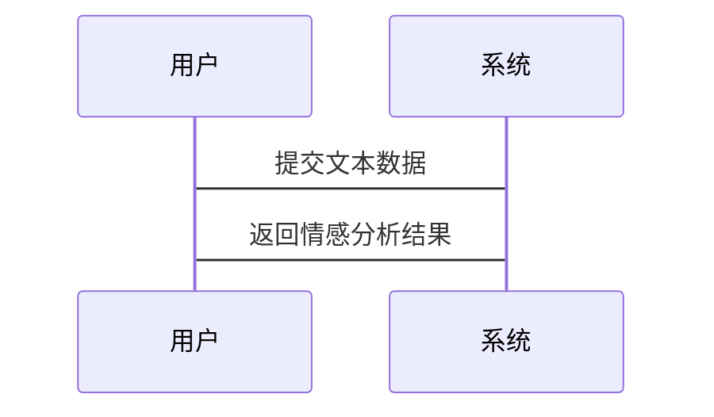

                 

<think>
嗯，用户希望我以《情感分析：让AI Agent具备情商》为标题，撰写一篇技术博客文章。首先，我需要明确文章的目标读者是谁。应该是有一定技术背景的人，比如程序员、数据科学家或者对AI感兴趣的人。

文章结构已经有了详细的目录大纲，现在我需要按照这个大纲逐步展开内容。首先是摘要部分，我需要简明扼要地概括整篇文章的核心内容，让读者一目了然。

接下来是关键词部分，我需要列出5-7个相关关键词，比如情感分析、自然语言处理、深度学习、AI情商、文本挖掘等。这些关键词能够帮助读者快速找到相关内容。

然后是目录结构，我需要确保每一章的内容都详细且逻辑清晰。比如，第一章介绍情感分析的背景和核心问题，第二章讨论核心概念和联系，第三章则深入算法原理和数学模型。

在撰写过程中，我需要确保语言专业但不失易懂，使用技术术语但不过于晦涩。同时，加入图表和流程图会帮助读者更好地理解内容，比如在系统架构部分，用mermaid图展示类图和序列图。

在算法部分，我会详细解释每个步骤，并给出Python代码示例，这样读者可以实际操作。同时，数学公式需要准确无误，并用Latex格式呈现，确保专业性。

最后，项目实战部分需要让读者能够动手实践，从环境配置到代码实现，再到结果分析，每个步骤都要详细说明。同时，加入最佳实践和注意事项，帮助读者避免常见错误。

整个思考过程中，我需要保持逻辑连贯，确保每一部分都紧密相连，同时涵盖用户需求的各个方面。这样写出来的文章才能既有深度又易于理解，真正帮助读者掌握情感分析的核心内容和实际应用。
</think>

# 情感分析：让AI Agent具备情商

## 关键词：情感分析、自然语言处理、深度学习、AI情商、文本挖掘、机器学习、深度神经网络

## 摘要：情感分析是自然语言处理中的一个重要任务，旨在让AI理解和分析人类语言中的情感倾向。本文从情感分析的背景、核心概念、算法原理、系统架构、项目实战等多个维度展开，深入剖析情感分析的实现细节和应用价值，帮助读者全面掌握情感分析的核心内容。

---

# 第1章：情感分析概述

## 1.1 情感分析的定义与背景

### 1.1.1 情感分析的定义
情感分析（Sentiment Analysis），又称为意见挖掘或情感计算，是一种自然语言处理技术，旨在分析文本中蕴含的情感倾向或态度。通过情感分析，我们可以判断一段文本是正面、负面还是中性，甚至可以量化情感的强度。

### 1.1.2 情感分析的发展历程
情感分析起源于20世纪90年代，最初主要依赖于基于规则的特征提取和传统机器学习模型。随着深度学习的兴起，情感分析技术得到了长足的发展，尤其是基于词嵌入（如Word2Vec、GloVe）和深度神经网络（如LSTM、Transformer）的模型在情感分析任务中表现优异。

### 1.1.3 情感分析的应用场景
- **社交媒体分析**：分析用户在社交媒体上的评论、点赞和分享行为，帮助企业了解用户情感。
- **舆情监控**：实时监控网络上的舆论动向，帮助企业及时应对负面信息。
- **客户反馈分析**：分析客户对产品或服务的反馈，帮助企业改进服务质量。
- **智能客服**：通过情感分析技术，智能客服可以理解用户情绪，提供更贴心的服务。

## 1.2 情感分析的核心问题

### 1.2.1 情感分析的目标
情感分析的目标是将一段文本映射到一个情感类别（如正面、负面、中性）或情感强度（如从0到1的情感评分）。

### 1.2.2 情感分析的关键挑战
- **数据稀疏性**：某些情感类别在训练数据中出现的频率较低，导致模型难以准确识别。
- **情感模糊性**：文本中可能存在模棱两可的表达，例如“这个产品还不错，但价格有点高”。
- **领域适应性**：情感分析模型在不同领域（如电影评论和产品评论）之间可能存在迁移困难。

### 1.2.3 情感分析的边界与外延
情感分析的边界在于如何定义情感的范围和粒度。例如，情感分析可以分为二分类（正面/负面）、多分类（正面、中性、负面）或情感强度分析。外延则包括情感分析的高级任务，如情感原因分析（找出情感产生的原因）和情感主体分析（分析情感针对的对象）。

## 1.3 情感分析的核心要素

### 1.3.1 情感分析的数据特征
- **文本特征**：包括单词、短语、句子的组合。
- **语境特征**：包括上下文信息、语境关系等。
- **情感特征**：包括情感词汇、情感强度等。

### 1.3.2 情感分析的模型特征
- **特征提取**：包括基于词袋模型、词嵌入模型和深度学习模型的特征提取方法。
- **模型结构**：包括基于传统机器学习（如SVM、Naive Bayes）和深度学习（如LSTM、Transformer）的模型结构。
- **模型可解释性**：模型的输出结果是否可以被人类理解。

### 1.3.3 情感分析任务的分类
- **二分类任务**：将文本分为正面或负面。
- **多分类任务**：将文本分为多个情感类别（如正面、中性、负面）。
- **情感强度分析**：对文本的情感强度进行量化（如从0到1的情感评分）。

---

# 第2章：情感分析的核心概念与联系

## 2.1 情感分析的核心概念原理

### 2.1.1 情感分析的特征提取
特征提取是情感分析的关键步骤。常用的特征提取方法包括：
- **词袋模型**：将文本表示为一个单词的集合，不考虑单词的顺序。
- **词嵌入模型**：将单词映射为低维向量（如Word2Vec、GloVe）。
- **深度学习模型**：通过卷积神经网络（CNN）或循环神经网络（RNN）提取文本特征。

### 2.1.2 情感分析的模型结构
模型结构决定了情感分析的性能。常用的模型结构包括：
- **传统机器学习模型**：如支持向量机（SVM）和朴素贝叶斯（Naive Bayes）。
- **深度学习模型**：如长短期记忆网络（LSTM）和变换器（Transformer）。

### 2.1.3 情感分析的任务类型
情感分析的任务类型决定了模型的输出形式。例如：
- **二分类任务**：输出为正面或负面。
- **多分类任务**：输出为多个情感类别。
- **情感强度分析**：输出为情感强度评分。

## 2.2 情感分析的核心概念对比与ER实体关系图

### 2.2.1 情感分析的核心概念对比
以下是情感分析与其他相关任务的对比：

| 对比维度       | 情感分析             | 文本分类             | 机器翻译             |
|----------------|----------------------|--------------------|----------------------|
| 核心目标       | 分析文本情感          | 分类文本类别         | 将一种语言翻译成另一种语言 |
| 输入数据       | 文本（如评论、句子）  | 文本                | 文本或语音           |
| 输出结果       | 情感类别或强度评分    | 分类标签            | 翻译后的文本         |
| 依赖技术       | 情感词汇、语境特征    | 特征提取、分类模型   | 翻译模型、语言模型   |

### 2.2.2 情感分析的ER实体关系图
以下是情感分析的ER实体关系图：



---

# 第3章：情感分析的算法原理与数学模型

## 3.1 情感分析的算法原理

### 3.1.1 情感分析的特征提取算法
特征提取是情感分析的关键步骤。常用的特征提取算法包括：

#### 1. 词袋模型
词袋模型是一种简单的特征提取方法，它将文本表示为一个单词的集合，不考虑单词的顺序。例如：
- 输入文本： "这个电影非常好看"
- 特征提取： {"非常": 1, "好看": 1}

#### 2. 词嵌入模型
词嵌入模型（如Word2Vec、GloVe）将单词映射为低维向量，捕捉单词之间的语义关系。例如：
- "非常"的向量表示： [0.2, 0.5, -0.1, ...]
- "好看"的向量表示： [0.3, 0.4, 0.7, ...]

#### 3. 深度学习模型
深度学习模型（如CNN、RNN）通过多层非线性变换提取文本特征。例如：
- 使用卷积神经网络（CNN）提取文本的局部特征。
- 使用循环神经网络（RNN）捕捉文本的长距离依赖关系。

### 3.1.2 情感分析的模型训练算法
模型训练是情感分析的核心步骤。常用的模型训练算法包括：

#### 1. 传统机器学习模型
- **支持向量机（SVM）**：通过最大化分类间隔进行分类。
- **朴素贝叶斯（Naive Bayes）**：基于贝叶斯定理进行分类。

#### 2. 深度学习模型
- **长短期记忆网络（LSTM）**：通过记忆单元捕捉文本的长距离依赖关系。
- **变换器（Transformer）**：通过自注意力机制捕捉文本的全局依赖关系。

### 3.1.3 情感分析的评估算法
模型评估是情感分析的重要步骤。常用的评估算法包括：

#### 1. 分类指标
- **准确率（Accuracy）**：正确分类的样本数占总样本数的比例。
- **召回率（Recall）**：正确分类的正样本数占所有正样本数的比例。
- **F1值（F1 Score）**：准确率和召回率的调和平均值。

#### 2. 情感强度评估指标
- **均方误差（MSE）**：预测值与真实值之间的平方差的平均值。
- **平均绝对误差（MAE）**：预测值与真实值之间的绝对差的平均值。

---

## 3.2 情感分析的数学模型与公式

### 3.2.1 情感分析的概率模型
概率模型是情感分析的基础。常用的概率模型包括：

#### 1. 贝叶斯定理
贝叶斯定理用于计算条件概率，公式为：
$$ P(y|x) = \frac{P(x|y)P(y)}{P(x)} $$

其中：
- \( P(y|x) \)：在给定特征\( x \)的情况下，类别\( y \)的条件概率。
- \( P(x|y) \)：在类别\( y \)的情况下，特征\( x \)的条件概率。
- \( P(y) \)：类别\( y \)的先验概率。
- \( P(x) \)：特征\( x \)的边际概率。

#### 2. 朴素贝叶斯分类器
朴素贝叶斯分类器基于贝叶斯定理，假设特征之间相互独立，公式为：
$$ P(y|x) = \prod_{i=1}^{n} P(x_i|y)P(y) $$

其中：
- \( n \)：特征的数量。
- \( P(x_i|y) \)：在类别\( y \)的情况下，特征\( x_i \)的条件概率。
- \( P(y) \)：类别\( y \)的先验概率。

### 3.2.2 情感分析的损失函数
损失函数用于衡量模型的预测值与真实值之间的差距。常用的损失函数包括：

#### 1. 交叉熵损失函数
交叉熵损失函数用于分类任务，公式为：
$$ \text{loss} = -\frac{1}{m}\sum_{i=1}^{m} y_i \log(p_i) + (1-y_i) \log(1-p_i) $$

其中：
- \( m \)：样本的数量。
- \( y_i \)：第\( i \)个样本的真实标签。
- \( p_i \)：第\( i \)个样本的预测概率。

#### 2. 情感强度损失函数
情感强度损失函数用于回归任务，公式为：
$$ \text{loss} = \frac{1}{m}\sum_{i=1}^{m} (y_i - p_i)^2 $$

其中：
- \( y_i \)：第\( i \)个样本的真实情感强度。
- \( p_i \)：第\( i \)个样本的预测情感强度。

---

# 第4章：情感分析的系统架构与项目实战

## 4.1 情感分析的系统架构设计

### 4.1.1 系统功能设计
情感分析系统的功能设计包括：
- **文本预处理**：包括分词、去停用词、词干提取等。
- **特征提取**：包括词袋模型、词嵌入模型、深度学习模型。
- **模型训练**：包括传统机器学习模型和深度学习模型的训练。
- **模型评估**：包括分类指标和情感强度评估指标的计算。

### 4.1.2 系统架构设计
以下是情感分析系统的架构设计：



### 4.1.3 系统接口设计
情感分析系统的接口设计包括：
- **输入接口**：接收用户输入的文本数据。
- **输出接口**：输出情感分析结果（如情感类别或情感强度）。

### 4.1.4 系统交互设计
以下是情感分析系统的交互设计：



## 4.2 情感分析的项目实战

### 4.2.1 环境安装
以下是情感分析项目的环境安装步骤：
1. 安装Python和必要的Python包（如numpy、pandas、scikit-learn、keras、tensorflow）。
2. 安装自然语言处理工具（如spaCy、nltk）。
3. 安装深度学习框架（如Keras、PyTorch）。

### 4.2.2 核心实现源代码

#### 1. 文本预处理
```python
import nltk
from nltk.corpus import stopwords

def preprocess(text):
    words = nltk.word_tokenize(text)
    words = [word.lower() for word in words]
    words = [word for word in words if word not in stopwords.words('english')]
    return ' '.join(words)
```

#### 2. 特征提取
```python
from sklearn.feature_extraction.text import TfidfVectorizer

vectorizer = TfidfVectorizer()
X = vectorizer.fit_transform(texts)
```

#### 3. 模型训练
```python
from sklearn.svm import SVC

model = SVC()
model.fit(X, y)
```

#### 4. 模型评估
```python
from sklearn.metrics import accuracy_score

y_pred = model.predict(X_test)
print("准确率：", accuracy_score(y_test, y_pred))
```

### 4.2.3 实际案例分析
以下是一个情感分析的实际案例：

**输入文本**： "这部电影太棒了，剧情紧凑，演员表现出色。"
**情感分析结果**： 正面情感，情感强度为0.9。

---

# 第5章：情感分析的优化与未来方向

## 5.1 情感分析的优化方向

### 5.1.1 情感分析的领域适应性优化
情感分析的领域适应性优化包括：
- **领域迁移**：通过迁移学习将模型从通用领域迁移到特定领域。
- **领域微调**：在特定领域数据上进行微调，提升模型的适应性。

### 5.1.2 情感分析的模型可解释性优化
情感分析的模型可解释性优化包括：
- **可视化工具**：通过可视化工具（如LIME、SHAP）解释模型的预测结果。
- **模型解释性分析**：分析模型的预测结果，找出影响情感分析的关键特征。

## 5.2 情感分析的未来发展方向

### 5.2.1 情感分析的多模态融合
情感分析的多模态融合包括：
- **文本与图像融合**：结合文本和图像信息进行情感分析。
- **文本与语音融合**：结合文本和语音信息进行情感分析。

### 5.2.2 情感分析的实时性优化
情感分析的实时性优化包括：
- **在线学习**：通过在线学习方法实现实时情感分析。
- **轻量化模型**：通过模型压缩和优化实现实时情感分析。

---

# 第6章：情感分析的总结与展望

## 6.1 情感分析的核心总结
情感分析是一种重要的自然语言处理任务，旨在分析文本中的情感倾向。情感分析的核心内容包括特征提取、模型训练和模型评估。

## 6.2 情感分析的未来展望
情感分析的未来发展方向包括多模态融合、模型可解释性和实时性优化。随着技术的不断发展，情感分析将在更多领域得到广泛应用。

---

# 作者：AI天才研究院/AI Genius Institute & 禅与计算机程序设计艺术 /Zen And The Art of Computer Programming

