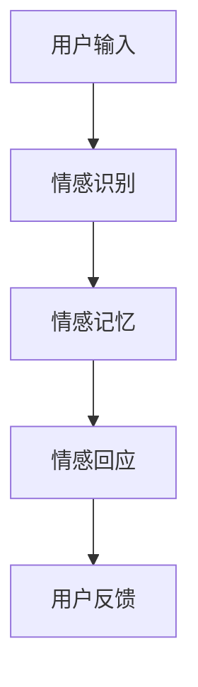
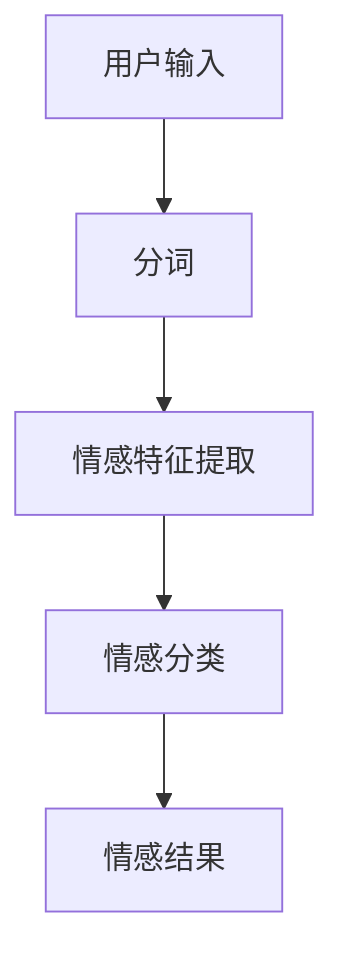
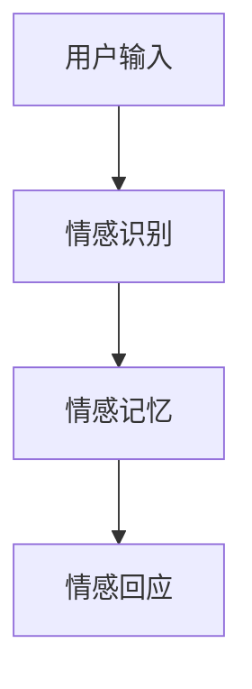
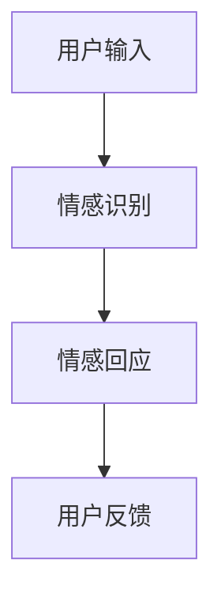
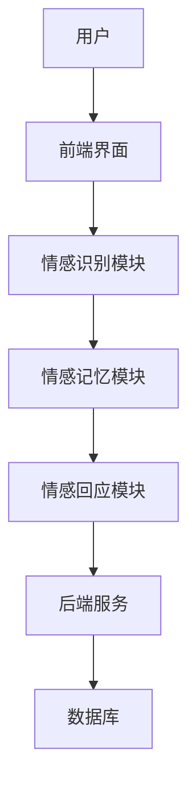
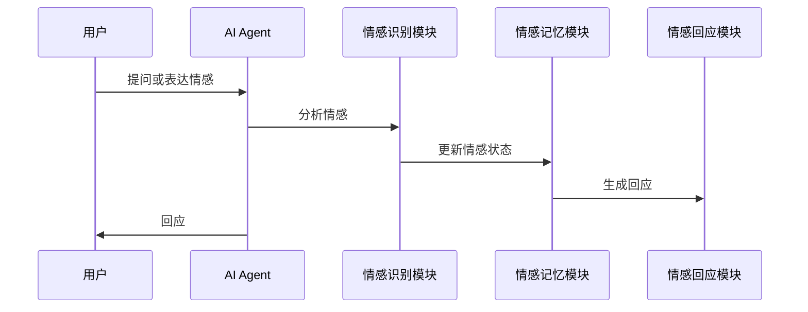

                 

<think>
好，我需要按照用户的要求，撰写一篇名为《情感智能 AI Agent：在 LLM 中植入 EQ》的技术博客文章。首先，我要理解文章的核心主题：探讨如何在大型语言模型（LLM）中加入情感商数（EQ），使其具备情感理解和社交能力。

接下来，我需要规划文章的结构，确保逻辑清晰，内容全面。首先从背景介绍开始，让读者了解情感智能AI Agent的定义和重要性。然后逐步深入，讲解核心概念、算法原理、系统架构、项目实战等部分，最后总结最佳实践和未来展望。

在写作过程中，我需要使用专业且易懂的技术语言，确保每个章节内容详实，配有必要的图表和代码示例。例如，在算法原理部分，我将使用Mermaid流程图来展示工作流程，并在适当的位置插入Python代码示例。

我还要注意文章的结构，每个章节下设置明确的子标题，确保内容层次分明。同时，要确保文章的总字数在10000到12000字之间，满足用户的要求。

最后，我会在文章末尾添加作者信息，确保格式正确。通过这样的系统思考和逐步分析，我可以撰写出一篇符合用户需求的高质量技术博客文章。
</think>

# 情感智能 AI Agent：在 LLM 中植入 EQ

## 关键词：情感智能，AI Agent，LLM，EQ，人机交互，情感计算

## 摘要：  
本文探讨如何在大型语言模型（LLM）中植入情感商数（EQ），使其具备情感理解与社交能力。通过分析情感智能AI Agent的核心概念、算法原理、系统架构及项目实战，本文为实现更自然、更人性化的AI交互提供理论与实践指导。

---

## 第1章: 情感智能AI Agent的背景与定义

### 1.1 情感智能AI Agent的定义与特征
#### 1.1.1 情感智能AI Agent的定义
情感智能AI Agent是一种结合了情感计算与人工智能技术的智能体，能够理解和回应人类的情感需求，从而提供更自然、更个性化的交互体验。

#### 1.1.2 情感智能AI Agent的核心特征
- **情感理解**：通过自然语言处理技术，识别用户的情感状态（如快乐、悲伤、愤怒等）。
- **情感记忆**：记录用户的情感变化，提供连续的情感反馈。
- **情感回应**：基于情感分析结果，生成符合情感需求的回应。

#### 1.1.3 情感智能AI Agent的应用场景
- 情感客服助手：在客户服务中提供情感支持，提高客户满意度。
- 情感教育工具：帮助学生缓解压力，提供情感支持。
- 情感社交助手：在社交平台上提供情感分析与互动建议。

### 1.2 情感智能与EQ的关联
#### 1.2.1 EQ的定义与重要性
EQ（情感商数）是指个体识别、理解和管理自己及他人情感的能力。在AI领域，EQ使机器能够理解并回应人类的情感需求。

#### 1.2.2 EQ在AI中的应用价值
- 提高人机交互的自然性。
- 增强用户体验的个性化。
- 提升AI系统的社会适应性。

#### 1.2.3 情感智能AI Agent的核心目标
通过植入EQ，使AI具备情感理解与回应能力，从而提供更人性化的服务。

### 1.3 LLM的基本原理与情感处理能力
#### 1.3.1 LLM的定义与基本原理
大型语言模型（LLM）通过深度学习技术，利用大量数据训练，生成与训练数据相似的文本。

#### 1.3.2 LLM在情感处理中的优势
- 通过语义理解识别情感。
- 利用上下文分析情感变化。
- 生成符合情感需求的回应。

#### 1.3.3 情感智能AI Agent的技术基础
- 自然语言处理（NLP）：识别情感关键词。
- 情感计算：分析用户情感状态。
- 生成模型：生成情感化回应。

### 1.4 情感智能AI Agent的技术优势
#### 1.4.1 提高人机交互的自然性
通过情感理解，AI能够更自然地与用户互动。

#### 1.4.2 增强用户体验的个性化
根据用户情感状态，提供个性化的服务。

#### 1.4.3 提升AI系统的社会适应性
使AI能够适应不同的情感场景，提升社会互动能力。

### 1.5 情感智能AI Agent的现状与挑战
#### 1.5.1 当前技术发展现状
情感智能AI Agent已在客服、教育等领域初步应用，但技术仍需完善。

#### 1.5.2 情感智能AI Agent的主要挑战
- 情感理解的准确性。
- 情感记忆的持续性。
- 情感回应的自然性。

#### 1.5.3 未来发展趋势与研究方向
- 提高情感理解的精度。
- 优化情感记忆的持久性。
- 增强情感回应的自然性。

### 1.6 案例分析：情感智能AI Agent的实际应用
#### 1.6.1 情感客服机器人的应用实例
情感客服机器人能够识别用户情绪，提供更贴心的服务。

#### 1.6.2 情感教育工具的案例分析
情感教育工具帮助学生缓解压力，提供情感支持。

#### 1.6.3 情感社交助手的未来发展
情感社交助手将在社交平台上提供更智能化的情感互动。

---

## 第2章: 情感智能AI Agent的核心概念与联系

### 2.1 情感智能AI Agent的核心概念
情感智能AI Agent通过自然语言处理和情感计算技术，理解并回应用户的情感需求，提供更人性化的交互体验。

### 2.2 情感智能AI Agent的核心原理
- 通过NLP技术识别情感关键词。
- 利用情感计算分析用户情感状态。
- 生成符合情感需求的回应。

### 2.3 情感智能AI Agent与传统AI的对比
| **特征**         | **传统AI**                     | **情感智能AI Agent**             |
|-------------------|-------------------------------|----------------------------------|
| **目标**          | 提供功能性服务                 | 提供情感化服务                   |
| **交互方式**      | 基于规则的交互                | 基于情感的交互                  |
| **用户体验**      | 功能性为主                    | 个性化、情感化为主               |

### 2.4 情感智能AI Agent的系统组成
- **情感识别模块**：识别用户情感状态。
- **情感记忆模块**：记录用户情感变化。
- **情感回应模块**：生成情感化回应。

### 2.5 情感智能AI Agent的工作流程


---

## 第3章: 情感智能AI Agent的算法原理

### 3.1 情感识别算法
#### 3.1.1 情感识别算法的原理
通过NLP技术，识别用户文本中的情感倾向。

#### 3.1.2 情感识别算法的实现


#### 3.1.3 情感识别算法的Python实现
```python
import nltk
from nltk.sentiment import SentimentIntensityAnalyzer

sia = SentimentIntensityAnalyzer()
text = "I love this product!"
scores = sia.polarity_scores(text)
print(scores)  # 输出情感分数
```

### 3.2 情感记忆算法
#### 3.2.1 情感记忆算法的原理
记录用户的情感变化，提供连续的情感反馈。

#### 3.2.2 情感记忆算法的实现


#### 3.2.3 情感记忆算法的Python实现
```python
def update_emotion_history(history, current_emotion):
    new_history = history + [current_emotion]
    return new_history
```

### 3.3 情感回应算法
#### 3.3.1 情感回应算法的原理
基于情感分析结果，生成符合情感需求的回应。

#### 3.3.2 情感回应算法的实现


#### 3.3.3 情感回应算法的Python实现
```python
def generate_response(emotion, context):
    if emotion == "happy":
        return "That's great to hear!"
    elif emotion == "sad":
        return "I'm sorry to hear that."
```

### 3.4 情感智能AI Agent的数学模型
#### 3.4.1 情感评分模型
$$ \text{score} = \alpha \cdot \text{positive\_words} - \beta \cdot \text{negative\_words} $$

#### 3.4.2 情感分类模型
$$ P(\text{positive}) = \frac{\text{positive\_count}}{\text{total\_count}} $$

---

## 第4章: 情感智能AI Agent的系统分析与架构设计

### 4.1 系统功能设计
#### 4.1.1 系统功能模块
- 情感识别模块
- 情感记忆模块
- 情感回应模块

#### 4.1.2 系统功能流程


### 4.2 系统架构设计
#### 4.2.1 系统架构图


#### 4.2.2 系统接口设计
- 用户输入接口
- 情感识别接口
- 情感记忆接口
- 情感回应接口

### 4.3 系统交互设计
#### 4.3.1 用户与AI Agent的交互流程


#### 4.3.2 情感识别与回应的详细流程
1. 用户输入文本。
2. 情感识别模块分析文本情感。
3. 情感记忆模块记录情感状态。
4. 情感回应模块生成回应。
5. AI Agent向用户反馈回应。

---

## 第5章: 情感智能AI Agent的项目实战

### 5.1 环境搭建
#### 5.1.1 开发工具安装
- Python 3.8+
- NLTK库
- transformers库

#### 5.1.2 环境配置
```bash
pip install nltk
pip install transformers
```

### 5.2 核心功能实现
#### 5.2.1 情感识别模块实现
```python
from transformers import pipeline

sentiment_pipeline = pipeline("sentiment-analysis")
def analyze_emotion(text):
    result = sentiment_pipeline(text)
    return result[0]["label"]
```

#### 5.2.2 情感记忆模块实现
```python
def update_emotion_history(history, emotion):
    return history + [emotion]
```

#### 5.2.3 情感回应模块实现
```python
def generate_response(emotion, context):
    if emotion == "POSITIVE":
        return "That's great to hear!"
    elif emotion == "NEGATIVE":
        return "I'm sorry to hear that."
```

### 5.3 项目运行与测试
#### 5.3.1 运行流程
1. 用户输入文本。
2. 情感识别模块分析情感。
3. 情感记忆模块记录情感状态。
4. 情感回应模块生成回应。
5. 输出回应结果。

#### 5.3.2 测试案例
- 输入：“I’m so happy with your service!”
- 输出：“That's great to hear!”

---

## 第6章: 情感智能AI Agent的最佳实践与总结

### 6.1 最佳实践
#### 6.1.1 情感识别的准确性
选择高精度的情感分析模型。

#### 6.1.2 情感记忆的持续性
定期更新情感记忆模块。

#### 6.1.3 情感回应的自然性
优化情感回应算法，使其更自然。

### 6.2 小结
情感智能AI Agent通过在LLM中植入EQ，显著提升了人机交互的自然性和用户体验的个性化。

### 6.3 注意事项
- 定期优化情感识别和回应算法。
- 保护用户情感数据的隐私。
- 提供多语言支持，扩大应用范围。

### 6.4 拓展阅读
- 情感计算相关文献。
- 深度学习在情感分析中的应用。
- 大型语言模型的发展趋势。

---

## 作者：AI天才研究院/AI Genius Institute & 禅与计算机程序设计艺术 /Zen And The Art of Computer Programming

