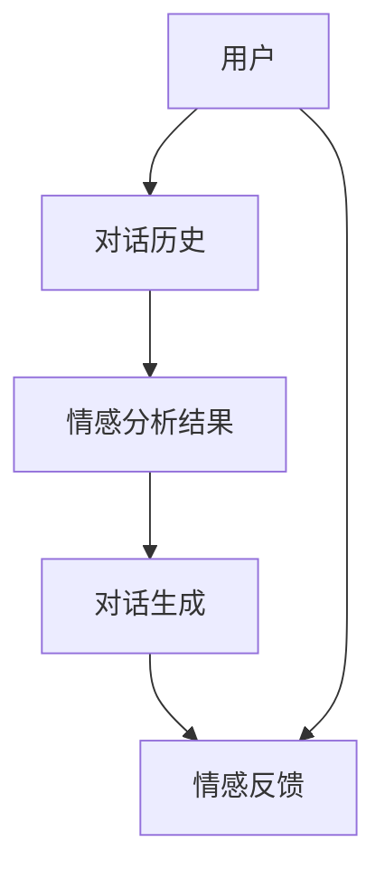
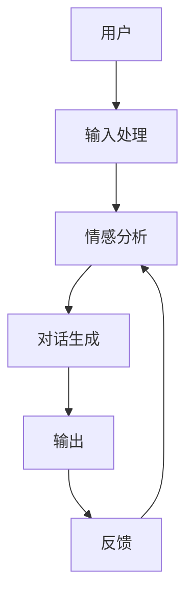
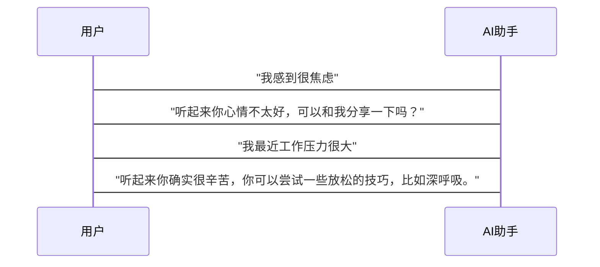

                 


# 情感智能对话AI Agent：LLM驱动的心理健康助手

---

## 关键词：
情感智能对话、LLM、心理健康助手、人工智能、对话生成、情感分析

---

## 摘要：
本文探讨了如何利用大语言模型（LLM）构建情感智能对话AI代理，用于心理健康支持。文章从背景、技术原理、系统设计到项目实战，全面分析了如何通过LLM实现情感智能对话，并为心理健康领域提供创新的解决方案。文章最后总结了最佳实践和未来发展方向。

---

## 第一部分：背景介绍

### 第1章：情感智能对话与心理健康助手的背景

#### 1.1 问题背景
- **心理健康问题的普遍性**：现代社会压力增加，焦虑、抑郁等心理健康问题日益普遍，尤其是在年轻人中。
- **对话在心理健康干预中的重要性**：及时、有效的对话干预可以显著改善心理健康状况，而专业心理咨询师资源有限。
- **情感智能对话的定义与目标**：情感智能对话是指通过AI代理实现的、能够理解和回应人类情感的对话方式，目标是提供即时、个性化的心理健康支持。

#### 1.2 问题描述
- **心理健康对话中的常见问题**：用户可能表达模糊、情绪化或有自杀倾向等复杂情感。
- **传统对话方式的局限性**：专业心理咨询师数量有限，无法覆盖所有需要帮助的人；传统聊天机器人缺乏情感理解能力。
- **LLM的出现及其在心理健康领域的应用潜力**：大语言模型具备强大的自然语言处理能力，可以生成连贯、自然的对话，适用于心理健康支持。

#### 1.3 问题解决思路
- **利用LLM进行情感分析**：通过LLM分析用户情感状态，识别潜在的心理健康问题。
- **生成情感智能回复**：基于分析结果，生成关怀、支持的回复，引导用户情绪稳定。
- **结合上下文对话**：通过对话历史理解用户情感变化，提供持续的支持。

#### 1.4 边界与外延
- **边界**：AI代理不能替代专业医生诊断，只能提供初步支持和建议。
- **外延**：未来可结合音视频交互、面部表情分析等技术，进一步提升用户体验。

#### 1.5 概念结构与核心要素
- **核心要素**：情感分析能力、对话生成能力、上下文理解能力、用户隐私保护。
- **概念结构**：用户输入 -> 情感分析 -> 对话生成 -> 情感反馈。

---

## 第二部分：核心概念与联系

### 第2章：情感智能对话的核心概念

#### 2.1 情感分析
- **定义**：识别文本中的情感倾向（正面、负面、中性）。
- **技术原理**：基于词袋模型、TF-IDF或深度学习模型（如LSTM、BERT）。
- **应用**：识别用户情绪状态，选择合适的回应策略。

#### 2.2 对话生成
- **定义**：根据上下文生成自然、连贯的回复。
- **技术原理**：基于预训练的大语言模型（如GPT-3、BERT）进行微调。
- **应用**：生成关怀、支持性的回复，缓解用户情绪。

#### 2.3 情感记忆
- **定义**：记录用户情感变化趋势，优化后续对话。
- **技术实现**：通过情感评分时间序列分析用户情绪波动。
- **应用**：预测用户可能的情绪变化，提前干预。

#### 2.4 核心概念对比

| 概念       | 定义                                   | 优势                                   | 局限性                                 |
|------------|--------------------------------------|--------------------------------------|--------------------------------------|
| 情感分析   | 识别文本情感倾向                     | 快速理解用户情绪                     | 无法捕捉复杂情感                     |
| 对话生成   | 基于上下文生成回复                   | 提供连贯对话                         | 回复可能缺乏情感深度                 |
| 情感记忆   | 记录情感变化                         | 优化后续对话                         | 数据存储和处理复杂                   |

#### 2.5 实体关系图



---

## 第三部分：算法原理

### 第3章：大语言模型（LLM）的工作原理

#### 3.1 预训练过程
- **定义**：通过大量通用文本数据进行无监督学习。
- **模型结构**：基于Transformer架构，包括编码器和解码器。
- **训练目标**：最小化预测词与实际词的交叉熵损失。
- **数学公式**：$$ L = -\sum_{i=1}^{n} \log P(y_i|x_{<i}) $$

#### 3.2 微调过程
- **定义**：在心理健康对话数据上进行有监督微调。
- **数据增强**：生成多样化的训练样本。
- **模型调整**：优化解码器部分，提升对话生成能力。
- **代码示例**：

```python
import torch
from transformers import AutoTokenizer, AutoModelForCausalLM

tokenizer = AutoTokenizer.from_pretrained('gpt2')
model = AutoModelForCausalLM.from_pretrained('gpt2')

inputs = tokenizer("I'm feeling really down today.", return_tensors='pt')
outputs = model.generate(inputs.input_ids, max_length=50)
print(tokenizer.decode(outputs[0], skip_special_tokens=True))
```

#### 3.3 对话生成的数学模型
- **解码过程**：基于贪心搜索或蒙特卡洛采样生成回复。
- **数学公式**：$$ P(y|x) = \prod_{i=1}^{m} P(y_i|x_{<i}, y_{\leq i-1}) $$

---

## 第四部分：系统分析与架构设计

### 第4章：心理健康助手的系统架构

#### 4.1 功能设计
- **用户输入处理**：解析用户输入，提取情感信息。
- **情感分析模块**：判断用户情绪状态。
- **对话生成模块**：基于情感分析结果生成回复。
- **反馈机制**：根据用户反馈优化对话策略。

#### 4.2 系统架构设计



#### 4.3 接口设计
- **输入接口**：RESTful API，支持文本输入。
- **输出接口**：文本回复，可能包含情感评分。

#### 4.4 交互流程



---

## 第五部分：项目实战

### 第5章：构建心理健康助手

#### 5.1 环境安装
- **Python 3.8+**
- **安装库**：`transformers`, `torch`

#### 5.2 核心代码实现

```python
from transformers import AutoTokenizer, AutoModelForCausalLM

tokenizer = AutoTokenizer.from_pretrained('gpt2')
model = AutoModelForCausalLM.from_pretrained('gpt2')

def generate_response(prompt):
    inputs = tokenizer(prompt, return_tensors='pt')
    outputs = model.generate(inputs.input_ids, max_length=50)
    return tokenizer.decode(outputs[0], skip_special_tokens=True)

# 示例对话
prompt = "I'm feeling really down today."
response = generate_response(prompt)
print(response)
```

#### 5.3 代码解读与案例分析
- **案例1**：用户输入“我感到很焦虑”，生成回复“你可以尝试深呼吸来放松自己。”
- **案例2**：用户输入“我最近工作压力很大”，生成回复“你可以试着安排一些休息时间，做点自己喜欢的事情。”

#### 5.4 项目总结
- **优势**：快速实现、成本低。
- **局限**：模型不够专业，需结合专业心理咨询师的指导。

---

## 第六部分：总结与扩展

### 第6章：总结与未来展望

#### 6.1 最佳实践
- **数据隐私保护**：确保用户数据安全。
- **模型可解释性**：提升模型的透明度，便于用户理解。
- **结合专业指导**：AI助手作为辅助工具，不能替代专业治疗。

#### 6.2 小结
本文详细探讨了如何利用大语言模型构建情感智能对话AI代理，为心理健康支持提供了一种创新的解决方案。

#### 6.3 注意事项
- **数据隐私**：严格遵守相关法律法规。
- **模型优化**：持续优化模型性能，提升用户体验。

#### 6.4 拓展阅读
- **相关书籍**：《Deep Learning》、《自然语言处理实战》。
- **论文推荐**：《Attention Is All You Need》、《GPT-3: Language Models are Few-Shot Learners》。

---

## 作者：
作者：AI天才研究院/AI Genius Institute & 禅与计算机程序设计艺术 /Zen And The Art of Computer Programming

