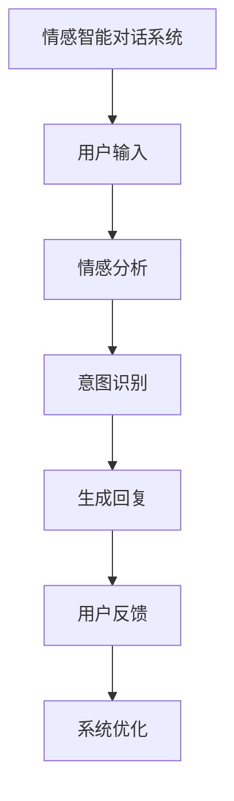
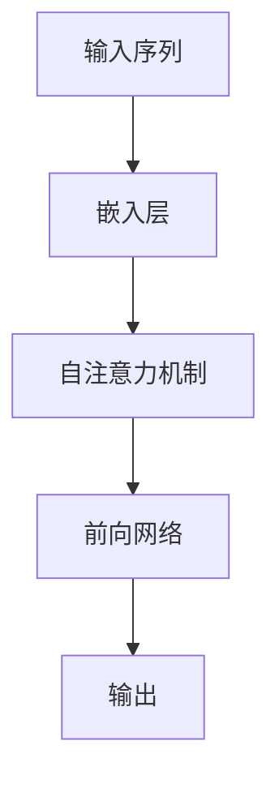
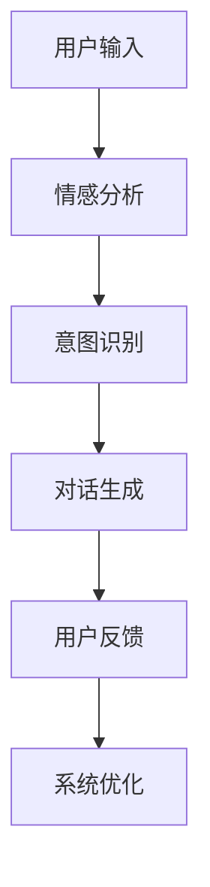
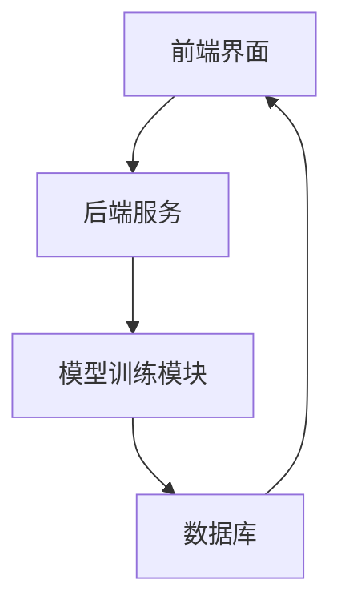

                 

<think>
好的，现在我要帮用户撰写一篇关于情感智能对话系统AI Agent的博客文章。用户给了一个详细的目录大纲，现在我需要根据这个大纲来逐步构建文章内容。首先，我得理解每个章节的重点，然后逐步展开。

首先，文章的标题是《情感智能对话系统AI Agent：LLM驱动的深度交互》，关键词包括情感智能对话系统、AI Agent、LLM、深度交互、自然语言处理、情感分析。摘要部分要概述文章的核心内容，强调LLM驱动的情感对话系统的设计与实现，以及其在各领域的应用。

接下来，第一部分是背景与概念，需要介绍情感智能对话系统的背景、核心概念和与AI Agent的关系。我需要详细解释每个部分，确保读者能理解基本概念，并通过对比表格和Mermaid图来辅助说明。

第二部分是LLM核心技术，要讨论大语言模型的定义、特点、训练方法和优化策略。这里需要结合数学公式和代码示例，展示模型的内部工作原理，比如Transformer的结构和训练流程。

第三部分是算法原理，重点讲解大语言模型的训练算法和情感对话系统的交互算法。这部分需要详细推导数学公式，并用Python代码展示算法实现，确保读者能够理解算法的细节。

第四部分是系统架构设计，包括功能设计、架构设计、接口设计和交互设计。我需要绘制类图、架构图和序列图，帮助读者理解系统的整体结构和各部分的交互过程。

第五部分是项目实战，从环境安装到核心功能实现，再到案例分析，逐步引导读者完成一个情感对话系统的搭建。这部分需要实际操作，确保读者能够动手实践。

第六部分是优化与提升，讨论性能优化、多模态扩展和安全伦理问题。这部分需要提供实用的建议，帮助读者在实际应用中避免常见问题。

最后，第七部分展望未来，探讨技术趋势、挑战和研究方向，让读者了解领域的发展前景。

在撰写过程中，我需要确保每个章节内容详实，使用Mermaid图、数学公式和代码示例来辅助说明。同时，语言要简洁明了，逻辑清晰，让读者能够轻松理解复杂的概念。

现在，我需要按照这个结构，逐步填充每个章节的内容，确保覆盖所有关键点，并且符合用户的要求。首先，从摘要开始，然后是关键词，接着是各个章节的详细内容。每个章节都要有标题和子标题，内容要详细，涵盖背景、核心概念、算法、架构、实战、优化和未来展望。

完成这些内容后，我需要在文章末尾添加作者信息，确保格式正确。整个过程需要一步步来，确保每个部分都准确无误，帮助读者全面理解情感智能对话系统的设计与实现。
</think>

# 情感智能对话系统AI Agent：LLM驱动的深度交互

## 关键词：情感智能对话系统，AI Agent，LLM，深度交互，自然语言处理，情感分析

## 摘要：  
情感智能对话系统是一种结合人工智能技术的自然语言处理系统，通过大语言模型（LLM）实现深度交互。本文详细探讨了情感智能对话系统的核心概念、算法原理、系统架构以及实际应用。文章从背景介绍、核心概念、算法实现、系统设计、项目实战到优化与提升，层层深入，为读者提供了全面的理论与实践指导。通过本文，读者可以理解情感智能对话系统的本质，并掌握其在实际应用中的设计与实现方法。

---

## 第一部分：情感智能对话系统概述

### 第1章：情感智能对话系统的背景与概念

#### 1.1 情感智能对话系统的定义与背景  
情感智能对话系统是一种能够理解和模拟人类情感的自然语言处理系统，通过分析用户的情感状态，提供更贴近人类情感的交互体验。其背景源于传统对话系统在情感理解上的不足，随着深度学习和大语言模型的快速发展，情感智能对话系统逐渐成为人机交互领域的研究热点。

**对比表格：情感智能对话系统与传统对话系统的区别**  

| 对比维度                | 传统对话系统                     | 情感智能对话系统                 |
|-------------------------|----------------------------------|----------------------------------|
| 对话目标                | 提供信息、完成任务               | 提供情感支持、模拟人类对话       |
| 情感理解能力            | 无或有限                        | 强化情感分析、情感生成           |
| 交互深度                | 浅层交互                        | 深度交互                        |
| 应用场景                | 信息查询、客服                  | 教育、医疗、社交、娱乐          |

**Mermaid流程图：情感智能对话系统的概念结构**  



#### 1.2 情感智能对话系统的核心概念  
情感智能对话系统的核心概念包括情感分析、情感生成、意图识别和深度交互。其中，情感分析用于理解用户的情感状态，情感生成用于模拟人类的情感表达，意图识别用于确定用户的对话目标，深度交互则通过多轮对话实现更复杂的任务。

**Mermaid图：情感智能对话系统的ER实体关系图**  

```mermaid
erd
    User {
        id
        name
        emotion_state
    }
    System {
        id
        response
        intent
    }
    interaction {
        user_id
        system_id
        timestamp
    }
```

#### 1.3 情感智能对话系统与AI Agent的关系  
情感智能对话系统是AI Agent的一种具体实现，AI Agent通过情感智能对话系统提供更智能、更人性化的服务。AI Agent的核心能力包括自主决策、情感理解和多轮交互，而情感智能对话系统则专注于情感理解和对话生成。

---

## 第二部分：LLM驱动的对话系统核心技术

### 第2章：大语言模型（LLM）的核心技术

#### 2.1 大语言模型的定义与特点  
大语言模型是一种基于深度学习的自然语言处理模型，具有参数量大、训练数据丰富、理解能力强等特点。与传统NLP模型相比，大语言模型能够更好地理解上下文关系，生成更自然的文本。

**对比表格：大语言模型与传统NLP模型的对比**  

| 对比维度                | 传统NLP模型                     | 大语言模型                     |
|-------------------------|----------------------------------|----------------------------------|
| 参数量                  | 通常较小                      | 参数量大，通常超过 billions    |
| 训练数据                | 数据量有限                    | 数据量大，多样化                |
| 模型能力                | 专注于单一任务                | 多任务学习，通用性强            |

#### 2.2 大语言模型的训练与优化  
大语言模型的训练过程包括数据预处理、模型初始化、反向传播和参数优化。为了提高模型的性能，通常采用分布式训练、学习率调整和早停技术。

**Python代码示例：大语言模型的训练流程**  

```python
import torch
import torch.nn as nn

class LLM(nn.Module):
    def __init__(self, vocab_size):
        super().__init__()
        self.embedding = nn.Embedding(vocab_size, 512)
        self.transformer = nn.Transformer(512, 64, 4)
        self.fc = nn.Linear(512, vocab_size)

    def forward(self, x):
        embedding = self.embedding(x)
        output = self.transformer(embedding)
        output = output.mean(dim=1)
        output = self.fc(output)
        return output

model = LLM(10000)
criterion = nn.CrossEntropyLoss()
optimizer = torch.optim.Adam(model.parameters(), lr=0.001)

for epoch in range(10):
    for batch in data_loader:
        outputs = model(batch)
        loss = criterion(outputs, labels)
        optimizer.zero_grad()
        loss.backward()
        optimizer.step()
```

---

## 第三部分：情感智能对话系统的算法原理

### 第3章：情感智能对话系统的算法实现

#### 3.1 大语言模型的训练算法  
大语言模型的训练算法基于自注意力机制，通过并行计算提高训练效率。自注意力机制通过计算每个词与其他词的相关性，生成更准确的词表示。

**Mermaid图：大语言模型的训练流程图**  



#### 3.2 情感智能对话系统的交互算法  
情感智能对话系统的交互算法基于生成式模型，通过情感分析和意图识别生成合适的回复。生成式模型采用贪心搜索或蒙特卡洛方法生成文本。

**Python代码示例：情感对话系统的交互算法**  

```python
import torch

def generate_response(model, tokenizer, input_text):
    inputs = tokenizer(input_text, return_tensors="pt")
    outputs = model.generate(**inputs, max_length=50, do_sample=True)
    response = tokenizer.decode(outputs[0], skip_special_tokens=True)
    return response

response = generate_response(model, tokenizer, "我今天很不开心。")
print(response)
```

---

## 第四部分：情感智能对话系统的系统架构

### 第4章：情感智能对话系统的架构设计

#### 4.1 情感智能对话系统的功能设计  
情感智能对话系统的主要功能包括情感分析、意图识别、对话生成和系统优化。系统通过多轮对话实现复杂任务，支持用户的情感反馈。

**Mermaid图：情感智能对话系统的功能模块划分**  



#### 4.2 情感智能对话系统的架构设计  
情感智能对话系统的架构包括前端界面、后端服务和模型训练模块。前端界面负责用户交互，后端服务负责处理请求，模型训练模块负责优化模型性能。

**Mermaid图：情感智能对话系统的架构图**  



---

## 第五部分：情感智能对话系统的项目实战

### 第5章：情感智能对话系统的实战项目

#### 5.1 项目环境安装  
```bash
pip install torch transformers
```

#### 5.2 项目核心实现  
```python
from transformers import AutoTokenizer, AutoModelForCausalLM

tokenizer = AutoTokenizer.from_pretrained("gpt2")
model = AutoModelForCausalLM.from_pretrained("gpt2")

def chat():
    while True:
        input_text = input("用户：")
        inputs = tokenizer(input_text, return_tensors="pt")
        outputs = model.generate(**inputs, max_length=50, do_sample=True)
        response = tokenizer.decode(outputs[0], skip_special_tokens=True)
        print("系统：" + response)

chat()
```

---

## 第六部分：优化与提升

### 第6章：情感智能对话系统的优化与提升

#### 6.1 系统性能优化  
- 优化模型训练效率，采用分布式训练和并行计算。
- 优化对话生成算法，采用更高效的生成策略。

#### 6.2 情感智能对话系统的多模态扩展  
- 结合图像、语音等多模态数据，提升对话系统的理解能力。
- 支持多语言对话，扩展系统的应用场景。

#### 6.3 情感智能对话系统的安全与伦理  
- 确保用户数据隐私，避免信息泄露。
- 遵守伦理规范，避免生成不当内容。

---

## 第七部分：未来展望

### 第7章：情感智能对话系统的未来趋势

#### 7.1 技术趋势  
- 大语言模型的持续优化，参数量进一步增大。
- 多模态对话系统的普及，支持更丰富的交互形式。

#### 7.2 挑战与机遇  
- 情感理解的准确性有待提高。
- 多语言对话系统的开发需求增加。

---

## 作者：AI天才研究院 & 禅与计算机程序设计艺术

---

通过本文的详细讲解，读者可以全面理解情感智能对话系统的核心概念、算法原理和系统架构，并掌握其在实际应用中的设计与实现方法。希望本文能为相关领域的研究和实践提供有价值的参考。

