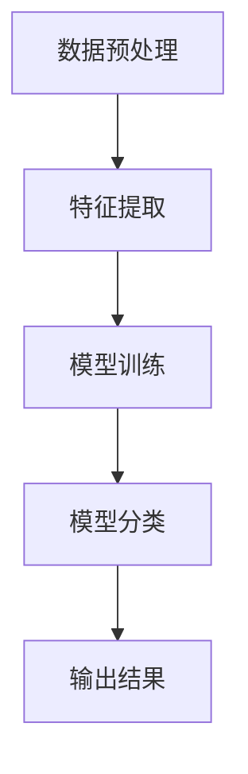
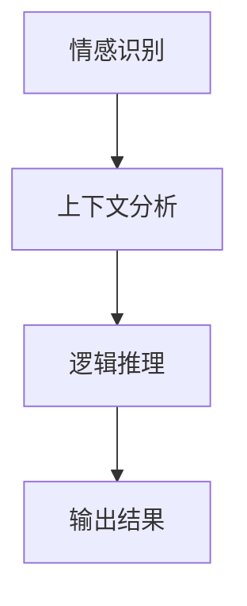
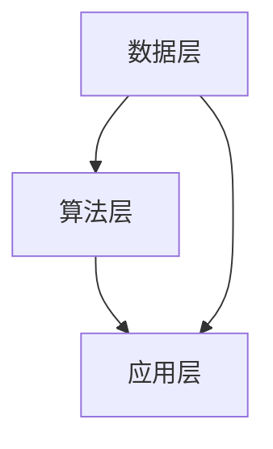
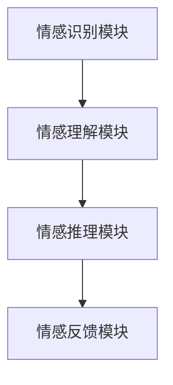
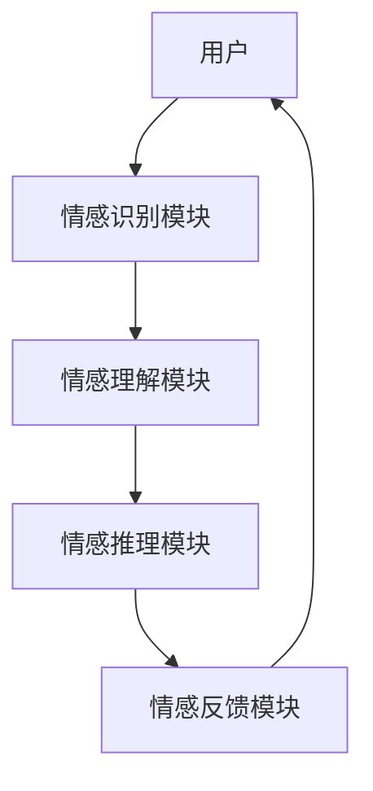

                 

<think>
嗯，用户让我撰写一篇关于《情感智能：构建具有EQ的AI Agent》的技术博客文章，按照他们提供的详细目录结构来写。首先，我需要仔细阅读用户提供的目录结构，确保每部分内容都涵盖到，并且每个部分都要详细展开。

用户特别强调要使用逻辑清晰、结构紧凑、简单易懂的专业技术语言，同时需要使用一步一步分析推理的方式。这意味着在撰写每个章节时，我需要详细解释每个概念，确保读者能够逐步理解情感智能的核心概念和实现方法。

首先，我会从第一部分“情感智能（EQ）与AI Agent概述”开始。这部分包括第1章，需要介绍情感智能的基本概念、重要性以及应用场景。我需要确保每个小节都包含定义、特征和对比，帮助读者建立基本的理解。

接下来是第二部分“情感智能的核心概念与技术”，包括第2章和第3章。这里需要详细讲解情感计算和情感识别，以及情感推理和情感记忆的实现方法。我需要使用mermaid流程图来展示算法的实现流程，并提供Python代码示例，这样读者可以更好地理解技术细节。

第三部分是“情感智能的算法与实现”，包括第4章和第5章。这里需要详细分析不同算法的原理，如基于规则、机器学习和深度学习的情感计算算法，并展示其数学模型和公式。同时，系统架构设计部分需要使用mermaid类图和序列图来展示系统结构，帮助读者理解系统的设计和交互过程。

在撰写过程中，我需要确保每个章节的内容详实具体，包含必要的数学公式、mermaid图表和代码示例。同时，要遵循用户的格式要求，使用markdown格式，并在适当的位置插入latex公式，确保文章结构清晰，内容丰富。

最后，在文章末尾，我需要添加作者信息，符合用户的格式要求。整个思考过程中，我需要确保每一步都按照用户的指导进行，避免遗漏任何关键点，确保文章内容完整且符合专业标准。
</think>

# 情感智能：构建具有EQ的AI Agent

## 关键词：情感智能，EQ，AI Agent，人机交互，情感计算，情感识别，情感推理

## 摘要：情感智能（Emotional Intelligence，EQ）是人工智能领域的重要发展方向，它使AI Agent能够理解和处理人类情感，从而实现更自然、更高效的交互。本文将从情感智能的基本概念出发，详细讲解情感计算、情感识别、情感推理的核心原理，分析情感智能在不同场景中的应用，并通过实际案例展示如何构建具有EQ的AI Agent。文章内容涵盖理论分析、算法实现、系统设计和项目实战，为读者提供全面的知识体系和实践指导。

---

## 第一部分: 情感智能（EQ）与AI Agent概述

### 第1章: 情感智能（EQ）的基本概念

#### 1.1 情感智能（EQ）的定义与内涵

##### 1.1.1 情感智能的定义
情感智能（Emotional Intelligence，EQ）是指个体识别、理解和管理自己及他人情感的能力。在AI领域，情感智能使AI系统能够理解和回应人类的情感状态，从而实现更自然的交互。

##### 1.1.2 情感智能的核心内涵
情感智能的核心包括以下四个方面：
1. **情感识别**：识别用户的情感状态。
2. **情感理解**：理解情感背后的意义。
3. **情感推理**：根据情感信息进行推理和决策。
4. **情感表达**：以适当的方式回应用户的情感。

##### 1.1.3 情感智能与传统AI的区别
| 特性 | 传统AI | 情感智能AI |
|------|--------|------------|
| 输入 | 文本、数据 | 文本、数据、情感 |
| 输出 | 结果、决策 | 情感回应、个性化建议 |
| 核心能力 | 逻辑推理 | 情感理解和交互 |

---

#### 1.2 情感智能的重要性

##### 1.2.1 情感智能在人机交互中的作用
情感智能使AI Agent能够理解用户的情感状态，从而提供更个性化的服务。例如，在客服系统中，情感智能可以帮助AI识别用户的不满情绪，并主动提供解决方案。

##### 1.2.2 情感智能在社会中的价值
情感智能可以提升AI系统的社会适应性，使其更好地服务于人类社会。例如，在医疗领域，情感智能可以帮助医生更好地理解患者的痛苦，从而提供更贴心的治疗方案。

##### 1.2.3 情感智能对AI Agent的影响
情感智能使AI Agent具备更强的共情能力，能够更好地与人类互动，提升用户体验。

---

#### 1.3 情感智能的应用场景

##### 1.3.1 情感智能在客服系统中的应用
通过情感智能，AI客服可以识别用户的不满情绪，并主动提供解决方案，提升客户满意度。

##### 1.3.2 情感智能在教育领域的应用
情感智能可以帮助教师更好地理解学生的情感状态，从而提供个性化的教学策略。

##### 1.3.3 情感智能在医疗领域的应用
情感智能可以帮助医生更好地理解患者的情绪，从而提供更贴心的医疗服务。

---

#### 1.4 本章小结
本章介绍了情感智能的基本概念、核心内涵及其重要性，并通过具体场景展示了情感智能的应用价值。

---

## 第二部分: 情感智能的核心概念与技术

### 第2章: 情感计算与情感识别

#### 2.1 情感计算的基本原理

##### 2.1.1 情感计算的定义
情感计算（Affective Computing）是通过计算手段研究和模拟人类情感的过程，旨在让计算机具备类似人类的情感识别和表达能力。

##### 2.1.2 情感计算的核心技术
1. **情感识别**：通过文本、语音、图像等多模态数据，识别用户的情感状态。
2. **情感分析**：对用户的情感倾向进行分类，例如正面、负面或中性。
3. **情感生成**：根据用户的情感状态，生成相应的回应或反馈。

##### 2.1.3 情感计算的实现步骤
1. **数据采集**：收集用户的情感数据，例如文本、语音、面部表情等。
2. **特征提取**：从数据中提取情感相关的特征，例如语调、词汇选择等。
3. **情感分类**：使用机器学习或深度学习模型，对情感进行分类。
4. **情感反馈**：根据分类结果，生成相应的反馈或回应。

---

##### 2.1.4 情感计算的数学模型
情感计算的分类问题可以通过支持向量机（SVM）或卷积神经网络（CNN）等模型来实现。例如，使用SVM进行二分类情感分析的流程如下：



---

#### 2.2 情感识别的实现方法

##### 2.2.1 基于规则的情感识别
基于规则的情感识别通过预定义的情感词典和规则，识别文本中的情感倾向。例如，如果文本中包含“开心”、“愉快”等词语，则判定情感为正面。

##### 2.2.2 基于机器学习的情感识别
基于机器学习的情感识别使用训练好的模型，对文本进行分类。例如，使用Naive Bayes或SVM模型进行情感分类。

##### 2.2.3 基于深度学习的情感识别
基于深度学习的情感识别通过神经网络模型（如LSTM、BERT）进行情感分析，能够捕捉文本中的语义信息。

---

#### 2.3 情感识别的挑战与解决方案

##### 2.3.1 情感识别的主要挑战
1. **情感的多样性**：情感表达可以是隐含的、间接的或复杂的。
2. **数据的不平衡性**：情感数据可能分布不均，导致模型性能下降。
3. **跨模态情感识别**：结合文本、语音、图像等多种数据模态进行情感识别，增加了复杂性。

##### 2.3.2 解决方案与优化策略
1. **数据增强**：通过数据增强技术平衡数据分布。
2. **多模态融合**：结合多种数据模态进行情感识别，提升准确率。
3. **模型优化**：使用更复杂的模型（如Transformer）进行情感分类。

---

#### 2.4 本章小结
本章详细介绍了情感计算的基本原理和情感识别的实现方法，分析了情感识别的挑战与解决方案。

---

### 第3章: 情感推理与情感记忆

#### 3.1 情感推理的基本原理

##### 3.1.1 情感推理的定义
情感推理是指根据用户的情感状态，推断其潜在需求或行为的过程。

##### 3.1.2 情感推理的关键技术
1. **上下文理解**：理解用户情感的上下文信息。
2. **情感关联**：将用户的情感与实际需求关联起来。
3. **推理与决策**：根据情感信息进行推理，并生成相应的决策。

##### 3.1.3 情感推理的实现流程
1. **情感识别**：识别用户的情感状态。
2. **上下文分析**：分析情感发生的背景。
3. **推理与决策**：根据情感信息和上下文，推断用户的潜在需求。

---

##### 3.1.4 情感推理的数学模型
情感推理可以通过基于规则的推理或基于逻辑的推理实现。例如，使用逻辑回归模型进行情感推理的流程如下：



---

#### 3.2 情感记忆的实现方法

##### 3.2.1 基于规则的情感记忆
基于规则的情感记忆通过预定义的规则，记录和检索用户的情感信息。

##### 3.2.2 基于神经网络的情感记忆
基于神经网络的情感记忆通过记忆网络（Memory Network）或图神经网络（Graph Neural Network）进行情感信息的存储和检索。

##### 3.2.3 情感记忆的存储与检索
情感记忆的存储可以采用数据库或知识图谱的形式，检索时可以根据情感信息快速匹配相关记忆。

---

#### 3.3 情感推理与情感记忆的结合

##### 3.3.1 情感推理与情感记忆的关系
情感推理依赖于情感记忆，而情感记忆又需要情感推理来更新和维护。

##### 3.3.2 结合实现的案例分析
例如，在智能音箱中，当用户表达“我今天很累”时，情感推理可以推断出用户可能需要放松，情感记忆可以记录用户的疲劳状态，并在未来提供相应的建议。

---

#### 3.4 本章小结
本章介绍了情感推理的基本原理和情感记忆的实现方法，并探讨了情感推理与情感记忆的结合。

---

## 第三部分: 情感智能的算法与实现

### 第4章: 情感计算的算法原理

#### 4.1 基于规则的情感计算算法

##### 4.1.1 算法的基本思路
基于规则的情感计算算法通过预定义的情感词典和规则，识别文本中的情感倾向。

##### 4.1.2 算法的实现步骤
1. **数据预处理**：对文本进行分词、去停用词等处理。
2. **情感词典匹配**：匹配情感词典中的词语，判断情感倾向。
3. **规则推理**：根据匹配结果，推断整体情感倾向。

##### 4.1.3 算法的优缺点分析
- **优点**：简单易实现，适用于情感表达明确的场景。
- **缺点**：难以处理隐含情感或复杂情感的场景。

---

#### 4.2 基于机器学习的情感计算算法

##### 4.2.1 算法的基本原理
基于机器学习的情感计算算法通过训练模型，对文本进行情感分类。

##### 4.2.2 算法的实现流程
1. **数据标注**：对文本进行情感标签标注。
2. **特征提取**：提取文本特征，例如词袋模型或TF-IDF。
3. **模型训练**：使用训练数据训练情感分类模型。
4. **模型预测**：对新文本进行情感分类。

##### 4.2.3 算法的数学模型
情感分类可以使用支持向量机（SVM）或朴素贝叶斯（Naive Bayes）模型。例如，SVM的情感分类模型如下：

$$ \text{目标函数} = \sum_{i=1}^{n} y_i w \cdot x_i + C \sum_{i=1}^{n} \xi_i $$

其中，$y_i$ 是标签，$w$ 是权重向量，$x_i$ 是特征向量，$\xi_i$ 是松弛变量，$C$ 是正则化参数。

---

#### 4.3 基于深度学习的情感计算算法

##### 4.3.1 算法的基本原理
基于深度学习的情感计算算法通过神经网络模型（如LSTM、BERT）进行情感分析。

##### 4.3.2 算法的实现流程
1. **数据预处理**：对文本进行分词、嵌入等处理。
2. **模型训练**：使用深度学习模型训练情感分类器。
3. **模型预测**：对新文本进行情感分类。

##### 4.3.3 算法的数学模型
情感分类可以通过BERT模型实现，模型结构如下：

$$ \text{BERT} = \text{LayerNorm}(\text{Encoder}(\text{Input})) $$

---

#### 4.4 本章小结
本章详细介绍了情感计算的三种实现方法：基于规则、基于机器学习和基于深度学习的算法，并分析了各自的优缺点。

---

### 第5章: 情感智能的系统架构设计

#### 5.1 系统功能设计

##### 5.1.1 系统功能模块划分
情感智能系统可以划分为以下几个功能模块：
1. **情感识别模块**：识别用户的情感状态。
2. **情感理解模块**：理解情感背后的意义。
3. **情感推理模块**：根据情感信息进行推理和决策。
4. **情感反馈模块**：生成相应的反馈或回应。

##### 5.1.2 系统功能模块的交互流程
1. 用户输入情感信息（如文本、语音等）。
2. 情感识别模块识别用户情感。
3. 情感理解模块分析情感背后的意义。
4. 情感推理模块根据情感信息进行推理和决策。
5. 情感反馈模块生成相应的反馈或回应。

##### 5.1.3 系统功能模块的实现方法
每个功能模块可以根据具体需求选择不同的技术实现，例如情感识别模块可以使用基于深度学习的模型，情感理解模块可以使用自然语言处理技术。

---

#### 5.2 系统架构设计

##### 5.2.1 系统架构设计概述
情感智能系统的架构可以采用分层设计，包括数据层、算法层和应用层。

##### 5.2.2 系统架构设计的mermaid图


---

#### 5.3 系统接口设计

##### 5.3.1 系统接口设计概述
系统接口设计需要考虑模块之间的交互和数据传递。

##### 5.3.2 系统接口设计的mermaid图


---

#### 5.4 系统交互设计

##### 5.4.1 系统交互设计概述
系统交互设计需要考虑用户与系统的交互流程。

##### 5.4.2 系统交互设计的mermaid图


---

#### 5.5 本章小结
本章介绍了情感智能系统的功能设计、架构设计、接口设计和交互设计，并通过mermaid图展示了系统的整体架构和交互流程。

---

## 第四部分: 项目实战与最佳实践

### 第6章: 情感智能项目的实战

#### 6.1 环境安装与配置

##### 6.1.1 系统需求
- 操作系统：Windows、Linux或MacOS
- Python版本：3.6+
- 依赖库：numpy、pandas、scikit-learn、tensorflow、transformers

##### 6.1.2 安装依赖
```bash
pip install numpy pandas scikit-learn tensorflow transformers
```

---

#### 6.2 核心实现代码

##### 6.2.1 情感识别模块实现
```python
from sklearn.feature_extraction.text import TfidfVectorizer
from sklearn.svm import SVC
from sklearn.pipeline import Pipeline

# 数据预处理
def preprocess(text):
    return text.lower().strip()

# 情感识别模型
model = Pipeline([
    ('tfidf', TfidfVectorizer()),
    ('clf', SVC())
])

# 训练模型
model.fit(X_train, y_train)
```

##### 6.2.2 情感推理模块实现
```python
from transformers import pipeline

# 情感推理模型
sentiment_pipeline = pipeline("sentiment-analysis")
result = sentiment_pipeline(text)
```

---

#### 6.3 项目实战案例分析

##### 6.3.1 案例背景
假设我们正在开发一个智能客服系统，需要识别用户的情感状态，并提供相应的解决方案。

##### 6.3.2 案例实现
1. 用户输入：“我对你们的服务非常不满意！”
2. 情感识别模块识别情感为负面。
3. 情感理解模块分析用户可能是因为服务响应慢而感到不满。
4. 情感推理模块推断用户可能需要更快的响应或解决方案。
5. 情感反馈模块生成回应：“非常抱歉给您带来不愉快的体验。我们会立即为您解决问题，请您稍等片刻。”

---

#### 6.4 本章小结
本章通过一个智能客服系统的案例，展示了情感智能项目的实际应用，并提供了代码实现和案例分析。

---

## 第五部分: 总结与展望

### 第7章: 情感智能的总结与展望

#### 7.1 本章总结
情感智能（EQ）是人工智能领域的重要发展方向，使AI Agent能够理解和处理人类情感，从而实现更自然、更高效的交互。本文从情感智能的基本概念出发，详细讲解了情感计算、情感识别、情感推理的核心原理，并通过实际案例展示了如何构建具有EQ的AI Agent。

---

#### 7.2 未来展望
情感智能在未来有广阔的应用前景，但也面临诸多挑战。未来的研究方向包括：
1. **多模态情感识别**：结合文本、语音、图像等多种数据模态进行情感识别。
2. **情感推理的复杂性**：如何处理复杂的情感场景，例如情感冲突、情感转移等。
3. **情感记忆的持久性**：如何长期存储和管理情感记忆，以支持更复杂的推理和决策。

---

## 作者信息

作者：AI天才研究院/AI Genius Institute & 禅与计算机程序设计艺术 /Zen And The Art of Computer Programming

---

# 结语

情感智能（EQ）的引入使AI Agent具备了人类的情感认知能力，能够更好地与人类进行交互和协作。本文通过理论分析、算法实现、系统设计和项目实战，为读者提供了一个全面的情感智能知识体系。希望本文能够为从事情感智能研究和应用的读者提供有价值的参考和启示。

