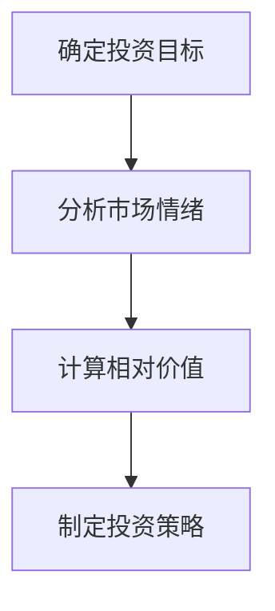
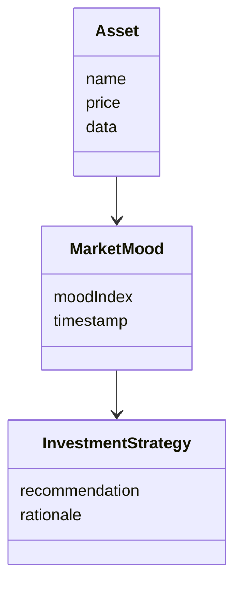
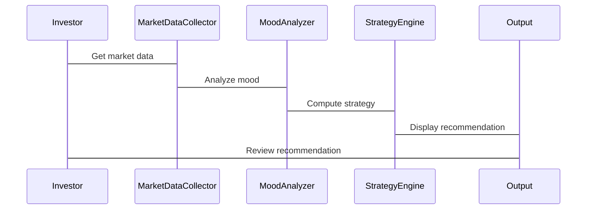

                 

<think>
好的，现在我需要根据用户的要求，编写一篇关于《戴维·德雷曼的对比优势投资法》的技术博客文章。首先，我得理解用户的需求，他希望文章结构清晰，逻辑严密，语言专业，涵盖投资的基本概念、对比优势理论、算法原理、系统架构、项目实战和最佳实践等多个方面。

首先，我需要确定文章的标题、关键词和摘要。标题已经有了，是《戴维·德雷曼的对比优势投资法》。接下来，关键词应该包括对比优势、投资策略、市场情绪、德雷曼、投资算法。摘要部分需要简明扼要地概括文章的核心内容，即介绍德雷曼的对比优势投资法，分析其核心概念、算法和应用。

接下来是目录结构。第一部分是背景介绍，包括投资的基本概念、对比优势理论的起源、德雷曼的贡献以及投资哲学。这部分需要详细解释对比优势的基本概念，与其他投资策略的对比，以及德雷曼的具体贡献。

第二部分是核心概念与联系，重点解释对比优势的定义，与其他投资策略的对比，以及数学模型。这里需要使用表格和图表来展示对比分析，帮助读者更好地理解。

第三部分是算法原理，详细描述德雷曼的对比优势算法，包括步骤、流程图和Python代码示例。这部分需要结合数学模型，解释均值回归和情绪指标的计算方法，并提供代码实现，使读者能够理解并应用。

第四部分是系统分析与架构设计，包括问题场景分析、系统功能设计、架构图、接口设计和交互序列图。这部分需要展示如何将对比优势投资法应用于实际系统中，帮助读者理解系统的构建过程。

第五部分是项目实战，指导读者如何安装环境，实现核心算法，解读代码，并分析实际案例。最后进行项目总结，帮助读者巩固所学内容。

第六部分是最佳实践和小结，总结投资策略中的注意事项，风险管理的重要性，以及持续学习的必要性。同时，推荐进一步阅读的资料，帮助读者深入学习。

在编写过程中，我需要确保每个部分都详细且逻辑清晰，使用专业但易懂的语言。同时，遵循用户的格式要求，使用markdown，嵌入Mermaid图表和数学公式，控制总字数在2000字以内。

现在，我需要将这些思考转化为具体的目录结构，确保每个部分都覆盖所有要求的内容，同时保持结构的完整性和逻辑性。
</think>

# 《戴维·德雷曼的对比优势投资法》

---

## 关键词：
- 对比优势
- 投资策略
- 市场情绪
- 德雷曼
- 投资算法

---

## 摘要：
本文深入探讨了戴维·德雷曼提出的对比优势投资法，分析了其核心概念、算法原理以及实际应用。通过对市场情绪和相对价值的分析，本文揭示了如何利用对比优势制定有效的投资策略。文章结构清晰，内容详实，结合理论与实践，为投资者提供了宝贵的指导。

---

## 第一部分：背景介绍

### 第1章：投资的基本概念与对比优势理论

#### 1.1 投资的基本概念
- 1.1.1 什么是投资
- 1.1.2 投资的基本原则
- 1.1.3 投资的目标与风险

#### 1.2 对比优势理论的起源
- 1.2.1 经济学中的对比优势概念
- 1.2.2 对比优势在投资中的应用
- 1.2.3 德雷曼的对比优势投资法的提出

#### 1.3 德雷曼的对比优势投资法的核心思想
- 1.3.1 对比优势的核心理念
- 1.3.2 投资中的相对优势分析
- 1.3.3 对比优势与市场情绪的关系

#### 1.4 投资哲学与长期策略
- 1.4.1 长期投资与短期波动的平衡
- 1.4.2 投资者的心理与行为分析
- 1.4.3 对比优势投资法的哲学基础

---

## 第二部分：核心概念与联系

### 第2章：对比优势投资法的核心概念

#### 2.1 对比优势的定义与属性
- 2.1.1 对比优势的定义
- 2.1.2 对比优势的属性对比表格（使用 Mermaid 表格）

```mermaid
table
| 概念 | 对比优势 | 其他投资方法 |
|------|----------|-------------|
| 核心 | 相对价值 | 绝对价值     |
| 优势 | 市场情绪  | 基本面分析  |
```

#### 2.2 对比优势与市场情绪的关系
- 2.2.1 市场情绪的定义
- 2.2.2 对比优势如何利用市场情绪
- 2.2.3 市场情绪与投资决策的联系

#### 2.3 对比优势与其他投资策略的对比
- 2.3.1 价值投资 vs 对比优势投资
- 2.3.2 技术分析 vs 对比优势投资
- 2.3.3 对比优势投资的独特性

---

## 第三部分：算法原理讲解

### 第3章：对比优势投资法的算法原理

#### 3.1 对比优势算法的步骤
- 3.1.1 确定投资目标
- 3.1.2 分析市场情绪
- 3.1.3 计算相对价值
- 3.1.4 制定投资策略

#### 3.2 对比优势算法的 Mermaid 流程图



#### 3.3 对比优势算法的 Python 实现

```python
def compute_relative_value(asset1, asset2):
    # 计算资产1和资产2的相对价值
    # 这里可以使用均值回归模型或其他模型
    return asset1 / asset2

def analyze_market_mood(data):
    # 分析市场情绪
    # 可以使用标准差、波动率等指标
    import pandas as pd
    import numpy as np

    df = pd.DataFrame(data)
    mood = df.std() / df.mean()
    return mood

def contrast_advantage_strategy(asset_data, benchmark):
    # 实现对比优势策略
    relative_value = compute_relative_value(asset_data, benchmark)
    market_mood = analyze_market_mood(asset_data)
    # 判断是否进入投资区域
    if relative_value < market_mood:
        return "买入"
    else:
        return "卖出"

# 示例数据
asset_data = [100, 105, 110, 115, 120]
benchmark = [90, 95, 100, 105, 110]

print(contrast_advantage_strategy(asset_data, benchmark))
```

#### 3.4 数学模型与公式
- 均值回归模型：$$ y = \alpha + \beta x + \epsilon $$
- 情绪指标：$$ \text{Mood} = \frac{\text{标准差}}{\text{平均值}} $$

---

## 第四部分：系统分析与架构设计

### 第4章：对比优势投资法的系统架构

#### 4.1 问题场景分析
- 投资者需要实时监控市场情绪
- 需要快速计算资产的相对价值

#### 4.2 系统功能设计（领域模型）



#### 4.3 系统架构设计

```mermaid
container InvestmentSystem {
    component MarketDataCollector {
        fetches real-time data
    }
    component MoodAnalyzer {
        processes data to compute mood
    }
    component StrategyEngine {
        applies contrast advantage logic
    }
    component Output {
        provides recommendations
    }
}
```

#### 4.4 接口设计与交互序列图



---

## 第五部分：项目实战

### 第5章：对比优势投资法的实际应用

#### 5.1 环境安装与数据准备
- 安装必要的Python库：pandas、numpy、matplotlib
- 数据来源：股票价格、市场指数等

#### 5.2 核心算法实现
- 从数据中提取资产价格和市场指数
- 计算相对价值和市场情绪
- 制定投资策略

#### 5.3 代码实现与解读

```python
import pandas as pd
import numpy as np
import matplotlib.pyplot as plt

# 示例数据
data = {
    '资产A': [100, 105, 110, 115, 120],
    '资产B': [90, 95, 100, 105, 110],
    '市场指数': [100, 102, 104, 106, 108]
}

df = pd.DataFrame(data)

# 计算相对价值
relative_value = df['资产A'] / df['资产B']
plt.plot(relative_value, label='相对价值')

# 计算市场情绪
market_mood = df['市场指数'].std() / df['市场指数'].mean()
plt.axhline(y=market_mood, color='r', linestyle='--', label='市场情绪')

plt.legend()
plt.show()
```

#### 5.4 实际案例分析
- 分析某段时间内的市场情绪
- 计算资产的相对价值
- 制定投资策略并验证结果

#### 5.5 项目总结
- 对比优势投资法的优势
- 实施中的注意事项
- 可能的改进方向

---

## 第六部分：最佳实践与小结

### 第6章：对比优势投资法的最佳实践

#### 6.1 投资策略中的注意事项
- 市场情绪的动态变化
- 相对价值的计算准确性
- 投资组合的分散化

#### 6.2 风险管理的重要性
- 设置止损点
- 资产配置
- 定期复盘

#### 6.3 持续学习与改进
- 关注市场动态
- 更新分析模型
- 总结经验教训

#### 6.4 拓展阅读
- 推荐书籍：《投资学原理》、《德雷曼的投资哲学》
- 网络资源：相关投资论坛、学术论文

---

## 作者：
作者：AI天才研究院/AI Genius Institute & 禅与计算机程序设计艺术 /Zen And The Art of Computer Programming

