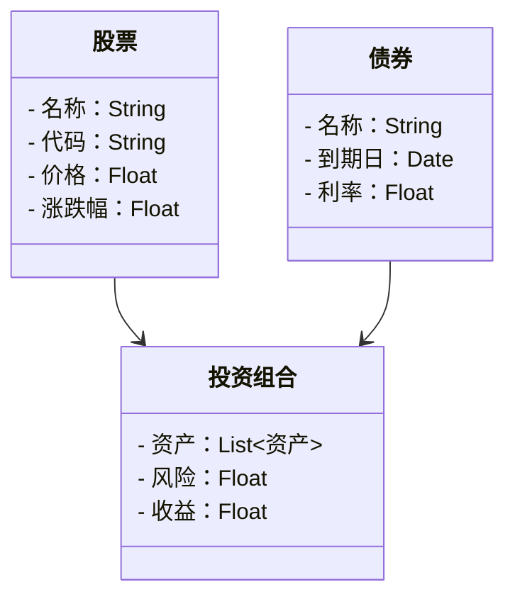
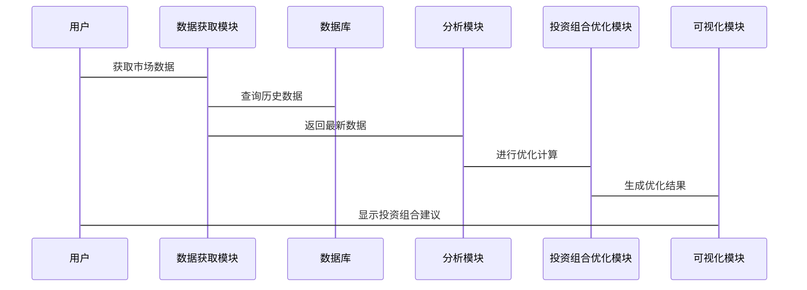

                 

<think>
好的，我现在需要帮用户撰写一篇关于“打造全面的投资理财知识图谱：方法与工具”的技术博客文章。首先，我要明确用户的需求，他们希望文章结构清晰，逻辑严谨，涵盖从基础知识到实际应用的各个方面，并且要结合技术工具和方法论。

首先，我会从文章的标题和摘要开始，确保它们能够准确反映文章的核心内容。接着，我会按照目录大纲逐步展开每个章节，确保每个部分都包含足够的细节和深入的分析。

在第一章，我需要介绍投资理财的基本概念，包括定义、核心要素以及目标。这部分需要让读者对投资理财有一个全面的了解，为后续内容打下基础。

第二章重点讲解投资理财的核心方法论，包括投资组合理论、现金流分析和投资决策模型。这部分需要结合实际案例和数学模型，帮助读者理解复杂的理论。

第三章涉及投资理财工具与技术，我会介绍数据分析工具、投资组合管理工具以及风险管理工具，并提供实际操作中的代码示例和工具使用方法，帮助读者将理论应用到实践中。

第四章是关于投资理财系统的架构设计，我需要从系统需求分析开始，逐步设计系统的功能模块、架构和接口，并使用Mermaid图来展示系统结构，使内容更直观。

第五章是项目实战，我会详细指导读者如何进行环境安装，提供核心代码实现，并通过实际案例分析，帮助读者巩固所学知识。

最后，我会总结投资理财的整体知识体系，强调理论与实践的结合，并提出一些实用的建议和注意事项。

在写作过程中，我会注意使用技术术语的准确性，确保内容专业且易于理解。同时，我会结合图表、代码示例和数学公式，帮助读者更好地理解和应用所学内容。

完成这些步骤后，我需要检查文章的结构和内容，确保每个部分都符合用户的要求，并且逻辑清晰，条理分明。最后，我会在文章末尾添加作者信息，使文章显得完整专业。
</think>

# 打造全面的投资理财知识图谱：方法与工具

> 关键词：投资理财，知识图谱，数据分析，风险管理，投资组合，量化投资

> 摘要：本文将从投资理财的基本概念出发，逐步分析投资理财的核心方法论，涵盖投资组合理论、现金流分析和投资决策模型等核心内容。接着，本文将详细探讨投资理财相关的工具与技术，包括数据分析工具、投资组合管理工具和风险管理工具等。最后，本文将结合实际案例，通过系统架构设计和项目实战，帮助读者构建全面的投资理财知识图谱，实现从理论到实践的完整跨越。

---

## 第1章: 投资理财基础知识

### 1.1 投资理财的基本概念

#### 1.1.1 投资与理财的定义

投资是指将资金投入到某种资产或项目中，以期获得超过初始投入的收益。理财则是指对个人或家庭的财务进行科学规划和管理，以实现财务目标的过程。投资是理财的重要组成部分，而理财则是投资的指导和目标。

#### 1.1.2 投资理财的核心要素

- **资产**：包括股票、债券、基金、房地产等多种投资品种。
- **风险**：投资的潜在损失，需要通过风险管理来控制。
- **收益**：投资的最终目标，通常以收益率或回报率衡量。
- **时间**：时间是投资的复利效应的重要因素。

#### 1.1.3 投资理财的目标与意义

投资理财的目标通常是实现资产的保值与增值，同时平衡风险与收益。通过科学的投资理财，可以提高资金的使用效率，实现财务自由。

### 1.2 资产配置与风险管理

#### 1.2.1 资产配置的基本原理

资产配置是指将资金分配到不同的资产类别中，以优化风险和收益。常见的资产配置策略包括**股债平衡型**、**稳健型**和**激进型**。

#### 1.2.2 风险管理的核心策略

风险管理是通过识别、评估和控制风险，降低投资损失的概率。常用的风险管理工具包括止损订单、对冲策略和分散投资。

#### 1.2.3 资产配置与风险管理的平衡

在实际投资中，资产配置和风险管理是相辅相成的。通过合理的资产配置，可以降低单一资产的风险，而风险管理策略则进一步保障了投资的安全性。

### 1.3 投资理财的分类与特点

#### 1.3.1 股票、债券、基金等主要投资品种

- **股票**：代表企业所有权，风险高，收益潜力大。
- **债券**：债务工具，风险较低，收益稳定。
- **基金**：集合投资工具，通过专业管理实现多元化投资。

#### 1.3.2 不同投资品种的风险与收益特征

- **股票**：高风险，高收益。
- **债券**：低风险，稳定收益。
- **基金**：风险和收益介于股票和债券之间。

#### 1.3.3 投资理财的多样化策略

通过多元化投资，可以降低非系统性风险，提高整体投资组合的稳定性。

---

## 第2章: 投资理财的核心方法论

### 2.1 投资组合理论

#### 2.1.1 投资组合理论的基本原理

投资组合理论由哈里·马科维茨提出，核心是通过优化资产配置，实现收益最大化和风险最小化。

#### 2.1.2 马科维茨的有效前沿理论

有效前沿是指在给定风险下，能够提供最高收益的投资组合的集合。投资者可以通过选择位于有效前沿上的投资组合，实现最优配置。

#### 2.1.3 现实中的投资组合优化方法

在实际操作中，投资组合优化需要考虑交易成本、税收等因素，常用的方法包括均值-方差优化和风险平价优化。

### 2.2 现金流分析与价值评估

#### 2.2.1 现金流分析的基本方法

现金流分析是评估投资项目价值的重要工具，常用的方法包括净现值（NPV）、内部收益率（IRR）等。

#### 2.2.2 股票估值的常用指标

- **市盈率（P/E）**：股价与每股收益的比率。
- **市净率（P/B）**：股价与每股净资产的比率。
- **股息率**：股息与股价的比率。

#### 2.2.3 债券定价与收益率计算

债券的价格由其票面利率、市场利率和剩余期限决定。收益率的计算方法包括票面收益率、当前收益率和到期收益率。

### 2.3 投资决策模型

#### 2.3.1 基于技术分析的投资决策模型

技术分析通过研究价格走势和成交量，预测未来的价格变动。常用的技术指标包括移动平均线、MACD和RSI等。

#### 2.3.2 基于基本面分析的投资决策模型

基本面分析通过研究企业的财务状况、行业地位和市场环境，评估其投资价值。常用的指标包括净利润率、资产负债率和ROE等。

#### 2.3.3 组合投资决策模型

组合投资决策模型通过综合考虑多个因素，优化投资组合的风险和收益。常用的方法包括现代投资组合理论和因子模型。

---

## 第3章: 投资理财工具与技术

### 3.1 数据分析工具

#### 3.1.1 常用的数据分析工具

- **Excel**：适合简单的数据处理和图表绘制。
- **Python**：适合复杂的数据分析和算法实现。
- **R语言**：适合统计分析和数据可视化的工具。

#### 3.1.2 数据可视化工具

- **Matplotlib**：Python中的绘图库，适合数据可视化。
- **Tableau**：专业的数据可视化工具，适合复杂的数据分析。

#### 3.1.3 数据获取与处理工具

- **Yahoo Finance API**：获取实时市场数据。
- **Pandas**：Python中的数据处理库，适合清洗和转换数据。

#### 3.1.4 数据分析工具对比

| 工具     | 优点                           | 缺点                           |
|----------|--------------------------------|--------------------------------|
| Excel    | 操作简单，适合非技术人员       | 功能有限，不适合复杂分析       |
| Python    | 功能强大，支持高级数据分析       | 学习曲线陡峭                   |
| R语言     | 统计分析强大                   | 用户界面不友好                 |

### 3.2 投资组合管理工具

#### 3.2.1 基于Excel的投资组合管理

通过Excel可以实现简单的投资组合分析，如计算收益率和波动率。

#### 3.2.2 使用Python进行投资组合优化

通过Python中的`pandas`和`numpy`库，可以实现投资组合的优化和回测。

#### 3.2.3 第三方投资组合管理软件

- **Morningstar**：提供专业的基金分析和评级。
- **Zerohedge**：提供实时市场数据和分析工具。

### 3.3 风险管理与预警工具

#### 3.3.1 风险指标与预警信号

- **波动率**：衡量资产价格的波动程度。
- **VaR**：风险价值，衡量潜在损失的大小。

#### 3.3.2 使用Python进行风险管理模型的构建

通过Python中的`scikit-learn`库，可以实现风险管理模型的构建和预测。

#### 3.3.3 第三方风险管理工具

- **R语言中的风险评估包**：提供丰富的风险管理函数和工具。
- **QuantLib**：一个用于金融市场的开源库，支持风险管理的计算。

---

## 第4章: 投资理财系统的架构设计

### 4.1 系统需求分析

#### 4.1.1 问题背景

随着金融市场的复杂化，投资者需要更高效的工具来管理投资组合和控制风险。

#### 4.1.2 系统目标

构建一个全面的投资理财知识图谱，实现投资决策的科学化和自动化。

#### 4.1.3 系统边界

系统将涵盖数据获取、分析、优化和可视化等模块。

### 4.2 系统功能设计

#### 4.2.1 领域模型



#### 4.2.2 系统架构


#### 4.2.3 系统接口设计

- **数据接口**：与数据源（如Yahoo Finance）对接。
- **用户接口**：提供友好的用户界面，方便用户操作。

#### 4.2.4 系统交互



### 4.3 系统实现

#### 4.3.1 环境安装

- **Python**：安装Python 3.8以上版本。
- **库的安装**：
  ```bash
  pip install pandas numpy matplotlib scikit-learn
  ```

#### 4.3.2 核心代码实现

```python
import pandas as pd
import numpy as np
from sklearn.linear_model import LinearRegression

# 数据获取与处理
data = pd.read_csv('market_data.csv')
returns = data.pct_change().dropna()

# 投资组合优化
mean_return = returns.mean(axis=0)
cov_matrix = returns.cov()

# 风险管理模型
model = LinearRegression()
model.fit(returns, data['prices'].pct_change().dropna())
```

---

## 第5章: 项目实战

### 5.1 实际案例分析

#### 5.1.1 环境安装

```bash
pip install pandas matplotlib
```

#### 5.1.2 核心代码实现

```python
import pandas as pd
import matplotlib.pyplot as plt

# 数据获取
data = pd.read_csv('market_data.csv')

# 数据可视化
plt.figure(figsize=(10,6))
plt.plot(data['price'], label='股票价格')
plt.xlabel('时间')
plt.ylabel('价格')
plt.legend()
plt.show()
```

#### 5.1.3 案例分析

通过对某股票的历史价格数据进行分析，使用回归模型预测未来的价格走势，并制定相应的投资策略。

---

## 第6章: 总结与展望

### 6.1 总结

本文从投资理财的基础知识出发，系统地介绍了投资理财的核心方法论和相关工具技术。通过理论与实践的结合，帮助读者构建全面的投资理财知识图谱。

### 6.2 展望

随着人工智能和大数据技术的发展，投资理财将更加智能化和自动化。未来，投资者可以利用更多的工具和技术，实现更精准的投资决策。

---

## 作者信息

作者：AI天才研究院/AI Genius Institute  
联系邮箱：contact@aigenius.com  
个人网站：https://aigenius.com  

---

以上为《打造全面的投资理财知识图谱：方法与工具》的技术博客文章的详细内容，涵盖了从基础知识到系统实现的各个方面，结合了理论分析和实际操作，帮助读者构建全面的投资理财知识图谱。

