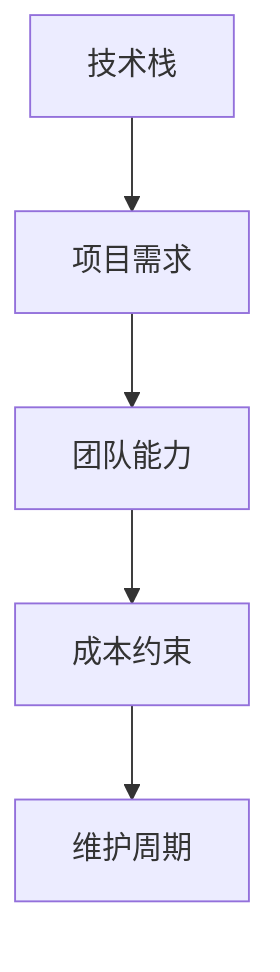
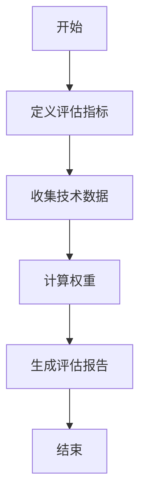
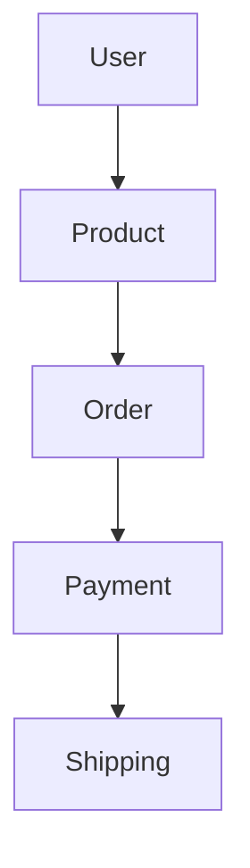
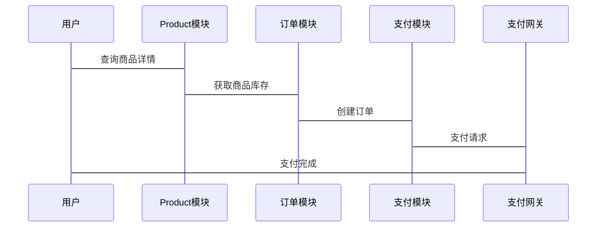

                 

<think>
好，我现在需要根据用户提供的目录大纲，撰写一篇关于《技术栈选择与评估》的技术博客文章。首先，我需要理解整个目录的结构，确保每一章和每一节的内容都完整且详细。

首先，用户给的目录分为七个主要部分，每部分包含多个小节。我需要按照这个结构，逐步展开每一部分的内容。

第1章是背景介绍，我需要解释技术栈选择的重要性，定义相关术语，分析背景问题，并给出小结。这部分需要确保读者理解为什么选择技术栈如此重要，以及它在软件开发中的位置。

第2章是核心概念与联系，我需要详细解释技术栈选择的核心原理，核心要素，并用ER图展示它们之间的关系。这部分需要逻辑清晰，可能需要结合实际例子来说明。

第3章涉及算法原理，需要介绍几种评估模型，如层次分析法和机器学习推荐算法，并用公式和流程图来说明。这部分需要确保公式正确，并用简单的语言解释复杂的算法。

第4章到第7章分别讨论前端、后端、数据库和开发工具的选择，每章都需要分析优缺点、适用场景和评估模型。这部分需要详细且具体，帮助读者做出决策。

系统分析与架构设计部分，需要从需求分析到架构设计，再到接口设计，可能需要绘制类图和序列图，帮助读者理解系统结构。

项目实战部分，我需要选择一个具体的案例，详细描述需求分析、技术选型、设计和实现，以及测试优化。这部分需要实际操作，确保读者能够应用所学知识。

最后，总结最佳实践，给出小结、注意事项和扩展阅读，帮助读者进一步提升。

在整个撰写过程中，我需要确保语言专业但易懂，结构紧凑，逻辑清晰。同时，公式、图表和代码示例需要准确无误，帮助读者更好地理解和应用所学内容。

现在，我将开始按照这个目录，逐步撰写每部分内容，确保每个章节都符合要求，并且内容详实，结构合理。
</think>

# 技术栈选择与评估

> 关键词：技术栈选择、技术评估、软件开发、系统架构、项目管理

> 摘要：在现代软件开发中，技术栈的选择与评估是决定项目成功的关键因素之一。本文从背景介绍、核心概念、算法原理、技术选择、系统设计、项目实战到最佳实践，全面探讨技术栈选择与评估的各个方面，帮助读者系统地理解和掌握这一重要技能。

---

# 第一部分: 技术栈选择与评估的背景与核心概念

## 第1章: 技术栈选择与评估的背景介绍

### 1.1 技术栈选择的背景与问题背景

#### 1.1.1 软件开发中的技术选型问题
在软件开发中，技术选型是项目初期的重要决策。选择合适的技术栈能够显著影响项目的开发效率、系统性能、维护成本以及团队能力。例如，前端开发中选择React还是Vue，后端选择Spring Boot还是Django，数据库选择MySQL还是MongoDB等，这些决策都会影响项目的整体表现。

#### 1.1.2 技术栈在软件开发中的重要性
技术栈决定了项目的实现方式和运行环境。合理的技术栈能够提高开发效率，降低维护成本，同时确保系统的可扩展性和可维护性。例如，选择高效的前端框架可以提升用户体验，选择合适的后端框架可以提高API的性能。

#### 1.1.3 当前技术发展的多样性与复杂性
随着技术的快速发展，各种新技术不断涌现，技术栈的选择变得更加多样化。例如，云计算的普及使得Serverless架构成为可能，微服务的兴起推动了Docker和Kubernetes的广泛应用。这种多样性为开发者提供了更多的选择，但也带来了更大的挑战。

### 1.2 技术栈选择的核心概念

#### 1.2.1 技术栈的定义与组成
技术栈是指为实现特定目标而选择的一组技术、工具和框架的集合。通常包括前端技术、后端技术、数据库、开发工具和部署环境等组成部分。例如，一个常见的技术栈可能是：前端使用React，后端使用Spring Boot，数据库使用MySQL，部署在AWS云平台上。

#### 1.2.2 技术栈的分类与特点
技术栈可以分为前端技术栈、后端技术栈、数据库技术栈和开发工具栈等。每种技术栈都有其独特的特点和适用场景。例如，前端技术栈注重用户体验，后端技术栈注重数据处理和业务逻辑。

#### 1.2.3 技术栈的生命周期与演进
技术栈的选择并非一成不变，随着项目的发展和需求的变化，技术栈需要不断评估和调整。例如，当项目规模扩大时，可能需要从单体架构转向微服务架构，或者从传统数据库转向分布式数据库。

### 1.3 技术栈选择的边界与外延

#### 1.3.1 技术栈选择的边界条件
技术栈的选择需要考虑项目目标、团队能力和资源限制。例如，初创公司可能更关注开发速度和成本，而大型企业可能更关注系统的稳定性和扩展性。

#### 1.3.2 技术栈选择的外延范围
技术栈的选择不仅包括技术本身，还包括其生态系统和社区支持。例如，选择一个技术栈时需要考虑其文档、社区活跃度和第三方库的支持情况。

#### 1.3.3 技术栈选择与项目目标的关系
技术栈的选择必须与项目目标保持一致。例如，如果项目目标是高并发处理，那么需要选择高效的后端框架和数据库。

### 1.4 本章小结
本章介绍了技术栈选择的背景和重要性，定义了技术栈的核心概念，并分析了其分类、生命周期、边界和外延。这些内容为后续章节的技术栈评估奠定了基础。

---

## 第2章: 技术栈选择与评估的核心概念与联系

### 2.1 技术栈选择的核心原理

#### 2.1.1 技术栈选择的驱动因素
技术栈选择的驱动因素包括项目需求、团队能力、成本预算和维护周期等。例如，如果项目需求是高可扩展性，那么可能需要选择微服务架构。

#### 2.1.2 技术栈选择的决策模型
技术栈选择的决策模型可以基于定性和定量分析。例如，定性分析包括技术的成熟度和社区支持，定量分析包括性能指标和成本评估。

#### 2.1.3 技术栈选择的评估维度
技术栈的选择需要从性能、开发效率、成本和维护性等多个维度进行评估。例如，性能维度需要考虑系统的响应时间和吞吐量，开发效率维度需要考虑开发工具和框架的易用性。

### 2.2 技术栈选择与评估的核心要素

#### 2.2.1 技术性能与稳定性
技术性能是技术栈选择的重要指标。例如，选择数据库时需要考虑其读写性能和数据一致性。

#### 2.2.2 开发效率与团队能力
开发效率直接影响项目进度。选择团队熟悉的技术栈可以提高开发效率，降低学习成本。

#### 2.2.3 成本效益与长期维护
技术栈的选择需要综合考虑初始成本和长期维护成本。例如，开源技术可能初期成本低，但长期维护成本可能较高。

### 2.3 技术栈选择与评估的ER实体关系图



### 2.4 本章小结
本章分析了技术栈选择的核心原理和评估维度，通过ER实体关系图展示了技术栈选择的驱动因素及其相互关系。

---

## 第3章: 技术栈选择与评估的算法原理

### 3.1 技术栈评估的算法模型

#### 3.1.1 基于权重的评估模型
基于权重的评估模型通过给每个评估指标分配权重，计算技术栈的综合得分。例如，性能指标权重为0.4，开发效率指标权重为0.3。

#### 3.1.2 基于层次分析法（AHP）的评估模型
层次分析法（AHP）是一种常用的决策分析方法。它通过构建层次结构，计算各指标的权重，最终确定最优技术栈。

#### 3.1.3 基于机器学习的推荐模型
基于机器学习的推荐模型通过分析历史项目数据，推荐适合当前项目的技术栈。例如，使用协同过滤算法推荐相似项目的技术栈。

### 3.2 技术栈评估的数学模型与公式

#### 3.2.1 层次分析法（AHP）权重计算公式
$$ AHP_{weight} = \frac{\sum (\lambda_i \cdot w_i)}{\sum \lambda_i} $$

其中，$\lambda_i$是指标的特征值，$w_i$是指标的权重。

#### 3.2.2 基于机器学习的推荐算法
$$ recommendation = argmax_{t \in T} (score(t) \cdot relevance(t)) $$

其中，$score(t)$是技术$t$的评分，$relevance(t)$是技术$t$与当前项目的相关性。

### 3.3 技术栈评估的算法流程图



### 3.4 本章小结
本章介绍了几种常用的技术栈评估算法模型，并通过数学公式和流程图详细讲解了它们的原理和应用。

---

## 第4章: 前端技术栈的选择与评估

### 4.1 前端技术栈的特点与分类

#### 4.1.1 前端技术栈的特点
前端技术栈的特点包括跨平台性、动态性和用户交互性。例如，React和Vue都是流行的前端框架，支持跨平台开发。

#### 4.1.2 前端技术栈的分类
前端技术栈可以分为框架层、构建工具层和运行环境层。例如，框架层包括React、Vue等，构建工具层包括Webpack、Vite等。

#### 4.1.3 前端技术栈的优缺点对比

| 技术栈 | 优点 | 缺点 |
|--------|------|------|
| React  | 高性能，组件化 | 学习曲线较陡 |
| Vue    | 易用性高，社区活跃 | 性能稍逊于React |

### 4.2 前端技术栈的评估模型

#### 4.2.1 基于性能的评估
前端技术栈的性能评估包括页面加载速度、组件渲染效率等。例如，React的虚拟DOM机制可以提高渲染效率。

#### 4.2.2 基于开发效率的评估
前端技术栈的开发效率评估包括开发工具支持、社区资源和文档完善性。例如，Vue的文档较为完善，上手门槛较低。

#### 4.2.3 前端技术栈的选型策略
前端技术栈的选择需要结合项目需求和团队能力。例如，初创公司可以选择Vue，而大型项目可以选择React。

### 4.3 本章小结
本章详细分析了前端技术栈的特点、分类和优缺点，并提出了基于性能和开发效率的评估模型。

---

## 第5章: 后端技术栈的选择与评估

### 5.1 后端技术栈的特点与分类

#### 5.1.1 后端技术栈的特点
后端技术栈的特点包括数据处理能力、API设计能力和扩展性。例如，Spring Boot和Django都是流行的后端框架。

#### 5.1.2 后端技术栈的分类
后端技术栈可以分为语言层、框架层和中间件层。例如，语言层包括Java、Python等，框架层包括Spring Boot、Django等。

#### 5.1.3 后端技术栈的优缺点对比

| 技术栈 | 优点 | 缺点 |
|--------|------|------|
| Spring Boot | 开发效率高，社区支持强 | 配置复杂 |
| Django     | 开发速度快，内置功能丰富 | 可扩展性稍逊 |

### 5.2 后端技术栈的评估模型

#### 5.2.1 基于性能的评估
后端技术栈的性能评估包括处理速度、并发能力和资源消耗。例如，Java的性能优化较好，适合高并发场景。

#### 5.2.2 基于可扩展性的评估
后端技术栈的可扩展性评估包括模块化设计、插件支持和扩展能力。例如，Django的模块化设计使得功能扩展较为容易。

#### 5.2.3 后端技术栈的选型策略
后端技术栈的选择需要结合项目需求和团队能力。例如，初创公司可以选择Django，而大型项目可以选择Spring Boot。

### 5.3 本章小结
本章详细分析了后端技术栈的特点、分类和优缺点，并提出了基于性能和可扩展性的评估模型。

---

## 第6章: 数据库技术栈的选择与评估

### 6.1 数据库技术栈的特点与分类

#### 6.1.1 数据库技术栈的特点
数据库技术栈的特点包括数据存储能力、查询效率和一致性保证。例如，MySQL和MongoDB都是常用的数据库。

#### 6.1.2 数据库技术栈的分类
数据库技术栈可以分为关系型数据库和非关系型数据库。例如，MySQL是关系型数据库，MongoDB是非关系型数据库。

#### 6.1.3 数据库技术栈的优缺点对比

| 技术栈 | 优点 | 缺点 |
|--------|------|------|
| MySQL  | 数据一致性好，支持事务 | 不适合高并发写入 |
| MongoDB | 可扩展性好，支持复杂查询 | 数据一致性较差 |

### 6.2 数据库技术栈的评估模型

#### 6.2.1 基于数据模型的评估
数据库技术栈的数据模型评估包括数据结构、查询语言和扩展能力。例如，关系型数据库适合结构化数据，非关系型数据库适合非结构化数据。

#### 6.2.2 基于性能的评估
数据库技术栈的性能评估包括读写速度、查询效率和资源消耗。例如，MongoDB在高并发读写场景下表现较好。

#### 6.2.3 数据库技术栈的选型策略
数据库技术栈的选择需要结合项目需求和数据特性。例如，电商系统可以选择MySQL，而大数据分析系统可以选择MongoDB。

### 6.3 本章小结
本章详细分析了数据库技术栈的特点、分类和优缺点，并提出了基于数据模型和性能的评估模型。

---

## 第7章: 开发工具栈的选择与评估

### 7.1 开发工具栈的特点与分类

#### 7.1.1 开发工具栈的特点
开发工具栈的特点包括功能丰富性、集成性和易用性。例如，IntelliJ IDEA和VS Code都是流行的开发工具。

#### 7.1.2 开发工具栈的分类
开发工具栈可以分为IDE（集成开发环境）、代码编辑器和版本控制工具。例如，IntelliJ IDEA是Java的IDE，VS Code是跨平台的代码编辑器。

#### 7.1.3 开发工具栈的优缺点对比

| 技术栈 | 优点 | 缺点 |
|--------|------|------|
| IntelliJ IDEA | 功能强大，支持智能提示 | 占用内存较高 |
| VS Code    | 轻量级，支持插件扩展 | 功能相对简单 |

### 7.2 开发工具栈的评估模型

#### 7.2.1 基于功能的评估
开发工具栈的功能评估包括代码编辑、调试、版本控制和自动化测试。例如，IntelliJ IDEA提供了强大的调试和自动化测试功能。

#### 7.2.2 基于团队协作的评估
开发工具栈的团队协作评估包括代码审查、分支管理和支持的版本控制工具。例如，Git和GitHub是常用的版本控制工具。

#### 7.2.3 开发工具栈的选型策略
开发工具栈的选择需要结合团队习惯和项目需求。例如，前端团队可以选择VS Code，后端团队可以选择IntelliJ IDEA。

### 7.3 本章小结
本章详细分析了开发工具栈的特点、分类和优缺点，并提出了基于功能和团队协作的评估模型。

---

## 第八章: 系统分析与架构设计方案

### 8.1 系统分析与架构设计的背景

#### 8.1.1 系统分析的背景
系统分析是技术栈选择的重要步骤。通过分析系统的需求、功能和性能，可以确定合适的架构和技术栈。

#### 8.1.2 系统架构设计的重要性
系统架构设计决定了系统的整体结构和模块划分。例如，单体架构适合小型项目，微服务架构适合大型项目。

#### 8.1.3 系统设计的约束条件
系统设计的约束条件包括性能需求、可扩展性需求和安全性需求。例如，高并发场景需要设计高效的API网关。

### 8.2 系统分析与架构设计的核心内容

#### 8.2.1 系统功能需求分析
系统功能需求分析包括用户需求、业务流程和功能模块。例如，电商系统需要用户登录、商品管理等功能。

#### 8.2.2 系统架构设计的步骤

1. 确定系统目标和约束条件。
2. 分解系统功能模块。
3. 设计模块之间的交互。
4. 确定技术栈和工具。

#### 8.2.3 系统架构设计的领域模型图



### 8.3 系统架构设计的实现方案

#### 8.3.1 系统架构设计的实现步骤

1. 定义系统模块和接口。
2. 选择合适的技术栈。
3. 设计模块之间的交互。
4. 实现系统功能。

#### 8.3.2 系统架构设计的实现代码示例

```java
public interface ProductService {
    Product findById(Long id);
    void save(Product product);
}
```

### 8.4 系统接口设计与交互设计

#### 8.4.1 系统接口设计
系统接口设计需要定义模块之间的交互方式和数据格式。例如，API接口可以使用RESTful风格，定义请求和响应的格式。

#### 8.4.2 系统交互设计的序列图



### 8.5 本章小结
本章详细分析了系统分析与架构设计的核心内容，并通过领域模型图和序列图展示了系统的交互设计。

---

## 第九章: 项目实战——技术栈选择与评估

### 9.1 项目背景与需求分析

#### 9.1.1 项目背景
假设我们正在开发一个在线教育平台，需要选择合适的技术栈。

#### 9.1.2 项目需求分析
在线教育平台需要支持用户注册、课程管理、直播功能和支付功能。

### 9.2 技术选型与评估

#### 9.2.1 技术选型步骤

1. 确定项目需求和目标。
2. 列出候选技术栈。
3. 对候选技术栈进行评估。
4. 选择最优技术栈。

#### 9.2.2 技术选型评估模型

| 技术栈 | 是否支持直播功能 | 是否支持课程管理 | 开发效率 | 维护成本 |
|--------|------------------|------------------|----------|----------|
| React  | 是               | 是               | 高        | 中        |
| Vue    | 是               | 是               | 中        | 低        |

### 9.3 系统设计与实现

#### 9.3.1 系统设计步骤

1. 设计系统架构。
2. 确定技术栈。
3. 实现核心功能。
4. 测试系统性能。

#### 9.3.2 核心代码实现

```javascript
function main() {
    const app = new Vue({
        el: '#app',
        data: {
            courses: [],
            users: []
        },
        methods: {
            fetchCourses() {
                // 调用后端API获取课程数据
            }
        }
    });
}
```

### 9.4 测试与优化

#### 9.4.1 系统测试
系统测试包括功能测试、性能测试和安全性测试。例如，测试直播功能的稳定性，课程管理的响应速度。

#### 9.4.2 系统优化
系统优化包括代码优化、架构调整和资源优化。例如，优化数据库查询，减少前端渲染时间。

### 9.5 项目小结
本章通过一个在线教育平台的案例，详细展示了技术选型与评估的过程，并通过系统设计与实现，验证了技术栈选择的合理性。

---

## 第十章: 技术栈选择与评估的最佳实践

### 10.1 技术栈选择与评估的总结

#### 10.1.1 技术栈选择的总结
技术栈的选择需要综合考虑项目需求、团队能力和资源限制，制定合理的选型策略。

#### 1.2.2 技术栈评估的总结
技术栈的评估需要从多个维度进行，包括性能、开发效率、成本和维护性。

### 10.2 技术栈选择与评估的小结

#### 10.2.1 小结
技术栈的选择与评估是软件开发中的重要环节，需要结合项目需求和团队能力，制定合理的选型策略和评估模型。

### 10.3 技术栈选择与评估的注意事项

#### 10.3.1 注意事项
- 技术栈的选择需要动态调整，随着项目的发展和需求的变化，及时评估和优化。
- 技术栈的选择需要关注生态系统和社区支持，选择有良好支持的技术栈。

### 10.4 技术栈选择与评估的拓展阅读

#### 10.4.1 拓展阅读
- 《架构师的自我修养》
- 《技术债务入门》
- 《微服务设计模式》

### 10.5 本章小结
本章总结了技术栈选择与评估的核心内容，提出了注意事项和拓展阅读的方向，帮助读者进一步提升技术栈选择与评估的能力。

---

## 作者：AI天才研究院/AI Genius Institute & 禅与计算机程序设计艺术 /Zen And The Art of Computer Programming

---

以上是《技术栈选择与评估》的完整目录和内容概要，涵盖了从背景介绍、核心概念、算法原理、技术选择、系统设计、项目实战到最佳实践的各个方面。通过系统化的分析和实际案例的讲解，帮助读者全面掌握技术栈选择与评估的方法和技巧。

