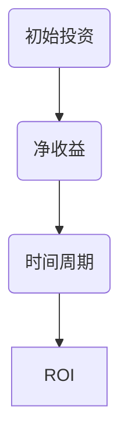
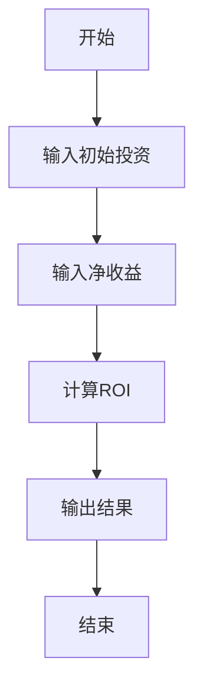
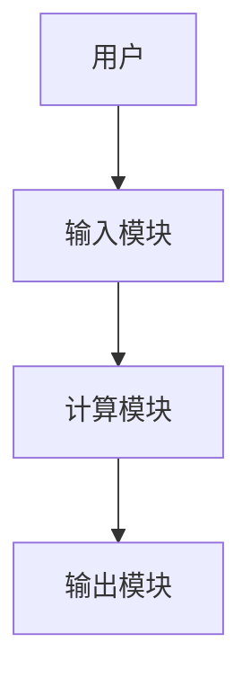
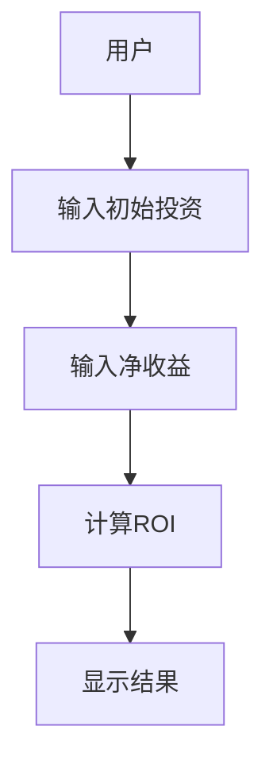

                 


# 投资回报率分析工具

> 关键词：投资回报率、财务分析工具、项目评估、数据分析、ROI计算、经济效益、风险控制

> 摘要：投资回报率（ROI）分析工具是一种帮助企业或个人评估投资项目经济效益的重要工具。本文将从ROI的基本概念、计算方法、工具设计与实现、系统架构、项目实战等多个方面详细阐述投资回报率分析工具的原理和应用。通过实际案例分析，帮助读者理解如何利用ROI工具进行项目决策，并提供最佳实践和注意事项。

---

# 第一部分：投资回报率分析工具的背景与核心概念

## 第1章：投资回报率的基本概念

### 1.1 ROI的定义与计算公式

投资回报率（ROI）是一种常用的财务指标，用于衡量投资项目或资产的盈利能力。其计算公式为：

$$ ROI = \left( \frac{\text{净收益}}{\text{初始投资}} \right) \times 100\% $$

其中，净收益等于总收入减去总成本，初始投资是项目的前期投入。

### 1.2 ROI的应用场景

ROI分析工具广泛应用于企业决策、个人投资、项目评估等领域。例如：

- 企业投资新项目的可行性分析
- 个人购买房地产或股票的收益评估
- 产品开发的成本效益分析

### 1.3 ROI的局限性

虽然ROI是一个重要的指标，但它也有局限性：

- 忽略了资金的时间价值
- 未考虑项目的规模差异
- 无法衡量风险因素

---

## 第2章：投资回报率分析工具的核心概念

### 2.1 ROI分析工具的必要性

传统的财务分析方法（如NPV和IRR）虽然全面，但计算复杂且需要专业知识。ROI分析工具简化了计算过程，使非专业人士也能快速评估项目收益。

### 2.2 核心概念与联系

为了更好地理解ROI分析工具，我们需要明确其核心要素：

- **初始投资**：项目的前期投入
- **净收益**：总收入减去总成本
- **时间周期**：项目从开始到回收的时间
- **风险因素**：可能影响收益的不确定性

通过以下表格可以更清晰地理解这些要素的特征：

| 概念 | 属性 | 特征 |
|------|------|------|
| 初始投资 | 计算方式 | 一次性投入 |
| 净收益 | 计算方式 | 总收入 - 总成本 |
| 时间周期 | 计算方式 | 项目从开始到回收所需的时间 |
| 风险因素 | 影响方式 | 可能导致净收益减少 |

### 2.3 ROI分析工具的系统架构

为了更好地理解工具的设计，我们可以通过以下Mermaid图展示其系统架构：



---

# 第二部分：投资回报率分析工具的算法原理

## 第3章：ROI计算算法

### 3.1 ROI计算流程

以下是ROI计算的详细流程：

1. **输入初始投资**：用户输入项目的初始投资金额。
2. **输入净收益**：用户输入项目在一定时间内的净收益。
3. **计算ROI**：系统根据公式计算投资回报率。
4. **输出结果**：系统显示计算结果。

流程图如下：



### 3.2 ROI计算公式

ROI的计算公式可以表示为：

$$ ROI = \left( \frac{\text{净收益}}{\text{初始投资}} \right) \times 100\% $$

例如，若初始投资为100万元，净收益为20万元，则：

$$ ROI = \left( \frac{20}{100} \right) \times 100\% = 20\% $$

### 3.3 ROI与其他财务指标的对比

为了更好地理解ROI的意义，我们需要将其与其他财务指标进行对比，例如净现值（NPV）和内部收益率（IRR）。

#### 对比表格

| 指标 | 计算方式 | 优点 | 局限性 |
|------|----------|------|--------|
| ROI | 净收益/初始投资 | 简单易懂 | 忽略时间价值 |
| NPV | 现值减去初始投资 | 考虑时间价值 | 计算复杂 |
| IRR | 资金时间价值的折现率 | 反映项目收益潜力 | 易受假设影响 |

---

## 第4章：系统架构与设计

### 4.1 系统功能设计

投资回报率分析工具的功能模块包括：

1. **输入模块**：用户输入初始投资和净收益。
2. **计算模块**：系统计算ROI。
3. **输出模块**：显示计算结果。

### 4.2 系统架构设计

系统架构图如下：



### 4.3 系统交互设计

用户与系统之间的交互流程如下：



---

## 第5章：项目实战

### 5.1 环境配置

为了运行ROI分析工具，需要以下环境：

- Python 3.8或更高版本
- 安装必要的库（如numpy、pandas）

### 5.2 核心代码实现

以下是Python代码示例：

```python
def calculate ROI(initial_investment, net_profit):
    return (net_profit / initial_investment) * 100

# 示例
initial_investment = 1000000
net_profit = 200000
roi = calculate ROI(initial_investment, net_profit)
print(f"ROI: {roi}%")
```

### 5.3 案例分析

假设某公司投资一个新项目，初始投资为50万元，预计净收益为15万元，时间为3年。计算ROI：

$$ ROI = \left( \frac{15}{50} \right) \times 100\% = 30\% $$

---

## 第6章：总结与展望

### 6.1 工具的优势与不足

- **优势**：简单易懂，计算快速。
- **不足**：忽略时间价值和风险因素。

### 6.2 改进建议

- 引入时间价值因素，计算净现值（NPV）。
- 考虑风险因素，引入概率分析。

### 6.3 未来展望

随着大数据和人工智能的发展，ROI分析工具将更加智能化，能够实时更新数据，提供更精准的预测。

---

# 作者：AI天才研究院 & 禅与计算机程序设计艺术

