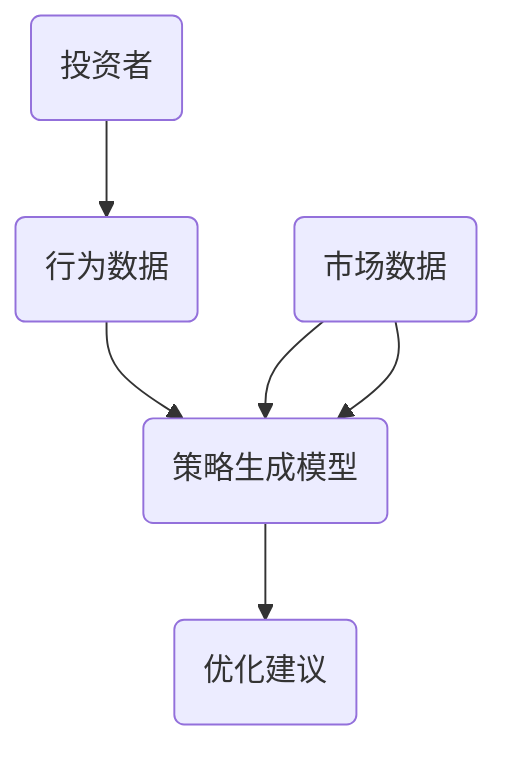
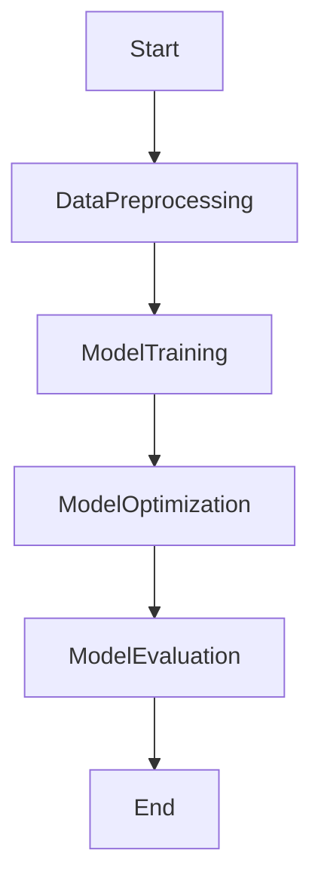
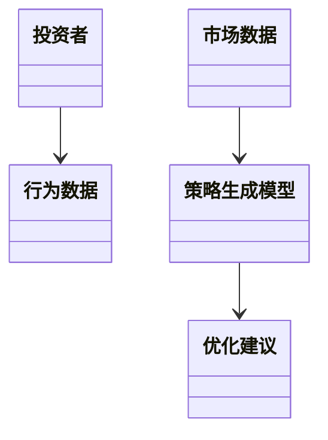
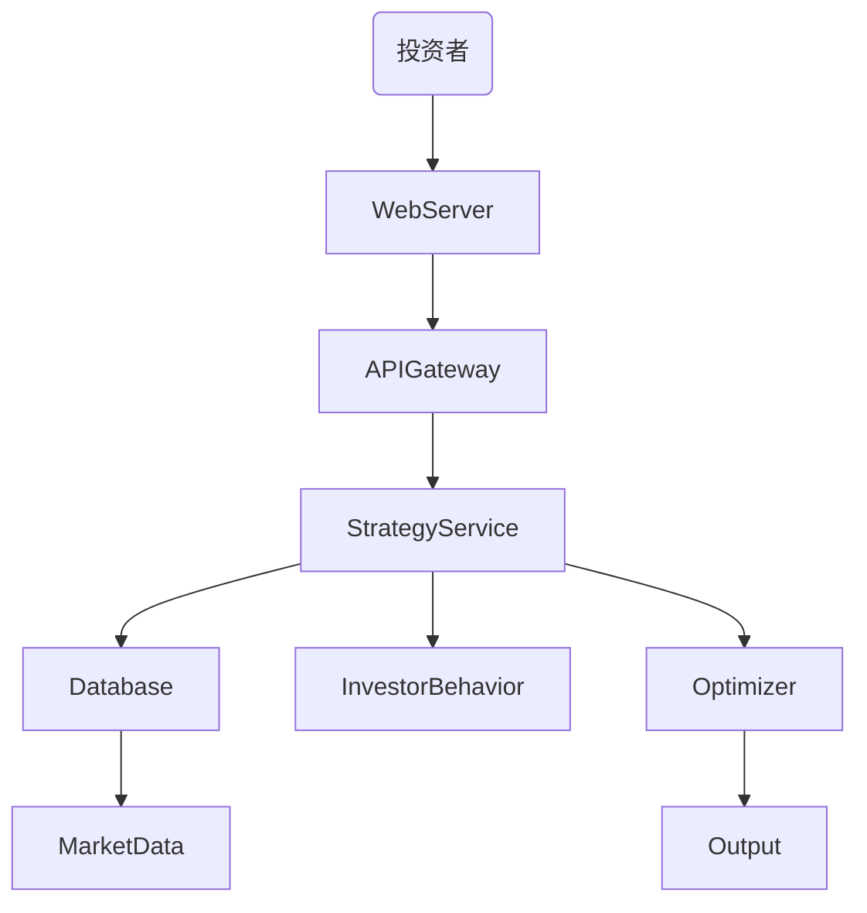
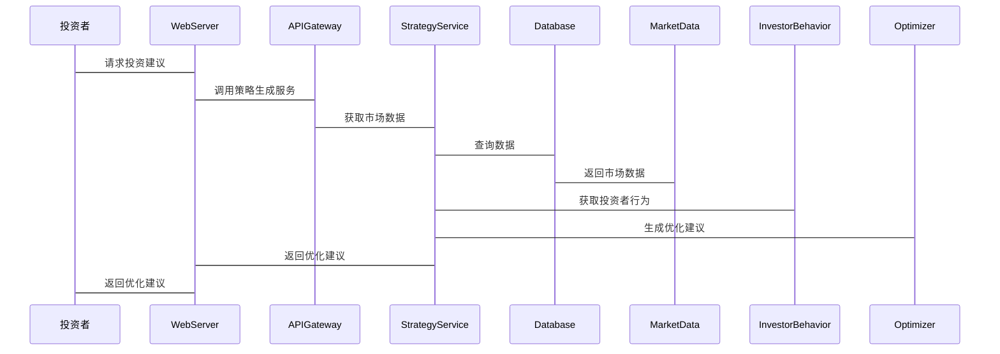

                 

<think>
嗯，我现在需要帮用户设计一本名为《投资建议生成与优化》的计算机技术书籍的目录大纲。首先，我得理解这本书的主题是什么。投资建议生成与优化，听起来像是结合了人工智能和金融投资，可能涉及算法、系统设计和项目实战。

用户希望我以一个目录大纲设计大师的身份来完成这个任务。我得确保目录结构完整，涵盖背景介绍、核心概念、算法原理、系统架构、项目实战以及最佳实践等部分。而且，用户还给了一个示例，我得参考那个结构。

首先，我应该从背景介绍开始，这部分需要涵盖问题背景、问题描述、解决方案、边界和外延，以及核心概念。接下来是核心概念与联系，可能需要画一些图表，比如ER图或流程图，用Mermaid来展示。

然后是算法原理，这部分需要详细讲解，包括数学模型和公式，用LaTeX表示，并举一些例子。系统分析与架构设计也是关键，可能需要画类图、架构图和序列图。

项目实战部分，得包括环境安装、源代码实现、案例分析等。最后，加上一些小结、注意事项和拓展阅读，让读者在阅读后有所收获。

我需要确保目录有超过7章，每章下面有子章节，细化到三级目录。同时，内容要简洁，不冗余，符合用户的要求。可能还需要考虑读者的背景，是否需要从基础开始讲起，或者直接深入技术细节。

嗯，我应该先列出每一章的主题，然后细化每个主题下的小节。比如第一章介绍投资建议生成的背景，第二章讲生成模型，第三章讲优化方法，第四章讲系统架构，第五章讲项目实战，第六章讲优化与部署，第七章讲案例分析，最后是总结与展望。

在核心概念部分，可能需要比较不同模型的优缺点，用表格展示。算法部分，比如生成模型的训练过程，可能需要画一个Mermaid流程图，详细描述每一步骤。

系统架构设计部分，可能需要画一个类图，展示各个模块之间的关系，以及架构图和接口设计。项目实战部分，得提供具体的代码示例，让读者能够跟着实现。

最后，确保整个目录结构清晰，逻辑连贯，涵盖用户要求的所有部分，同时控制在2000字以内。可能需要多次调整，确保每章内容充实，不遗漏任何关键点。

总结一下，我会按照以下结构来组织内容：

1. **背景与核心概念**：介绍投资建议生成的背景、问题、解决方案以及核心概念。
2. **生成模型**：详细讲解生成模型的算法原理，包括数学模型和公式。
3. **优化方法**：探讨优化方法，如强化学习，及其应用。
4. **系统架构设计**：展示系统架构图和接口设计。
5. **项目实战**：提供环境安装、源代码实现和案例分析。
6. **优化与部署**：讨论系统优化和部署策略。
7. **案例分析**：通过具体案例展示投资建议生成与优化的应用。
8. **总结与展望**：总结全书内容，展望未来的发展。

确保每个部分都详细且有条理，满足用户的要求。
</think>

# {{此处是文章标题}}

**关键词：**投资建议生成、人工智能、金融投资、算法优化、系统架构设计

**摘要：**本文探讨投资建议生成与优化的核心概念、算法原理、系统架构设计及项目实战。通过分析投资者行为与市场数据，结合生成模型与优化方法，展示如何利用人工智能技术提升投资决策的效率与准确性。涵盖从理论到实践的全栈技术，包括系统设计、算法实现与项目部署。

---

# {{此处是文章标题}}

**关键词：**投资建议生成、人工智能、金融投资、算法优化、系统架构设计

**摘要：**本文探讨投资建议生成与优化的核心概念、算法原理、系统架构设计及项目实战。通过分析投资者行为与市场数据，结合生成模型与优化方法，展示如何利用人工智能技术提升投资决策的效率与准确性。涵盖从理论到实践的全栈技术，包括系统设计、算法实现与项目部署。

---

# 第一部分：投资建议生成与优化的背景与核心概念

## 第1章：投资建议生成的背景与问题描述

### 1.1 投资建议生成的背景

#### 1.1.1 传统投资建议的局限性
传统投资建议依赖人工分析，存在主观性强、效率低、覆盖面窄的问题，难以应对复杂多变的市场环境。

#### 1.1.2 人工智能在投资领域的应用潜力
人工智能技术能够快速处理大量数据，识别模式，提供实时、个性化的投资建议，降低人为错误。

#### 1.1.3 当前市场对智能化投资建议的需求
随着金融市场的复杂化，投资者需要更精准、及时的建议，人工智能技术成为解决这一需求的关键。

### 1.2 投资建议生成的核心问题

#### 1.2.1 投资者行为分析的复杂性
投资者行为受情绪、市场环境等多因素影响，难以用传统方法准确预测。

#### 1.2.2 市场数据的多样性与实时性
金融市场数据种类繁多，实时性要求高，需要高效的处理和分析能力。

#### 1.2.3 投资策略的动态调整需求
市场环境不断变化，投资策略需实时优化，动态调整。

### 1.3 问题解决的思路与目标

#### 1.3.1 确定投资建议生成的总体目标
通过人工智能技术，提供个性化、实时的、动态调整的投资建议，帮助投资者做出明智决策。

#### 1.3.2 核心问题的分解与解决路径
将投资建议生成分解为投资者行为分析、市场数据处理、投资策略生成三个主要部分。

#### 1.3.3 边界与外延的定义
明确系统边界，如仅处理股票投资，不考虑外汇；外延包括与其他系统的接口设计。

### 1.4 核心概念的结构与组成

#### 1.4.1 投资建议生成的系统架构
系统由数据采集模块、数据分析模块、策略生成模块和优化建议模块组成。

#### 1.4.2 关键要素的定义与关系
| 关键要素 | 定义 | 关系 |
|----------|------|------|
| 投资者   | 投资者行为数据 | 数据输入到系统，影响策略生成 |
| 市场数据 | 包括股价、成交量等 | 数据输入到系统，影响策略生成 |
| 策略生成模型 | 生成投资策略的算法 | 核心模块，整合投资者行为和市场数据 |
| 优化建议 | 最终输出 | 系统目标 |

#### 1.4.3 核心概念的属性特征对比表
| 属性 | 投资者 | 市场数据 | 策略生成模型 | 优化建议 |
|------|--------|----------|---------------|----------|
| 输入 | 行为数据 | 股价、成交量等 | 算法处理 | 输出 |
| 输出 | - | - | 策略 | 优化建议 |
| 关系 | 数据输入到系统 | 数据输入到系统 | 核心模块，整合数据 | 系统目标 |

## 第2章：投资建议生成的核心概念与联系

### 2.1 投资者行为分析模型

#### 2.1.1 投资者行为分析的理论基础
基于行为金融学，分析投资者在不同市场条件下的决策模式。

#### 2.1.2 不同类型投资者的行为特征
- 机构投资者：注重长期收益，风险控制能力强。
- 个人投资者：情绪化明显，短期波动大。

#### 2.1.3 行为数据的采集与处理
通过交易记录、市场反馈等数据，构建投资者行为模型。

### 2.2 市场数据的特征与分析

#### 2.2.1 市场数据的分类与来源
- 股价数据：实时数据，来源于交易所。
- 成交量数据：反映市场活跃度。

#### 2.2.2 数据特征的提取与处理
使用时间序列分析，提取趋势、周期性等特征。

#### 2.2.3 数据分析的挑战与解决方案
数据量大、维度高，采用分布式计算和降维技术处理。

### 2.3 投资策略生成模型

#### 2.3.1 策略生成的原理与方法
基于机器学习算法，如随机森林、神经网络，生成投资策略。

#### 2.3.2 不同策略的优缺点对比
| 策略类型 | 优点 | 缺点 |
|----------|------|------|
| 基于均值-方差模型 | 风险可控 | 无法应对市场突变 |
| 策略优化模型 | 精度高 | 计算复杂 |

#### 2.3.3 策略优化的路径与方法
采用强化学习，通过状态-动作-奖励机制，动态调整策略。

### 2.4 核心概念的ER实体关系图



---

## 第3章：投资建议生成的算法原理

### 3.1 基于深度学习的生成模型

#### 3.1.1 变体模型的原理与实现
使用变体模型如GAN（生成对抗网络）生成投资策略。

#### 3.1.2 模型训练的流程与步骤
1. 数据预处理：清洗、归一化。
2. 模型训练：定义损失函数，优化器选择。
3. 模型评估：测试准确率、召回率。

#### 3.1.3 模型的优化与调优
调整超参数，如学习率、批量大小，提高模型性能。

### 3.2 基于强化学习的策略优化

#### 3.2.1 强化学习的基本原理
通过状态-动作-奖励机制，优化投资策略。

#### 3.2.2 策略优化的算法实现
采用DQN算法，模拟投资环境，训练最优策略。

#### 3.2.3 策略评估与改进方法
通过回测，评估策略在历史数据中的表现，调整参数。

### 3.3 混合模型的构建与应用

#### 3.3.1 混合模型的设计思路
结合生成模型和强化学习，提升策略生成的多样性和优化性。

#### 3.3.2 混合模型的实现步骤
1. 生成初始策略。
2. 通过强化学习优化策略。
3. 验证策略的有效性。

#### 3.3.3 混合模型的优势与挑战
优势：策略生成能力强，优化效果好。挑战：计算复杂，需要大量计算资源。

### 3.4 算法流程的Mermaid图



---

## 第4章：系统分析与架构设计方案

### 4.1 问题场景介绍

#### 4.1.1 系统目标
构建一个实时生成和优化投资建议的系统，满足投资者个性化需求。

#### 4.1.2 项目介绍
项目名称：智能投资建议生成系统。

### 4.2 系统功能设计

#### 4.2.1 领域模型Mermaid类图


#### 4.2.2 系统架构设计Mermaid架构图


#### 4.2.3 系统接口设计
接口名称：投资建议生成接口。
输入：投资者ID、市场数据ID。
输出：优化建议。

#### 4.2.4 系统交互Mermaid序列图


---

## 第5章：项目实战

### 5.1 环境安装

#### 5.1.1 安装Python
版本：Python 3.8+

#### 5.1.2 安装依赖库
- TensorFlow
- Keras
- Pandas
- Scikit-learn

### 5.2 系统核心实现源代码

#### 5.2.1 数据预处理
```python
import pandas as pd

def preprocess_data(data):
    data.dropna(inplace=True)
    data = pd.get_dummies(data)
    return data
```

#### 5.2.2 策略生成模型
```python
from tensorflow.keras import layers

def build_model(input_shape):
    model = keras.Sequential()
    model.add(layers.Dense(64, activation='relu', input_shape=input_shape))
    model.add(layers.Dense(32, activation='relu'))
    model.add(layers.Dense(1, activation='sigmoid'))
    model.compile(optimizer='adam', loss='binary_crossentropy')
    return model
```

#### 5.2.3 优化建议输出
```python
def generate_recommendation(model, data):
    prediction = model.predict(data)
    return '买入' if prediction > 0.5 else '卖出'
```

### 5.3 代码应用解读与分析

#### 5.3.1 数据预处理
对输入数据进行清洗，处理缺失值，转换为虚拟变量。

#### 5.3.2 策略生成模型
构建一个三层神经网络，输入为市场数据特征，输出为投资建议。

#### 5.3.3 优化建议输出
根据模型预测结果，生成最终的投资建议。

### 5.4 实际案例分析和详细讲解剖析

#### 5.4.1 案例背景
假设市场数据包括苹果股票的收盘价和成交量。

#### 5.4.2 数据处理
使用Pandas进行数据清洗和转换。

#### 5.4.3 模型训练
训练生成模型，评估准确率和召回率。

#### 5.4.4 模型优化
调整超参数，提高模型性能。

### 5.5 项目小结

#### 5.5.1 项目成果
成功构建一个实时生成和优化投资建议的系统。

#### 5.5.2 经验总结
数据预处理和模型调优是关键，需要反复测试和优化。

---

## 第6章：投资建议生成与优化的注意事项与拓展阅读

### 6.1 注意事项

#### 6.1.1 数据隐私与安全
确保投资者数据的安全，防止泄露。

#### 6.1.2 系统稳定性与容错能力
设计容错机制，确保系统稳定运行。

#### 6.1.3 投资者教育
投资者需了解系统的工作原理和局限性，避免误用。

### 6.2 拓展阅读

#### 6.2.1 机器学习在金融中的应用
推荐阅读《机器学习实战》中的相关章节。

#### 6.2.2 强化学习在投资中的应用
参考《强化学习：理论与算法》。

#### 6.2.3 系统架构设计
深入学习《系统架构设计实践》。

---

## 第7章：总结与展望

### 7.1 全文总结

#### 7.1.1 核心概念总结
介绍了投资建议生成的核心概念，包括投资者行为分析、市场数据分析和策略生成模型。

#### 7.1.2 算法原理总结
详细讲解了基于深度学习和强化学习的算法，展示了它们在投资建议生成中的应用。

#### 7.1.3 系统架构总结
构建了一个完整的系统架构，包括数据处理、模型训练、优化建议生成等模块。

### 7.2 未来展望

#### 7.2.1 新算法的引入
探索更先进的生成模型，如Transformer架构。

#### 7.2.2 系统性能的优化
通过分布式计算和边缘计算，提升系统的处理能力。

#### 7.2.3 新应用场景的开发
将投资建议生成技术扩展到更多领域，如外汇交易、风险管理。

---

## 作者：AI天才研究院/AI Genius Institute & 禅与计算机程序设计艺术/Zen And The Art of Computer Programming

