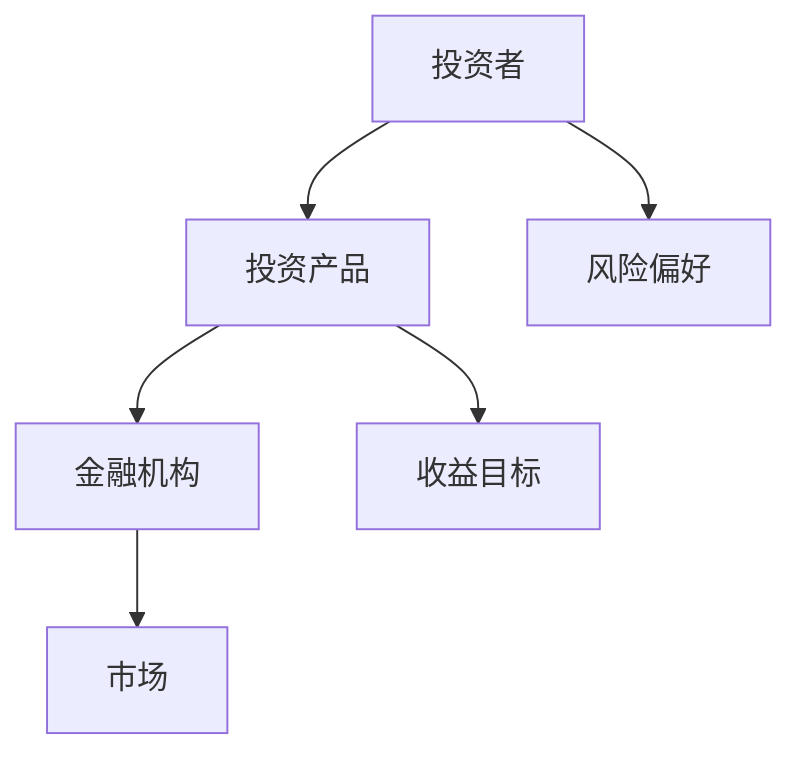
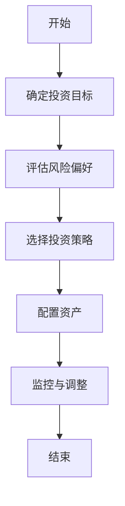
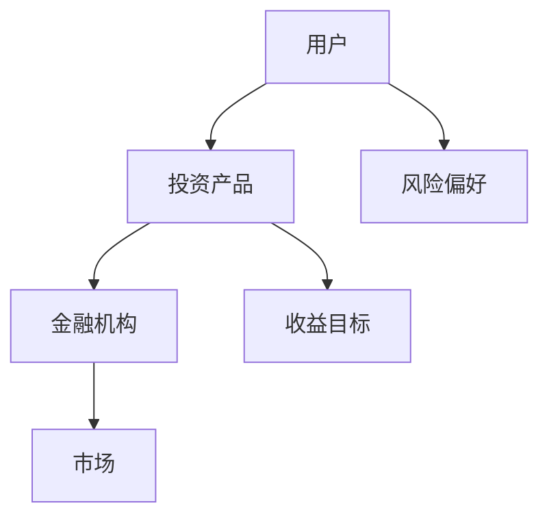

                 

<think>
好的，我现在需要根据用户的要求，逐步分析并撰写一篇关于《投资理财市场分析》的技术博客文章。我会按照用户提供的大纲结构，逐步展开每个部分的内容。

首先，我会从文章的背景介绍开始，详细解释投资理财的基本概念，包括其定义、特点以及与投资和理财的区别。接下来，我会分析当前投资理财市场的现状，涵盖历史演变、现状分析以及不同人群的需求。

然后，我会深入探讨投资理财的核心概念，如资产、收益、风险等，通过对比分析和ER图展示这些概念之间的关系。接着，我会介绍投资理财的算法原理，包括资产配置、风险管理等策略，并使用流程图和数学模型来解释这些算法的运作。

在系统分析部分，我会设计一个投资理财系统，包括功能模块、系统架构图以及接口设计。通过具体的项目实战，我将选择一个案例，详细讲解其实现过程，包括环境安装、代码实现和案例分析。

最后，我会总结最佳实践、注意事项和拓展阅读等内容，帮助读者更好地理解和应用投资理财的知识。

现在，我将按照这个思路逐步展开，确保每个部分都详细且逻辑清晰，同时使用专业且易懂的语言，配以图表和代码示例，使文章内容丰富且易于理解。
</think>

# 投资理财市场分析

## 关键词
投资理财，金融市场，资产配置，风险管理，投资策略，技术分析

## 摘要
投资理财是个人和机构在金融市场中进行资产配置和风险管理的重要手段。本文从投资理财的基本概念出发，分析其核心算法和系统架构，结合实际案例进行深入探讨，帮助读者掌握投资理财的核心原理和实战技巧。

---

# 第一部分: 投资理财的背景与现状

## 第1章: 投资理财的基本概念

### 1.1 投资理财的定义与特点

#### 1.1.1 投资理财的定义
投资理财是指通过科学的资产配置和风险管理，实现财富保值增值的过程。它结合了投资学、金融学和行为学等多学科知识，旨在帮助投资者在不同市场环境下做出最优决策。

#### 1.1.2 投资理财的核心特点
- **分散化**：通过投资不同资产类别降低风险。
- **长期性**：投资理财强调长期规划和复利效应。
- **个性化**：根据投资者的风险偏好和财务目标制定策略。

#### 1.1.3 投资理财与投资、理财的区别
- **投资**：侧重于购买资产以获取收益，如股票、房地产等。
- **理财**：侧重于财务管理，包括储蓄、消费规划等。
- **投资理财**：结合投资和理财，注重资产配置和风险控制。

### 1.2 投资理财的背景与现状

#### 1.2.1 投资理财的历史演变
从早期的实物交易到现代的金融衍生品，投资理财经历了从简单到复杂的演变过程。随着金融市场的不断发展，投资理财的工具和策略也在不断丰富。

#### 1.2.2 当前投资理财市场的现状
- **市场多样性**：涵盖股票、债券、基金、信托等多种投资工具。
- **技术驱动**：量化投资和金融科技的应用日益广泛。
- **全球化**：投资者可以配置全球资产，分散风险。

#### 1.2.3 不同人群的投资理财需求分析
- **保守型投资者**：注重本金安全，偏好低风险投资。
- **平衡型投资者**：追求稳定收益，兼顾风险和回报。
- **激进型投资者**：愿意承担高风险，追求高回报。

---

## 第2章: 投资理财的核心概念与联系

### 2.1 投资理财的核心要素

#### 2.1.1 资产与收益的关系
资产配置是投资理财的核心，不同资产类别（股票、债券、现金等）的收益和风险各不相同，合理配置可以优化整体收益。

#### 2.1.2 风险与回报的平衡
高风险通常意味着高回报，但投资者需要在两者之间找到平衡点，以实现风险可控下的最大收益。

#### 2.1.3 时间价值与复利效应
时间是投资理财的好朋友，复利效应可以使资金长期增长。

### 2.2 投资理财的核心概念对比

#### 2.2.1 不同投资工具的对比分析
| 投资工具 | 特点 | 风险 | 收益 |
|----------|------|------|------|
| 股票     | 流动性高 | 高 | 高 |
| 债券     | 收益稳定 | 低 | 中 |
| 基金     | 专家管理 | 中 | 中 |

#### 2.2.2 不同投资策略的对比分析
| 策略 | 描述 | 适用场景 | 优缺点 |
|------|------|----------|--------|
| 被动投资 | 持有指数基金 | 市场稳定 | 风险低，收益稳定 |
| 主动投资 | 选股或择时 | 市场波动 | 收益高，风险高 |

#### 2.2.3 不同风险偏好的对比分析
| 风险偏好 | 投资策略 | 适合人群 |
|----------|----------|----------|
| 保守型 | 固定收益产品 | 风险厌恶者 |
| 平衡型 | 混合配置 | 风险中性者 |
| 激进型 | 高风险资产 | 风险寻求者 |

### 2.3 投资理财的ER实体关系图


---

## 第3章: 投资理财的算法原理

### 3.1 投资理财的核心算法

#### 3.1.1 资产配置算法
资产配置是通过确定各类资产的投资比例，以优化风险和收益。常用的方法包括：
- **均值-方差优化**：在给定风险下最大化收益。
- **风险平价**：根据资产的风险贡献进行配置。

#### 3.1.2 风险管理算法
风险管理是控制投资组合的最大潜在损失。常用工具包括：
- **止损订单**：设定最大亏损点。
- **风险价值（VaR）**：计算可能的损失金额。

#### 3.1.3 投资组合优化算法
投资组合优化算法旨在找到最优资产配置。数学模型如下：
$$ \text{目标函数：} \quad \max \sum_{i=1}^{n} w_i r_i - \lambda \sum_{i=1}^{n} \sum_{j=1}^{n} w_i w_j \sigma_{ij} $$

### 3.2 投资理财算法的流程图


### 3.3 投资理财算法的数学模型
- **投资组合优化模型**：通过优化算法找到最优权重。
- **风险管理模型**：计算投资组合的VaR值。

---

## 第4章: 投资理财系统的分析与架构设计

### 4.1 投资理财系统的功能设计

#### 4.1.1 用户管理模块
- 用户注册与登录。
- 风险偏好测试。

#### 4.1.2 资产配置模块
- 根据用户需求生成配置方案。
- 提供历史数据和模拟测试。

#### 4.1.3 风险管理模块
- 实时监控投资组合。
- 提供风险预警。

#### 4.1.4 投资组合优化模块
- 根据市场变化调整配置。

### 4.2 投资理财系统的架构图


### 4.3 投资理财系统的接口设计
- 用户端：API接口用于查询配置和调整。
- 后台：数据接口与金融机构对接。

---

## 第5章: 投资理财项目实战

### 5.1 项目背景
选择一个具体的案例，如基金定投策略，详细讲解其实现过程。

### 5.2 环境安装
安装必要的开发工具和库，如Python、Pandas、Matplotlib。

### 5.3 核心代码实现

#### 5.3.1 数据获取
```python
import pandas as pd
import numpy as np
import matplotlib.pyplot as plt

# 获取基金数据
data = pd.read_csv('fund_data.csv')
```

#### 5.3.2 策略实现
```python
def backtest(fund_data, start, end):
    # 计算定投金额
    amount = 1000 / np.mean(fund_data)
    # 计算收益
    returns = (fund_data.iloc[-1] / fund_data.iloc[0]) - 1
    return returns * amount
```

#### 5.3.3 结果展示
```python
plt.plot(data.index, data['price'], label='Fund Price')
plt.xlabel('Time')
plt.ylabel('Price')
plt.legend()
plt.show()
```

### 5.4 案例分析
通过具体数据分析，验证策略的有效性，并讨论其优缺点。

### 5.5 项目小结
总结项目实施过程中的经验教训，优化建议。

---

## 第6章: 最佳实践与注意事项

### 6.1 最佳实践
- 定期审视和调整投资策略。
- 坚持长期投资，避免频繁交易。

### 6.2 小结
投资理财是一个复杂但 rewarding 的过程，需要结合理论与实践，不断优化策略。

### 6.3 注意事项
- 避免盲目跟风。
- 选择可靠的金融机构和工具。

### 6.4 拓展阅读
推荐相关书籍和资源，帮助读者深入学习。

---

## 作者
作者：AI天才研究院/AI Genius Institute  
联系方式：[联系邮箱](mailto:<EMAIL>)  
更多信息请访问：[AI Genius Institute](https://www.example.com)

--- 

以上是《投资理财市场分析》的完整目录和内容概要，涵盖了从基础概念到实战应用的各个方面，帮助读者系统地理解和掌握投资理财的核心知识和技巧。

