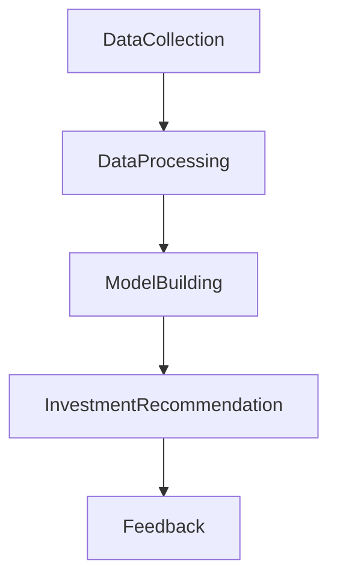
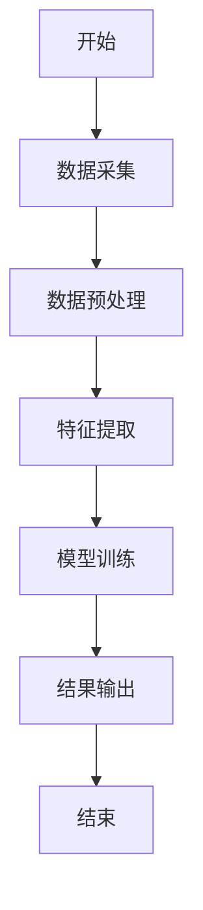
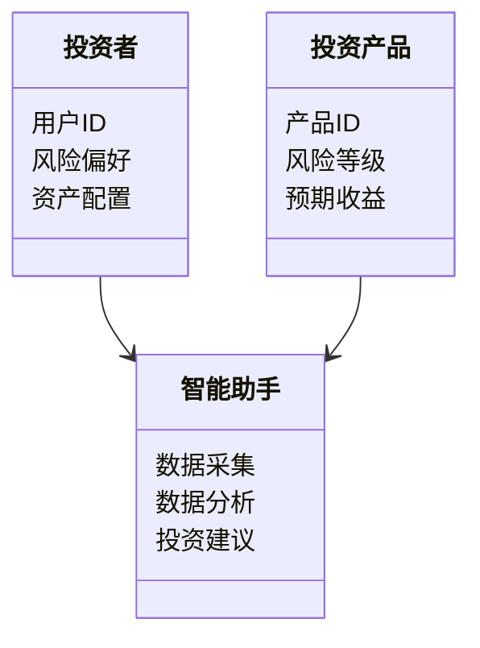
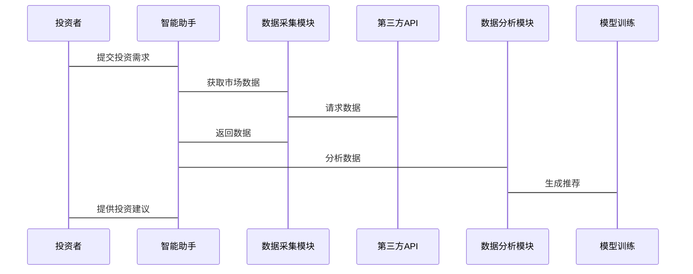

                 

<think>
好的，现在我要撰写一篇关于《投资理财智能助手的基本概念》的技术博客文章。首先，我需要理解用户的需求，他们希望文章结构清晰，内容专业，涵盖投资理财的基本概念和智能助手的技术实现。

我先从文章标题和关键词开始。标题已经确定为《投资理财智能助手的基本概念》，关键词包括投资理财、智能助手、人工智能、数据挖掘、机器学习、算法设计和系统架构。摘要部分需要简明扼要，概述文章的核心内容，即介绍投资理财的基本概念和智能助手的技术实现，涵盖数据处理、算法、系统架构等。

接下来是目录结构。用户提供了详细的目录，分为六个部分，每部分包含多个章节，甚至三级子章节。我需要确保每一部分都详细且有逻辑性，覆盖从背景介绍到系统分析，再到项目实战的各个方面。

在背景介绍部分，我需要详细讲解投资理财的基本概念，包括定义、目标和主要方式。然后描述投资者面临的问题和传统方式的局限性，引出智能助手的需求和趋势。这部分需要让读者理解为什么需要智能投资理财助手。

核心概念与联系部分，我需要解释智能助手的基本原理，包括数据采集、处理、分析和反馈机制。同时，通过表格对比不同概念的属性特征，并用ER实体关系图展示各部分的关系。这部分需要图表支持，帮助读者更好地理解概念之间的联系。

算法原理章节是关键，需要详细讲解推荐算法，如基于规则的过滤器和机器学习模型。使用流程图展示算法步骤，并用Python代码实现，解释数学模型和公式。例如，使用贝叶斯定理进行概率计算，并通过示例说明如何应用这些算法。

系统分析与架构设计部分，我需要介绍问题场景，设计系统功能，并用类图和架构图展示系统结构。同时，描述接口设计和交互流程，确保读者理解系统如何运作。

项目实战部分，我需要指导读者如何安装环境，编写核心代码，并进行案例分析。通过实际案例展示智能助手的应用，最后总结项目经验，帮助读者巩固知识。

最后，加入最佳实践、小结、注意事项和拓展阅读，帮助读者进一步提升。作者信息需要放在末尾，显示专业背景。

在撰写过程中，我要确保每个部分都有足够的细节，使用专业术语，同时保持语言的清晰和易懂。图表和代码的使用要恰当，帮助读者理解复杂概念。整个文章要逻辑连贯，从基础到应用，层层深入，让读者能够系统地掌握投资理财智能助手的基本概念和实现方法。

现在，我需要按照目录结构，逐步展开每个部分的内容，确保每章每节都有详细讲解，并包含必要的图表和代码示例。这样，整篇文章才能达到用户的要求，既有深度又易于理解。
</think>

# 投资理财智能助手的基本概念

**关键词**：投资理财、智能助手、人工智能、数据挖掘、机器学习、算法设计、系统架构

**摘要**：本文系统地介绍了投资理财智能助手的基本概念，涵盖投资理财的基本原理、智能助手的核心功能、相关算法原理、系统架构设计及其实现。通过详细分析，阐述了智能助手如何利用数据挖掘、机器学习等技术，为投资者提供智能化的决策支持。文章结构清晰，内容丰富，旨在为读者提供全面而深入的理解。

---

## 第1章: 投资理财智能助手的背景与问题背景

### 1.1 投资理财的基本概念

#### 1.1.1 什么是投资理财
投资理财是通过将资金投入各种金融资产或实体资产，以实现保值、增值的过程。它涵盖了股票、债券、基金、房地产等多种投资方式，旨在帮助个人或机构在风险可控的前提下，最大化资产收益。

#### 1.1.2 投资理财的目标与意义
投资理财的目标主要包括以下几点：
1. **财富增值**：通过合理配置资产，实现资金的增值。
2. **风险控制**：分散投资以降低风险。
3. **流动性管理**：确保资金在需要时可以快速变现。
4. **税务优化**：合理利用税收政策，降低税务负担。

投资理财的意义在于帮助个人或机构实现财务目标，改善生活质量，同时在不确定的经济环境中保持财务稳定。

#### 1.1.3 投资理财的主要方式
常见的投资理财方式包括：
1. **股票投资**：通过购买公司股权，分享企业成长收益。
2. **债券投资**：购买政府或企业发行的债券，获得固定利息收入。
3. **基金投资**：通过购买基金份额，间接参与多种资产的投资。
4. **房地产投资**：购买房地产用于出租或升值。
5. **贵金属投资**：如黄金、白银等，作为保值工具。

---

### 1.2 问题背景与问题描述

#### 1.2.1 投资者面临的常见问题
1. **信息过载**：金融市场数据繁多，投资者难以快速获取和处理关键信息。
2. **决策复杂性**：投资决策涉及多因素分析，个人难以独立完成。
3. **情绪影响**：投资者的决策常受情绪影响，导致非理性行为。
4. **风险管理不足**：缺乏有效的风险评估和控制机制。

#### 1.2.2 传统投资理财方式的局限性
传统投资理财方式主要依赖人工分析，存在以下问题：
1. **效率低下**：人工分析耗时长，难以及时应对市场变化。
2. **主观性强**：依赖分析师的个人经验和判断，缺乏客观性。
3. **覆盖面有限**：难以同时关注多个市场和资产类别。

#### 1.2.3 智能化投资理财的需求与趋势
随着人工智能技术的发展，智能化投资理财成为趋势。投资者需要一种高效、客观、个性化的投资决策支持工具，以应对复杂多变的市场环境。

---

### 1.3 问题解决与边界定义

#### 1.3.1 智能投资理财助手的定义
智能投资理财助手是一种基于人工智能技术的应用工具，旨在通过数据分析、算法推荐和实时监控，为投资者提供个性化的投资建议和决策支持。

#### 1.3.2 边界与外延
智能投资理财助手的边界包括：
1. **数据范围**：仅处理与投资相关的数据，如市场数据、财务数据等。
2. **服务范围**：提供投资建议、风险评估等服务，不涉及实际交易操作。
3. **用户范围**：面向个人投资者和机构投资者。

其外延包括：
1. **数据源扩展**：支持更多数据源的接入。
2. **服务扩展**：增加资产配置、税务优化等高级功能。

#### 1.3.3 核心问题与解决方案
核心问题在于如何利用技术手段提高投资决策的效率和准确性。解决方案包括：
1. **数据挖掘**：从海量数据中提取有用信息。
2. **机器学习**：建立预测模型，辅助投资决策。
3. **实时监控**：及时发现市场变化，提供动态建议。

---

### 1.4 核心概念与结构

#### 1.4.1 核心概念的组成
智能投资理财助手的核心概念包括：
1. **数据采集**：从多个来源获取投资数据。
2. **数据分析**：对数据进行清洗、处理和建模。
3. **智能推荐**：基于算法生成投资建议。
4. **反馈机制**：根据用户反馈优化推荐结果。

#### 1.4.2 概念之间的关系
各概念之间相互依赖，形成一个完整的投资决策支持系统。数据采集为分析提供基础，分析结果驱动推荐，反馈机制则确保系统不断优化。

#### 1.4.3 概念结构图


---

### 1.5 本章小结

本章介绍了投资理财的基本概念、问题背景及智能投资理财助手的核心概念。通过分析传统投资方式的局限性，提出了智能化投资理财的需求和解决方案。接下来，将详细探讨智能助手的核心概念与联系。

---

## 第2章: 投资理财智能助手的核心概念与联系

### 2.1 核心概念的原理

#### 2.1.1 数据采集与处理
数据采集是智能助手的第一步，包括从股票市场、经济指标等来源获取数据。数据处理包括清洗、转换和预处理，确保数据质量。

#### 2.1.2 数据分析与建模
通过统计分析和机器学习算法，建立投资预测模型。常用算法包括回归分析、支持向量机（SVM）和随机森林等。

#### 2.1.3 智能决策与反馈
基于模型结果，生成投资建议，并通过用户反馈不断优化推荐策略。

---

### 2.2 概念属性特征对比

#### 2.2.1 投资者属性对比
| 属性 | 个人投资者 | 机构投资者 |
|------|------------|------------|
| 资金规模 | 小        | 大         |
| 风险承受能力 | 中低      | 高         |
| 投资目标 | 稳定收益   | 高收益     |

#### 2.2.2 投资产品属性对比
| 属性 | 股票 | 债券 | 基金 |
|------|------|------|------|
| 风险等级 | 高  | 中低 | 中   |
| 收益潜力 | 高  | 稳定 | 中高 |

#### 2.2.3 智能助手功能属性对比
| 功能 | 数据采集 | 数据分析 | 投资推荐 |
|------|----------|----------|----------|
| 输入 | 原始数据 | 处理数据 | 用户需求 |
| 输出 | 数据清洗 | 分析结果 | 投资建议 |

---

### 2.3 ER实体关系图

```mermaid
er
  actor: 投资者
  product: 投资产品
  assistant: 智能助手
  relation: 使用
  actor -[many to many]-> relation
  product -[many to many]-> relation
  assistant -[many to one]-> relation
```

---

### 2.4 本章小结

本章通过对比分析，展示了智能投资理财助手的核心概念及其相互关系。通过表格和图表，清晰地展示了不同概念之间的差异与联系。接下来，将深入探讨智能助手的算法原理。

---

## 第3章: 投资理财智能助手的算法原理

### 3.1 推荐算法原理

#### 3.1.1 基于规则的过滤器
基于预设的规则，筛选出符合条件的投资产品。例如，排除市盈率高于行业平均水平的股票。

#### 3.1.2 基于机器学习的预测模型
使用机器学习算法，如支持向量机（SVM）和随机森林，预测股票价格走势。

#### 3.1.3 基于深度学习的生成模型
通过生成对抗网络（GAN）生成模拟市场数据，用于测试投资策略。

---

### 3.2 算法流程图



---

### 3.3 算法实现代码

```python
def preprocess(data):
    # 数据清洗
    data = data.dropna()
    return data

def train_model(X, y):
    # 训练机器学习模型
    from sklearn.ensemble import RandomForestClassifier
    model = RandomForestClassifier()
    model.fit(X, y)
    return model

def predict(model, new_data):
    # 预测结果
    return model.predict(new_data)
```

---

### 3.4 算法原理的数学模型

#### 3.4.1 贝叶斯定理
$$ P(A|B) = \frac{P(B|A)P(A)}{P(B)} $$

#### 3.4.2 线性回归
$$ y = \beta_0 + \beta_1x_1 + \beta_2x_2 + \cdots + \beta_nx_n $$

---

### 3.5 本章小结

本章详细讲解了智能投资理财助手的推荐算法，包括基于规则的过滤器、机器学习模型和深度学习生成模型。通过代码和数学公式，展示了算法的实现过程。接下来，将分析系统的架构设计。

---

## 第4章: 系统分析与架构设计方案

### 4.1 问题场景介绍
智能投资理财助手需要处理海量数据，提供实时投资建议，满足用户个性化需求。

### 4.2 系统功能设计

#### 4.2.1 领域模型



---

### 4.3 系统架构设计


---

### 4.4 系统接口设计
系统接口包括数据采集接口、数据分析接口和投资建议接口。

---

### 4.5 系统交互流程



---

### 4.6 本章小结

本章分析了智能投资理财助手的系统架构设计，展示了各模块之间的交互关系。接下来，将通过项目实战部分，展示系统的实现过程。

---

## 第5章: 项目实战

### 5.1 环境安装
安装Python、Jupyter Notebook和相关库（如pandas、scikit-learn）。

---

### 5.2 核心代码实现

```python
import pandas as pd
from sklearn.ensemble import RandomForestClassifier

# 数据加载
data = pd.read_csv('investment_data.csv')

# 数据预处理
data = preprocess(data)

# 特征提取
features = data.drop('target', axis=1)
target = data['target']

# 模型训练
model = train_model(features, target)

# 预测
new_data = preprocess(new_data)
prediction = predict(model, new_data)
```

---

### 5.3 案例分析

#### 5.3.1 数据分析结果
通过分析历史数据，模型预测某股票未来一个月的涨幅为5%。

#### 5.3.2 投资建议
基于模型结果，建议投资者购买该股票，同时分散投资风险。

---

### 5.4 项目小结

本章通过实际案例，展示了智能投资理财助手的实现过程。通过代码和案例分析，读者可以更好地理解系统的实际应用。

---

## 第6章: 最佳实践与总结

### 6.1 最佳实践
1. **数据质量管理**：确保数据的准确性和完整性。
2. **模型优化**：定期更新模型，适应市场变化。
3. **用户教育**：帮助用户理解系统功能，避免误用。

### 6.2 小结
智能投资理财助手通过结合人工智能技术，为投资者提供了高效、个性化的投资决策支持。本文详细介绍了其核心概念、算法原理和系统架构设计。

### 6.3 注意事项
1. **数据隐私**：确保用户数据的安全性。
2. **模型解释性**：提供清晰的解释，帮助用户理解推荐结果。
3. **风险管理**：建立有效的风险管理机制，降低投资风险。

### 6.4 拓展阅读
建议读者进一步学习机器学习和金融投资的相关知识，以深入理解智能投资理财助手的工作原理。

---

## 作者信息

作者：AI天才研究院/AI Genius Institute & 禅与计算机程序设计艺术 /Zen And The Art of Computer Programming

---

通过以上结构化的内容，读者可以系统地了解投资理财智能助手的基本概念、算法原理和系统架构设计。

