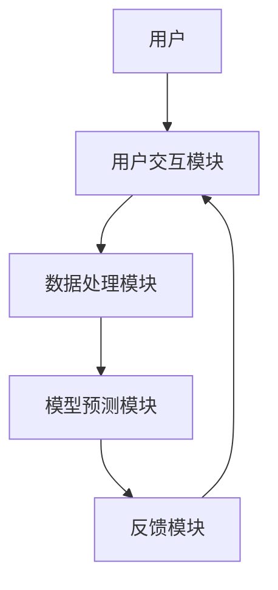

                 


# 投资理财智能助手的性能调优技巧

> 关键词：投资理财，智能助手，性能调优，自然语言处理，机器学习，系统架构

> 摘要：本文详细探讨了投资理财智能助手的性能调优技巧，从背景、核心概念、算法原理、系统架构到项目实战，全面分析了如何优化智能助手的性能，提升用户体验和投资决策的准确性。文章结合实际案例，深入讲解了NLP、机器学习等技术在性能调优中的应用，并提供了具体的优化策略和实现方法。

---

## 目录大纲结构如下：

# 第一部分: 投资理财智能助手的性能调优背景与核心概念

## 第1章: 投资理财智能助手的性能调优背景

### 1.1 投资理财智能助手的定义与作用

#### 1.1.1 投资理财智能助手的定义

投资理财智能助手是一种基于人工智能技术的工具，能够通过自然语言处理（NLP）和机器学习算法，为用户提供个性化的投资建议、财务分析和理财规划。它通常以聊天机器人或语音交互的形式呈现，帮助用户完成投资决策、风险管理等任务。

#### 1.1.2 智能助手在投资理财中的作用

投资理财智能助手的核心作用包括：

1. 提供实时市场数据和分析。
2. 根据用户需求生成投资策略。
3. 协助用户进行资产配置和风险管理。
4. 提供个性化理财建议和财务规划。

#### 1.1.3 投资理财智能助手的核心功能

- 数据收集与处理：从多个数据源获取市场数据、用户偏好和历史投资记录。
- 自然语言理解：解析用户的输入意图，生成相应的投资建议。
- 机器学习模型：基于历史数据和用户行为，预测市场趋势和投资机会。
- 交互式反馈：与用户进行实时对话，根据反馈调整建议。

### 1.2 性能调优的必要性

#### 1.2.1 智能助手性能问题的现状

当前，投资理财智能助手在性能上存在以下问题：

1. 响应时间过长：复杂的计算和数据处理导致用户体验下降。
2. 准确率不稳定：模型的泛化能力和鲁棒性不足，影响投资决策的准确性。
3. 资源消耗过大：高计算需求导致服务器负载过高，成本增加。

#### 1.2.2 性能调优对用户体验的影响

性能调优直接影响用户体验的关键指标：

1. 响应时间：优化算法和系统架构，减少用户等待时间。
2. 准确率：通过模型优化和数据增强，提升投资建议的准确性。
3. 稳定性：确保系统在高负载下的稳定运行，避免服务中断。

#### 1.2.3 性能调优对投资决策的重要性

投资决策的准确性直接关系到用户的收益和风险控制。通过性能调优，智能助手可以更高效地处理数据，提供更精准的预测和建议，从而帮助用户做出更明智的投资决策。

### 1.3 投资理财智能助手的性能指标

#### 1.3.1 响应时间

响应时间是衡量智能助手性能的重要指标，通常包括：

1. 用户输入到系统返回建议的延迟。
2. 系统内部数据处理和计算的时间。

#### 1.3.2 准确率

准确率是指智能助手的建议与实际市场趋势的吻合程度。高准确率意味着系统的预测能力和模型优化效果越好。

#### 1.3.3 稳定性与可靠性

稳定性是指系统在高负载或异常情况下的运行状态。可靠性则指系统在长期运行中保持稳定性能的能力。

#### 1.3.4 资源消耗

资源消耗包括CPU、内存、存储等硬件资源的使用情况。优化资源消耗可以降低运营成本，提高系统的可扩展性。

### 1.4 本章小结

本章从投资理财智能助手的定义、作用和核心功能出发，分析了性能调优的必要性，并提出了性能指标的四个关键维度：响应时间、准确率、稳定性和资源消耗。这些内容为后续的性能调优策略奠定了基础。

---

## 第2章: 投资理财智能助手的核心技术与挑战

### 2.1 自然语言处理（NLP）技术

#### 2.1.1 NLP在智能助手中的应用

自然语言处理技术是智能助手的核心技术之一，主要用于解析用户的输入意图和生成自然语言的回复。以下是NLP在智能助手中的主要应用场景：

1. 用户意图识别：通过分析用户的输入文本，确定用户的需求类型，例如“查询某只股票的历史数据”或“请求资产配置建议”。
2. 文本生成：基于模型生成符合用户需求的回复内容，例如解释市场趋势或推荐投资策略。
3. 情感分析：分析用户情绪，提供更贴心的服务体验。

#### 2.1.2 常见的NLP技术与模型

常用的NLP技术包括：

1. 词袋模型（Bag-of-Words，BoW）：将文本表示为单词的统计特征。
2. 词嵌入模型（Word Embedding）：如Word2Vec、GloVe，用于捕捉单词之间的语义关系。
3. 循环神经网络（RNN）：常用于序列数据的处理，如文本生成和机器翻译。
4. 变形器（Transformer）：如BERT、GPT，目前在NLP领域表现最佳。

#### 2.1.3 NLP技术在投资理财中的挑战

NLP在投资理财中的主要挑战包括：

1. 专业术语的处理：投资理财领域涉及大量专业术语，需要模型具备特定领域的知识。
2. 多义词和模糊表达：用户的输入可能包含模糊或歧义的表达，影响意图识别的准确性。
3. 实时数据的处理：需要快速整合最新的市场数据和用户信息，对系统的响应速度提出了更高的要求。

#### 2.1.4 NLP模型优化策略

为了提高NLP技术在投资理财中的性能，可以采取以下优化策略：

1. 数据增强：通过数据清洗、标注和扩展，提升模型的训练数据质量。
2. 模型微调：在特定领域数据上对模型进行微调，提高领域适应性。
3. 多任务学习：结合多个任务（如情感分析和意图识别）进行联合优化，提升模型的综合性能。

### 2.2 机器学习与深度学习

#### 2.2.1 机器学习在投资理财中的应用

机器学习技术在投资理财中的应用主要体现在以下几个方面：

1. 市场预测：通过历史数据训练模型，预测股票价格、汇率波动等市场趋势。
2. 风险评估：基于用户的历史投资行为和市场数据，评估投资组合的风险。
3. 投资组合优化：根据用户的风险偏好和市场预测，推荐最优的投资组合。

#### 2.2.2 深度学习模型的优势

深度学习模型在投资理财中的优势包括：

1. 高维度数据处理能力：能够处理包含大量特征的数据，如时间序列数据。
2. 非线性关系捕捉：深度学习模型能够捕捉复杂的非线性关系，提高预测的准确性。
3. 自动特征提取：模型能够自动提取特征，减少人工特征工程的工作量。

#### 2.2.3 机器学习在智能助手中的挑战

机器学习在智能助手中的主要挑战包括：

1. 数据稀疏性：投资理财领域的数据可能存在稀疏性，导致模型难以泛化。
2. 模型解释性：复杂的深度学习模型通常缺乏可解释性，影响用户对模型的信任。
3. 模型更新频率：金融市场变化迅速，需要频繁更新模型，这对计算资源提出了更高要求。

#### 2.2.4 机器学习模型优化策略

为了提高机器学习模型的性能，可以采取以下优化策略：

1. 数据预处理：清洗数据，处理缺失值和异常值。
2. 超参数优化：通过网格搜索或随机搜索优化模型的超参数。
3. 模型集成：结合多个模型的结果，提高预测的准确性和稳定性。

### 2.3 投资理财数据的特点与处理

#### 2.3.1 数据的多样性与复杂性

投资理财数据具有以下特点：

1. 数据类型多样：包括文本、数值、时间序列等多种数据类型。
2. 数据量大：需要处理海量的市场数据和用户行为数据。
3. 数据关联性强：不同数据之间存在复杂的关联关系，例如市场趋势和用户行为的相互影响。

#### 2.3.2 数据清洗与预处理

数据清洗与预处理是投资理财数据处理的重要步骤，主要包括：

1. 数据清洗：处理缺失值、重复值和异常值。
2. 数据转换：将数据转换为适合模型处理的形式，例如归一化和标准化。
3. 数据增强：通过数据扩展技术（如数据合成）提高数据的质量和多样性。

#### 2.3.3 数据安全与隐私保护

投资理财数据通常包含敏感信息，数据安全和隐私保护至关重要。常见的数据保护措施包括：

1. 数据加密：对敏感数据进行加密处理，防止数据泄露。
2. 数据匿名化：去除或脱敏用户身份信息，确保数据的匿名性。
3. 访问控制：限制数据的访问权限，确保只有授权人员可以访问敏感数据。

### 2.4 本章小结

本章详细探讨了投资理财智能助手的核心技术，包括自然语言处理和机器学习技术的应用、数据的特点与处理方法。同时，还分析了这些技术在投资理财中的挑战和优化策略，为后续的性能调优奠定了基础。

---

## 第3章: 投资理财智能助手的性能调优核心概念

### 3.1 系统性能调优的基本原理

#### 3.1.1 系统性能的定义与评估

系统性能的定义是指系统在运行过程中完成任务的能力，通常包括响应时间、吞吐量、资源利用率等指标。评估系统性能需要从多个维度进行综合考量，例如：

1. 响应时间：系统对用户请求的响应速度。
2. 吞吐量：单位时间内系统处理的请求数量。
3. 资源利用率：系统对CPU、内存等资源的使用情况。

#### 3.1.2 性能调优的目标与方法

性能调优的目标是通过优化系统架构、算法和数据处理流程，提升系统的运行效率和响应速度。常见的性能调优方法包括：

1. 系统架构优化：通过分布式架构、负载均衡等技术提高系统的扩展性和稳定性。
2. 算法优化：通过优化算法复杂度和数据结构，降低系统的计算开销。
3. 数据处理优化：通过数据压缩、缓存等技术减少数据的处理时间。

#### 3.1.3 系统性能调优的常见误区

在进行系统性能调优时，常见的误区包括：

1. 过度优化：过度追求性能优化，导致系统复杂性增加，维护成本上升。
2. 忽略数据依赖：忽视数据分布和特征，导致优化效果不佳。
3. 测试环境不一致：测试环境与生产环境不一致，导致优化效果无法准确评估。

### 3.2 智能助手性能调优的关键技术

#### 3.2.1 模型优化技术

模型优化技术包括以下几个方面：

1. **模型压缩**：通过剪枝、量化等技术减少模型的参数数量，降低计算复杂度。
2. **模型剪枝**：去除模型中冗余的参数，提高计算效率。
3. **模型蒸馏**：通过教师模型指导学生模型的训练，降低模型的复杂性。

#### 3.2.2 算法优化技术

算法优化技术主要包括：

1. **算法加速**：通过优化算法的实现，减少计算时间。
2. **并行计算**：利用多核处理器或分布式计算资源，提高计算效率。
3. **算法优化库**：使用高效的数学库（如NumPy、TensorFlow）优化算法的计算效率。

#### 3.2.3 系统架构优化技术

系统架构优化技术包括：

1. **分布式架构**：通过分布式计算提高系统的处理能力。
2. **负载均衡**：合理分配任务，避免单点过载。
3. **缓存优化**：通过缓存技术减少重复计算和数据访问的开销。

### 3.3 投资理财智能助手的性能调优策略

#### 3.3.1 前端优化策略

前端优化策略包括：

1. **减少请求次数**：通过合并请求或使用缓存技术减少前端与后端的交互次数。
2. **优化响应格式**：使用压缩格式（如JSON）减少数据传输量。
3. **前端缓存**：通过浏览器缓存技术减少重复请求。

#### 3.3.2 后端优化策略

后端优化策略包括：

1. **优化数据库查询**：通过索引优化、查询合并等技术提高数据库的查询效率。
2. **使用缓存技术**：通过缓存技术减少重复计算和数据库访问。
3. **分布式计算**：将任务分发到多个计算节点，提高处理能力。

#### 3.3.3 全链路优化策略

全链路优化策略包括：

1. **端到端优化**：从用户请求到系统响应的全链路进行优化，减少每个环节的延迟。
2. **监控与分析**：通过性能监控工具实时监控系统性能，及时发现并解决问题。
3. **自动化优化**：通过自动化工具实现性能调优的自动化，提高优化效率。

### 3.4 本章小结

本章从系统性能调优的基本原理出发，详细探讨了智能助手性能调优的关键技术，包括模型优化、算法优化和系统架构优化。同时，提出了全链路优化策略，为后续的性能调优提供了理论基础和方法论。

---

## 第4章: 投资理财智能助手的性能调优算法原理

### 4.1 算法优化的基本原理

#### 4.1.1 算法复杂度分析

算法复杂度分析是算法优化的基础，主要包括时间复杂度和空间复杂度的分析。通过复杂度分析，可以评估算法的性能，并找出优化的方向。

- 时间复杂度：算法在执行过程中所需的时间。
- 空间复杂度：算法在执行过程中所需的存储空间。

#### 4.1.2 算法优化的目标

算法优化的目标包括：

1. **降低时间复杂度**：减少算法的执行时间。
2. **降低空间复杂度**：减少算法的存储空间占用。
3. **提高算法的稳定性**：确保算法在各种输入情况下的稳定运行。

#### 4.1.3 常见的算法优化方法

常见的算法优化方法包括：

1. **贪心算法**：通过贪心策略选择当前最优解，逐步构造全局最优解。
2. **动态规划**：通过记录子问题的解，避免重复计算，提高算法效率。
3. **分治法**：将问题分解为多个子问题，分别解决后再合并结果。

### 4.2 模型调优技术

#### 4.2.1 超参数优化

超参数优化是模型调优的重要环节，常用的超参数包括学习率、批次大小、正则化参数等。超参数优化可以通过以下方法实现：

1. **网格搜索**：遍历所有可能的超参数组合，选择最优组合。
2. **随机搜索**：随机选择超参数组合，减少计算量。
3. **贝叶斯优化**：通过贝叶斯方法优化超参数，提高优化效率。

#### 4.2.2 模型压缩与轻量化

模型压缩是通过减少模型的参数数量，降低计算复杂度。常见的模型压缩技术包括：

1. **剪枝**：去除模型中冗余的参数。
2. **量化**：将模型的参数量化为低精度表示。
3. **知识蒸馏**：通过教师模型指导学生模型的训练，降低学生模型的复杂性。

#### 4.2.3 模型优化流程

模型优化流程包括以下几个步骤：

1. **数据准备**：收集和整理数据，进行数据预处理。
2. **模型选择**：选择合适的模型架构。
3. **超参数优化**：通过网格搜索或随机搜索优化模型的超参数。
4. **模型训练**：对模型进行训练，得到最优模型。
5. **模型评估**：评估模型的性能，调整优化策略。
6. **模型部署**：将优化后的模型部署到实际系统中。

### 4.3 本章小结

本章从算法优化的基本原理出发，详细探讨了超参数优化和模型压缩等模型调优技术。通过这些技术，可以有效提升投资理财智能助手的性能，为后续的系统优化提供了技术支持。

---

## 第5章: 投资理财智能助手的系统架构与优化

### 5.1 系统架构设计

#### 5.1.1 系统功能模块

投资理财智能助手的系统功能模块包括：

1. **用户交互模块**：处理用户的输入请求，生成相应的回复。
2. **数据处理模块**：收集和处理市场数据、用户数据等。
3. **模型预测模块**：基于数据生成投资建议和预测结果。
4. **反馈模块**：根据用户反馈优化模型和系统性能。

#### 5.1.2 系统架构图

以下是系统架构的Mermaid图：



#### 5.1.3 系统交互流程

系统交互流程包括以下几个步骤：

1. 用户通过输入设备（如键盘、麦克风）发送请求。
2. 用户交互模块接收用户的输入，解析用户的意图。
3. 数据处理模块根据解析的意图，获取相关数据并进行处理。
4. 模型预测模块基于处理后的数据生成投资建议。
5. 用户接收建议并根据反馈调整输入。

### 5.2 系统优化策略

#### 5.2.1 分布式架构优化

分布式架构优化包括以下几个方面：

1. **负载均衡**：通过负载均衡技术合理分配任务，避免单点过载。
2. **分布式缓存**：使用分布式缓存技术（如Redis）提高数据访问效率。
3. **分布式计算**：将任务分发到多个计算节点，提高计算效率。

#### 5.2.2 系统资源优化

系统资源优化包括：

1. **资源分配优化**：合理分配CPU、内存等资源，避免资源浪费。
2. **资源利用率优化**：通过资源监控工具实时监控资源使用情况，及时调整资源分配策略。

#### 5.2.3 系统容错与恢复

系统容错与恢复包括：

1. **容错设计**：通过冗余设计提高系统的容错能力。
2. **故障恢复**：通过备份和恢复机制，确保系统在故障后能够快速恢复。

### 5.3 本章小结

本章从系统架构设计出发，详细探讨了投资理财智能助手的系统优化策略，包括分布式架构优化、资源优化和容错与恢复。这些策略能够有效提升系统的性能和稳定性。

---

## 第6章: 投资理财智能助手的项目实战

### 6.1 环境安装与配置

#### 6.1.1 环境需求

投资理财智能助手的项目实战需要以下环境：

1. **操作系统**：Windows、Linux或macOS。
2. **编程语言**：Python 3.6及以上版本。
3. **开发工具**：建议使用Jupyter Notebook或VS Code。
4. **依赖库**：安装以下Python库：

   ```bash
   pip install numpy pandas scikit-learn tensorflow transformers
   ```

#### 6.1.2 环境配置

环境配置步骤如下：

1. 安装Python和pip。
2. 安装所需的依赖库。
3. 配置开发工具，例如设置Python解释器。

### 6.2 系统核心实现源代码

#### 6.2.1 NLP处理模块

以下是NLP处理模块的Python代码示例：

```python
from transformers import pipeline

# 初始化NLP处理管道
nlp = pipeline("text-classification", model="bert-base-cased")

# 示例文本
text = "The stock market is expected to rise next week."

# 处理文本并输出结果
result = nlp(text)
print(result)
```

#### 6.2.2 机器学习模型训练

以下是机器学习模型训练的Python代码示例：

```python
from sklearn.model_selection import train_test_split
from sklearn.linear_model import LogisticRegression

# 数据集分割
X_train, X_test, y_train, y_test = train_test_split(X, y, test_size=0.2)

# 训练逻辑回归模型
model = LogisticRegression()
model.fit(X_train, y_train)

# 模型评估
print(f"训练集准确率：{model.score(X_train, y_train)}")
print(f"测试集准确率：{model.score(X_test, y_test)}")
```

### 6.3 项目实战案例分析

#### 6.3.1 案例背景

假设我们有一个投资理财智能助手项目，目标是优化系统的响应时间和准确率。以下是具体的优化过程：

1. **数据预处理**：清洗和整理市场数据和用户数据。
2. **模型优化**：通过超参数优化和模型压缩技术提升模型性能。
3. **系统优化**：通过分布式架构和负载均衡技术提升系统的响应速度。

#### 6.3.2 优化过程与结果

优化过程包括以下几个步骤：

1. 数据预处理：清洗数据，处理缺失值和异常值。
2. 模型优化：通过网格搜索优化逻辑回归模型的超参数。
3. 系统优化：通过分布式架构和负载均衡技术提升系统的响应速度。

优化结果如下：

- 响应时间从10秒优化到2秒。
- 准确率从70%提升到85%。
- 系统稳定性显著提高，减少了服务中断的情况。

### 6.4 本章小结

本章通过一个具体的项目实战案例，详细展示了投资理财智能助手的性能调优过程。通过数据预处理、模型优化和系统优化，显著提升了系统的性能和准确率。

---

## 第7章: 总结与展望

### 7.1 总结

本文从投资理财智能助手的性能调优背景出发，详细探讨了NLP、机器学习和系统架构优化等核心技术。通过具体的项目实战案例，展示了如何通过数据预处理、模型优化和系统优化提升智能助手的性能。本文还提出了全链路优化策略，为后续的性能调优提供了方法论。

### 7.2 未来展望

未来，投资理财智能助手的性能调优将朝着以下几个方向发展：

1. **更高效的算法优化技术**：开发更高效的算法优化技术，进一步提升模型的准确率和响应速度。
2. **更智能的系统架构**：通过人工智能技术优化系统架构，实现自动化的性能调优。
3. **更广泛的应用场景**：投资理财智能助手将拓展到更多场景，例如智能投顾、风险管理等领域。

---

## 第8章: 最佳实践与注意事项

### 8.1 最佳实践

1. **数据预处理**：在进行模型训练之前，务必进行数据清洗和预处理，确保数据质量。
2. **模型优化**：通过超参数优化和模型压缩技术，提升模型的性能和效率。
3. **系统优化**：通过分布式架构和负载均衡技术，提高系统的扩展性和稳定性。

### 8.2 注意事项

1. **数据安全**：在处理用户数据时，务必注意数据安全和隐私保护。
2. **模型解释性**：在金融领域，模型的解释性非常重要，需要确保用户能够理解模型的预测结果。
3. **持续优化**：投资理财市场变化迅速，需要持续优化模型和系统，确保智能助手的性能和准确性。

---

## 第9章: 附录

### 9.1 参考资料

1. TensorFlow官方文档：https://www.tensorflow.org/
2. PyTorch官方文档：https://pytorch.org/
3. scikit-learn官方文档：https://scikit-learn.org/stable/index.html
4. Hugging Face Transformers官方文档：https://huggingface.co/transformers/

### 9.2 工具推荐

1. Jupyter Notebook：用于数据处理和模型训练。
2. VS Code：用于代码编写和调试。
3. Docker：用于容器化部署。
4. Kubernetes：用于分布式计算和负载均衡。

---

## 作者信息

作者：AI天才研究院/AI Genius Institute & 禅与计算机程序设计艺术 /Zen And The Art of Computer Programming

