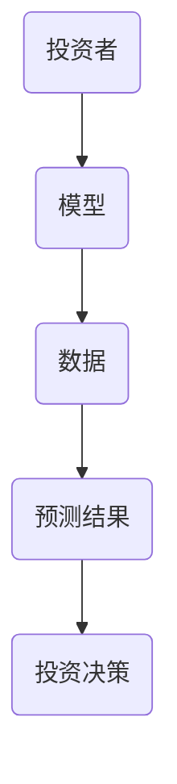
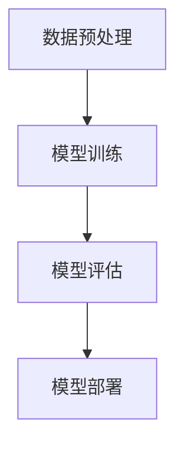
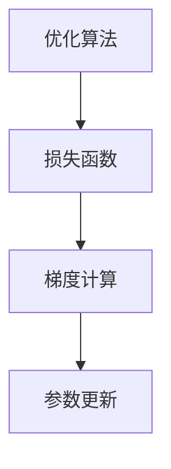
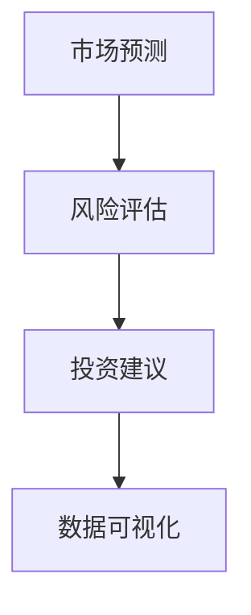
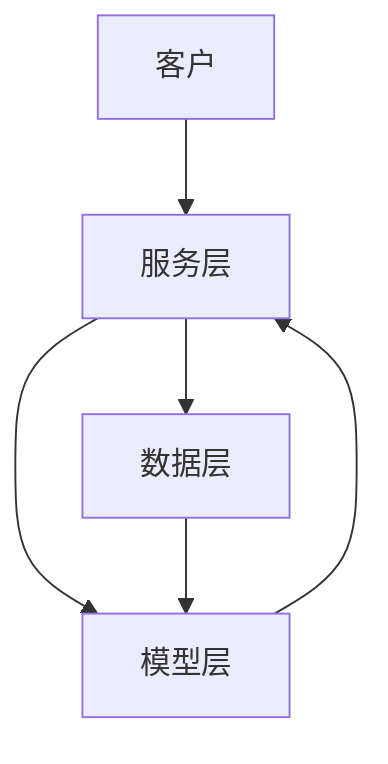
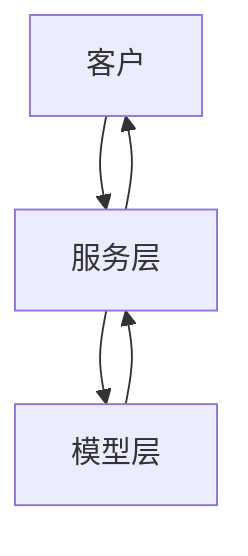

                 

<think>
好，我现在需要帮用户撰写一篇技术博客文章，标题是《投资理财智能助手的机器学习模型管理方法》。用户已经给出了详细的目录大纲，我需要根据这个大纲来逐步思考如何展开每个部分，确保内容完整且符合要求。

首先，我需要明确每个章节的重点内容。从背景介绍开始，这部分需要说明投资理财智能助手的背景、问题背景和解决方法。接着是核心概念，需要解释机器学习模型的基本原理、特征工程、模型评估等，并附上ER实体关系图。

然后是算法原理，这部分需要详细讲解模型训练流程、优化算法，并使用mermaid流程图和Python代码示例。数学公式需要用LaTeX表示，比如损失函数和优化算法的公式。

接下来是系统架构部分，我需要设计系统架构图、类图，并描述系统功能模块和交互流程。项目实战部分需要提供环境安装步骤、代码实现、案例分析和项目总结。

最后是最佳实践和小结，总结文章内容，并提供注意事项和扩展阅读的建议。

在写作过程中，我需要确保每个部分都详细展开，使用专业而清晰的语言，同时符合用户的格式要求，包括使用markdown、mermaid图表和LaTeX公式。这将帮助读者更好地理解投资理财智能助手的机器学习模型管理方法。

总的来说，我会按照目录大纲逐步展开，确保每个章节内容丰富，逻辑清晰，满足用户对深度和技术细节的要求。
</think>

# 投资理财智能助手的机器学习模型管理方法

## 关键词
投资理财, 机器学习, 模型管理, 算法优化, 系统架构

## 摘要
本文详细探讨了投资理财智能助手的机器学习模型管理方法。首先介绍了投资理财智能助手的背景、核心概念和问题背景，然后从算法原理、系统架构、项目实战等多个方面展开分析，结合实际案例和最佳实践，全面阐述了如何有效管理投资理财智能助手的机器学习模型。

---

## 第一部分: 投资理财智能助手的背景与核心概念

### 第1章: 投资理财智能助手的背景介绍

#### 1.1 投资理财智能助手的背景
投资理财智能助手是一种利用机器学习技术为投资者提供个性化投资建议和决策支持的工具。随着金融市场复杂性的增加，传统的人工投资方式逐渐暴露出效率低、风险高等问题，而智能化的投资工具能够通过数据驱动的方式，帮助投资者做出更科学的决策。

##### 1.1.1 传统投资理财的痛点
传统的投资理财方式主要依赖人工分析和经验判断，存在以下痛点：
- **信息不全**：投资者难以获取全面的市场数据和分析。
- **决策延迟**：人工分析耗时较长，难以及时捕捉市场机会。
- **主观性强**：受个人经验和情绪影响较大，存在决策偏差。

##### 1.1.2 智能化投资理财的需求
智能化投资理财的需求主要体现在以下几个方面：
- **实时性**：能够快速处理市场数据，提供实时的投资建议。
- **个性化**：根据投资者的风险承受能力和收益目标，提供定制化的投资方案。
- **准确性**：通过机器学习模型提高预测的准确性。

##### 1.1.3 机器学习在投资理财中的应用
机器学习在投资理财中的应用主要体现在以下几个方面：
- **市场预测**：利用机器学习模型预测股票价格、市场趋势等。
- **风险评估**：通过模型评估投资组合的风险。
- **智能推荐**：根据投资者的偏好推荐合适的投资产品。

#### 1.2 问题背景与描述
投资理财智能助手的核心任务是通过机器学习模型为投资者提供准确的投资建议。然而，模型的管理是一个复杂的系统工程，需要考虑数据预处理、模型训练、模型部署、模型监控等多个环节。

##### 1.2.1 投资者的需求分析
投资者的需求可以分为以下几类：
- **普通投资者**：需要简单易用的投资工具，帮助其进行基本的投资决策。
- **机构投资者**：需要高精度的市场预测模型，支持复杂的投资策略。
- **风险管理**：所有投资者都需要关注投资组合的风险控制。

##### 1.2.2 现有投资工具的不足
现有的投资工具主要依赖人工分析，存在以下不足：
- **效率低下**：人工分析耗时长，难以满足实时性需求。
- **决策偏差**：受个人情绪和经验影响，存在决策偏差。
- **缺乏个性化**：无法根据投资者的个性化需求提供定制化的投资建议。

##### 1.2.3 机器学习模型的优势
机器学习模型在投资理财中的优势主要体现在以下几个方面：
- **数据驱动**：能够利用大量历史数据进行分析，提高预测的准确性。
- **实时性**：能够快速处理实时数据，提供及时的投资建议。
- **个性化**：可以根据投资者的个性化需求，提供定制化的投资方案。

#### 1.3 问题解决与边界
投资理财智能助手的目标是通过机器学习模型解决投资理财中的痛点，提高投资效率和准确性。

##### 1.3.1 机器学习模型如何解决投资问题
机器学习模型可以通过以下方式解决投资问题：
- **市场预测**：利用机器学习模型预测股票价格、市场趋势等。
- **风险评估**：通过模型评估投资组合的风险。
- **智能推荐**：根据投资者的偏好推荐合适的投资产品。

##### 1.3.2 模型管理的边界与外延
模型管理的边界主要集中在数据预处理、模型训练、模型部署和模型监控等方面。模型的外延则包括数据源、投资者需求、市场环境等外部因素。

##### 1.3.3 核心要素与组成结构
投资理财智能助手的核心要素包括：
- **数据源**：股票价格、市场新闻、经济指标等。
- **机器学习模型**：用于市场预测、风险评估等。
- **投资者需求**：投资者的风险承受能力、收益目标等。
- **投资建议**：基于模型预测的结果，为投资者提供具体的投资建议。

---

### 第2章: 核心概念与联系

#### 2.1 核心概念原理
投资理财智能助手的核心概念包括机器学习模型、数据预处理、特征工程、模型评估等。

##### 2.1.1 机器学习模型的基本原理
机器学习模型的基本原理包括数据预处理、模型训练、模型评估和模型部署。数据预处理是模型训练的前提，模型训练是模型学习数据规律的过程，模型评估是验证模型性能的必要步骤，模型部署是将模型应用于实际场景的过程。

##### 2.1.2 投资理财中的特征工程
特征工程是投资理财智能助手中非常重要的一步，主要包括特征选择、特征提取和特征转换。特征选择是根据业务需求选择重要的特征，特征提取是从数据中提取有用的特征，特征转换是对特征进行标准化、归一化等处理。

##### 2.1.3 模型评估与优化
模型评估是通过测试数据验证模型的性能，模型优化是通过调整模型参数和优化算法提高模型的性能。常用的模型评估指标包括准确率、召回率、F1分数等。

#### 2.2 概念属性对比表
以下是一个概念属性对比表，展示了不同模型的特点：

| 模型类型 | 数据要求 | 训练时间 | 预测精度 | 解释性 |
|----------|----------|----------|----------|--------|
| 线性回归 | 数值型数据 | 短 | 中等 | 高 |
| 支持向量机 | 标签型数据 | 中 | 高 | 中等 |
| 神经网络 | 数值型数据 | 长 | 高 | 低 |

#### 2.3 ER实体关系图
以下是投资理财智能助手的ER实体关系图：



---

## 第二部分: 机器学习模型管理的算法原理

### 第3章: 算法原理讲解

#### 3.1 模型训练流程
以下是模型训练流程的mermaid图：



##### 3.1.1 数据预处理
数据预处理是模型训练的前提，主要包括数据清洗、特征工程和数据分割。数据清洗是去除噪声数据，特征工程是提取有用的特征，数据分割是将数据分为训练集和测试集。

##### 3.1.2 模型训练
模型训练是通过优化算法调整模型参数，使模型能够准确地预测目标变量。常用的优化算法包括随机梯度下降（SGD）、Adam优化器等。

##### 3.1.3 模型评估
模型评估是通过测试数据验证模型的性能，常用的评估指标包括准确率、召回率、F1分数等。

#### 3.2 模型优化算法
以下是模型优化算法的mermaid图：



##### 3.2.1 损失函数
损失函数是衡量模型预测值与真实值之间差异的函数，常用的损失函数包括均方误差（MSE）、对数损失函数等。

##### 3.2.2 优化算法
优化算法是通过调整模型参数最小化损失函数的算法，常用的优化算法包括随机梯度下降（SGD）、Adam优化器等。

---

### 第4章: 数学模型和公式

#### 4.1 损失函数
损失函数是用来衡量模型预测值与真实值之间差异的函数，常用的损失函数包括均方误差（MSE）和对数损失函数。

##### 4.1.1 均方误差（MSE）
$$\text{MSE} = \frac{1}{n}\sum_{i=1}^{n}(y_i - \hat{y}_i)^2$$

##### 4.1.2 对数损失函数
$$\text{Log Loss} = -\frac{1}{n}\sum_{i=1}^{n} [y_i \log(\hat{y}_i) + (1 - y_i) \log(1 - \hat{y}_i)]$$

#### 4.2 优化算法
优化算法是通过调整模型参数最小化损失函数的算法，常用的优化算法包括随机梯度下降（SGD）和Adam优化器。

##### 4.2.1 随机梯度下降（SGD）
随机梯度下降是一种常用优化算法，其更新公式为：
$$\theta_{new} = \theta_{old} - \eta \cdot \nabla J(\theta_{old})$$
其中，$\eta$是学习率，$\nabla J(\theta_{old})$是损失函数对$\theta_{old}$的梯度。

##### 4.2.2 Adam优化器
Adam优化器是一种结合了动量和自适应学习率的优化算法，其更新公式为：
$$m_t = \beta_1 m_{t-1} + (1 - \beta_1) g_t$$
$$v_t = \beta_2 v_{t-1} + (1 - \beta_2) g_t^2$$
$$\theta_{t} = \theta_{t-1} - \eta \frac{m_t}{\sqrt{v_t} + \epsilon}$$
其中，$\beta_1$和$\beta_2$分别是动量和自适应学习率的参数，$\epsilon$是一个小的常数，用于防止除以零。

---

## 第三部分: 系统架构与设计

### 第5章: 系统架构设计

#### 5.1 项目介绍
投资理财智能助手是一个基于机器学习的投资决策支持系统，主要功能包括市场预测、风险评估、投资建议等。

#### 5.2 系统功能设计
以下是系统的功能模块图：



##### 5.2.1 数据预处理模块
数据预处理模块负责对原始数据进行清洗、特征工程和数据分割。

##### 5.2.2 模型训练模块
模型训练模块负责训练机器学习模型，并保存模型参数。

##### 5.2.3 模型评估模块
模型评估模块负责通过测试数据验证模型的性能，并输出评估结果。

##### 5.2.4 模型部署模块
模型部署模块负责将模型部署到生产环境，并提供API接口供其他系统调用。

#### 5.3 系统架构图
以下是系统的架构图：



#### 5.4 系统接口设计
系统的接口设计主要包括API接口和数据接口。

##### 5.4.1 API接口
API接口是系统对外提供的接口，主要用于接受投资者的请求并返回投资建议。

##### 5.4.2 数据接口
数据接口是系统与外部数据源之间的接口，主要用于获取股票价格、市场新闻等数据。

#### 5.5 系统交互流程
以下是系统的交互流程图：



---

## 第四部分: 项目实战

### 第6章: 项目实战

#### 6.1 环境安装
以下是项目实战的环境安装步骤：

1. 安装Python和必要的库：
   ```bash
   pip install numpy pandas scikit-learn matplotlib
   ```

2. 安装Jupyter Notebook：
   ```bash
   pip install jupyter
   ```

3. 安装TensorFlow：
   ```bash
   pip install tensorflow
   ```

#### 6.2 系统核心实现源代码

##### 6.2.1 数据预处理代码
```python
import pandas as pd
import numpy as np

# 加载数据
data = pd.read_csv('stock_data.csv')

# 数据清洗
data.dropna(inplace=True)

# 特征工程
from sklearn.preprocessing import StandardScaler
scaler = StandardScaler()
data_features = scaler.fit_transform(data[['open', 'high', 'low', 'close']])
```

##### 6.2.2 模型训练代码
```python
from sklearn.linear_model import LinearRegression
from sklearn.model_selection import train_test_split
from sklearn.metrics import mean_squared_error

# 数据分割
X_train, X_test, y_train, y_test = train_test_split(data_features, data['label'], test_size=0.2)

# 训练模型
model = LinearRegression()
model.fit(X_train, y_train)

# 模型预测
y_pred = model.predict(X_test)
print('均方误差:', mean_squared_error(y_test, y_pred))
```

#### 6.3 代码应用解读与分析
以上代码实现了数据预处理、模型训练和模型评估的基本功能。数据预处理部分使用了StandardScaler对数据进行标准化处理，模型训练部分使用了线性回归模型，模型评估部分使用了均方误差作为评估指标。

#### 6.4 案例分析和详细讲解剖析
以下是一个具体的案例分析，展示了如何利用投资理财智能助手进行股票价格预测。

##### 6.4.1 数据获取与预处理
假设我们有一个包含股票价格数据的CSV文件，首先需要加载数据并进行预处理：

```python
import pandas as pd
import numpy as np

data = pd.read_csv('stock_data.csv')

# 数据清洗
data.dropna(inplace=True)

# 特征工程
from sklearn.preprocessing import StandardScaler
scaler = StandardScaler()
data_features = scaler.fit_transform(data[['open', 'high', 'low', 'close']])
```

##### 6.4.2 模型训练
使用线性回归模型进行训练：

```python
from sklearn.linear_model import LinearRegression
from sklearn.model_selection import train_test_split
from sklearn.metrics import mean_squared_error

# 数据分割
X_train, X_test, y_train, y_test = train_test_split(data_features, data['label'], test_size=0.2)

# 训练模型
model = LinearRegression()
model.fit(X_train, y_train)
```

##### 6.4.3 模型预测与评估
进行模型预测并评估性能：

```python
y_pred = model.predict(X_test)
print('均方误差:', mean_squared_error(y_test, y_pred))
```

##### 6.4.4 模型部署
将模型部署到生产环境，并提供API接口供其他系统调用。

#### 6.5 项目总结
通过以上步骤，我们可以看到投资理财智能助手的核心功能包括数据预处理、模型训练、模型评估和模型部署。每个环节都需要仔细处理，才能确保模型的性能和准确性。

---

## 第五部分: 最佳实践与小结

### 第7章: 最佳实践与小结

#### 7.1 最佳实践
以下是投资理财智能助手模型管理的一些最佳实践：

##### 7.1.1 数据预处理
- 确保数据的完整性和准确性。
- 根据业务需求选择合适的特征工程方法。

##### 7.1.2 模型选择
- 根据数据类型和业务需求选择合适的模型。
- 对不同模型进行对比和评估，选择性能最优的模型。

##### 7.1.3 模型部署
- 确保模型部署的环境与训练环境一致。
- 提供完善的API接口文档，方便其他系统调用。

##### 7.1.4 模型监控
- 定期监控模型的性能，及时发现并解决问题。
- 根据市场变化和投资者需求，及时更新和优化模型。

#### 7.2 小结
投资理财智能助手的机器学习模型管理是一个复杂但重要的任务。通过合理的数据预处理、模型选择和部署，可以显著提高投资理财的效率和准确性。同时，模型的监控和优化也是确保模型长期稳定运行的关键。

#### 7.3 注意事项
- **数据隐私**：确保投资者数据的安全和隐私。
- **模型解释性**：确保模型的解释性，以便投资者理解和信任。
- **实时性**：确保模型能够实时处理数据，提供及时的投资建议。

#### 7.4 拓展阅读
- 《机器学习实战》
- 《深入浅出机器学习》
- 《投资学原理》

---

## 作者：AI天才研究院/AI Genius Institute & 禅与计算机程序设计艺术 /Zen And The Art of Computer Programming

---

以上就是《投资理财智能助手的机器学习模型管理方法》的完整目录和内容概要。

