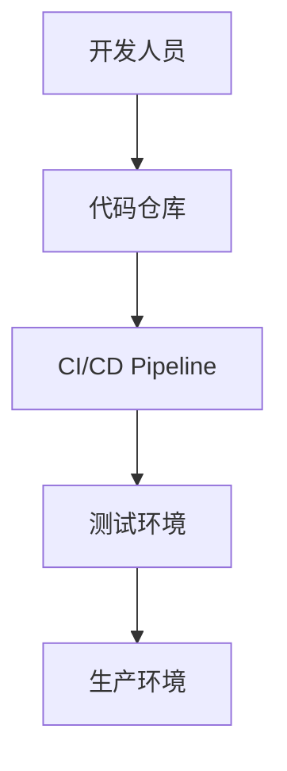
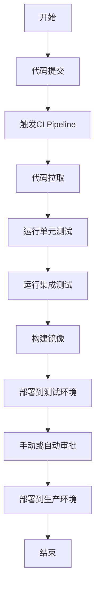
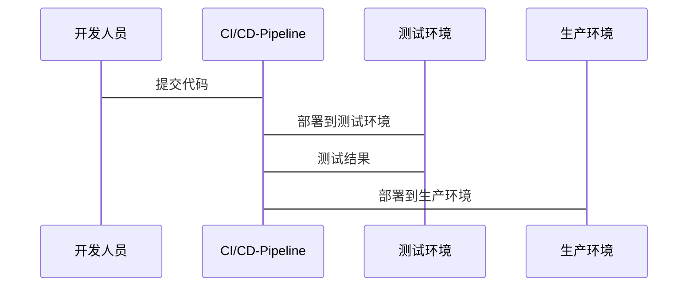

                 

<think>
嗯，我现在需要帮助用户撰写一篇关于持续集成/持续部署（CI/CD）在自动化AI Agent更新流程中的技术博客文章。用户已经提供了一个详细的目录结构，包括关键词、摘要和各章的详细内容。我需要按照这个结构，用逻辑清晰、结构紧凑且专业的技术语言来撰写这篇文章，确保每一步都详细分析，对技术原理和本质进行到位的剖析。

首先，我会从背景介绍开始，解释CI/CD的基本概念，为什么它们在AI开发中如此重要。然后，我会详细讲解核心概念，包括CI和CD的区别，以及它们在AI代理更新中的具体应用。接着，我会通过一个实际案例，展示CI/CD pipeline在AI项目中的具体流程，包括代码提交、测试、构建镜像和部署等步骤。

在系统分析与架构设计部分，我会使用Mermaid图来展示系统架构和交互流程，帮助读者更好地理解系统的结构。然后，我会提供项目的实战部分，从环境安装到代码实现，再到测试和部署，让读者能够实际操作。

最后，我会总结CI/CD的优势，提出最佳实践和未来的发展方向。整个过程中，我会确保每一部分都符合用户的要求，内容完整且逻辑清晰，同时使用合适的代码示例和图表来辅助说明。

现在，我需要一步步完成每个章节的内容，确保覆盖所有必要的部分，同时保持语言的专业性和技术的深度。我会从关键词和摘要开始，然后逐步展开每一章的内容，确保每个部分都详细且易于理解。

总的来说，我需要通过详细的分析和清晰的结构，为读者提供一篇高质量的技术博客文章，帮助他们理解如何利用CI/CD来优化AI Agent的更新流程。
</think>

# 持续集成/持续部署：自动化AI Agent的更新流程

## 关键词：持续集成、持续部署、CI/CD Pipeline、自动化测试、AI Agent

## 摘要：本文深入探讨了持续集成和持续部署在自动化AI Agent更新中的应用。通过详细分析CI/CD的核心概念、算法原理、系统架构和项目实战，揭示了如何通过自动化流程确保AI Agent的高效、稳定更新。文章从背景介绍到系统设计，再到实战案例，为读者提供了全面的知识体系，帮助他们在实际项目中有效应用CI/CD。

---

# 第一部分: 持续集成/持续部署基础

## 第1章: 持续集成与持续部署概述

### 1.1 持续集成的核心概念

#### 1.1.1 持续集成的定义与背景
持续集成（CI）是一种软件开发实践，通过频繁地将代码集成到主代码库中，并自动化执行单元测试、集成测试等，确保代码的健康状态。CI的核心在于“持续”，即开发人员每次提交代码后，立即触发测试，及时发现和修复集成问题。

**背景**：在传统开发模式中，代码集成往往会导致“集成地狱”，即长时间的集成问题难以解决。CI通过频繁集成和自动化测试，有效避免了这一问题。

**定义**：持续集成是一种通过自动化工具（如Jenkins、GitHub Actions）持续将代码集成到主分支，并运行测试以确保代码质量的开发实践。

#### 1.1.2 持续集成的关键特点
- **频繁集成**：开发人员每次提交代码后，立即触发测试。
- **自动化测试**：通过自动化工具执行单元测试、集成测试等。
- **快速反馈**：测试结果快速反馈给开发人员，确保问题尽早发现。

#### 1.1.3 持续集成与传统开发模式的区别
| 特性                | 持续集成                              | 传统开发模式                         |
|---------------------|--------------------------------------|--------------------------------------|
| 集成频率            | 高频（每天多次）                      | 低频（每周或每月）                   |
| 测试执行           | 自动化测试                            | 手动测试或少量自动化                 |
| 问题发现           | 问题发现早，每次提交后               | 问题发现晚，集成时集中爆发          |

---

### 1.2 持续部署的核心概念

#### 1.2.1 持续部署的定义与特点
持续部署（CD）是持续集成的延伸，强调将代码从测试环境自动化部署到生产环境。CD的目标是通过自动化流程确保代码从开发到生产的每个阶段都能顺利进行。

**定义**：持续部署是一种通过自动化工具将代码从测试环境部署到生产环境的开发实践。

**特点**：
- **自动化部署**：通过脚本实现从测试到生产的自动部署。
- **蓝绿部署**：通过镜像切换实现无风险发布。
- **回滚机制**：部署失败时能够快速回滚到之前版本。

#### 1.2.2 持续部署的优势与挑战
- **优势**：
  - 提高部署频率，缩短交付周期。
  - 降低人为错误，提升部署成功率。
  - 通过自动化监控确保系统稳定性。
- **挑战**：
  - 需要复杂的自动化工具支持。
  - 需要完善的监控和回滚机制。
  - 对团队协作和流程管理要求较高。

#### 1.2.3 持续部署与持续集成的关系
持续部署是持续集成的延伸，两者共同构成了CI/CD pipeline。CI关注代码的集成和测试，CD关注代码的部署和发布。通过CI和CD的结合，能够实现从代码提交到生产部署的全自动流程。

---

### 1.3 CI/CD Pipeline 的基本结构

#### 1.3.1 开发、测试、部署的流程
CI/CD Pipeline通常包括以下几个阶段：
1. **代码提交**：开发人员将代码提交到版本控制系统（如Git）。
2. **触发CI Pipeline**：代码提交触发CI Pipeline，开始自动化测试。
3. **代码拉取**：CI Pipeline从版本控制系统拉取最新的代码。
4. **运行单元测试**：执行单元测试，确保单个模块的功能正常。
5. **运行集成测试**：执行集成测试，确保模块之间的协作正常。
6. **构建镜像**：将代码构建为可部署的镜像（如Docker镜像）。
7. **部署到测试环境**：将镜像部署到测试环境，进行进一步验证。
8. **手动或自动审批**：测试通过后，触发部署到生产环境的流程，可能需要人工审批。
9. **部署到生产环境**：将镜像部署到生产环境，正式发布。

#### 1.3.2 Pipeline 的阶段划分
CI/CD Pipeline通常分为以下几个阶段：
1. **CI阶段**：包括代码拉取、单元测试、集成测试。
2. **CD阶段**：包括构建镜像、部署到测试环境、部署到生产环境。

#### 1.3.3 Pipeline 的自动化工具
常用的CI/CD工具包括：
- **CI工具**：Jenkins、GitHub Actions、CircleCI。
- **CD工具**：Jenkins、Terraform、Kubernetes。

---

## 第2章: 持续集成与持续部署的核心概念与联系

### 2.1 核心概念原理

#### 2.1.1 CI/CD 的核心流程
1. **代码提交**：开发人员提交代码到版本控制系统。
2. **触发CI Pipeline**：代码提交触发CI Pipeline，开始自动化测试。
3. **运行测试**：CI Pipeline执行单元测试和集成测试。
4. **构建镜像**：测试通过后，构建可部署的镜像。
5. **部署到测试环境**：将镜像部署到测试环境，进行进一步验证。
6. **审批与部署**：测试通过后，手动或自动审批，部署到生产环境。

#### 2.1.2 版本控制与分支策略
版本控制是CI/CD的核心，通常采用以下分支策略：
- **主分支（trunk）**：用于生产环境的代码。
- **特性分支（feature branches）**：用于开发新功能。
- **分支策略**：特性分支完成后，并入主分支，确保主分支始终稳定。

#### 2.1.3 自动化测试与质量保障
自动化测试是CI/CD的核心，包括：
- **单元测试**：测试单个函数或方法。
- **集成测试**：测试模块之间的协作。
- **端到端测试**：测试整个系统的流程。

---

### 2.2 核心概念属性对比

| 特性                | 持续集成                              | 持续部署                              |
|---------------------|--------------------------------------|--------------------------------------|
| 目标                | 确保代码集成的正确性                   | 确保代码部署的正确性                   |
| 关键步骤            | 代码提交、测试                        | 部署到测试环境、生产环境                |
| 工具                | Jenkins、GitHub Actions               | Jenkins、Terraform                    |
| 输出                | 测试报告                             | 部署状态报告                           |

---

### 2.3 ER 实体关系图架构



---

## 第3章: 持续集成与持续部署的算法原理

### 3.1 算法原理流程



---

### 3.2 算法实现代码

```python
def ci_cd_pipeline():
    while True:
        trigger = detect_code_change()
        if trigger:
            run_unit_tests()
            run_integration_tests()
            build_docker_image()
            deploy_to_test_env()
            approve_deployment()
            deploy_to_prod_env()
        else:
            time.sleep(60)
```

---

## 第4章: 系统分析与架构设计方案

### 4.1 问题场景介绍

#### 4.1.1 问题背景
在AI Agent的开发过程中，代码更新频繁，依赖的环境复杂，手动部署容易导致错误。因此，需要一种自动化的方式来确保AI Agent的更新流程稳定可靠。

#### 4.1.2 问题描述
- **问题1**：手动部署容易出错，导致生产环境不稳定。
- **问题2**：测试环境和生产环境差异导致部署失败。
- **问题3**：缺乏回滚机制，部署失败时难以快速恢复。

---

### 4.2 项目介绍

#### 4.2.1 项目目标
实现AI Agent的自动化更新流程，确保每次代码提交都能自动测试、构建和部署。

#### 4.2.2 项目范围
- AI Agent的代码开发。
- CI/CD Pipeline的设计与实现。
- 测试环境和生产环境的搭建。

---

### 4.3 系统功能设计

#### 4.3.1 领域模型

```mermaid
classDiagram
    class AI-Agent {
        +代码仓库
        +CI/CD Pipeline
        +测试环境
        +生产环境
        +自动化测试脚本
    }
    class CI/CD-Pipeline {
        -代码拉取
        -单元测试
        -集成测试
        -镜像构建
        -部署
    }
```

---

#### 4.3.2 系统架构设计


---

### 4.4 系统接口设计

#### 4.4.1 接口设计
- **接口1**：代码仓库与CI/CD Pipeline的接口。
- **接口2**：测试环境与生产环境的接口。
- **接口3**：CI/CD Pipeline与自动化工具的接口。

---

### 4.5 系统交互设计



---

## 第5章: 项目实战

### 5.1 环境安装

#### 5.1.1 安装Jenkins
```bash
sudo apt-get update
sudo apt-get install jenkins
```

#### 5.1.2 安装Docker
```bash
sudo apt-get install docker.io
```

---

### 5.2 系统核心实现源代码

#### 5.2.1 Jenkins Pipeline 代码
```groovy
pipeline {
    agent none
    stages {
        stage('拉取代码') {
            agent {
                docker 'python:3'
            }
            steps {
                sh 'git clone https://github.com/ai-agent/repo.git'
            }
        }
        stage('运行单元测试') {
            agent {
                docker 'python:3'
            }
            steps {
                sh 'python -m pytest tests/unit/'
            }
        }
        stage('运行集成测试') {
            agent {
                docker 'python:3'
            }
            steps {
                sh 'python -m pytest tests/integration/'
            }
        }
        stage('构建镜像') {
            agent {
                docker 'docker:dind'
            }
            steps {
                sh 'docker build -t ai-agent .
```

---

### 5.3 代码应用解读与分析

#### 5.3.1 代码解读
- **CI阶段**：代码提交触发Jenkins Pipeline，开始拉取代码、运行单元测试和集成测试。
- **CD阶段**：测试通过后，构建Docker镜像并部署到测试环境，最后部署到生产环境。

---

### 5.4 实际案例分析和详细讲解剖析

#### 5.4.1 案例分析
假设我们有一个AI Agent项目，代码托管在GitHub上，使用Jenkins作为CI/CD工具。开发人员每次提交代码后，Jenkins会自动触发Pipeline，执行以下步骤：
1. 拉取代码。
2. 运行单元测试。
3. 运行集成测试。
4. 构建Docker镜像。
5. 部署到测试环境。
6. 部署到生产环境。

---

### 5.5 项目小结

通过本章的实战，我们了解了如何在实际项目中应用CI/CD。从环境安装到代码实现，再到测试和部署，整个过程都是自动化的。通过Jenkins和Docker的结合，能够高效地管理AI Agent的更新流程。

---

## 第6章: 总结与展望

### 6.1 总结

持续集成和持续部署是现代软件开发的重要实践，尤其在AI Agent的开发中，CI/CD能够显著提高开发效率和代码质量。通过自动化测试和部署，能够确保AI Agent的更新流程稳定可靠。

---

### 6.2 展望

未来，随着AI技术的不断发展，CI/CD在AI开发中的应用将会更加广泛。我们需要进一步优化CI/CD Pipeline，引入更多自动化工具，确保AI Agent的更新流程更加高效和智能。

---

## 作者：AI天才研究院/AI Genius Institute & 禅与计算机程序设计艺术 /Zen And The Art of Computer Programming

---

通过本文的详细介绍，我们全面探讨了持续集成和持续部署在自动化AI Agent更新中的应用。从核心概念到系统设计，再到项目实战，为读者提供了全面的知识体系。希望本文能够帮助读者在实际项目中有效应用CI/CD，提升开发效率和代码质量。

