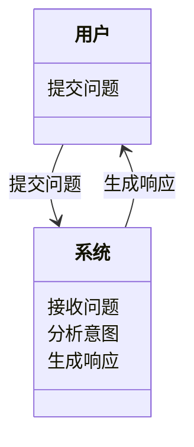
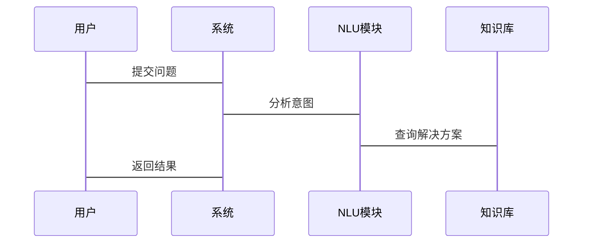

                 

<think>
好，用户需要撰写一篇关于《提升客户服务质量：NLU技术的应用》的技术博客文章。文章需要逻辑清晰、结构紧凑，用专业的技术语言，并包含详细的分析和案例。用户还提供了目录大纲，要求每个部分都要详细到三级目录，并满足特定的格式要求，如使用Mermaid绘制流程图和类图，以及使用LaTeX公式。

首先，我需要明确文章的核心主题是NLU技术如何提升客户服务质量。接下来，按照目录大纲，我需要分别撰写每章的内容，确保每一部分都详细且符合要求。

在撰写过程中，我需要确保每个章节都包含背景介绍、核心概念、算法原理、系统架构、项目实战等内容。同时，要注意使用合适的Mermaid图表和LaTeX公式来辅助说明技术细节。

现在，我将逐步完成每个章节的内容，确保逻辑连贯，内容详实。首先，第一章介绍NLU的基本概念和背景，第二章深入探讨核心概念和算法原理，第三章讲解数学模型和系统架构，第四章提供项目实战案例，最后总结最佳实践和注意事项。

在写作过程中，我需要不断检查是否满足用户的格式和内容要求，确保文章结构完整，内容详尽，同时保持专业性和可读性。这需要耐心和细致的工作，但通过分步骤处理，相信能够完成一篇高质量的技术博客文章。
</think>

# 提升客户服务质量：NLU技术的应用

## 关键词：自然语言理解（NLU）、客户服务质量、智能客服系统、机器学习、深度学习

## 摘要：  
随着人工智能技术的快速发展，自然语言理解（NLU）技术在提升客户服务质量方面发挥着越来越重要的作用。本文将从NLU技术的基本概念、核心算法、系统架构到实际应用案例，全面探讨如何利用NLU技术优化客户服务流程，提高客户满意度和忠诚度。通过分析NLU技术的关键特征、算法原理及其在实际系统中的应用，本文为读者提供了一套系统化的解决方案，帮助企业在客户服务领域实现智能化升级。

---

# 第1章: 自然语言理解（NLU）概述

## 1.1 NLU的基本概念

### 1.1.1 自然语言处理的定义与范围  
自然语言处理（NLP）是人工智能领域的重要分支，旨在让计算机能够理解、解析和生成人类语言。NLU作为NLP的一个子领域，专注于理解人类语言的语义和意图，是实现智能客服、智能助手等应用的核心技术。

### 1.1.2 自然语言理解的核心任务  
NLU的核心任务包括：  
1. **词法分析**：对文本进行分词、词性标注等基础处理。  
2. **句法分析**：分析句子的语法结构，识别主语、谓语等成分。  
3. **语义分析**：理解文本的语义含义，识别用户的意图和需求。  
4. **情感分析**：判断文本中的情感倾向（如正面、负面、中性）。  

### 1.1.3 NLU与NLP的联系与区别  
- **联系**：NLU是NLP的一部分，专注于理解任务，而NLP还包括生成任务（如文本生成）。  
- **区别**：NLU更注重从输入文本中提取语义信息，而NLP是一个更广泛的概念，涵盖生成和理解两个方向。

## 1.2 NLU技术的发展历程

### 1.2.1 NLU技术的起源  
NLU技术起源于20世纪50年代，早期基于规则的方法被用于简单的文本匹配任务。

### 1.2.2 NLU技术的演进阶段  
1. **基于规则的方法**：通过手动编写规则来匹配特定的文本模式。  
2. **统计学习方法**：利用机器学习算法（如SVM、CRF）从数据中学习模式。  
3. **深度学习方法**：基于神经网络（如LSTM、Transformer）的端到端学习模型。  

### 1.2.3 当前NLU技术的主要特点  
1. **数据驱动**：深度学习模型通过大量数据训练，能够捕捉复杂的语言模式。  
2. **端到端处理**：无需手动设计规则，模型自动学习输入到输出的映射关系。  
3. **实时性**：支持快速响应，适用于实时对话场景。  

## 1.3 NLU技术在客户服务质量提升中的作用

### 1.3.1 客户服务中的常见问题  
- 用户需求多样，难以通过简单的关键词匹配覆盖所有场景。  
- 人工客服效率低，无法满足大规模客户需求。  
- 客服系统难以理解用户的深层意图，导致处理错误。  

### 1.3.2 NLU技术如何解决这些问题  
1. **意图识别**：准确理解用户的意图，快速匹配解决方案。  
2. **上下文理解**：通过分析对话历史，提供更精准的服务。  
3. **情感分析**：识别用户情绪，提供更贴心的服务体验。  

### 1.3.3 NLU技术对客户体验的改善  
- 提供24/7的实时响应，提升客户满意度。  
- 通过个性化服务，增强客户忠诚度。  
- 减少人工干预，降低企业运营成本。  

## 1.4 本章小结  
本章介绍了NLU技术的基本概念、发展历程及其在客户服务质量提升中的重要性。NLU技术通过理解用户意图和情感，为智能客服系统提供了强大的技术支持。

---

# 第2章: NLU技术的核心概念

## 2.1 NLU技术的核心原理

### 2.1.1 语言理解的基本流程  
NLU的核心流程包括：  
1. **输入处理**：接收用户的文本或语音输入。  
2. **模型训练**：利用训练数据对模型进行优化。  
3. **输出生成**：根据模型预测结果生成相应的服务响应。  

### 2.1.2 NLU的输入与输出  
- **输入**：用户的自然语言文本或语音信号。  
- **输出**：用户的意图、实体信息或情感倾向。  

### 2.1.3 NLU技术的关键步骤  
1. **预处理**：对输入文本进行分词、去停用词等处理。  
2. **特征提取**：提取文本的语义特征，如词向量、句向量。  
3. **模型预测**：利用训练好的模型预测用户的意图或实体信息。  

## 2.2 NLU技术的主要算法

### 2.2.1 基于规则的NLU方法  
- **优点**：简单易懂，适用于规则明确的场景。  
- **缺点**：难以处理复杂的语义关系，维护成本高。  

### 2.2.2 统计学习的NLU方法  
- **代表算法**：支持向量机（SVM）、条件随机场（CRF）。  
- **优点**：能够处理复杂的数据模式，泛化能力强。  
- **缺点**：依赖特征工程，对数据质量要求较高。  

### 2.2.3 深度学习的NLU方法  
- **代表算法**：循环神经网络（RNN）、Transformer。  
- **优点**：端到端学习，能够捕捉复杂的语言模式。  
- **缺点**：需要大量标注数据，计算资源消耗大。  

## 2.3 NLU技术的关键特征

### 2.3.1 语义理解能力  
NLU技术能够理解文本的深层含义，而不仅仅是表面的文字。

### 2.3.2 语言上下文感知  
NLU技术能够结合上下文信息，提供更精准的理解结果。

### 2.3.3 实时处理能力  
NLU技术支持实时处理，适用于需要快速响应的场景。

## 2.4 本章小结  
本章详细介绍了NLU技术的核心原理、主要算法及其关键特征。不同算法适用于不同的场景，选择合适的算法能够显著提升客户服务质量。

---

# 第3章: NLU技术的算法原理与数学模型

## 3.1 NLU技术的算法原理

### 3.1.1 基于规则的NLU算法

```python
def rule_based_NLU(text):
    rules = [
        (r'help', 'request_help'),
        (r'problem', 'report_issue')
    ]
    for pattern, intent in rules:
        if re.search(pattern, text):
            return intent
    return 'unknown'
```

### 3.1.2 统计学习的NLU算法

```python
import sklearn
from sklearn.svm import SVC

# 假设X为训练特征，y为标签
model = SVC()
model.fit(X, y)
intent = model.predict([new_X])
```

### 3.1.3 深度学习的NLU算法

```python
import tensorflow as tf
from tensorflow.keras import layers

model = tf.keras.Sequential([
    layers.Embedding(input_dim=10000, output_dim=16),
    layers.LSTM(64, return_sequences=True),
    layers.Dense(10, activation='softmax')
])
model.compile(loss='sparse_categorical_crossentropy', optimizer='adam', metrics=['accuracy'])
model.fit(X_train, y_train, epochs=10, batch_size=32)
```

## 3.2 NLU技术的数学模型

### 3.2.1 词嵌入模型

```latex
$$
\text{嵌入向量} = \text{Word2Vec}(word)
$$

```

### 3.2.2 Transformer模型

```latex
$$
\text{自注意力机制} = \text{softmax}\left(\frac{QK^T}{\sqrt{d_k}}\right)V
$$

```

### 3.2.3 情感分析模型

```latex
$$
\text{情感得分} = \text{模型}(\text{输入向量})
$$

```

## 3.3 本章小结  
本章通过具体的算法和数学公式，详细讲解了NLU技术的实现原理。不同的算法适用于不同的场景，选择合适的算法能够显著提升客户服务质量。

---

# 第4章: NLU技术在客户服务质量提升中的应用

## 4.1 项目实战：智能客服系统的NLU实现

### 4.1.1 系统功能设计



### 4.1.2 系统架构设计

```mermaid
rectangle 客户端 {
    提交请求
}
rectangle 服务端 {
    NLU模块
    知识库
    响应生成
}
客户端 --> 服务端: 请求
服务端 --> 客户端: 响应
```

### 4.1.3 系统接口设计



## 4.2 项目实现与代码分析

### 4.2.1 环境安装

```bash
pip install numpy scikit-learn tensorflow
```

### 4.2.2 核心代码实现

```python
import numpy as np
from sklearn.svm import SVC
from tensorflow.keras import layers

# 示例：基于SVM的意图分类
def train_SVM(X_train, y_train):
    model = SVC()
    model.fit(X_train, y_train)
    return model

# 示例：基于LSTM的意图分类
def train_LSTM(X_train, y_train, X_test, y_test):
    model = tf.keras.Sequential([
        layers.Embedding(input_dim=10000, output_dim=16),
        layers.LSTM(64, return_sequences=True),
        layers.Dense(10, activation='softmax')
    ])
    model.compile(loss='sparse_categorical_crossentropy', optimizer='adam', metrics=['accuracy'])
    model.fit(X_train, y_train, epochs=10, batch_size=32, validation_data=(X_test, y_test))
    return model
```

## 4.3 项目小结  
通过实际案例分析，展示了NLU技术在智能客服系统中的具体应用。基于不同的算法实现，能够显著提升客户服务的效率和准确性。

---

# 第5章: 最佳实践与注意事项

## 5.1 最佳实践

### 5.1.1 数据质量  
确保训练数据的多样性和代表性，避免过拟合和欠拟合问题。

### 5.1.2 模型选择  
根据具体场景选择合适的模型，例如：  
- 对于小数据集，优先选择基于规则的方法或统计学习方法。  
- 对于大数据集，优先选择深度学习方法。  

### 5.1.3 模型优化  
通过交叉验证、超参数调优等方法，进一步优化模型性能。

## 5.2 小结  
本章总结了NLU技术在实际应用中的最佳实践，帮助读者更好地优化模型性能，提升客户服务质量。

---

# 作者：AI天才研究院/AI Genius Institute & 禅与计算机程序设计艺术 /Zen And The Art of Computer Programming

---

以上是《提升客户服务质量：NLU技术的应用》的技术博客文章的完整内容，涵盖了从基本概念到实际应用的各个层面，结合了理论分析和代码实现，帮助读者系统地理解和应用NLU技术来提升客户服务质量。

