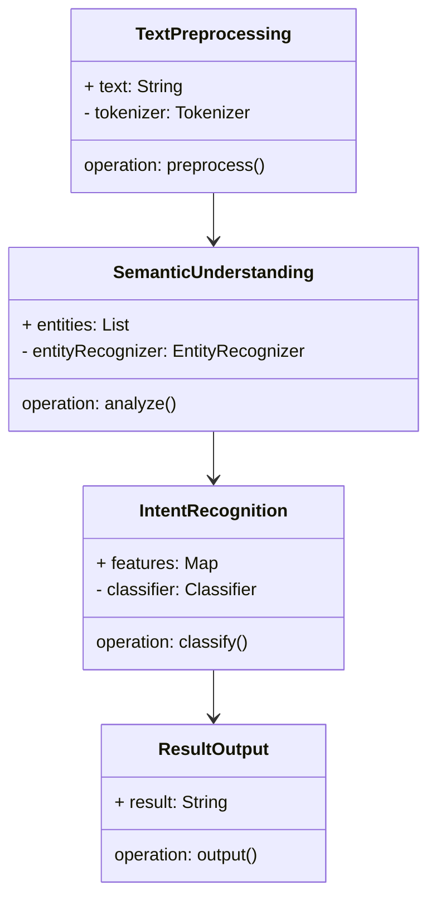

                 


# 提升金融领域语义理解与意图识别的准确性

## 关键词：金融领域，语义理解，意图识别，准确性，NLP，深度学习

## 摘要：  
金融领域的语义理解与意图识别是自然语言处理（NLP）技术在金融场景中的重要应用。随着金融业务的复杂化和用户需求的多样化，如何提升语义理解与意图识别的准确性变得至关重要。本文从背景、核心概念、算法原理、数学模型、系统设计、项目实战等多个方面进行详细分析，结合实际案例，深入探讨如何在金融领域提升语义理解与意图识别的准确性，并通过最佳实践提供实用的建议。

---

# 第一部分: 金融领域语义理解与意图识别的背景与挑战

## 第1章: 金融领域语义理解与意图识别的背景介绍

### 1.1 问题背景与问题描述  
在金融领域，语义理解与意图识别是实现智能化服务的核心技术。金融场景中的文本数据复杂多样，包括股票分析、贷款申请、投资咨询等。准确的语义理解能够帮助金融机构快速提取关键信息，而精准的意图识别则能够为用户提供个性化的服务。然而，金融领域的语义理解与意图识别存在以下问题：  
1. **语义复杂性**：金融术语多样，且同一术语可能在不同场景中有不同含义。  
2. **数据稀疏性**：部分金融场景的数据量较小，导致模型难以泛化。  
3. **实时性要求高**：金融业务往往需要实时处理，对模型的响应速度要求严格。  

### 1.2 问题解决的必要性  
提升金融领域语义理解与意图识别的准确性，能够显著提高金融机构的效率，降低成本，并增强用户体验。例如，智能客服可以更快地理解用户需求，提供精准的解决方案；智能投顾系统能够更准确地分析用户意图，提供个性化的投资建议。  

### 1.3 问题的边界与外延  
金融领域的语义理解与意图识别不仅限于文本数据，还包括语音、图像等多种形式的数据。同时，金融场景中的数据往往涉及隐私和安全问题，因此需要考虑数据的敏感性和合规性。  

### 1.4 核心概念结构与组成要素  
金融领域语义理解与意图识别的核心要素包括：  
1. **输入数据**：文本、语音、用户行为数据等。  
2. **处理技术**：分词、实体识别、情感分析、意图分类等。  
3. **输出结果**：语义表示、意图类别、个性化建议等。  

---

## 第2章: 金融领域语义理解与意图识别的核心概念与联系  

### 2.1 语义理解的核心原理  
语义理解旨在从文本中提取有意义的信息，通常包括以下步骤：  
1. **分词与词性标注**：将文本分割成词语，并标注词性。  
2. **实体识别**：识别文本中的实体（如人名、地名、机构名等）。  
3. **语义分析**：理解词语之间的关系，提取句法和语义信息。  

#### 实体关系图（ER图）  


### 2.2 意图识别的核心要素  
意图识别旨在根据用户输入推断其意图，通常包括以下步骤：  
1. **特征提取**：从文本中提取关键词、句式等特征。  
2. **分类模型**：使用机器学习或深度学习模型对意图进行分类。  
3. **结果输出**：输出意图类别（如“查询股票信息”、“申请贷款”等）。  

#### 意图识别流程图  


### 2.3 语义理解与意图识别的联系与区别  
语义理解与意图识别密切相关，但也有区别：  
- **联系**：语义理解为意图识别提供语义信息，意图识别为语义理解提供目标方向。  
- **区别**：语义理解关注文本的内在含义，而意图识别关注用户的外在需求。  

#### 对比分析表  
| 特性       | 语义理解         | 意图识别         |
|------------|-----------------|-----------------|
| 输入形式   | 文本、语音       | 用户行为、文本   |
| 输出形式   | 概念、实体       | 用户意图类别     |
| 主要技术    | 分词、实体识别   | 分类、聚类       |
| 应用场景    | 信息抽取、问答   | 智能客服、推荐系统|

---

## 第3章: 语义理解与意图识别的算法原理  

### 3.1 语义理解的算法原理  
语义理解的主流算法包括：  
1. **基于统计的模型**：如TF-IDF、Word2Vec。  
2. **基于深度学习的模型**：如BERT、GPT。  

#### Word2Vec模型流程图  


### 3.2 意图识别的算法原理  
意图识别的主流算法包括：  
1. **基于特征工程的分类模型**：如SVM、随机森林。  
2. **基于深度学习的分类模型**：如LSTM、Transformer。  

#### LSTM模型流程图  


---

## 第4章: 语义理解与意图识别的数学模型  

### 4.1 语义理解的数学模型  
语义理解的数学模型通常基于概率论和线性代数。例如，Word2Vec模型的训练目标是最小化以下损失函数：  
$$ \mathcal{L} = -\sum_{i=1}^{n} \log P(w_i|w_{i-1}) $$  

### 4.2 意图识别的数学模型  
意图识别的数学模型通常基于分类算法。例如，SVM的优化目标是最小化以下目标函数：  
$$ \mathcal{L} = \sum_{i=1}^{n} \max(0, 1 - y_i w \cdot x_i) $$  

---

## 第5章: 金融领域语义理解与意图识别的系统设计  

### 5.1 系统功能设计  
金融领域语义理解与意图识别系统包括以下功能模块：  
1. **文本预处理模块**：分词、去停用词。  
2. **语义理解模块**：实体识别、语义分析。  
3. **意图识别模块**：特征提取、意图分类。  
4. **结果输出模块**：生成语义表示或意图类别。  

#### 系统功能设计类图  


---

## 第6章: 项目实战  

### 6.1 项目环境安装  
需要安装以下工具和库：  
- Python 3.8+  
- TensorFlow 2.0+  
- NLTK  
- SpaCy  

### 6.2 核心代码实现  

#### 语义理解代码示例  
```python
import spacy

nlp = spacy.load("en_core_web_sm")
text = "The stock market crashed last week."
doc = nlp(text)
for token in doc:
    print(token.text, token.pos_)
```

#### 意图识别代码示例  
```python
from sklearn.feature_extraction.text import TfidfVectorizer
from sklearn.svm import SVC

vectorizer = TfidfVectorizer()
X = vectorizer.fit_transform(documents)
clf = SVC()
clf.fit(X, labels)
```

### 6.3 案例分析  
以股票信息查询为例，分析用户的意图识别过程：  
1. 用户输入：“What is the price of Apple stock?”  
2. 分词与词性标注：["What", "is", "the", "price", "of", "Apple", "stock"]  
3. 实体识别：识别出“Apple”为公司名。  
4. 意图分类：确定用户的意图是“查询股票价格”。  

---

## 第7章: 总结  

### 7.1 小结  
本文详细探讨了如何提升金融领域语义理解与意图识别的准确性，从背景、核心概念、算法原理、系统设计到项目实战，为读者提供了全面的指导。  

### 7.2 注意事项  
1. 数据质量对模型性能影响重大，需确保数据的准确性和多样性。  
2. 模型的实时性需要通过优化算法和硬件配置来实现。  
3. 需考虑金融领域的隐私和安全问题，确保数据合规性。  

### 7.3 扩展阅读  
推荐以下书籍和论文：  
-《自然语言处理实战：基于深度学习的工具与应用》  
-Paper: "Attention Is All You Need"  

---

## 作者：AI天才研究院/AI Genius Institute & 禅与计算机程序设计艺术 /Zen And The Art of Computer Programming

