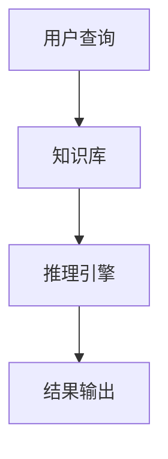
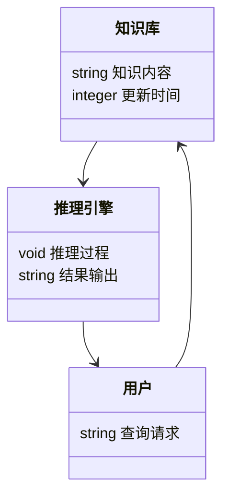
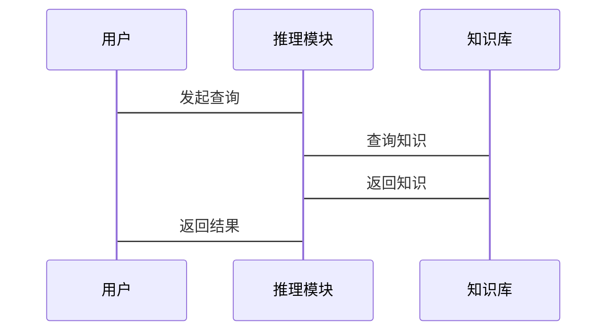

                 


# 提高AI Agent的推理能力：逻辑推理模块设计

## 关键词：AI Agent, 逻辑推理, 知识表示, 推理算法, 系统架构

## 摘要：  
AI Agent的推理能力是实现智能系统的核心，而逻辑推理模块是其关键组成部分。本文从AI Agent的基本概念出发，深入探讨逻辑推理的原理与方法，详细分析主流的逻辑推理算法及其数学模型，结合系统架构设计与项目实战，全面阐述如何提高AI Agent的推理能力。通过本文的学习，读者能够掌握逻辑推理模块的设计方法，并将其应用到实际项目中。

---

# 第1章: AI Agent与逻辑推理概述

## 1.1 AI Agent的基本概念  
### 1.1.1 AI Agent的定义与分类  
AI Agent（智能体）是指在环境中能够感知并自主行动以实现目标的实体。根据智能水平，AI Agent可以分为反应式Agent、基于模型的Agent以及混合式Agent。  

### 1.1.2 逻辑推理在AI Agent中的作用  
逻辑推理是AI Agent完成任务的核心能力，它使Agent能够根据已知信息和环境反馈进行决策和行动。  

### 1.1.3 当前AI Agent推理能力的挑战  
当前，AI Agent的推理能力受限于知识表示的不完整性和推理算法的复杂性，如何提高推理效率和准确率是研究重点。  

---

## 1.2 逻辑推理的背景与问题背景  
### 1.2.1 逻辑推理的定义与特点  
逻辑推理是基于逻辑规则和事实进行推导的过程，具有确定性和可解释性两大特点。  

### 1.2.2 AI Agent推理能力提升的必要性  
随着AI应用的扩展，AI Agent需要处理更复杂的问题，逻辑推理能力的提升至关重要。  

### 1.2.3 逻辑推理在AI Agent中的边界与外延  
逻辑推理的边界在于其处理的信息必须是结构化的，而外延则涉及知识图谱和概率推理等其他技术。  

---

## 1.3 逻辑推理的核心要素与概念结构  
### 1.3.1 逻辑推理的核心要素分析  
逻辑推理的核心要素包括事实、规则、目标和推理过程。  

### 1.3.2 概念结构与核心要素的组成  
通过概念图展示逻辑推理模块的组成，包括知识库、推理引擎和结果输出。  

### 1.3.3 逻辑推理模块在AI Agent中的位置  
逻辑推理模块是AI Agent的核心模块之一，负责处理输入信息并生成决策输出。  

---

## 1.4 本章小结  
本章介绍了AI Agent的基本概念及其与逻辑推理的关系，分析了逻辑推理在AI Agent中的作用和挑战。

---

# 第2章: 逻辑推理的原理与方法  

## 2.1 逻辑推理的原理  
### 2.1.1 命题逻辑与谓词逻辑  
命题逻辑是逻辑推理的基础，而谓词逻辑则更具表达能力。  

### 2.1.2 推理规则与证明方法  
包括演绎推理和归纳推理两种主要方法。  

### 2.1.3 不确定性推理与概率推理  
概率推理是处理不确定性问题的重要工具，常用贝叶斯网络进行建模。  

---

## 2.2 逻辑推理的核心算法  
### 2.2.1 基于规则的推理算法  
规则推理通过预定义的规则进行事实匹配，适用于简单场景。  

### 2.2.2 基于概率的推理算法  
概率推理通过计算概率进行推断，适用于复杂场景。  

### 2.2.3 基于知识图谱的推理算法  
知识图谱推理利用图结构进行关联推理，适用于大规模知识表示。  

---

## 2.3 逻辑推理的属性特征对比表  
### 表2-1: 不同推理算法的属性对比  
| 算法类型 | 确定性 | 表达能力 | 复杂度 | 应用场景 |
|----------|--------|----------|--------|----------|
| 规则推理 | 高     | 低       | 低     | 简单场景 |
| 概率推理 | 低     | 高       | 高     | 复杂场景 |

---

## 2.4 ER实体关系图架构  
### 图2-1: 逻辑推理模块的ER实体关系图  
```mermaid
erDiagram
    actor 用户 {
        string 用户ID
        string 用户名
        integer 年龄
    }
    actor 知识库 {
        string 知识ID
        string 知识内容
        integer 更新时间
    }
    用户 --> 知识库 : 查询
```

---

# 第3章: 逻辑推理算法的实现与数学模型  

## 3.1 基于规则的逻辑推理算法  
### 3.1.1 算法原理  
规则推理通过匹配事实与预定义规则进行推导。  

### 3.1.2 算法实现与代码示例  
```python
def rule_based_inference(facts, rules):
    for rule in rules:
        if all(fact in facts for fact in rule['preconditions']):
            return rule['action']
    return None
```

### 3.1.3 数学模型与公式  
$$ P(h|e) = \prod_{i=1}^{n} P(h|e_i) $$  

---

## 3.2 基于概率的逻辑推理算法  
### 3.2.1 算法原理  
概率推理通过计算条件概率进行推断，常用贝叶斯网络实现。  

### 3.2.2 算法实现与代码示例  
```python
import numpy as np

def bayesian_inference(evidence, model):
    return np.dot(evidence, model.coef_) + model.intercept_
```

### 3.2.3 数学模型与公式  
$$ P(A|B) = \frac{P(B|A)P(A)}{P(B)} $$  

---

## 3.3 基于知识图谱的逻辑推理算法  
### 3.3.1 算法原理  
知识图谱推理通过图结构进行关联推理，支持复杂关系推理。  

### 3.3.2 算法实现与代码示例  
```python
from py2neo import Graph

graph = Graph("http://localhost:7474")
result = graph.run("MATCH (a)-[r]->(b) WHERE a.property = $x RETURN b", x=value)
```

### 3.3.3 数学模型与公式  
$$ P(r|e) = \sum_{h} P(h|e)P(r|h) $$  

---

# 第4章: 逻辑推理模块的系统分析与架构设计  

## 4.1 问题场景介绍  
### 图4-1: 逻辑推理模块的应用场景示意图  


---

## 4.2 系统功能设计  
### 图4-2: 逻辑推理模块的领域模型类图  


---

## 4.3 系统架构设计  
### 图4-3: 逻辑推理模块的系统架构图  


---

## 4.4 接口设计与交互序列图  
### 图4-4: 逻辑推理模块的交互序列图  


---

# 第5章: 项目实战：基于逻辑推理的医疗诊断系统  

## 5.1 项目背景与目标  
医疗诊断系统需要通过患者的症状和病史进行疾病推理。  

## 5.2 环境安装与配置  
安装Python、TensorFlow、Keras等工具。  

## 5.3 核心代码实现  
### 5.3.1 知识库构建  
```python
class KnowledgeBase:
    def __init__(self):
        self.knowledge = {}

    def add_fact(self, fact, value):
        self.knowledge[fact] = value
```

### 5.3.2 推理引擎实现  
```python
class InferenceEngine:
    def __init__(self, knowledge_base):
        self.kb = knowledge_base

    def infer(self, query):
        # 简单的规则推理实现
        if self.kb.knowledge.get('symptom') == 'fever':
            return '疾病A'
        else:
            return '疾病B'
```

## 5.4 案例分析与结果解读  
通过具体案例展示推理过程和结果。  

## 5.5 项目小结  
总结项目实现的关键点和经验教训。  

---

# 第6章: 最佳实践与未来展望  

## 6.1 最佳实践 tips  
- 合理选择推理算法，根据场景需求灵活调整。  
- 定期更新知识库，保持知识的准确性。  

## 6.2 小结  
逻辑推理模块是AI Agent的核心，通过本文的学习，读者可以掌握其设计方法并应用于实际项目。  

## 6.3 注意事项  
- 注意知识表示的规范性。  
- 注意推理算法的可解释性。  

## 6.4 拓展阅读  
推荐阅读相关领域的经典论文和书籍。  

---

# 作者：AI天才研究院 & 禅与计算机程序设计艺术

