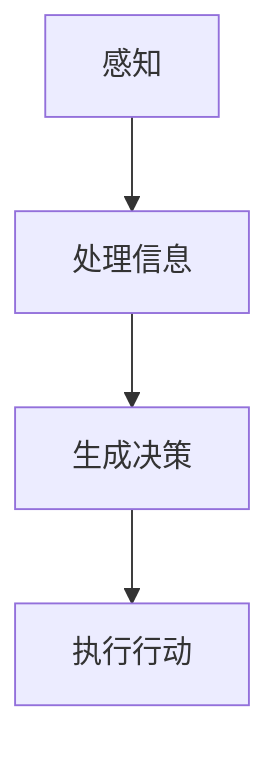
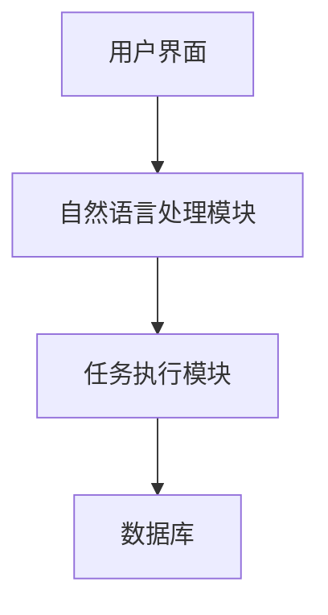

                 


# 搭建AI Agent开发环境：必要工具与框架

## 关键词：
AI Agent、开发环境、工具、框架、系统设计、项目实战

## 摘要：
本文详细介绍了搭建AI Agent开发环境所需的关键工具与框架，从基础知识到实际应用，逐步引导读者完成开发环境的搭建。内容涵盖AI Agent的核心概念、开发工具的安装与配置、主流AI框架的使用、系统架构设计以及项目实战案例。通过本文的学习，读者能够系统地掌握AI Agent开发环境的搭建方法，为后续的AI开发奠定坚实基础。

---

# 第1章: AI Agent基础概念

## 1.1 AI Agent的定义与类型

### 1.1.1 什么是AI Agent
AI Agent（人工智能代理）是指能够感知环境并采取行动以实现目标的智能实体。它可以是一个软件程序，也可以是一个物理设备，通过与环境交互来完成特定任务。AI Agent的核心目标是通过感知和行动来优化其行为，以达到预设的目标。

### 1.1.2 AI Agent的类型
AI Agent可以根据功能、智能水平和应用场景进行分类：

| 类型 | 描述 | 示例 |
|------|------|------|
| **简单反射型** | 基于当前感知直接做出反应，没有内部状态。 | 自动门禁系统 |
| **基于模型的反射型** | 使用内部状态和环境模型来规划行动。 | 自然语言处理模型 |
| **目标驱动型** | 通过目标驱动决策，具备长期规划能力。 | 自动驾驶系统 |
| **效用驱动型** | 基于效用函数优化决策。 | 机器人路径规划 |

### 1.1.3 AI Agent的核心特征
AI Agent的核心特征包括：
- **自主性**：能够自主决策和行动。
- **反应性**：能够感知环境并实时调整行为。
- **目标导向**：具备明确的目标，能够优化行动以实现目标。
- **学习能力**：通过经验改进性能。

---

## 1.2 AI Agent的工作原理

### 1.2.1 感知与决策机制
AI Agent通过传感器或数据输入感知环境，然后通过算法处理信息，生成决策。感知和决策的流程如下：



### 1.2.2 行为执行流程
AI Agent的行为执行流程包括：
1. 感知环境，获取输入数据。
2. 数据处理，提取有用信息。
3. 决策生成，选择最优行动。
4. 执行行动，影响环境。

### 1.2.3 人机交互方式
AI Agent可以通过以下方式与用户交互：
- **命令行交互**：通过命令输入与输出。
- **图形界面交互**：通过GUI进行操作。
- **自然语言交互**：通过文本或语音进行对话。

---

## 1.3 AI Agent的应用场景

### 1.3.1 智能助手
AI Agent可以作为智能助手，帮助用户完成日常任务，如语音助手（Siri、Alexa）。

### 1.3.2 自动化系统
AI Agent可以用于自动化系统，如工业机器人、自动驾驶汽车。

### 1.3.3 游戏AI
AI Agent在游戏开发中用于控制非玩家角色（NPC）的行为。

### 1.3.4 其他应用场景
AI Agent还可以应用于金融交易、医疗诊断、智能家居等领域。

---

# 第2章: 搭建AI Agent开发环境的必要性

## 2.1 开发环境的重要性

### 2.1.1 开发效率的提升
有了合适的开发环境，开发者可以更高效地编写代码、调试和测试。

### 2.1.2 资源管理的优化
开发环境可以帮助开发者更好地管理代码、数据和依赖项。

### 2.1.3 团队协作的便利
统一的开发环境可以减少团队协作中的冲突，提高开发效率。

---

## 2.2 开发环境的核心组件

### 2.2.1 开发工具
- **IDE**：如PyCharm、VS Code。
- **编辑器**：如Vim、Sublime Text。

### 2.2.2 框架与库
- **AI框架**：如TensorFlow、PyTorch。
- **NLP库**：如spaCy、NLTK。

### 2.2.3 数据存储与管理
- **数据库**：如MySQL、MongoDB。
- **数据处理工具**：如Pandas、NumPy。

### 2.2.4 服务与接口
- **API**：如RESTful API。
- **消息队列**：如RabbitMQ、Kafka。

---

## 2.3 选择合适的开发环境

### 2.3.1 环境搭建的步骤
1. **选择编程语言**：推荐使用Python。
2. **安装开发工具**：如PyCharm、VS Code。
3. **配置依赖管理**：使用虚拟环境（如venv）和包管理工具（如pip）。

### 2.3.2 开发环境的配置与优化
- **虚拟环境配置**：
  ```bash
  python -m venv venv
  source venv/bin/activate
  ```
- **代码格式化工具**：如black、flake8。

---

# 第3章: AI Agent开发环境搭建的基础工具

## 3.1 选择合适的编程语言

### 3.1.1 Python的优势
- **丰富的库**：如NumPy、Pandas、Matplotlib。
- **强大的社区支持**。
- **简洁易学**。

### 3.1.2 其他语言的适用场景
- **C++**：适用于性能要求高的场景。
- **Java**：适用于企业级开发。

---

## 3.2 安装与配置开发环境

### 3.2.1 安装Python与虚拟环境
```bash
# 安装Python
sudo apt-get install python3 python3-pip

# 创建虚拟环境
python3 -m venv myenv

# 激活虚拟环境
source myenv/bin/activate
```

### 3.2.2 安装开发工具
- **PyCharm**：下载并安装。
- **VS Code**：安装插件（Python、Git）。

---

## 3.3 使用版本控制工具

### 3.3.1 Git的基本操作
```bash
# 初始化仓库
git init

# 添加文件到暂存区
git add .

# 提交更改
git commit -m "Initial commit"
```

### 3.3.2 使用GitHub进行协作
1. 创建GitHub仓库。
2. 将本地仓库与远程仓库同步：
   ```bash
   git remote add origin git@github.com:username/repository.git
   git push -u origin master
   ```

---

# 第4章: 主流AI框架与工具

## 4.1 选择合适的AI框架

### 4.1.1 TensorFlow
- **特点**：适合深度学习任务。
- **安装**：
  ```bash
  pip install tensorflow
  ```

### 4.1.2 PyTorch
- **特点**：适合动态计算图，广泛应用于学术研究。
- **安装**：
  ```bash
  pip install torch
  ```

### 4.1.3 Keras
- **特点**：用户友好的高级API。
- **安装**：
  ```bash
  pip install keras
  ```

---

## 4.2 使用NLP库

### 4.2.1 spaCy
- **特点**：适合英语NLP任务。
- **安装**：
  ```bash
  pip install spacy
  python -m spacy download en
  ```

### 4.2.2 NLTK
- **特点**：适合多种语言处理。
- **安装**：
  ```bash
  pip install nltk
  ```

---

## 4.3 使用机器学习库

### 4.3.1 Scikit-learn
- **特点**：适合经典机器学习任务。
- **安装**：
  ```bash
  pip install scikit-learn
  ```

### 4.3.2 XGBoost
- **特点**：适合梯度提升任务。
- **安装**：
  ```bash
  pip install xgboost
  ```

---

## 4.4 其他常用工具

### 4.4.1 数据可视化
- **工具**：Matplotlib、Seaborn。
- **示例**：
  ```python
  import matplotlib.pyplot as plt
  plt.plot([1, 2, 3], [4, 5, 6])
  plt.show()
  ```

### 4.4.2 日志管理
- **工具**：logging模块。
- **示例**：
  ```python
  import logging
  logging.basicConfig(level=logging.INFO)
  logging.info("This is an info message.")
  ```

---

# 第5章: 系统设计与项目实战

## 5.1 系统架构设计

### 5.1.1 项目介绍
- **项目目标**：开发一个简单的智能助手。
- **核心功能**：自然语言处理、任务执行。

### 5.1.2 系统架构


### 5.1.3 系统功能设计
- **用户输入**：通过文本框或语音输入。
- **处理逻辑**：解析意图，生成响应。
- **任务执行**：调用API或执行脚本。

---

## 5.2 项目实战

### 5.2.1 环境配置
```bash
# 创建虚拟环境
python -m venv myenv
source myenv/bin/activate

# 安装依赖
pip install tensorflow nltk spacy
python -m spacy download en
```

### 5.2.2 核心功能实现

#### 5.2.2.1 自然语言处理模块
```python
import spacy

nlp = spacy.load("en_core_web_sm")
doc = nlp("What is the weather today?")
print([token.text for token in doc])
```

#### 5.2.2.2 任务执行模块
```python
import requests

def get_weather(location):
    response = requests.get(f"http://api.weatherapi.com/v1/current.json?key=API_KEY&location={location}")
    return response.json()

weather = get_weather("London")
print(weather["current"]["temp_c"])
```

### 5.2.3 测试与优化
- **单元测试**：使用pytest。
- **性能优化**：使用缓存和异步处理。

### 5.2.4 部署与上线
- **部署环境**：使用Docker打包。
- **上线步骤**：
  ```bash
  docker build -t ai_agent .
  docker run -p 5000:5000 ai_agent
  ```

---

# 第6章: 最佳实践与小结

## 6.1 开发经验总结

### 6.1.1 注意事项
- **代码规范**：遵循PEP 8。
- **依赖管理**：使用`poetry`或`pipenv`。
- **文档编写**：记录关键代码和流程。

### 6.1.2 未来趋势
- **边缘计算**：AI Agent将更多地部署在边缘设备上。
- **多模态交互**：支持更丰富的交互方式，如视觉和语音。

---

## 6.2 小结

搭建AI Agent开发环境需要综合考虑工具选择、框架配置和系统设计。通过本文的学习，读者可以掌握从环境搭建到系统实现的完整流程，为后续的AI开发打下坚实的基础。

---

## 作者：AI天才研究院/AI Genius Institute & 禅与计算机程序设计艺术 /Zen And The Art of Computer Programming

---

# 结语

搭建AI Agent开发环境是一个复杂但有趣的任务，需要综合运用多种工具和框架。通过本文的详细指导，读者可以系统地掌握AI Agent开发环境的搭建方法，并在实践中不断优化和完善自己的开发流程。希望本文能为读者提供有价值的参考和启发。

