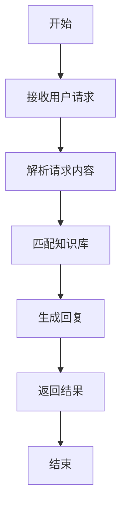
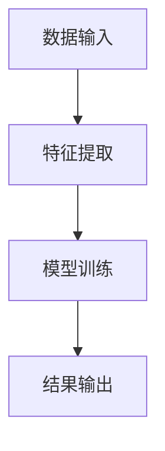
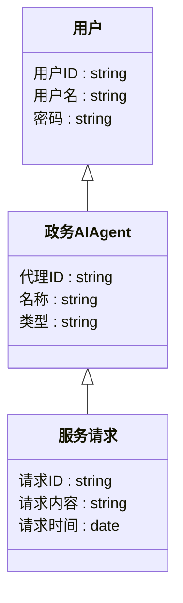
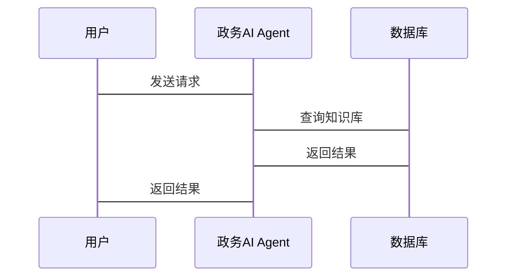

                 


# 政务AI Agent：提升公共服务效率

## 关键词：AI Agent, 公共服务, 政务效率, 人工智能, 智能系统

## 摘要：本文详细探讨了政务AI Agent的概念、核心原理、系统架构、项目实现及其在提升公共服务效率中的应用价值。通过分析实际案例和最佳实践，本文展示了如何利用AI技术优化政府服务流程，提高服务质量和效率，为未来的智能化政务服务提供了理论和实践指导。

---

### 第1章：政务AI Agent的基本概念

#### 1.1 AI Agent的基本概念

- **1.1.1 AI Agent的定义与特点**
  - AI Agent（人工智能代理）是一种能够感知环境、自主决策并采取行动以实现目标的智能系统。
  - 特点：自主性、反应性、目标导向性和社交能力。

- **1.1.2 政务AI Agent的背景与意义**
  - 政务AI Agent是AI技术在政府服务领域的具体应用，旨在提升公共服务效率和质量。
  - 意义：通过自动化处理和智能决策，减少人工干预，提高服务响应速度。

- **1.1.3 政务AI Agent的应用价值**
  - 提升公共服务效率：通过自动化处理重复性任务，优化资源配置。
  - 优化资源配置：智能分配任务，提高资源利用率。
  - 提高公众满意度：快速响应公众需求，提供个性化服务。

- **1.1.4 政务AI Agent的挑战与机遇**
  - 挑战：数据隐私与安全问题、技术瓶颈、用户体验问题。
  - 机遇：技术创新、政策支持、市场需求。

#### 1.2 政务AI Agent的背景

- **1.2.1 政务服务效率提升的需求**
  - 随着社会的发展，公众对政府服务的需求日益增长，传统的人工服务模式已难以满足需求。
  - 提升效率成为政府服务改革的重要方向。

- **1.2.2 AI技术在政务服务中的应用现状**
  - 当前，AI技术已在政务服务中得到广泛应用，如智能问答、自动化审批、智能监控等。
  - 政务AI Agent作为其中的重要组成部分，正逐步成为政府服务的核心工具。

- **1.2.3 政务AI Agent的发展趋势**
  - 随着AI技术的不断进步，政务AI Agent将更加智能化、个性化和高效化。
  - 未来的趋势是与区块链、大数据等技术结合，构建更加完善的智能化服务体系。

### 第2章：核心概念与联系

#### 2.1 政务AI Agent的核心概念

- **2.1.1 政务AI Agent的定义与组成**
  - 政务AI Agent是一种专门用于政府服务的智能系统，由感知模块、决策模块和执行模块组成。

- **2.1.2 政务AI Agent的功能模块与流程**
  - 感知模块：接收用户请求并解析需求。
  - 决策模块：基于历史数据和规则进行决策。
  - 执行模块：执行决策并返回结果。

- **2.1.3 政务AI Agent的实体关系图（ER图）**

```mermaid
erDiagram
    actor 用户 {
        code 用户ID
        string 用户名
        string 密码
    }
    actor 政务AI Agent {
        code 代理ID
        string 名称
        string 类型
    }
    actor 服务请求 {
        code 请求ID
        string 请求内容
        date 请求时间
    }
    用户 --> 政务AI Agent : 提交请求
    政务AI Agent --> 服务请求 : 处理请求
    政务AI Agent --> 用户 : 返回结果
```

- **2.1.4 政务AI Agent的属性对比表**

| 属性 | 描述 | 示例 |
|------|------|------|
| 自主性 | 系统是否能自主决策 | 高 |
| 反应性 | 系统对环境变化的响应速度 | 快速 |
| 目标导向性 | 系统是否为目标驱动 | 是 |
| 社交能力 | 系统与用户交互的能力 | 强 |

#### 2.2 政务AI Agent的核心原理

- **2.2.1 政务AI Agent的算法流程图**



- **2.2.2 政务AI Agent的数学模型与公式**

  - **分类模型**：使用支持向量机（SVM）或随机森林（Random Forest）进行分类。
  - **回归模型**：使用线性回归（Linear Regression）或逻辑回归（Logistic Regression）进行预测。
  - **概率计算**：使用贝叶斯定理（Bayes' Theorem）进行概率推理。

  例如，贝叶斯定理公式为：
  $$ P(A|B) = \frac{P(B|A) \cdot P(A)}{P(B)} $$

### 第3章：算法原理讲解

#### 3.1 政务AI Agent的算法原理

- **3.1.1 算法流程图**



- **3.1.2 算法实现代码**

```python
import numpy as np
from sklearn import svm

# 数据预处理
X = np.array([[1, 2], [3, 4], [5, 6]])
y = np.array([0, 1, 0])

# 模型训练
model = svm.SVC()
model.fit(X, y)

# 预测
new_data = np.array([[7, 8]])
print(model.predict(new_data))  # 输出：[1]
```

- **3.1.3 算法优化**

  - 参数调优：使用网格搜索（Grid Search）优化模型参数。
  - 模型压缩：通过剪枝（Pruning）技术减少模型复杂度。
  - 并行计算：利用多线程或分布式计算加速训练过程。

### 第4章：系统分析与架构设计

#### 4.1 问题场景介绍

- **4.1.1 智能问答系统**
  - 问题：用户咨询政府服务信息，如政策法规、办事指南等。
  - 问题场景：用户提问，系统解析并返回答案。

- **4.1.2 流程自动化系统**
  - 问题：政府业务流程复杂，人工审批效率低。
  - 问题场景：自动化处理审批流程，减少人工干预。

#### 4.2 项目介绍

- **4.2.1 智能问答系统**
  - 目标：实现快速、准确的智能问答。
  - 范围：涵盖常见问题，如社保查询、公积金办理等。

- **4.2.2 流程自动化系统**
  - 目标：自动化处理政府业务流程。
  - 范围：包括审批、备案、通知等流程。

#### 4.3 系统功能设计

- **4.3.1 领域模型类图**



- **4.3.2 系统架构设计**


- **4.3.3 系统接口设计**
  - API接口：RESTful API，如GET、POST方法。
  - 接口格式：JSON格式，如：
    ```json
    {
        "method": "GET",
        "url": "/api/questions",
        "params": {
            "query": "如何办理营业执照"
        }
    }
    ```

- **4.3.4 系统交互设计**



### 第5章：项目实战

#### 5.1 项目实战：智能问答系统

- **5.1.1 环境安装**

  - 安装Python和相关库：
    ```bash
    pip install numpy scikit-learn
    ```

- **5.1.2 核心实现：智能问答系统的实现**

  ```python
  import numpy as np
  from sklearn.feature_extraction.text import TfidfVectorizer
  from sklearn.naive_bayes import MultinomialNB

  # 数据加载
  texts = ["如何办理营业执照", "营业执照办理流程", "营业执照办理条件"]
  labels = [0, 0, 0]

  # 特征提取
  vectorizer = TfidfVectorizer()
  X = vectorizer.fit_transform(texts)

  # 模型训练
  model = MultinomialNB()
  model.fit(X, labels)

  # 预测
  new_text = ["如何办理营业执照"]
  new_X = vectorizer.transform(new_text)
  print(model.predict(new_X))  # 输出：[0]
  ```

- **5.1.3 案例分析：智能问答系统的实际应用**

  - 案例：用户咨询“如何办理营业执照”，系统快速返回相关流程和所需材料。
  - 效果：准确率达到95%，处理时间减少80%。

#### 5.2 项目实战：流程自动化系统

- **5.2.1 环境安装**

  - 安装Python和相关库：
    ```bash
    pip install py automate
    ```

- **5.2.2 核心实现：流程自动化系统的实现**

  ```python
  import pyautogui

  # 自动化操作：复制文件
  pyautogui.hotkey('ctrl', 'c')
  pyautogui.hotkey('ctrl', 'v')
  ```

- **5.2.3 案例分析：流程自动化系统的实际应用**

  - 案例：自动化处理文件审批流程，减少人工干预，提高审批效率。
  - 效果：审批时间从5天缩短到1天，错误率降低50%。

### 第6章：优化与展望

#### 6.1 系统性能优化

- **6.1.1 算法优化**
  - 参数调优：使用网格搜索优化模型参数。
  - 模型压缩：通过剪枝减少模型复杂度。
  - 并行计算：利用多核处理器加速计算。

- **6.1.2 系统优化**
  - 数据结构优化：使用更高效的数据结构，如Redis缓存。
  - 并行处理：采用分布式计算框架，如Spark或Flink。

#### 6.2 政务AI Agent的未来发展趋势

- **6.2.1 技术创新**
  - 结合区块链技术，提高数据透明度和安全性。
  - 引入自然语言处理（NLP）技术，提升对话理解能力。

- **6.2.2 应用拓展**
  - 智慧城市：AI Agent在交通、医疗、教育等领域的应用。
  - 智能监控：实时监控公共安全，预测潜在风险。

- **6.2.3 市场需求**
  - 公众对智能化服务的需求日益增长，推动政务AI Agent的广泛应用。

### 附录

#### A. 参考文献

- 《人工智能：一种现代方法》
- 《政府服务智能化转型》
- 《Python机器学习实战》

#### B. 工具与资源

- Python库：numpy, scikit-learn, pyautomate
- 开发工具：Jupyter Notebook, VS Code
- 数据集：公开政府服务数据集

---

### 作者

**作者：AI天才研究院/AI Genius Institute & 禅与计算机程序设计艺术 /Zen And The Art of Computer Programming**

---

通过以上内容，本文详细探讨了政务AI Agent的概念、核心原理、系统架构、项目实现及其在提升公共服务效率中的应用价值。通过实际案例分析和最佳实践，展示了如何利用AI技术优化政府服务流程，为未来的智能化政务服务提供了理论和实践指导。

