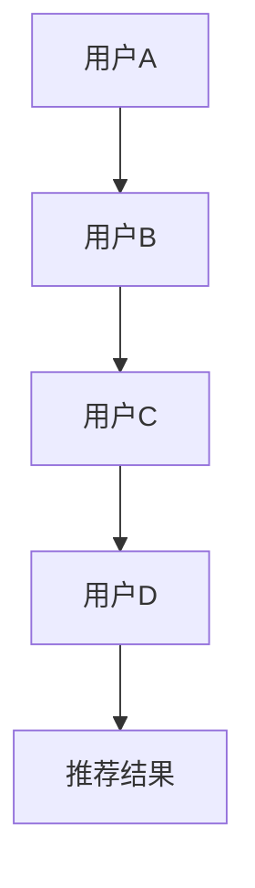
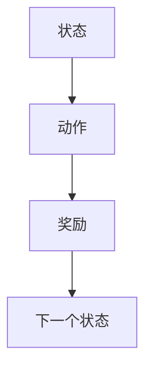
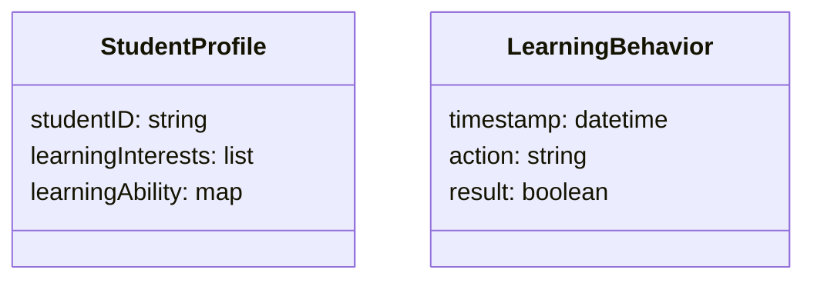
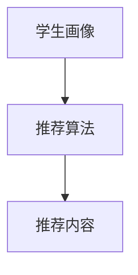
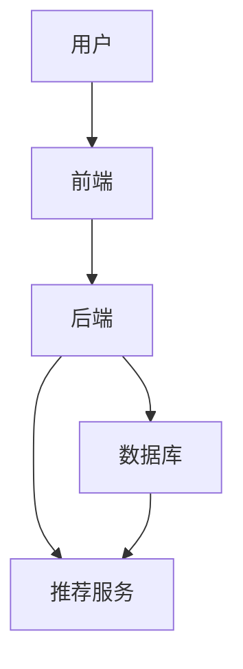
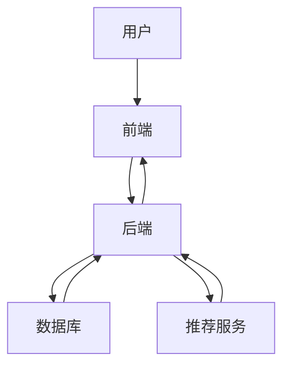

                 

<think>
好的，我需要帮用户设计一本名为《教育领域AI Agent的个性化学习方案》的技术博客文章。用户已经提供了一个详细的目录大纲，我需要按照这个大纲逐步完成每一部分内容。

首先，我需要理解这本书的核心内容，它主要涉及AI Agent在教育中的应用，特别是个性化学习方案的设计。接下来，我需要按照目录的结构，逐一完成每一章和每一节的内容。

从第1章开始，我需要介绍AI Agent的基本概念，涵盖其在教育领域的应用现状、个性化学习的需求分析以及技术发展趋势。这部分需要让读者了解为什么AI Agent在教育中重要，以及当前的发展情况。

然后，第二章深入探讨AI Agent的核心概念与原理，讲解其在教育中的具体应用，包括知识图谱的构建和推荐算法的使用。我需要使用Mermaid图表和数学公式来辅助说明这些概念，确保内容清晰易懂。

第三章是关于个性化学习方案的算法原理，重点介绍推荐算法和强化学习的应用。我需要详细解释这些算法的工作原理，并通过代码示例和数学公式来展示如何实现这些算法。

第四章讨论系统架构设计，包括系统功能模块的设计和系统接口的实现。这部分需要使用Mermaid图表来展示系统架构和交互流程，帮助读者更好地理解系统如何运作。

第五章通过实际案例展示项目实战，指导读者如何安装环境并运行代码，同时分析实际案例以展示AI Agent在个性化学习中的应用效果。

最后，第六章总结整个项目的关键点，给出一些最佳实践和未来发展的建议，帮助读者在实际应用中避免常见的陷阱，并了解未来的发展趋势。

在撰写过程中，我需要确保每一部分内容详实，结构清晰，同时使用专业但易懂的技术语言。此外，我还需要插入适当的图表和代码示例，以增强文章的可读性和实用性。

完成所有章节后，我会检查整个文章的逻辑是否连贯，内容是否全面覆盖用户的需求，并确保格式符合要求，最终为读者呈现一篇高质量的技术博客文章。
</think>

# 教育领域AI Agent的个性化学习方案

---

## 关键词：AI Agent、个性化学习、教育技术、推荐算法、知识图谱

---

## 摘要

随着人工智能技术的快速发展，AI Agent（人工智能代理）在教育领域的应用越来越广泛。个性化学习作为教育的核心目标，通过AI Agent的帮助，可以实现更加精准的学习内容推荐、学习路径优化以及学习效果评估。本文将详细探讨教育领域中AI Agent的核心概念、算法原理、系统架构以及实际应用，为教育技术的未来发展提供有价值的参考。

---

# 第1章: 教育领域AI Agent的背景介绍

## 1.1 AI Agent的基本概念

### 1.1.1 什么是AI Agent

AI Agent（人工智能代理）是指能够感知环境并采取行动以实现特定目标的智能体。在教育领域，AI Agent可以以软件或系统的形式存在，帮助学生、教师和机构实现教育目标。

### 1.1.2 AI Agent的核心特征

- **自主性**：能够在没有外部干预的情况下自主运行。
- **反应性**：能够实时感知环境并做出反应。
- **目标导向**：通过目标驱动进行决策和行动。
- **学习能力**：能够通过数据和经验不断优化自身的性能。

### 1.1.3 教育领域中的AI Agent

在教育领域，AI Agent可以用于学生学习辅助、教师教学支持以及机构管理等多个方面。例如，AI Agent可以帮助学生制定学习计划、推荐学习资源，或者为教师提供教学建议。

---

## 1.2 教育领域AI Agent的应用现状

### 1.2.1 当前教育技术的发展趋势

随着大数据、人工智能和机器学习技术的快速发展，教育技术正在从传统的教学工具向智能化、个性化方向转变。

### 1.2.2 AI Agent在教育中的应用案例

- **智能辅导系统**：基于学生的学习情况推荐个性化学习内容。
- **学习效果评估**：通过分析学生的行为数据，评估学习效果并提出改进建议。
- **教学管理支持**：帮助教师优化教学计划和资源分配。

### 1.2.3 现有技术的局限性与挑战

尽管AI Agent在教育中的应用已经取得了一定的成果，但仍然存在数据隐私、算法可解释性以及模型泛化能力不足等问题。

---

## 1.3 个性化学习的需求与挑战

### 1.3.1 个性化学习的核心目标

个性化学习的目标是根据每个学生的学习特点、兴趣和能力，提供定制化的学习方案，从而提高学习效率和效果。

### 1.3.2 当前教育体系中的个性化学习现状

传统的教育模式往往采用统一的教学方式，难以满足学生的个性化需求。而AI Agent可以通过数据分析和推荐算法，实现真正的个性化学习。

### 1.3.3 AI Agent如何解决个性化学习的痛点

AI Agent可以通过以下方式解决个性化学习的痛点：
- **精准推荐**：基于学生的学习数据，推荐适合的学习资源。
- **动态调整**：根据学生的学习进展，动态调整学习计划。
- **实时反馈**：提供即时的学习反馈，帮助学生及时调整学习策略。

---

## 1.4 教育领域AI Agent的技术发展趋势

### 1.4.1 大语言模型在教育中的应用

大语言模型（如GPT）在教育领域的应用越来越广泛，可以用于生成学习材料、解答问题以及提供学习建议。

### 1.4.2 AI Agent的教育场景扩展

AI Agent在教育中的应用场景正在不断扩展，例如智能课堂管理、学习行为分析、学习效果预测等。

### 1.4.3 未来教育技术的融合与创新

未来的教育技术将更加注重AI Agent与其他技术的融合，例如虚拟现实（VR）、增强现实（AR）以及区块链等，为教育带来更多的可能性。

---

# 第2章: 教育领域AI Agent的核心概念与原理

## 2.1 AI Agent的核心原理

### 2.1.1 AI Agent的基本工作流程

AI Agent的工作流程通常包括以下步骤：
1. **感知环境**：通过传感器或数据输入获取环境信息。
2. **分析数据**：对获取的数据进行处理和分析，提取有用的信息。
3. **制定决策**：基于分析结果，制定下一步行动的决策。
4. **执行行动**：根据决策执行相应的动作，并返回新的环境信息。

### 2.1.2 教育领域中的AI Agent功能模块

在教育领域，AI Agent的功能模块通常包括：
- **学生画像模块**：分析学生的学习特点和能力。
- **学习内容推荐模块**：基于学生画像推荐个性化学习资源。
- **学习效果评估模块**：评估学生的学习效果并提供反馈。

---

## 2.2 个性化学习模型的构建

### 2.2.1 基于知识图谱的个性化学习模型

知识图谱是一种结构化的数据表示方式，可以用来表示学习内容之间的关系。通过构建知识图谱，AI Agent可以更好地理解学习内容的结构，并推荐相关的内容。

### 2.2.2 基于推荐算法的学习路径优化

推荐算法是个性化学习的核心技术之一，常见的推荐算法包括协同过滤、基于内容的推荐以及混合推荐。

### 2.2.3 基于强化学习的学习效果评估

强化学习可以通过不断试错来优化学习策略，帮助学生提高学习效果。

---

## 2.3 AI Agent与教育场景的结合

### 2.3.1 AI Agent在学习者画像中的应用

通过分析学生的学习数据，AI Agent可以构建学生的学习画像，包括学习兴趣、学习能力、学习风格等。

### 2.3.2 AI Agent在学习内容推荐中的作用

AI Agent可以根据学生的学习画像推荐适合的学习资源，例如课程、视频、练习题等。

### 2.3.3 AI Agent在学习效果反馈中的价值

AI Agent可以通过分析学生的学习行为和结果，提供即时反馈，帮助学生及时调整学习策略。

---

# 第3章: 个性化学习方案的算法原理

## 3.1 推荐算法的核心原理

### 3.1.1 协同过滤推荐算法

协同过滤是一种基于用户行为的推荐算法，主要通过分析用户之间的相似性来推荐内容。

**协同过滤算法流程图**



### 3.1.2 基于内容的推荐算法

基于内容的推荐算法是通过分析学习内容的特征来推荐相关内容。

**基于内容的推荐算法公式**

$$ sim(i,j) = \frac{\sum_{k=1}^n w_{i,k} w_{j,k}}{\sqrt{\sum_{k=1}^n w_{i,k}^2} \sqrt{\sum_{k=1}^n w_{j,k}^2}}} $$

### 3.1.3 混合推荐算法

混合推荐算法是将协同过滤和基于内容的推荐算法结合起来，利用两者的优势来提高推荐效果。

---

## 3.2 强化学习在学习效果评估中的应用

### 3.2.1 强化学习的基本原理

强化学习是一种通过试错来优化决策的算法，适用于动态环境下的学习效果评估。

**强化学习算法流程图**



### 3.2.2 强化学习在个性化学习中的应用

强化学习可以用于优化学习路径，帮助学生在学习过程中不断调整策略，以达到最佳的学习效果。

---

# 第4章: 教育领域AI Agent的系统架构设计

## 4.1 系统功能设计

### 4.1.1 学生画像模块

学生画像模块用于分析学生的学习特点，包括学习兴趣、学习能力等。

**学生画像模块类图**



### 4.1.2 学习内容推荐模块

学习内容推荐模块基于学生画像推荐个性化学习资源。

**学习内容推荐流程图**



### 4.1.3 学习效果评估模块

学习效果评估模块用于分析学生的学习效果并提供反馈。

---

## 4.2 系统架构设计

### 4.2.1 系统架构图

**系统架构图**



### 4.2.2 系统接口设计

- **用户登录接口**：用于用户身份验证。
- **获取推荐内容接口**：基于用户画像返回推荐内容。
- **提交学习结果接口**：用于记录学生的学习行为和结果。

---

## 4.3 系统交互流程图

**系统交互流程图**



---

# 第5章: 项目实战——个性化学习方案的实现

## 5.1 环境安装与配置

### 5.1.1 安装Python和相关库

```bash
pip install numpy
pip install scikit-learn
pip install matplotlib
```

### 5.1.2 安装推荐算法库

```bash
pip install surprise
```

---

## 5.2 核心代码实现

### 5.2.1 基于协同过滤的推荐算法

```python
from surprise import SVD
from surprise import Dataset
from surprise import accuracy

# 加载数据集
data = Dataset.load_from_files('data/u.data')

# 定义训练集和测试集
train = data.build_trainset()
test = data.build_testset()

# 初始化模型
model = SVD()
model.fit(train)

# 预测结果
predictions = model.test(test)

# 评估结果
accuracy.rmse(predictions)
```

### 5.2.2 基于内容的推荐算法实现

```python
from sklearn.feature_extraction.text import TfidfVectorizer
from sklearn.metrics.pairwise import cosine_similarity

# 文本特征提取
vectorizer = TfidfVectorizer()
X = vectorizer.fit_transform(documents)

# 计算相似度
similarity_matrix = cosine_similarity(X)
```

---

## 5.3 实际案例分析

### 5.3.1 学生画像分析

假定一个学生的学习数据如下：

| 学科 | 成绩 | 兴趣程度 |
|------|------|-----------|
| 数学 | 85   | 高         |
| 英语 | 70   | 中         |
| 物理 | 90   | 高         |

### 5.3.2 学习内容推荐

基于学生的学习数据，AI Agent可以推荐以下学习资源：
- 数学：难度较高的练习题
- 英语：语法辅导视频
- 物理：实验模拟工具

---

## 5.4 项目小结

通过实际案例分析，我们可以看到AI Agent在个性化学习中的巨大潜力。推荐算法和系统架构设计是实现个性化学习方案的关键。

---

# 第6章: 最佳实践与小结

## 6.1 最佳实践

### 6.1.1 数据隐私保护

在教育领域，学生的学习数据往往包含敏感信息，需要特别注意数据隐私保护。

### 6.1.2 模型的可解释性

复杂的推荐算法可能难以解释其决策过程，建议在实际应用中注重模型的可解释性。

### 6.1.3 持续优化

AI Agent的学习模型需要不断优化和更新，以适应新的学习需求和数据变化。

---

## 6.2 小结

本文详细探讨了教育领域AI Agent的个性化学习方案，从核心概念到算法原理，再到系统架构和实际应用，为教育技术的未来发展提供了有价值的参考。

---

## 6.3 注意事项

- 在实际应用中，需要注意数据的多样性和代表性。
- 推荐算法的选择需要根据具体场景和需求来定。
- 系统设计时，需要考虑可扩展性和可维护性。

---

## 6.4 拓展阅读

- 《Reinforcement Learning: Theory and Algorithms》
- 《Deep Learning for Education: A Comprehensive Review》
- 《Knowledge Graphs in Educational Technology》

---

## 作者

作者：AI天才研究院/AI Genius Institute & 禅与计算机程序设计艺术 /Zen And The Art of Computer Programming

