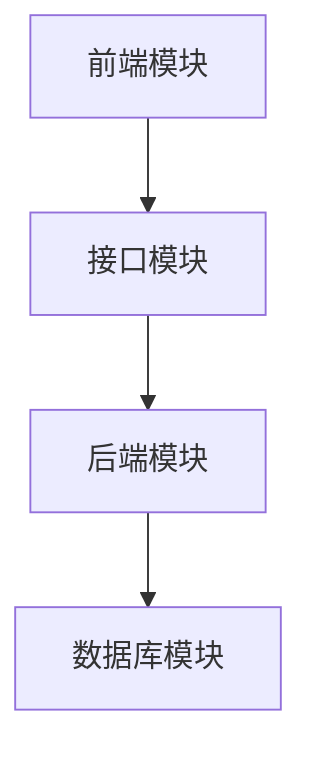
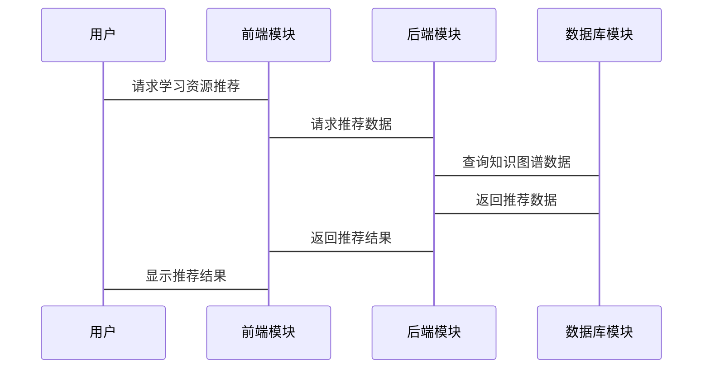

                 


# 教育领域AI Agent：个性化学习助手的构建

> 关键词：AI Agent，个性化学习，教育技术，自然语言处理，知识图谱，推荐算法

> 摘要：随着人工智能技术的快速发展，教育领域的智能化转型已成为不可逆转的趋势。个性化学习助手作为教育领域的重要工具，利用AI Agent技术为学生提供个性化的学习支持。本文将深入探讨教育领域AI Agent的核心概念、算法原理、系统架构以及实际应用，旨在为教育技术的研究者和实践者提供理论支持和实践指导。

---

# 第一部分：教育领域AI Agent的背景与概念

## 第1章：教育领域AI Agent的背景与现状

### 1.1 人工智能与教育的结合

#### 1.1.1 人工智能技术的发展与教育领域的结合
人工智能技术（AI）的快速发展为教育领域带来了前所未有的变革。从智能推荐到自然语言处理，AI技术正在改变传统的教育模式，使其更加个性化、智能化和高效化。

#### 1.1.2 教育领域中AI Agent的核心作用
AI Agent（智能代理）在教育领域的核心作用主要体现在以下几个方面：
- **个性化学习支持**：通过分析学生的学习行为和数据，提供个性化的学习建议和资源推荐。
- **实时互动**：通过自然语言处理技术，与学生进行实时对话，解答学习中的疑问。
- **知识管理**：构建知识图谱，帮助学生更好地理解和组织知识。

#### 1.1.3 当前教育领域的技术挑战与机遇
当前教育领域在AI Agent技术的应用中面临以下挑战：
- 数据隐私问题：学生数据的安全性和隐私保护是亟待解决的问题。
- 技术复杂性：AI Agent的构建涉及多个技术领域，如NLP、推荐算法等，技术实现难度较大。
- 用户接受度：教师和学生对AI技术的接受度和适应性也是影响技术应用的重要因素。

### 1.2 个性化学习助手的定义与特点

#### 1.2.1 个性化学习助手的定义
个性化学习助手是一种基于AI技术的教育工具，能够根据学生的学习需求、学习风格和知识水平，提供个性化的学习建议、资源推荐和实时互动支持。

#### 1.2.2 个性化学习助手的核心特点
- **个性化推荐**：根据学生的学习数据，推荐适合的学习资源和学习计划。
- **实时互动**：通过自然语言处理技术，与学生进行实时对话，解答学习中的疑问。
- **知识管理**：构建知识图谱，帮助学生更好地理解和组织知识。

#### 1.2.3 个性化学习助手与传统教育工具的区别
个性化学习助手与传统教育工具的主要区别在于其智能化和个性化。传统教育工具通常基于固定的课程内容和教学模式，而个性化学习助手能够根据学生的学习情况动态调整学习内容和策略。

### 1.3 教育领域AI Agent的应用场景

#### 1.3.1 在线教育中的应用
个性化学习助手在在线教育中的应用主要体现在以下几个方面：
- **智能推荐**：根据学生的学习进度和兴趣，推荐适合的课程和学习资源。
- **实时互动**：通过在线聊天或语音交互，为学生提供实时的学习支持。
- **学习效果评估**：通过分析学生的学习数据，评估学习效果并提供改进建议。

#### 1.3.2 校园管理中的应用
AI Agent在校园管理中的应用主要体现在以下几个方面：
- **学生行为分析**：通过分析学生的行为数据，识别潜在的学习问题并提供支持。
- **资源分配优化**：根据学生的学习需求和教师的教学资源，优化资源分配。
- **校园安全监控**：通过AI技术实时监控校园安全，预防和处理突发事件。

#### 1.3.3 学生学习过程中的实时辅助
个性化学习助手在学生学习过程中的实时辅助主要体现在以下几个方面：
- **学习计划制定**：根据学生的学习目标和时间安排，制定个性化的学习计划。
- **学习内容推荐**：根据学生的学习进度和兴趣，推荐适合的学习内容。
- **学习效果反馈**：通过实时反馈学习效果，帮助学生及时调整学习策略。

### 1.4 当前教育领域AI Agent的发展现状

#### 1.4.1 国内外研究现状
当前，国内外关于教育领域AI Agent的研究主要集中在以下几个方面：
- **知识图谱构建**：如何构建适用于教育领域的知识图谱，以支持个性化学习。
- **推荐算法优化**：如何优化推荐算法，提高个性化推荐的准确性和效率。
- **自然语言处理技术**：如何利用自然语言处理技术，实现更智能的对话系统。

#### 1.4.2 技术实现的难点与瓶颈
教育领域AI Agent的技术实现面临以下难点和瓶颈：
- **数据隐私问题**：如何在保证数据隐私的前提下，实现个性化推荐和知识图谱构建。
- **技术复杂性**：如何整合多个技术领域（如NLP、推荐算法、知识图谱）实现一个高效的AI Agent系统。
- **用户接受度**：如何提高教师和学生对AI技术的接受度和适应性。

#### 1.4.3 未来发展趋势与方向
未来，教育领域AI Agent的发展趋势主要体现在以下几个方面：
- **多模态交互**：通过整合视觉、听觉等多种交互方式，提高AI Agent的用户体验。
- **知识图谱的深度应用**：进一步优化知识图谱的构建和应用，提高个性化推荐的精准度。
- **智能化对话系统**：通过强化学习和深度学习技术，实现更智能、更自然的对话系统。

## 1.5 本章小结

---

## 第2章：教育领域AI Agent的核心概念

### 2.1 知识图谱与学习者画像

#### 2.1.1 知识图谱的构建与应用
知识图谱的构建是个性化学习助手的核心技术之一。知识图谱通过将知识组织成图结构，能够帮助学生更好地理解和组织知识。知识图谱的构建过程包括以下几个步骤：
1. **知识抽取**：从大量的学习资源中提取知识点。
2. **知识表示**：将知识点表示为图中的节点，并定义节点之间的关系。
3. **知识融合**：将不同来源的知识点进行整合，消除冗余和矛盾。
4. **知识推理**：通过图结构进行推理，发现新的知识点之间的关系。

#### 2.1.2 学习者画像的构建方法
学习者画像是个性化学习助手的另一个核心技术。学习者画像通过收集和分析学生的学习数据，构建学生的学习特征和知识水平。学习者画像的构建方法包括以下几个方面：
1. **学习数据采集**：通过学习管理系统（LMS）采集学生的学习数据，如学习时间、学习进度、考试成绩等。
2. **特征提取**：从学习数据中提取关键特征，如学习兴趣、学习风格、知识水平等。
3. **画像构建**：基于提取的特征，构建学生的学习者画像。

#### 2.1.3 知识图谱与学习者画像的关联
知识图谱与学习者画像的关联是个性化推荐的核心。通过将学习者画像与知识图谱进行匹配，可以找到适合学生的学习资源和学习路径。

### 2.2 个性化推荐算法

#### 2.2.1 基于内容的推荐算法
基于内容的推荐算法是个性化推荐的核心算法之一。该算法通过分析学习资源的内容特征，推荐与学生兴趣和知识水平相匹配的学习资源。例如，如果学生对数学感兴趣，算法会推荐与数学相关的学习资源。

#### 2.2.2 基于协同过滤的推荐算法
基于协同过滤的推荐算法通过分析学生之间的相似性，推荐相似学生喜欢的学习资源。例如，如果学生A和学生B的兴趣相似，算法会推荐学生A喜欢的学习资源给学生B。

#### 2.2.3 混合推荐算法的应用
混合推荐算法是将基于内容的推荐和协同过滤推荐结合在一起，以提高推荐的准确性和多样性。例如，算法会同时考虑学习资源的内容特征和学生的兴趣相似性，推荐最适合学生的学习资源。

### 2.3 自然语言处理与对话系统

#### 2.3.1 NLP技术在教育中的应用
自然语言处理技术（NLP）在教育中的应用主要体现在以下几个方面：
- **文本理解**：通过NLP技术理解学生的提问和反馈，提供更精准的回答。
- **文本生成**：通过NLP技术生成适合学生的学习材料和反馈。

#### 2.3.2 对话系统的构建与优化
对话系统的构建与优化是个性化学习助手的核心技术之一。对话系统的构建过程包括以下几个步骤：
1. **需求分析**：明确对话系统的功能和目标用户。
2. **数据采集**：收集真实用户与系统对话的数据。
3. **模型训练**：通过深度学习模型（如Transformer）训练对话系统。
4. **系统优化**：通过不断优化模型和对话策略，提高对话系统的性能。

#### 2.3.3 对话系统的实际案例分析
实际案例分析可以帮助我们更好地理解对话系统的应用和优化。例如，我们可以分析一个基于Transformer的对话系统在教育领域的实际应用效果，包括系统的准确率、响应时间等。

### 2.4 AI Agent的多模态交互能力

#### 2.4.1 多模态数据的采集与处理
多模态数据的采集与处理是AI Agent实现多模态交互的基础。多模态数据包括文本、语音、图像等多种形式的数据。例如，系统可以通过摄像头采集学生的面部表情，通过麦克风采集学生的语音。

#### 2.4.2 多模态数据的融合与分析
多模态数据的融合与分析是实现多模态交互的关键。通过将不同模态的数据进行融合和分析，可以更全面地理解学生的需求和情感状态。例如，系统可以通过分析学生的语音和面部表情，判断学生的情感状态。

#### 2.4.3 多模态交互的实际应用
多模态交互在教育领域的实际应用主要体现在以下几个方面：
- **情感识别**：通过分析学生的语音和面部表情，识别学生的情感状态。
- **注意力监测**：通过分析学生的注意力集中情况，优化学习资源的推荐。

### 2.5 核心概念对比分析

#### 2.5.1 不同推荐算法的优缺点对比
不同的推荐算法有不同的优缺点。例如，基于内容的推荐算法具有较高的推荐准确率，但计算成本较高；基于协同过滤的推荐算法计算成本较低，但推荐结果的多样性较差。

#### 2.5.2 不同对话系统架构的对比
不同的对话系统架构有不同的优缺点。例如，基于规则的对话系统实现简单，但对话效果较差；基于深度学习的对话系统对话效果较好，但实现复杂。

#### 2.5.3 知识图谱与学习者画像的对比
知识图谱和学习者画像是个性化学习助手的两个核心技术。知识图谱主要关注知识的组织和表示，而学习者画像主要关注学生的学习特征和知识水平。

### 2.6 本章小结

---

## 第3章：教育领域AI Agent的算法原理与实现

### 3.1 知识图谱构建算法

#### 3.1.1 知识抽取与表示
知识抽取与表示是知识图谱构建的第一步。知识抽取主要通过NLP技术从文本中提取知识点，例如，从一篇数学教材中提取“勾股定理”这个知识点。知识表示则是将知识点表示为图中的节点，并定义节点之间的关系，例如，将“勾股定理”与“几何”、“数学”等知识点建立关联。

#### 3.1.2 知识融合与推理
知识融合与推理是知识图谱构建的关键步骤。知识融合通过将不同来源的知识点进行整合，消除冗余和矛盾。知识推理则是通过图结构进行推理，发现新的知识点之间的关系，例如，通过推理可以发现“勾股定理”与“三角形”之间的关系。

#### 3.1.3 知识图谱的存储与查询
知识图谱的存储与查询是知识图谱应用的基础。知识图谱可以通过图数据库（如Neo4j）进行存储，并通过SPARQL等查询语言进行查询。

### 3.2 个性化推荐算法

#### 3.2.1 基于深度学习的推荐模型
基于深度学习的推荐模型是个性化推荐的核心算法之一。例如，基于Transformer的推荐模型可以通过分析学习资源的内容特征和学生的学习特征，推荐适合学生的学习资源。

#### 3.2.2 基于强化学习的推荐策略
基于强化学习的推荐策略是一种新兴的推荐算法。通过强化学习模型，推荐系统可以在与学生的交互中不断优化推荐策略，提高推荐的准确性和满意度。

#### 3.2.3 混合推荐算法的实现
混合推荐算法是将基于内容的推荐和协同过滤推荐结合在一起，以提高推荐的准确性和多样性。例如，算法会同时考虑学习资源的内容特征和学生的兴趣相似性，推荐最适合学生的学习资源。

### 3.3 自然语言处理算法

#### 3.3.1 基于Transformer的NLP模型
基于Transformer的NLP模型（如BERT）是当前自然语言处理领域的主流模型。通过预训练和微调，可以将模型应用于教育领域的各种任务，如文本理解、文本生成等。

#### 3.3.2 对话系统的生成与理解算法
对话系统的生成与理解算法是实现智能对话的核心技术。例如，基于Transformer的对话系统可以通过自注意力机制理解和生成对话内容。

#### 3.3.3 多语言NLP模型的应用
多语言NLP模型（如Marian）可以在多种语言之间进行转换和理解，为教育领域提供了更广泛的应用场景，例如，支持多语言学习资源的推荐和多语言对话系统的实现。

### 3.4 算法实现的数学模型与公式

#### 3.4.1 知识图谱构建的数学模型
知识图谱构建的数学模型主要基于图论。例如，节点表示为$u_i$，边表示为$r_{ij}$，其中$r_{ij}$表示节点$u_i$和$u_j$之间的关系。

#### 3.4.2 推荐算法的数学公式
推荐算法的数学公式以基于深度学习的推荐模型为例，假设输入为学习资源的特征向量$x$和学生的特征向量$y$，输出为推荐分数$s$，则有：
$$
s = f(x, y)
$$
其中$f$是一个深度神经网络模型。

#### 3.4.3 对话系统的数学模型
对话系统的数学模型以Transformer模型为例，其基本公式为：
$$
\text{Attention}(Q, K, V) = \text{softmax}\left(\frac{QK^T}{\sqrt{d_k}}\right)V
$$
其中$Q$、$K$、$V$分别为查询、键和值向量。

### 3.5 算法实现的代码示例

#### 3.5.1 知识图谱构建的代码示例
```python
from neo4j import GraphDatabase

class KnowledgeGraph:
    def __init__(self, uri, user, password):
        self.driver = GraphDatabase.driver(uri, user, password)
    
    def add_node(self, label, properties):
        with self.driver.session() as session:
            session.write_transaction(lambda tx: tx.create_node(label, properties))
    
    def add_relationship(self, from_node, to_node, relationship_type, properties):
        with self.driver.session() as session:
            session.write_transaction(lambda tx: tx.create_relationship(from_node, to_node, relationship_type, properties))
```

#### 3.5.2 推荐算法的代码示例
```python
import numpy as np

class Recommender:
    def __init__(self, user_count, item_count):
        self.user_count = user_count
        self.item_count = item_count
        self.preference_matrix = np.zeros((user_count, item_count))
    
    def train(self):
        # 简单实现基于协同过滤的推荐算法
        self.similarity_matrix = np.zeros((self.item_count, self.item_count))
        for i in range(self.item_count):
            for j in range(self.item_count):
                if i != j:
                    self.similarity_matrix[i, j] = np.corrcoef(self.preference_matrix[:, i], self.preference_matrix[:, j])[0, 1]
    
    def recommend(self, user_id, top_k=3):
        similar_items = np.argsort(self.similarity_matrix[user_id])[::-1][:top_k]
        return similar_items
```

#### 3.5.3 对话系统的代码示例
```python
import torch
import torch.nn as nn

class Transformer(nn.Module):
    def __init__(self, embed_dim, num_heads):
        super(Transformer, self).__init__()
        self.embed_dim = embed_dim
        self.num_heads = num_heads
        self.key = nn.Linear(embed_dim, embed_dim)
        self.query = nn.Linear(embed_dim, embed_dim)
        self.value = nn.Linear(embed_dim, embed_dim)
        self.softmax = nn.Softmax(dim=-1)
    
    def forward(self, x, mask=None):
        key = self.key(x)
        query = self.query(x)
        value = self.value(x)
        
        attention = torch.bmm(query.unsqueeze(1), key.unsqueeze(2).transpose(2, 3))
        attention = attention / (key.size(-1) ** 0.5)
        if mask is not None:
            attention = attention * mask
        attention = self.softmax(attention)
        
        output = torch.bmm(attention, value.unsqueeze(2))
        return output.squeeze(2)
```

### 3.6 本章小结

---

## 第4章：教育领域AI Agent的系统分析与架构设计

### 4.1 问题场景介绍
个性化学习助手的系统设计需要解决以下几个问题：
- **数据采集与处理**：如何高效采集和处理学生的学习数据。
- **知识图谱构建**：如何构建适用于教育领域的知识图谱。
- **推荐算法优化**：如何优化推荐算法，提高推荐的准确性和效率。
- **对话系统实现**：如何实现高效的对话系统，支持学生与系统之间的智能交互。

### 4.2 项目介绍
个性化学习助手项目旨在通过AI Agent技术，为学生提供个性化的学习支持，包括学习资源推荐、学习计划制定、实时互动等。

### 4.3 系统功能设计

#### 4.3.1 领域模型设计
领域模型设计主要体现在以下几个方面：
- **知识图谱构建模块**：负责知识图谱的构建和管理。
- **学习者画像构建模块**：负责学习者画像的构建和更新。
- **推荐算法模块**：负责基于知识图谱和学习者画像，推荐适合的学习资源。
- **对话系统模块**：负责与学生进行实时对话，解答学习中的疑问。

#### 4.3.2 系统架构设计
系统架构设计基于微服务架构，主要包括以下几个模块：
- **前端模块**：负责用户界面的设计与实现。
- **后端模块**：负责业务逻辑的实现，包括知识图谱构建、推荐算法优化、对话系统实现等。
- **数据库模块**：负责数据的存储与管理，包括知识图谱数据、学习者画像数据、推荐数据等。
- **接口模块**：负责前后端模块之间的数据交互。

#### 4.3.3 系统交互设计
系统交互设计主要体现在以下几个方面：
- **用户登录与注册**：用户通过登录或注册进入系统。
- **学习资源推荐**：系统根据学生的学习数据，推荐适合的学习资源。
- **实时对话**：学生可以通过对话系统与系统进行实时互动，解答学习中的疑问。
- **学习效果评估**：系统通过分析学生的学习数据，评估学习效果并提供改进建议。

### 4.4 系统架构设计

#### 4.4.1 系统架构图


#### 4.4.2 系统接口设计
系统接口设计主要体现在以下几个方面：
- **API接口**：前端模块通过API接口与后端模块进行数据交互。
- **数据库接口**：后端模块通过数据库接口与数据库模块进行数据交互。

#### 4.4.3 系统交互序列图


### 4.5 本章小结

---

## 第5章：教育领域AI Agent的项目实战

### 5.1 环境安装与配置

#### 5.1.1 安装Python环境
为了实现个性化学习助手，首先需要安装Python环境。推荐使用Anaconda分布，它包含了Python和常用的科学计算库。

#### 5.1.2 安装依赖库
安装所需的依赖库，包括：
- `numpy`：用于数值计算。
- `pandas`：用于数据处理。
- `scikit-learn`：用于机器学习算法。
- `transformers`：用于自然语言处理模型。
- `neo4j`：用于知识图谱存储。

#### 5.1.3 安装与配置知识图谱工具
安装与配置知识图谱工具，例如Neo4j。按照官方文档进行安装和配置，确保知识图谱构建和查询功能正常。

### 5.2 系统核心实现

#### 5.2.1 知识图谱构建
知识图谱的构建过程包括以下几个步骤：
1. **数据采集**：从学习资源中提取知识点。
2. **知识表示**：将知识点表示为图中的节点，并定义节点之间的关系。
3. **知识融合**：将不同来源的知识点进行整合，消除冗余和矛盾。
4. **知识推理**：通过图结构进行推理，发现新的知识点之间的关系。

#### 5.2.2 学习者画像构建
学习者画像的构建过程包括以下几个步骤：
1. **数据采集**：通过学习管理系统（LMS）采集学生的学习数据。
2. **特征提取**：从学习数据中提取关键特征，如学习兴趣、学习风格、知识水平等。
3. **画像构建**：基于提取的特征，构建学生的学习者画像。

#### 5.2.3 推荐算法实现
推荐算法的实现包括以下几个步骤：
1. **数据预处理**：对学习数据进行清洗和预处理。
2. **模型训练**：基于深度学习模型（如Transformer）训练推荐系统。
3. **推荐结果生成**：根据学生的学习数据，生成个性化推荐结果。

#### 5.2.4 对话系统实现
对话系统的实现包括以下几个步骤：
1. **需求分析**：明确对话系统的目标和功能。
2. **数据采集**：收集真实用户与系统对话的数据。
3. **模型训练**：通过深度学习模型（如Transformer）训练对话系统。
4. **系统优化**：通过不断优化模型和对话策略，提高对话系统的性能。

### 5.3 代码实现与解读

#### 5.3.1 知识图谱构建代码
```python
from neo4j import GraphDatabase

class KnowledgeGraph:
    def __init__(self, uri, user, password):
        self.driver = GraphDatabase.driver(uri, user, password)
    
    def add_node(self, label, properties):
        with self.driver.session() as session:
            session.write_transaction(lambda tx: tx.create_node(label, properties))
    
    def add_relationship(self, from_node, to_node, relationship_type, properties):
        with self.driver.session() as session:
            session.write_transaction(lambda tx: tx.create_relationship(from_node, to_node, relationship_type, properties))
```

#### 5.3.2 推荐算法实现代码
```python
import numpy as np

class Recommender:
    def __init__(self, user_count, item_count):
        self.user_count = user_count
        self.item_count = item_count
        self.preference_matrix = np.zeros((user_count, item_count))
    
    def train(self):
        # 简单实现基于协同过滤的推荐算法
        self.similarity_matrix = np.zeros((self.item_count, self.item_count))
        for i in range(self.item_count):
            for j in range(self.item_count):
                if i != j:
                    self.similarity_matrix[i, j] = np.corrcoef(self.preference_matrix[:, i], self.preference_matrix[:, j])[0, 1]
    
    def recommend(self, user_id, top_k=3):
        similar_items = np.argsort(self.similarity_matrix[user_id])[::-1][:top_k]
        return similar_items
```

#### 5.3.3 对话系统实现代码
```python
import torch
import torch.nn as nn

class Transformer(nn.Module):
    def __init__(self, embed_dim, num_heads):
        super(Transformer, self).__init__()
        self.embed_dim = embed_dim
        self.num_heads = num_heads
        self.key = nn.Linear(embed_dim, embed_dim)
        self.query = nn.Linear(embed_dim, embed_dim)
        self.value = nn.Linear(embed_dim, embed_dim)
        self.softmax = nn.Softmax(dim=-1)
    
    def forward(self, x, mask=None):
        key = self.key(x)
        query = self.query(x)
        value = self.value(x)
        
        attention = torch.bmm(query.unsqueeze(1), key.unsqueeze(2).transpose(2, 3))
        attention = attention / (key.size(-1) ** 0.5)
        if mask is not None:
            attention = attention * mask
        attention = self.softmax(attention)
        
        output = torch.bmm(attention, value.unsqueeze(2))
        return output.squeeze(2)
```

### 5.4 实际案例分析与应用

#### 5.4.1 案例背景介绍
假设我们有一个数学学习平台，需要为学生提供个性化的学习支持，包括数学知识点推荐、学习计划制定、实时互动等。

#### 5.4.2 数据采集与处理
首先，我们需要从数学教材中提取知识点，构建数学知识图谱。然后，通过学习管理系统采集学生的学习数据，包括学习时间、学习进度、考试成绩等。

#### 5.4.3 知识图谱构建
通过知识图谱构建模块，我们将数学知识点组织成图结构，例如，将“勾股定理”与“几何”、“数学”等知识点建立关联。

#### 5.4.4 学习者画像构建
通过学习者画像构建模块，我们根据学生的学习数据，构建学生的学习者画像，包括学生的学习兴趣、学习风格、知识水平等。

#### 5.4.5 推荐算法实现
通过推荐算法模块，我们将知识图谱和学习者画像进行匹配，推荐适合学生的学习资源和学习计划。

#### 5.4.6 对话系统实现
通过对话系统模块，学生可以与系统进行实时互动，解答学习中的疑问。

### 5.5 项目小结

---

## 第6章：总结与展望

### 6.1 本项目的核心总结

个性化学习助手的核心总结包括以下几个方面：
- **知识图谱构建**：通过知识图谱构建，帮助学生更好地理解和组织知识。
- **学习者画像构建**：通过学习者画像构建，实现个性化的学习支持。
- **推荐算法优化**：通过优化推荐算法，提高推荐的准确性和效率。
- **对话系统实现**：通过对话系统实现，支持学生与系统之间的智能交互。

### 6.2 项目实现中的最佳实践

在项目实现中，我们总结了以下最佳实践：
- **数据隐私保护**：在数据采集和处理过程中，确保学生数据的隐私和安全。
- **技术整合与优化**：通过整合多个技术领域（如NLP、推荐算法、知识图谱）实现一个高效的AI Agent系统。
- **用户反馈与优化**：通过收集用户反馈，不断优化系统性能和用户体验。

### 6.3 未来展望

未来，教育领域AI Agent的发展将朝着以下几个方向迈进：
- **多模态交互**：通过整合视觉、听觉等多种交互方式，提高AI Agent的用户体验。
- **知识图谱的深度应用**：进一步优化知识图谱的构建和应用，提高个性化推荐的精准度。
- **智能化对话系统**：通过强化学习和深度学习技术，实现更智能、更自然的对话系统。

### 6.4 本章小结

---

# 作者：AI天才研究院/AI Genius Institute & 禅与计算机程序设计艺术 /Zen And The Art of Computer Programming

---

**注**：以上内容为《教育领域AI Agent：个性化学习助手的构建》的详细目录和部分章节内容，实际撰写时需要根据具体需求进一步扩展和补充。

