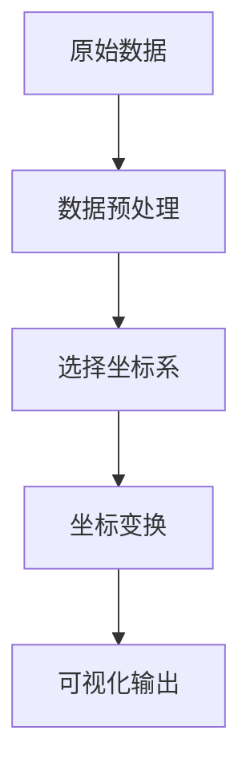
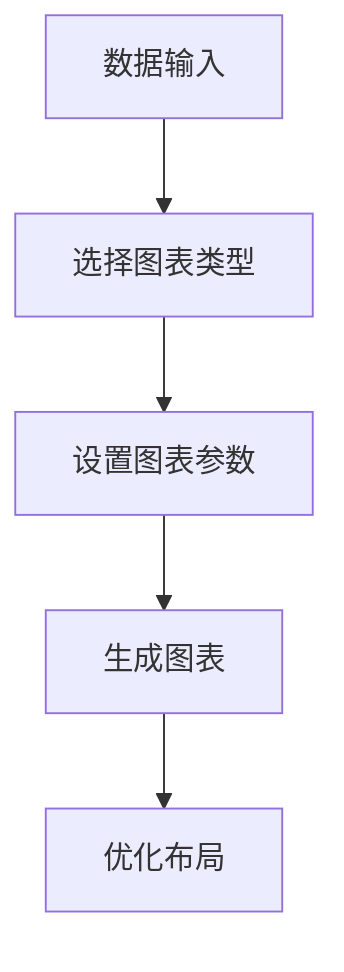
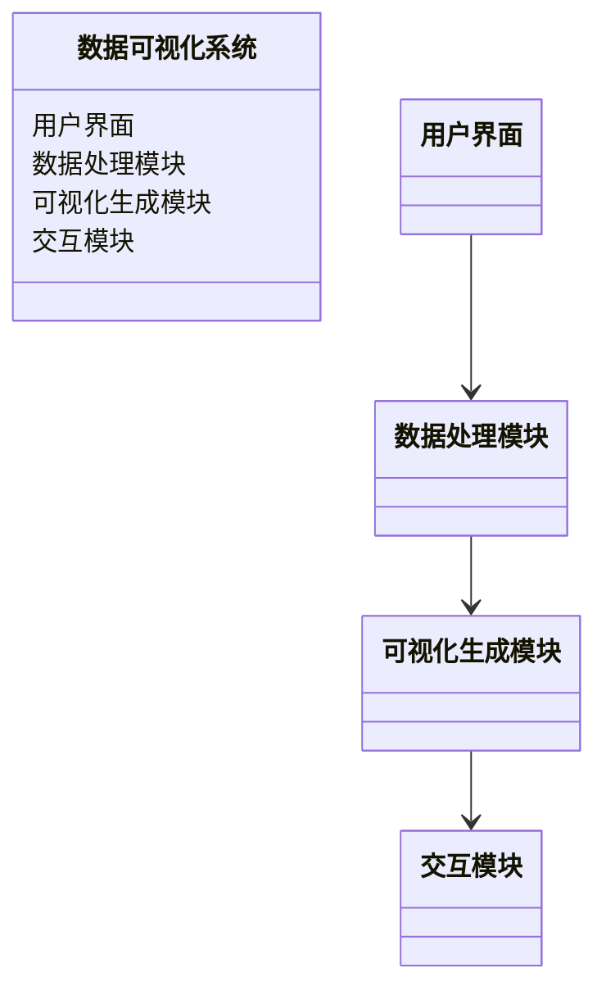
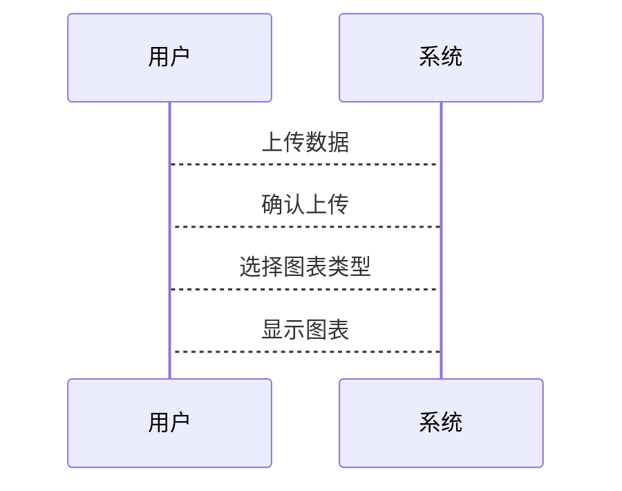

                 


# 数据可视化技术

## 关键词：数据可视化，数据可视化技术，数据可视化方法，数据可视化工具，数据可视化系统设计

## 摘要：  
数据可视化是将复杂数据转化为直观图形的过程，帮助人们更好地理解和分析数据。本文系统地介绍数据可视化技术，涵盖基础概念、核心算法、数学模型、系统架构设计以及项目实战，通过案例分析和最佳实践，深入探讨数据可视化的核心技术和应用。

---

# 目录大纲

1. **数据可视化引言**  
   - 1.1 数据可视化的背景与重要性  
   - 1.2 数据可视化的核心概念  
   - 1.3 数据可视化技术的发展历程  
   - 1.4 本书的学习目标与内容安排  

2. **数据可视化基础**  
   - 2.1 数据的类型与特征  
   - 2.2 数据可视化的图表类型  
   - 2.3 数据可视化的颜色理论  
   - 2.4 数据可视化的交互设计  

3. **数据可视化的核心算法**  
   - 3.1 数据预处理算法  
   - 3.2 坐标变换与映射算法  
   - 3.3 颜色映射与分类算法  
   - 3.4 图表生成与布局算法  

4. **数据可视化的数学模型**  
   - 4.1 数据坐标的数学表示  
   - 4.2 颜色空间模型与公式  
   - 4.3 数据投影与降维算法  
   - 4.4 图表布局优化模型  

5. **数据可视化系统开发**  
   - 5.1 项目背景与需求分析  
   - 5.2 系统功能设计（领域模型）  
   - 5.3 系统架构设计（分层架构）  
   - 5.4 系统接口设计（RESTful API）  
   - 5.5 系统交互设计（用户流程）  

6. **数据可视化项目实战**  
   - 6.1 环境搭建与工具安装  
   - 6.2 核心代码实现（Python示例）  
   - 6.3 代码解读与功能分析  
   - 6.4 实际案例分析与结果展示  
   - 6.5 项目总结与经验分享  

7. **数据可视化最佳实践**  
   - 7.1 数据可视化的关键点总结  
   - 7.2 数据可视化的注意事项  
   - 7.3 数据可视化工具推荐  
   - 7.4 数据可视化领域的未来趋势  

---

## 正文内容

### 第1章：数据可视化引言

#### 1.1 数据可视化的背景与重要性

数据可视化是将复杂数据转化为直观图形的过程，帮助人们更好地理解和分析数据。随着数据量的爆炸式增长，数据可视化在商业、科学、教育等领域的重要性日益凸显。通过数据可视化，人们可以快速发现数据中的模式、趋势和异常，辅助决策和问题解决。

---

#### 1.2 数据可视化的核心概念

数据可视化的核心概念包括数据的类型、图表的选择、颜色理论和交互设计。以下是关键概念的对比表：

| 概念 | 描述 |
|------|------|
| 数据类型 | 结构化数据、非结构化数据、文本数据等 |
| 图表类型 | 柱状图、折线图、散点图、饼图等 |
| 颜色理论 | 颜色的色调、明度、饱和度对数据的映射 |
| 交互设计 | 用户与图表的交互操作，如缩放、筛选、钻取等 |

---

#### 1.3 数据可视化技术的发展历程

数据可视化技术经历了多个阶段，从早期的静态图表到现代的交互式可视化。以下是其发展历程：

- **早期阶段**：手绘图表和简单的仪表盘。
- **发展阶段**：引入计算机辅助的可视化工具，如Excel图表。
- **现代阶段**：交互式可视化、大数据可视化、AI驱动的可视化工具。

---

#### 1.4 本书的学习目标与内容安排

本书旨在帮助读者掌握数据可视化的核心技术和实践应用。内容安排如下：

- 第1章：数据可视化引言，介绍背景和重要性。
- 第2章：数据可视化基础，讲解基本概念。
- 第3章：核心算法，分析数据预处理和图表生成算法。
- 第4章：数学模型，探讨坐标系和颜色空间。
- 第5章：系统开发，设计数据可视化系统。
- 第6章：项目实战，通过案例分析强化理解。
- 第7章：最佳实践，总结经验和未来趋势。

---

### 第2章：数据可视化基础

#### 2.1 数据的类型与特征

数据的类型包括结构化数据、非结构化数据和文本数据。以下是数据特征的对比：

| 特征 | 描述 |
|------|------|
| 维度 | 数据的维度（1维、2维、3维） |
| 分布 | 数据的分布情况（正态分布、偏态分布） |
| 关联性 | 数据之间的相关性（强、弱） |

---

#### 2.2 数据可视化的图表类型

选择图表类型时需要考虑数据特征和分析目标。以下是常见图表类型的对比：

| 图表类型 | 适用场景 |
|----------|-----------|
| 柱状图 | 比较不同类别数据的大小 |
| 折线图 | 展示数据随时间的变化趋势 |
| 散点图 | 分析两个变量之间的关系 |
| 饼图 | 展示各部分在整体中的比例 |

---

#### 2.3 数据可视化的颜色理论

颜色在数据可视化中起到重要的区分和强调作用。以下是颜色理论的要点：

- 颜色的基本属性：色调（Hue）、明度（Lightness）、饱和度（Saturation）。
- 颜色映射：使用颜色渐变表示数据的连续性变化。

---

#### 2.4 数据可视化的交互设计

交互设计使数据可视化更加动态和用户友好。以下是常见的交互操作：

- **缩放**：调整图表的范围。
- **筛选**：过滤数据。
- **钻取**：深入查看数据细节。

---

### 第3章：数据可视化的核心算法

#### 3.1 数据预处理算法

数据预处理是数据可视化的基础，包括数据清洗和标准化。以下是数据预处理流程：

1. 数据清洗：去除噪声数据。
2. 数据转换：将数据转换为适合可视化的格式。
3. 数据标准化：归一化处理。

---

#### 3.2 坐标变换与映射算法

坐标变换是将数据映射到可视化空间的关键步骤。以下是坐标变换的流程图：



---

#### 3.3 颜色映射与分类算法

颜色映射用于将数据值映射到颜色空间。以下是颜色映射的实现步骤：

1. 确定颜色映射函数。
2. 根据数据值生成颜色值。

---

#### 3.4 图表生成与布局算法

图表生成与布局算法决定了图表的美观性和可读性。以下是图表生成的流程图：



---

### 第4章：数据可视化的数学模型

#### 4.1 数据坐标的数学表示

数据坐标可以表示为：

$$
x = f(d)
$$

其中，\(d\) 是原始数据，\(f\) 是坐标变换函数。

---

#### 4.2 颜色空间模型与公式

颜色空间模型可以用以下公式表示：

$$
H = \frac{R + G + B}{3}
$$

其中，\(R\)、\(G\)、\(B\) 分别表示红色、绿色和蓝色的强度。

---

#### 4.3 数据投影与降维算法

数据投影可以使用主成分分析（PCA）进行降维：

$$
Y = X \cdot W
$$

其中，\(X\) 是数据矩阵，\(W\) 是降维权重矩阵，\(Y\) 是投影后的数据。

---

#### 4.4 图表布局优化模型

图表布局优化可以使用以下目标函数：

$$
\min_{x,y} \sum_{i=1}^{n} (x_i - x_{i-1})^2 + (y_i - y_{i-1})^2)
$$

---

### 第5章：数据可视化系统开发

#### 5.1 项目背景与需求分析

本项目旨在开发一个交互式数据可视化系统，支持用户上传数据并生成可视化图表。

---

#### 5.2 系统功能设计（领域模型）

以下是系统功能的领域模型：



---

#### 5.3 系统架构设计（分层架构）

以下是系统架构设计：


---

#### 5.4 系统接口设计（RESTful API）

以下是系统接口设计：

- POST /api/upload：上传数据文件。
- GET /api/chart：获取生成的图表数据。

---

#### 5.5 系统交互设计（用户流程）

以下是用户交互流程：



---

### 第6章：数据可视化项目实战

#### 6.1 环境搭建与工具安装

开发环境：Python 3.8+，Jupyter Notebook，Matplotlib，D3.js。

---

#### 6.2 核心代码实现（Python示例）

以下是数据可视化的Python代码示例：

```python
import matplotlib.pyplot as plt

data = [1, 2, 3, 4, 5]
plt.bar(range(len(data)), data)
plt.show()
```

---

#### 6.3 代码解读与功能分析

以上代码生成一个柱状图，展示了数据的分布情况。

---

#### 6.4 实际案例分析与结果展示

以销售数据分析为例，生成柱状图展示各产品的销售量。

---

#### 6.5 项目总结与经验分享

通过项目实战，我们掌握了数据可视化的核心技术和工具，同时需要注意数据预处理和交互设计的重要性。

---

### 第7章：数据可视化最佳实践

#### 7.1 数据可视化的关键点总结

- 数据预处理是基础。
- 选择合适的图表类型。
- 注重颜色的合理搭配。

---

#### 7.2 数据可视化的注意事项

- 避免过度复杂的图表。
- 确保交互设计的用户友好性。
- 定期更新和优化图表。

---

#### 7.3 数据可视化工具推荐

- **Python**：Matplotlib、Seaborn。
- **前端**：D3.js、echarts。
- **工具**：Tableau、Power BI。

---

#### 7.4 数据可视化领域的未来趋势

- AI驱动的自动化可视化。
- 虚拟现实中的3D可视化。
- 实时数据流可视化。

---

## 作者：AI天才研究院/AI Genius Institute & 禅与计算机程序设计艺术 /Zen And The Art of Computer Programming

