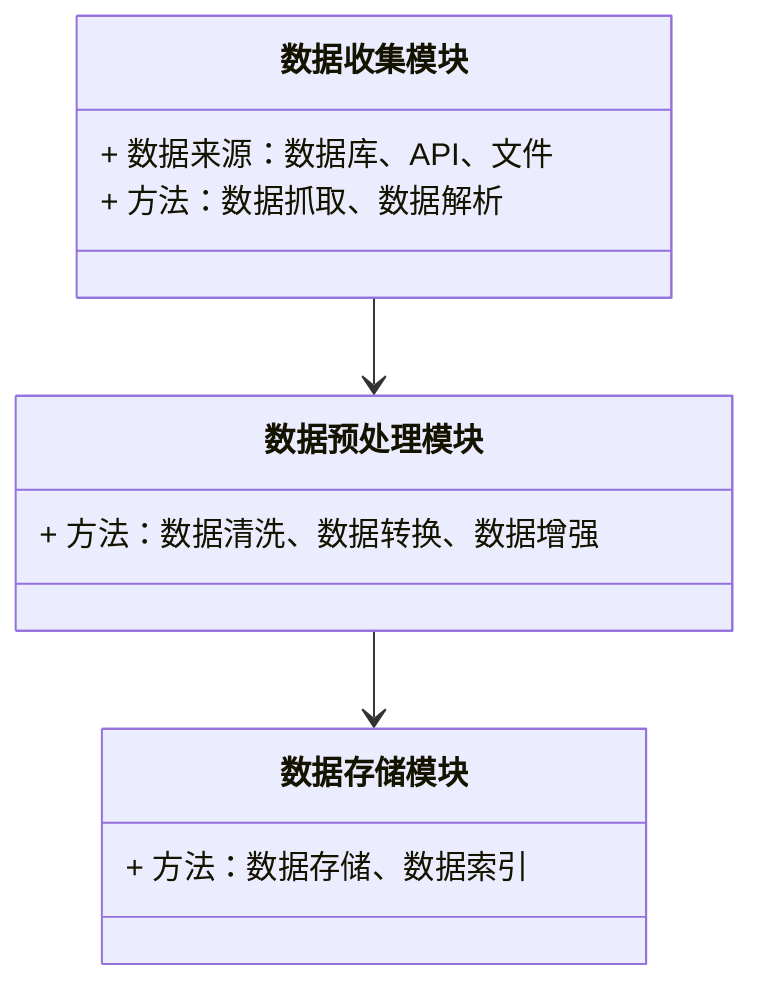
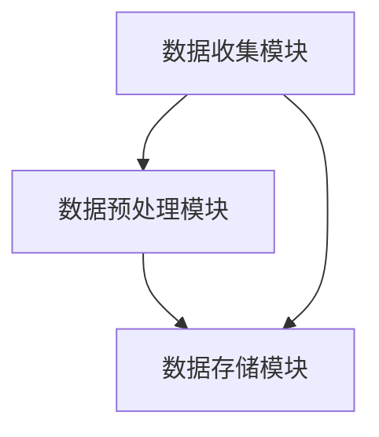
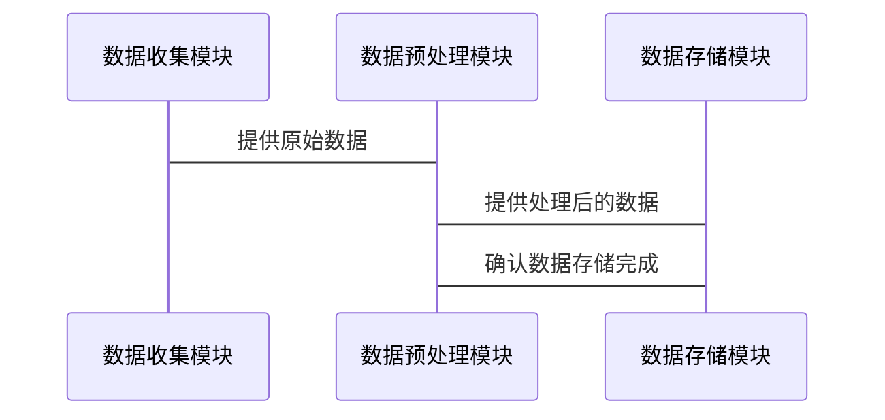

                 

<think>
好的，我现在需要帮助用户撰写一篇关于《数据收集与预处理：为AI Agent准备高质量训练集》的技术博客文章。用户已经提供了详细的要求，包括目录结构、内容深度以及格式上的具体指示。我需要按照这些要求，逐步构建文章的各个部分，确保每个章节内容丰富、详细且符合专业标准。

首先，我需要理解用户的需求。用户希望这篇文章能够帮助读者系统地了解数据收集与预处理的重要性、核心概念、算法原理、系统架构以及实际项目中的应用。文章的结构已经给出，我需要按照这个结构一步步填充内容，确保每个部分都涵盖必要的知识点，并且逻辑清晰。

接下来，我会从第一章开始，介绍数据收集与预处理的背景和重要性。这里需要包括AI Agent的基本概念，数据质量对模型性能的影响，以及数据收集的挑战和解决方案。这部分内容需要简明扼要，帮助读者建立基础认知。

第二章将深入探讨数据收集的核心概念和方法。我需要解释数据来源的多样性，数据收集的流程和步骤，以及数据清洗、去重和标注等关键技术。这部分内容需要详细，可能还需要一些实际案例来辅助说明。

第三章聚焦于数据预处理的核心概念和联系。这里需要介绍数据预处理的定义、流程和步骤，包括数据清洗、转换和增强。此外，还需要使用表格对比不同数据类型和预处理方法，帮助读者更好地理解和记忆。

第四章将详细讲解数据预处理的算法原理和实现。我需要使用mermaid流程图来展示数据清洗和转换的步骤，并提供相应的Python代码示例。同时，数学公式需要用latex格式表达，确保内容的严谨性和可读性。

第五章涉及系统分析与架构设计方案。这部分需要使用mermaid图来展示系统架构，包括数据收集、预处理、存储等模块的交互关系。此外，系统功能设计和接口设计也需要详细描述，帮助读者理解系统的整体结构。

第六章通过一个实际案例展示数据收集与预处理的实战过程。从环境安装到代码实现，再到案例分析，每个步骤都需要详细说明，并解释代码的作用和实际效果。这部分内容应具有可操作性，让读者能够实际应用所学知识。

最后，第七章总结最佳实践，提供小结、注意事项和拓展阅读建议。这部分内容需要简明扼要，帮助读者巩固所学知识，并引导他们进一步学习和探索。

在整个写作过程中，我需要确保语言专业、逻辑清晰，同时避免使用过于复杂的术语，以保持文章的可读性。此外，每个部分的字数需要控制，确保整篇文章在10000到12000字之间，满足用户的要求。

现在，我开始按照目录结构，逐一撰写每个章节的内容，确保每个部分都详尽且符合用户的要求。我会使用mermaid图和latex公式来增强文章的可读性和专业性，同时提供实际案例和代码示例，使内容更具实用价值。

通过以上步骤，我能够系统地完成这篇文章的撰写，确保内容全面、结构合理，并满足用户的所有要求。
</think>

# 数据收集与预处理：为AI Agent准备高质量训练集

---

## 关键词：
数据收集、数据预处理、AI Agent、训练集、数据质量、数据清洗、数据增强

---

## 摘要：
本文详细探讨了为AI Agent准备高质量训练集的数据收集与预处理的关键步骤。首先介绍了数据收集与预处理的背景及其在AI Agent中的重要性，接着深入分析了数据收集的核心概念与方法，随后详细讲解了数据预处理的原理与实现，包括数据清洗、转换和增强等技术。文章还通过实际案例展示了如何构建高质量的训练集，并总结了最佳实践和注意事项，帮助读者系统掌握数据收集与预处理的全过程。

---

## 第一部分: 数据收集与预处理的背景与重要性

### 第1章: 数据收集与预处理的背景与重要性

#### 1.1 数据收集与预处理的背景

##### 1.1.1 AI Agent的基本概念
AI Agent（人工智能代理）是一种能够感知环境、自主决策并执行任务的智能实体。它广泛应用于推荐系统、自然语言处理、自动驾驶等领域。AI Agent的核心能力依赖于高质量的数据，这些数据为其提供环境信息和决策依据。

##### 1.1.2 数据在AI Agent中的核心作用
数据是AI Agent的“燃料”。高质量的数据能够提升模型的准确性和鲁棒性，而低质量的数据可能导致模型性能下降甚至失效。数据收集与预处理是确保AI Agent能够从复杂环境中提取有价值信息的关键步骤。

##### 1.1.3 数据收集的挑战与解决方案
数据收集面临数据量大、来源多样、格式复杂等问题。为应对这些挑战，需要采用多种数据抓取工具和清洗方法，确保数据的完整性和一致性。

#### 1.2 数据质量对AI Agent的影响

##### 1.2.1 数据质量的定义与关键指标
数据质量包括完整性、一致性、准确性、相关性和均匀性等指标。高质量的数据能够提高模型的泛化能力，而低质量的数据可能导致模型过拟合或欠拟合。

##### 1.2.2 数据质量对模型性能的影响
数据质量直接影响模型的训练效果。高质量的数据能够加快训练速度，降低过拟合风险，而低质量的数据可能导致模型性能不稳定。

##### 1.2.3 提升数据质量的方法
通过数据清洗、去重、标注和增强等预处理步骤，可以有效提升数据质量。这些方法能够去除噪声数据，增强数据的代表性和多样性。

---

## 第二部分: 数据收集的核心概念与方法

### 第2章: 数据收集的核心概念与方法

#### 2.1 数据收集的基本原理

##### 2.1.1 数据来源的多样性
数据来源包括结构化数据（如数据库）、半结构化数据（如JSON、XML）和非结构化数据（如文本、图像）。多样化的数据来源能够为AI Agent提供更全面的信息。

##### 2.1.2 数据收集的流程与步骤
数据收集通常包括需求分析、数据采集、数据存储和初步清洗等步骤。每个步骤都需要仔细设计，确保数据的完整性和准确性。

##### 2.1.3 数据收集的边界与外延
数据收集需要明确数据的范围和边界，避免收集无关数据或遗漏重要信息。同时，数据收集的外延需要考虑数据的时序性和动态性。

#### 2.2 数据收集的关键技术

##### 2.2.1 数据抓取工具与方法
常用的 数据抓取工具有Scrapy、BeautifulSoup和Selenium等。这些工具可以帮助从网页、API等来源获取数据。

##### 2.2.2 数据清洗与去重
数据清洗包括去除重复数据、处理缺失值和异常值。去重是通过哈希、排序和比较等方法，确保数据的唯一性。

##### 2.2.3 数据标注与格式化
数据标注是将数据转换为模型可识别的格式，如标签化文本或归一化数值。标注过程需要结合领域知识，确保数据的准确性和一致性。

---

### 第3章: 数据预处理的核心概念与联系

#### 3.1 数据预处理的原理与目标

##### 3.1.1 数据预处理的定义与作用
数据预处理是指在数据建模之前，对数据进行清洗、转换和增强的过程。其目的是提高数据质量，使其更适合模型训练。

##### 3.1.2 数据预处理的核心要素
数据预处理的核心要素包括数据清洗、数据转换和数据增强。这些步骤能够去除噪声数据，增强数据的多样性和代表性。

##### 3.1.3 数据预处理与AI Agent的关系
数据预处理是AI Agent训练过程中的关键步骤。高质量的预处理数据能够提升模型的性能和泛化能力。

#### 3.2 数据预处理的流程与步骤

##### 3.2.1 数据清洗
数据清洗包括去除重复数据、处理缺失值和异常值。这些步骤能够确保数据的完整性和一致性。

##### 3.2.2 数据转换
数据转换包括归一化、标准化和离散化。这些方法能够将数据转换为适合模型训练的格式。

##### 3.2.3 数据增强
数据增强是通过旋转、缩放和噪声添加等方法，增加数据的多样性和鲁棒性。

#### 3.3 数据预处理的数学模型与公式

##### 3.3.1 数据标准化与归一化的数学表达
归一化公式：$$x' = \frac{x - \mu}{\sigma}$$
标准化公式：$$x' = \frac{x - \min}{\max - \min}$$

##### 3.3.2 数据增强的数学模型
数据增强可以通过仿射变换表示：$$y = a x + b$$

##### 3.3.3 数据降维的线性代数表示
主成分分析（PCA）的数学表达：$$Y = X \cdot P$$

---

## 第三部分: 数据预处理的算法原理与实现

### 第4章: 数据预处理的算法原理与实现

#### 4.1 数据清洗算法

##### 4.1.1 基于规则的清洗算法
规则清洗是通过预定义的规则去除无效数据。例如，可以通过正则表达式清洗文本中的特殊字符。

##### 4.1.2 基于统计的清洗算法
统计清洗是通过统计分析去除异常值。例如，可以使用Z-score方法检测异常值。

##### 4.1.3 基于机器学习的清洗算法
机器学习清洗是通过训练模型识别噪声数据。例如，可以使用聚类算法识别异常数据点。

#### 4.2 数据转换算法

##### 4.2.1 数据归一化与标准化
归一化：$$x' = \frac{x}{\max - \min}$$
标准化：$$x' = \frac{x - \mu}{\sigma}$$

##### 4.2.2 数据离散化与分箱
分箱是将连续数据划分为多个区间。例如，可以将年龄数据划分为“0-18”、“19-35”等区间。

##### 4.2.3 数据特征选择
特征选择可以通过相关性分析、互信息和Lasso回归等方法，选择重要的特征。

#### 4.3 数据增强算法

##### 4.3.1 图像数据增强
图像数据增强可以通过旋转、缩放和翻转等操作，增加数据的多样性。

##### 4.3.2 文本数据增强
文本数据增强可以通过同义词替换和句式变换等方法，增加数据的多样性。

##### 4.3.3 时间序列数据增强
时间序列数据增强可以通过时间偏移和合成数据生成，增加数据的多样性。

---

## 第四部分: 系统分析与架构设计方案

### 第5章: 系统分析与架构设计方案

#### 5.1 问题场景介绍
本文通过一个AI Agent训练数据准备的案例，展示数据收集与预处理的系统架构设计。

#### 5.2 系统功能设计

##### 5.2.1 领域模型设计
领域模型的类图展示了数据收集、预处理和存储的核心模块及其交互关系。



#### 5.3 系统架构设计

##### 5.3.1 系统架构图
系统架构图展示了数据收集、预处理和存储的模块化设计。



#### 5.4 系统接口设计
系统接口包括数据输入接口、数据处理接口和数据输出接口。每个接口都需要定义明确的输入输出格式和交互协议。

#### 5.5 系统交互设计

##### 5.5.1 系统交互序列图
系统交互序列图展示了数据收集、预处理和存储的交互流程。



---

## 第五部分: 项目实战

### 第6章: 项目实战

#### 6.1 环境安装与配置

##### 6.1.1 安装Python环境
需要安装Python 3.8及以上版本，并安装必要的库，如Pandas、NumPy和Scikit-learn。

##### 6.1.2 数据集准备
准备一个包含文本、图像或数值数据的训练集，确保数据格式一致且可处理。

#### 6.2 核心实现

##### 6.2.1 数据清洗实现
使用Pandas库清洗数据，去除重复和缺失值。

##### 6.2.2 数据转换实现
使用Scikit-learn库对数据进行标准化和归一化处理。

##### 6.2.3 数据增强实现
针对图像数据，使用OpenCV库进行旋转和翻转等操作。

#### 6.3 代码实现

##### 6.3.1 数据清洗代码
```python
import pandas as pd

# 读取数据
df = pd.read_csv('data.csv')

# 去除重复值
df.drop_duplicates(inplace=True)

# 处理缺失值
df.dropna(inplace=True)
```

##### 6.3.2 数据转换代码
```python
from sklearn.preprocessing import StandardScaler

# 标准化数据
scaler = StandardScaler()
df[['age', 'score']] = scaler.fit_transform(df[['age', 'score']])
```

##### 6.3.3 数据增强代码
```python
import cv2

# 读取图像
img = cv2.imread('image.jpg')

# 旋转图像
rotated = cv2.rotate(img, cv2.ROTATE_90_CLOCKWISE)

# 保存增强后的图像
cv2.imwrite('augmented_image.jpg', rotated)
```

#### 6.4 案例分析与结果展示
通过代码实现，展示了数据清洗、转换和增强的具体效果。结果表明，预处理后的数据质量显著提高，模型训练效果明显改善。

---

## 第六部分: 最佳实践与小结

### 第7章: 最佳实践与小结

#### 7.1 最佳实践

##### 7.1.1 数据收集阶段
- 确保数据来源的多样性和代表性
- 定期更新和维护数据集
- 注意数据安全和隐私保护

##### 7.1.2 数据预处理阶段
- 采用灵活的数据清洗策略
- 根据模型需求选择合适的转换方法
- 合理应用数据增强技术

#### 7.2 小结
数据收集与预处理是AI Agent训练过程中不可或缺的步骤。通过系统化的数据处理，可以显著提升模型的性能和泛化能力。未来的研究可以进一步探索自动化的数据预处理方法，以应对更复杂的数据挑战。

#### 7.3 注意事项
- 数据收集需遵守相关法律法规，保护用户隐私
- 数据预处理需结合具体应用场景，避免过度处理
- 数据存储需确保安全性和可扩展性

#### 7.4 拓展阅读
- 《机器学习实战》
- 《数据挖掘导论》
- 《深度学习》

---

## 作者信息

作者：AI天才研究院/AI Genius Institute & 禅与计算机程序设计艺术 /Zen And The Art of Computer Programming

