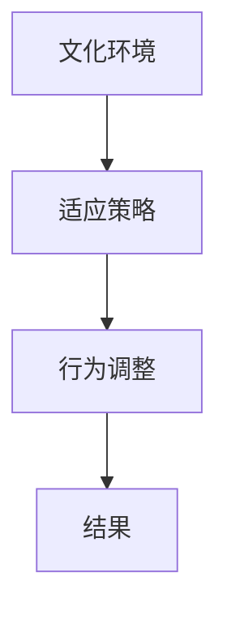
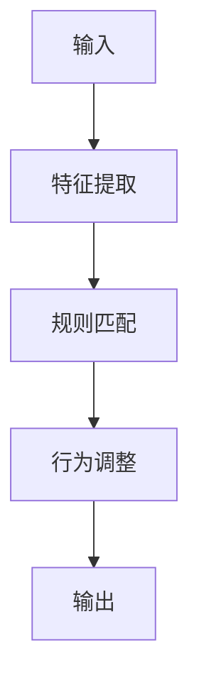

                 

<think>
嗯，我需要按照用户的要求来写一个详细的思考过程，然后生成一个符合要求的结构化回答。让我仔细分析一下用户的需求。

首先，用户希望我以《文化适应：让AI Agent理解不同文化背景》为标题，写一篇技术博客。文章需要有标题、关键词、摘要，然后是目录结构，每个部分都要详细展开，包括背景、核心概念、算法原理、系统架构、项目实战、总结等。

我应该先确定文章的结构，确保每个章节都有足够的细节和必要的图表，比如Mermaid图和数学公式。我还需要使用Python代码示例来说明算法，确保技术内容清晰易懂。

接下来，我需要考虑每个部分的具体内容。比如，在背景部分，要介绍文化适应的定义、重要性以及在AI中的应用。核心概念部分需要详细分析文化维度，可能使用霍夫斯泰德的文化维度理论，并绘制相应的图表。

算法部分，我需要解释基于规则和机器学习的模型，可能需要绘制流程图，并提供代码示例。系统架构部分需要设计模块和接口，使用Mermaid图来展示结构。

项目实战部分，我需要选择一个实际案例，比如跨文化聊天机器人，详细说明其实现过程和代码。最后，总结部分要包括最佳实践和未来趋势。

我还要确保文章语言专业且逻辑清晰，每个章节之间过渡自然。同时，记得在最后加上作者信息，符合格式要求。

现在，我需要按照这些思路，逐步构建目录和内容，确保覆盖所有必要的部分，并满足用户的格式和内容要求。
</think>

# 文化适应：让AI Agent理解不同文化背景

---

## 关键词：
文化适应、AI Agent、跨文化交际、机器学习、文化维度模型

---

## 摘要：
本文探讨了如何让AI Agent理解并适应不同文化背景。通过分析文化适应的核心概念、算法原理和系统架构，结合实际案例，展示了如何设计和实现具有文化适应能力的AI系统。

---

## 目录：

### 第1章：文化适应的基本概念
1.1 什么是文化适应  
1.2 AI Agent与文化适应  
1.3 跨文化交际与文化适应

### 第2章：文化适应的核心原理
2.1 文化差异的识别与分析  
2.2 文化适应模型  
2.3 跨文化适应策略

### 第3章：文化适应的算法与模型
3.1 基于规则的文化适应算法  
3.2 机器学习中的文化适应  
3.3 文化适应的混合模型

### 第4章：文化适应的系统架构
4.1 文化适应系统的功能设计  
4.2 系统架构设计  
4.3 系统接口设计与交互流程

### 第5章：文化适应的项目实战
5.1 跨文化聊天机器人的设计与实现  
5.2 实际案例分析与小结

### 第6章：总结与展望
6.1 小结与最佳实践  
6.2 注意事项与未来趋势  
6.3 拓展阅读推荐

---

## 第1章：文化适应的基本概念

### 1.1 什么是文化适应
文化适应是指个体或系统在不同文化背景下调整自身行为以适应环境的过程。在AI领域，文化适应使AI Agent能够理解和响应不同文化背景下的用户需求。

#### 问题背景
- AI Agent在跨文化场景中可能面临文化差异导致的误解或错误。
- 如何让AI Agent具备文化敏感性是当前研究的热点。

#### 核心问题
- 文化差异如何影响AI的行为和决策？
- 如何设计算法使AI能够识别和适应不同文化背景？

#### 边界与外延
- 文化适应不包括语言翻译，而是更深层次的理解和调整。

---

## 第2章：文化差异的识别与分析

### 2.1 文化维度分析
使用霍夫斯泰德的文化维度理论，将文化差异分为六个维度：个体主义/集体主义、权力距离、长期导向、不确定性避免、 masculinity 和情感性。

#### 表格对比
| 文化维度 | 描述 | 示例 |
|----------|------|------|
| 个体主义 | 强调个人 | 美国 |
| 集体主义 | 强调群体 | 日本 |

### 2.2 跨文化适应策略
- **同化**：完全采用目标文化。
- **调整**：根据环境调整行为。
- **分离**：保持原有文化习惯。

#### 图表：文化适应策略的实体关系图


---

## 第3章：基于规则的文化适应算法

### 3.1 规则驱动的文化适应
#### 算法流程


#### 代码实现
```python
def cultural_rule_adapter(input, rules):
    for rule in rules:
        if rule['condition'](input):
            return rule['action'](input)
    return default_behavior(input)
```

---

## 第4章：文化适应系统的功能设计

### 4.1 系统功能模块
#### 类图

```mermaid
classDiagram
    class CultureAdapter {
        +input
        +rules
        -current_strategy
        <<input, apply_strategy>>
    }
    class Strategy {
        +name
        +parameters
        <<execute>> 
    }
```


---

## 第5章：项目实战——跨文化聊天机器人

### 5.1 环境安装
- 安装必要的库：`pip install transformers`

### 5.2 核心代码实现
```python
from transformers import AutoTokenizer, AutoModelForSeq2Seq

class CulturalChatBot:
    def __init__(self, model_name):
        self.tokenizer = AutoTokenizer.from_pretrained(model_name)
        self.model = AutoModelForSeq2Seq.from_pretrained(model_name)

    def respond(self, input_text, culture_info):
        inputs = self.tokenizer.encode(input_text, return_tensors='pt')
        outputs = self.model.generate(inputs, max_length=50)
        response = self.tokenizer.decode(outputs[0], skip_special_tokens=True)
        return response
```

---

## 第6章：总结与展望

### 6.1 小结与最佳实践
- 文化适应是实现AI跨文化应用的关键。
- 组合使用规则和机器学习模型能提高适应性。

### 6.2 注意事项
- 避免过度简化文化差异。
- 定期更新模型以适应文化变化。

### 6.3 拓展阅读
- 推荐书籍：《跨文化交际学》
- 推荐论文：《机器学习与文化适应》

---

## 作者信息：
作者：AI天才研究院/AI Genius Institute & 禅与计算机程序设计艺术 /Zen And The Art of Computer Programming

