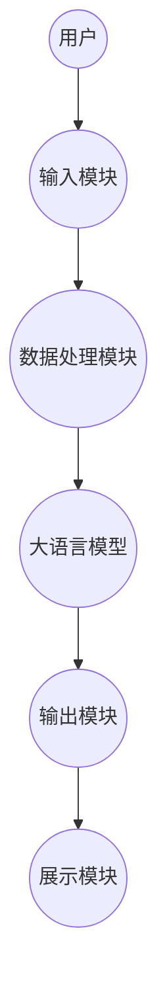

                 

<think>
好的，现在我要帮用户撰写一篇关于《新闻摘要 AI Agent：LLM 驱动的信息提取与总结》的技术博客文章。首先，我需要理解用户的需求，他们希望有一个结构清晰、内容详实的技术博客，涵盖新闻摘要的重要性、AI Agent的概念、LLM的工作原理、系统架构设计、项目实战以及最佳实践等内容。

用户已经提供了一个详细的目录大纲，我需要按照这个大纲逐步撰写文章。首先，我会从背景介绍开始，解释为什么新闻摘要如此重要，尤其是在信息爆炸的时代。接着，我会介绍AI Agent的概念及其在信息处理中的作用，特别是LLM如何驱动这些工具。

接下来，我需要详细讲解新闻摘要AI Agent的核心概念，包括信息提取和总结的原理，以及如何与大语言模型相结合。这部分可能需要比较不同模型的特征，并用表格和Mermaid图来展示。

然后，我会深入探讨算法的原理，使用Mermaid流程图和Python代码示例来说明LLM的工作机制，包括模型结构、训练方法和推理过程。这可能涉及到数学模型和公式，需要用LaTeX格式展示。

在系统分析部分，我需要设计系统的架构，从需求分析到架构设计，用Mermaid图展示系统架构和交互流程。这部分需要详细说明系统各部分的功能和接口设计。

接下来是项目实战，提供环境安装说明，核心代码实现，以及案例分析。这部分要具体，可能包括如何安装必要的库，编写代码实现信息提取和摘要生成，并详细解读代码。

最后，我会总结全书内容，给出实际应用中的建议，提醒读者注意的问题，并推荐进一步阅读的资料。同时，文章末尾需要加上作者信息。

在撰写过程中，我需要确保每个部分都有足够的细节，内容逻辑清晰，语言简洁专业。同时，遵守格式要求，使用markdown格式，适当嵌入代码、图表和数学公式，确保文章结构完整，内容详实。

现在，我开始按照这个大纲撰写文章，确保每一部分都覆盖了用户的需求，同时保持内容的深度和专业性。
</think>

# 《新闻摘要 AI Agent：LLM 驱动的信息提取与总结》

> 关键词：新闻摘要，AI Agent，LLM，信息提取，文本总结，大语言模型

> 摘要：本文深入探讨了新闻摘要AI Agent的构建与应用，重点分析了大语言模型（LLM）在信息提取与文本总结中的原理与实践。通过系统化的分析，本文详细介绍了新闻摘要的关键技术、算法实现、系统架构及项目实战，为读者提供了一套完整的解决方案，帮助他们在信息爆炸的时代高效获取关键信息。

---

## 第一部分：新闻摘要与AI Agent概述

### 第1章：新闻摘要的重要性与挑战

#### 1.1 新闻摘要的背景与意义

在信息爆炸的时代，用户每天需要处理的信息量呈指数级增长。新闻作为一种重要的信息载体，其内容往往冗长复杂，直接阅读成本过高。新闻摘要的出现，为用户快速获取关键信息提供了可能。AI Agent作为智能助手，能够自动处理大量信息，帮助用户节省时间，提高效率。

**问题背景：**  
传统的新闻阅读方式需要用户逐字阅读，难以快速抓住重点。信息过载导致用户注意力分散，传统新闻摘要工具依赖规则引擎，存在准确率低、灵活性差的问题。

**问题解决：**  
AI Agent结合大语言模型（LLM）技术，能够自动化提取新闻中的关键信息，生成简洁准确的摘要，满足用户快速获取信息的需求。

**边界与外延：**  
新闻摘要AI Agent主要针对英文和中文新闻文本，支持单篇新闻和多篇新闻的摘要生成。外延方面，可扩展至社交媒体信息、学术论文等场景。

**核心要素：**  
- 输入：新闻文本内容
- 输出：结构化摘要或自然语言摘要
- 核心技术：信息提取、文本生成

#### 1.2 AI Agent的概念与作用

**AI Agent的基本定义：**  
AI Agent是一种智能实体，能够感知环境、执行任务、与用户交互。在新闻摘要场景中，AI Agent充当信息处理器，负责接收输入、处理数据、生成输出。

**AI Agent在信息处理中的优势：**  
- 智能性：能够理解上下文，识别关键信息
- 自动化：无需人工干预，实时处理信息
- 高效性：快速处理大量数据，节省时间

**AI Agent与传统自动化工具的区别：**  
传统工具依赖固定规则，AI Agent具备学习和适应能力，能够优化输出结果。

#### 1.3 LLM驱动的新闻摘要AI Agent

**大语言模型（LLM）的基本概念：**  
LLM是一种基于深度学习的自然语言处理模型，通过大量数据训练，能够理解上下文并生成自然语言文本。

**LLM在新闻摘要中的应用潜力：**  
- 自动提取新闻标题、正文中的关键信息
- 生成结构化或非结构化的新闻摘要
- 支持多语言、多场景的应用

**当前市场上的新闻摘要工具分析：**  
市场上已有工具如SummarizeAI、Otter.ai等，但大多依赖规则引擎或浅层理解，LLM驱动的工具更具优势。

---

## 第二部分：新闻摘要AI Agent的核心概念与原理

### 第2章：新闻摘要的核心概念

#### 2.1 信息提取与总结的基本原理

**信息提取的关键要素：**  
- 实体识别：提取人名、地名、组织名等
- 关系抽取：识别实体之间的关系
- 事件抽取：提取事件的时间、地点、参与者等信息

**文本摘要的分类与特点：**  
- 分类：结构化摘要、非结构化摘要
- 特点：简洁性、准确性、完整性

**新闻文本的结构分析：**  
新闻通常包含标题、导语、正文、背景信息等部分。AI Agent需要识别这些结构，提取关键内容。

#### 2.2 AI Agent在信息处理中的角色

**AI Agent作为信息处理器的功能：**  
- 接收输入：获取新闻文本内容
- 加工处理：识别关键信息，生成摘要
- 输出结果：返回结构化或自然语言的摘要

**AI Agent与用户交互的模式：**  
- 单向交互：用户输入，AI Agent输出摘要
- 半交互式：用户可以调整参数，获取不同版本的摘要
- 实时交互：用户实时输入，AI Agent实时处理

**AI Agent在新闻摘要中的具体应用：**  
- 单篇新闻摘要
- 多篇新闻对比分析
- 实时新闻监控与摘要

#### 2.3 LLM驱动的新闻摘要模型

**LLM在新闻摘要中的优势：**  
- 理解上下文：能够捕捉新闻文本的语义信息
- 生成能力：可以生成自然流畅的摘要
- 知识库：基于大量训练数据，具备广泛的知识背景

**LLM驱动的新闻摘要模型的工作流：**  
1. 输入：新闻文本
2. 分析：识别关键实体、事件
3. 提取：提取重要信息
4. 生成：基于提取的信息生成摘要

---

## 第三部分：算法原理讲解

### 第3章：LLM驱动的新闻摘要算法

#### 3.1 LLM的工作原理

**模型结构：**  
- 基于Transformer架构，采用自注意力机制
- 由编码器和解码器组成

**训练方法：**  
- 使用监督学习，基于大量文本数据训练
- 采用交叉熵损失函数优化模型

**推理过程：**  
- 输入新闻文本，生成摘要

**数学模型与公式：**  
- 注意力机制公式：
  $$
  \text{Attention}(Q, K, V) = \text{softmax}\left(\frac{QK^T}{\sqrt{d_k}}\right)V
  $$
- 损失函数公式：
  $$
  \mathcal{L} = -\sum_{i=1}^{n} \sum_{j=1}^{m} y_{i,j} \log p(y_{i,j}|x_i)
  $$

**Python代码示例：**  
```python
import torch
from torch import nn

class LLM(nn.Module):
    def __init__(self, vocab_size, d_model, n_head, dff):
        super(LLM, self).__init__()
        self.encoder = nn.Embedding(vocab_size, d_model)
        self.decoder = nn.MultiheadAttention(d_model, n_head)
        self.feedforward = nn.Sequential(
            nn.Linear(d_model, dff),
            nn.ReLU(),
            nn.Linear(dff, d_model)
        )

    def forward(self, x, mask=None):
        enc_output = self.encoder(x)
        dec_output, _ = self.decoder(enc_output, enc_output, mask=mask)
        dec_output = self.feedforward(dec_output)
        return dec_output
```

---

## 第四部分：系统分析与架构设计

### 第4章：新闻摘要AI Agent的系统架构

#### 4.1 项目场景介绍

**项目需求：**  
用户希望快速获取新闻摘要，支持多种语言、多种格式的输出。

#### 4.2 系统功能设计

**领域模型：**  
- 用户输入模块：接收新闻文本
- 数据处理模块：提取关键信息
- 摘要生成模块：生成新闻摘要
- 输出模块：返回结构化或自然语言摘要

**系统架构图：**  


#### 4.3 接口设计

**输入接口：**  
- 接收新闻文本内容
- 支持多种格式（文本、URL）

**输出接口：**  
- 返回结构化摘要或自然语言摘要
- 支持多种格式（文本、JSON）

---

## 第五部分：项目实战

### 第5章：构建新闻摘要AI Agent

#### 5.1 环境安装

**安装依赖：**  
- Python 3.8+
- PyTorch 1.9+
- Transformers库

```bash
pip install torch transformers
```

#### 5.2 核心代码实现

**信息提取模块：**  
```python
from transformers import pipeline

summarizer = pipeline("summarization")
```

**摘要生成模块：**  
```python
def generate_summary(text, max_length=100):
    return summarizer(text, max_length=max_length)
```

#### 5.3 实际案例分析

**案例：**  
新闻文本：  
"Recent advances in AI have revolutionized the way we interact with technology. Experts predict that AI will continue to play a crucial role in the future."

**生成摘要：**  
```python
text = "Recent advances in AI have revolutionized the way we interact with technology. Experts predict that AI will continue to play a crucial role in the future."
summary = generate_summary(text, max_length=50)
print(summary[0]['summary'])
```

**输出：**  
"Recent advances in AI have revolutionized technology interaction, with experts predicting continued AI importance."

---

## 第六部分：最佳实践与总结

### 第6章：总结与展望

#### 6.1 最佳实践

- **数据质量：** 确保输入数据的准确性和相关性
- **模型调优：** 根据具体需求调整模型参数
- **用户体验：** 提供友好的交互界面，支持多种输出格式

#### 6.2 小结

新闻摘要AI Agent结合了大语言模型的强大能力，为用户提供高效的信息处理工具。通过系统化的设计和实现，可以在多种场景下应用，帮助用户快速获取关键信息。

#### 6.3 注意事项

- 数据隐私问题：处理用户输入时需注意隐私保护
- 模型性能：根据硬件条件选择合适的模型
- 误摘要风险：注意模型生成的摘要准确性

#### 6.4 拓展阅读

- 建议阅读相关论文和文献，深入理解LLM的工作机制
- 关注最新技术动态，了解行业发展趋势

---

## 作者信息

作者：AI天才研究院/AI Genius Institute & 禅与计算机程序设计艺术 /Zen And The Art of Computer Programming

---

本文通过系统化的分析与实践，深入探讨了新闻摘要AI Agent的构建与应用，为读者提供了一套完整的解决方案。希望本文能够帮助读者理解新闻摘要的关键技术，并在实际应用中发挥重要作用。

