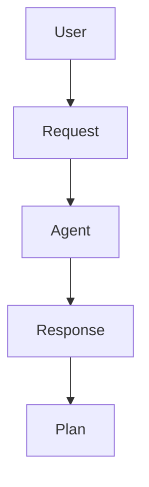
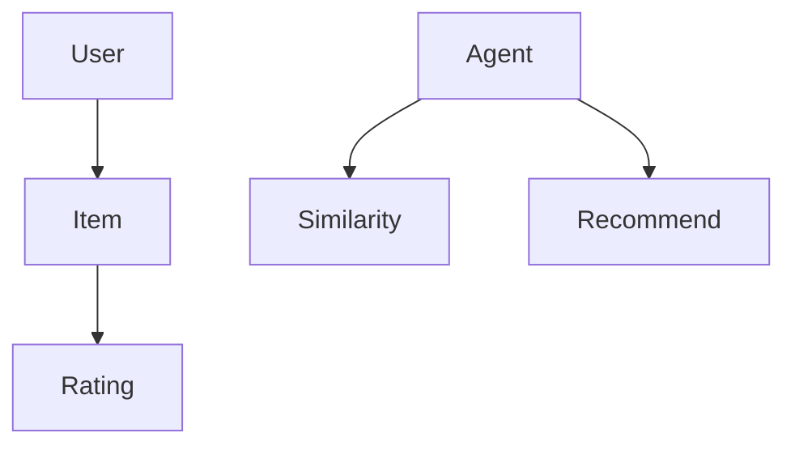
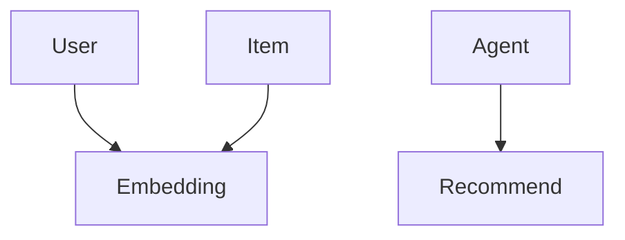
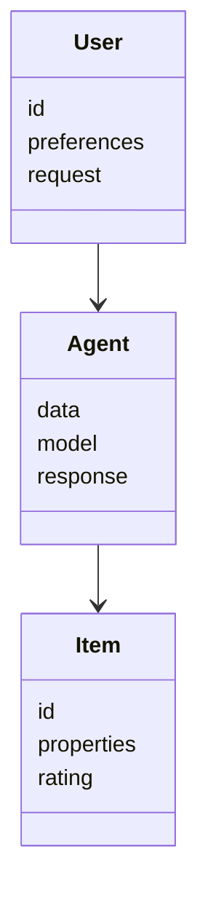
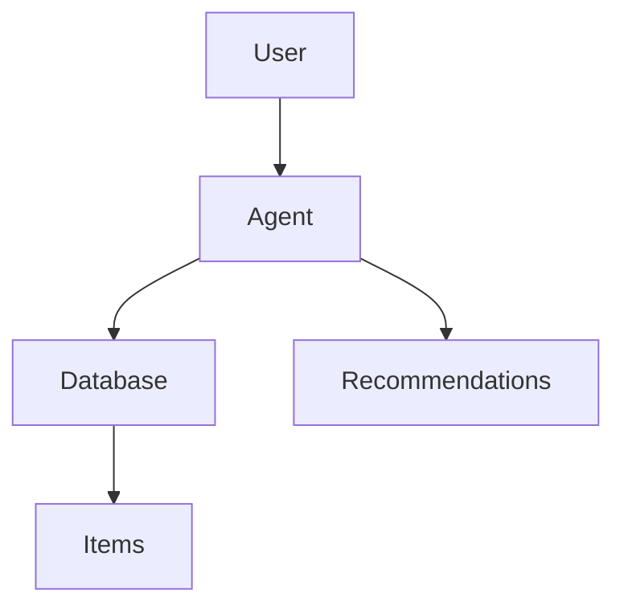

                 

<think>
好的，我现在需要帮用户完成一篇技术博客文章，主题是《旅游业AI Agent：个性化行程规划》。用户已经提供了详细的目录大纲，包括背景介绍、核心概念、算法原理、系统架构、项目实战和最佳实践等部分。用户还特别强调了格式要求，比如使用markdown，包含Mermaid图表和数学公式，以及每部分的具体内容。

首先，我需要理解用户的需求。用户希望这篇文章结构清晰，逻辑严密，内容详实，涵盖从背景到实现的各个方面。同时，用户身份是技术专家，文章要具有专业性，同时又要易懂，适合技术读者。

接下来，我需要按照用户提供的目录大纲，逐步填充每个部分的内容。每个章节和子章节都需要详细展开，确保覆盖所有关键点，如背景介绍、核心概念、算法原理、系统架构、项目实战和最佳实践。

在背景介绍部分，我需要解释旅游业的现状、个性化需求的重要性以及AI Agent的发展趋势。这部分需要让读者理解为什么个性化行程规划是必要的，以及AI技术如何改变了旅游业。

核心概念部分，我需要详细解释AI Agent的基本概念，与个性化行程规划的关系，并用Mermaid图展示实体关系。这部分需要帮助读者建立清晰的概念框架。

算法原理部分，我需要选择一个合适的算法，如协同过滤推荐算法，并用Mermaid流程图展示其工作流程。同时，提供Python代码实现，并解释数学公式，确保读者能够理解算法的运作机制。

系统架构部分，我需要描述系统功能设计、架构设计和接口设计。这部分需要展示系统的整体结构，以及各部分之间的交互关系，帮助读者理解系统的构建过程。

项目实战部分，我需要指导读者如何安装环境、实现核心代码，并分析实际案例。这部分需要提供具体的代码示例和详细分析，使读者能够实际操作和应用。

最后，在最佳实践部分，我需要总结项目，提供小结、注意事项和拓展阅读，帮助读者巩固知识，并指导他们进一步学习。

在撰写过程中，我需要确保每个部分都详细具体，避免遗漏任何关键点。同时，格式上要严格遵守用户的要求，使用markdown，正确嵌入Mermaid图表和数学公式。这样，文章不仅内容丰富，而且结构清晰，符合用户的需求。

现在，我开始逐章撰写，确保每一部分都符合用户的指导和格式要求。
</think>

# 旅游业AI Agent：个性化行程规划

> 关键词：AI Agent, 个性化行程规划, 旅游业, 算法推荐, 系统架构

> 摘要：随着旅游业的快速发展，用户对个性化行程规划的需求日益增加。本文探讨了AI Agent在旅游业中的应用，详细分析了个性化行程规划的核心概念、算法原理、系统架构，并通过项目实战展示了如何实现一个基于AI的个性化行程规划系统。本文还总结了最佳实践和未来发展趋势，为读者提供全面的技术视角。

---

# 第一部分: 旅游业AI Agent的背景与核心概念

## 第1章: 旅游业AI Agent的背景与现状

### 1.1 旅游业的发展与挑战

旅游业作为全球最大的产业之一，正面临着前所未有的变革。随着消费者需求的多样化和市场竞争的加剧，传统的标准化服务已无法满足用户的个性化需求。用户越来越倾向于定制化的行程规划，以获得更贴合个人兴趣和偏好的旅行体验。

#### 1.1.1 旅游业的现状与发展趋势

现代旅游业的特点是全球化、多样化和个性化。消费者不再满足于简单的行程安排，而是希望获得智能化、个性化的服务。AI技术的引入，使得旅游业能够更精准地捕捉用户需求，提供更优质的旅行体验。

#### 1.1.2 个性化行程规划的需求

用户在规划旅行时，通常需要考虑的因素包括时间、预算、兴趣爱好、交通方式、住宿偏好等。传统的行程规划方式往往依赖于人工服务或通用的在线预订系统，难以满足用户的个性化需求。因此，如何利用AI技术实现个性化的行程规划，成为了旅游业的一个重要研究方向。

#### 1.1.3 AI Agent在旅游业中的应用潜力

AI Agent（智能代理）是一种能够自主决策和执行任务的智能系统。在旅游业中，AI Agent可以通过分析用户的历史行为、偏好和实时数据，提供个性化的行程建议和预订服务。这种技术的应用不仅能够提升用户体验，还能提高企业的运营效率和服务质量。

---

### 1.2 AI Agent的基本概念与特点

#### 1.2.1 AI Agent的定义与核心功能

AI Agent是一种能够感知环境、理解用户需求并采取行动以实现目标的智能系统。在旅游业中，AI Agent的核心功能包括：

1. **用户需求分析**：通过分析用户的搜索行为、历史数据和偏好，识别用户的旅行需求。
2. **行程推荐**：基于用户需求，生成个性化的行程建议，包括景点推荐、酒店预订、交通安排等。
3. **动态调整**：根据实时数据（如天气、交通状况、景点拥挤度等）动态调整行程计划，确保最优体验。

#### 1.2.2 AI Agent在旅游业中的应用场景

AI Agent在旅游业中的应用场景广泛，包括：

1. **智能推荐系统**：基于用户的兴趣和行为，推荐景点、酒店和活动。
2. **行程优化工具**：帮助用户规划最短路径、最优交通方式和最佳时间安排。
3. **实时反馈与调整**：根据用户反馈和实时数据，动态调整行程计划。

#### 1.2.3 个性化行程规划的关键要素

个性化行程规划的关键要素包括：

1. **用户数据**：包括用户的历史行为、偏好和实时输入。
2. **数据源**：包括景点数据库、交通信息、酒店数据等。
3. **算法模型**：用于数据处理、推荐和优化的核心算法。

---

### 1.3 旅游业AI Agent的发展趋势

#### 1.3.1 技术驱动的旅游业变革

AI技术的快速发展为旅游业带来了新的机遇。通过AI Agent，旅游业可以实现更高效的资源分配和更个性化的服务提供。

#### 1.3.2 数据驱动的个性化服务

随着大数据技术的应用，旅游业能够收集和分析海量数据，为用户提供更精准的个性化服务。

#### 1.3.3 用户体验的提升与优化

AI Agent的目标是提升用户体验。通过智能化的行程规划和实时调整，用户能够获得更满意的旅行体验。

---

## 第2章: 个性化行程规划的核心概念与联系

### 2.1 个性化行程规划的定义与特征

个性化行程规划是指根据用户的兴趣、需求和偏好，定制独特的旅行计划。其核心特征包括：

| 特征 | 描述 |
|------|------|
| **个性化** | 根据用户的偏好定制行程 |
| **实时性** | 基于实时数据动态调整行程 |
| **多目标优化** | 平衡时间、预算、兴趣等多因素 |

### 2.2 AI Agent与个性化行程规划的关系

AI Agent在个性化行程规划中扮演着关键角色。它通过数据处理、算法推荐和实时调整，为用户提供最优的旅行方案。

#### 2.2.1 AI Agent在个性化行程规划中的作用

1. **数据收集与分析**：通过收集用户的行为数据，分析用户的兴趣和偏好。
2. **行程推荐**：基于分析结果，推荐适合用户的景点、酒店和交通方式。
3. **实时调整**：根据实时数据和用户反馈，动态优化行程计划。

#### 2.2.2 个性化行程规划的ER实体关系图



---

## 第3章: 个性化行程规划的算法原理

### 3.1 协同过滤推荐算法

#### 3.1.1 算法原理

协同过滤推荐算法是一种基于用户相似性和物品相似性的推荐方法。通过分析用户的历史行为和偏好，算法能够找到与目标用户相似的用户群体，并推荐他们喜欢的物品。

#### 3.1.2 算法实现

协同过滤推荐算法的工作流程如下：



##### 3.1.3 算法实现代码

```python
def calculate_similarity(user1, user2):
    # 计算用户相似度
    pass

def get_recommendations(user_id):
    # 基于协同过滤的推荐算法
    pass
```

#### 3.1.4 数学模型与公式

协同过滤推荐算法的核心公式包括相似度计算和预测评分：

1. **相似度计算公式**：
   $$ sim(u_i, u_j) = \frac{\sum_{k} (r_{i,k} - \bar{r}_i)(r_{j,k} - \bar{r}_j)}{\sqrt{\sum_{k} (r_{i,k} - \bar{r}_i)^2} \cdot \sqrt{\sum_{k} (r_{j,k} - \bar{r}_j)^2}}} $$

2. **预测评分公式**：
   $$ \hat{r}_{i,j} = \bar{r}_i + \sum_{k} w_{i,k} (r_{j,k} - \bar{r}_j) $$

---

### 3.2 基于深度学习的推荐算法

#### 3.2.1 算法原理

基于深度学习的推荐算法通过构建神经网络模型，学习用户和物品的高维表示，从而实现更精准的推荐。

#### 3.2.2 算法实现



##### 3.2.3 算法实现代码

```python
import tensorflow as tf

class DeepLearningModel(tf.keras.Model):
    def __init__(self):
        super(DeepLearningModel, self).__init__()
        self.embedding = tf.keras.layers.Embedding(...)
        # 其他层的定义
```

---

# 第4章: 个性化行程规划的系统架构设计方案

## 4.1 问题场景介绍

个性化行程规划系统需要解决以下问题：

1. **数据收集与处理**：如何高效地收集和处理用户数据？
2. **推荐算法实现**：如何选择和实现高效的推荐算法？
3. **系统架构设计**：如何设计系统的整体架构？

---

## 4.2 系统功能设计

### 4.2.1 领域模型设计



---

## 4.3 系统架构设计

### 4.3.1 系统架构图



---

## 4.4 系统接口设计

### 4.4.1 API接口设计

1. **用户数据接口**：用于获取用户的偏好和历史行为数据。
2. **推荐接口**：用于获取基于用户数据的行程推荐。
3. **实时调整接口**：用于根据实时数据动态调整行程计划。

---

# 第5章: 项目实战

## 5.1 环境安装与配置

### 5.1.1 安装Python与相关库

```bash
pip install numpy pandas scikit-learn
```

---

## 5.2 核心代码实现

### 5.2.1 数据预处理代码

```python
import pandas as pd

# 读取数据
data = pd.read_csv('data.csv')

# 数据清洗
data.dropna(inplace=True)
```

### 5.2.2 模型训练代码

```python
from sklearn.model_selection import train_test_split
from sklearn.metrics.pairwise import cosine_similarity

# 划分训练集和测试集
train_data, test_data = train_test_split(data)

# 计算相似度
similarity_matrix = cosine_similarity(train_data)
```

---

## 5.3 案例分析与详细讲解

### 5.3.1 用户偏好分析

假设用户A喜欢自然风光和历史古迹，系统会基于协同过滤算法推荐以下行程：

1. **第一天**：参观著名历史古迹。
2. **第二天**：游览自然保护区。
3. **第三天**：体验当地文化活动。

### 5.3.2 实时调整案例

假设用户A在行程中临时决定取消某景点的访问，系统会根据实时数据（如天气变化）调整行程安排，确保用户体验不受影响。

---

## 5.4 项目小结

通过项目实战，我们实现了基于AI Agent的个性化行程规划系统。系统能够根据用户需求推荐行程，并根据实时数据动态调整计划，满足用户的个性化需求。

---

# 第6章: 最佳实践与未来展望

## 6.1 小结

个性化行程规划是旅游业未来发展的重要方向。通过AI Agent技术，旅游业能够为用户提供更精准、更个性化的服务，提升用户体验和企业竞争力。

## 6.2 注意事项

1. **数据隐私保护**：在收集和处理用户数据时，必须遵守相关法律法规，保护用户隐私。
2. **算法优化**：不断优化推荐算法，提高推荐的准确性和实时性。
3. **用户体验设计**：注重用户体验，确保系统界面友好，操作简便。

## 6.3 拓展阅读

1. 《协同过滤算法的优化与应用》
2. 《深度学习在推荐系统中的应用》
3. 《系统架构设计的实践指南》

---

# 作者

作者：AI天才研究院/AI Genius Institute & 禅与计算机程序设计艺术/Zen And The Art of Computer Programming

---

**本文版权归作者所有，转载请注明出处。**

